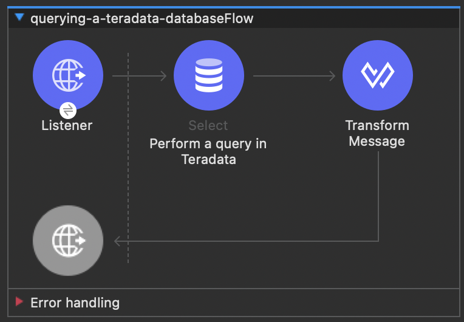
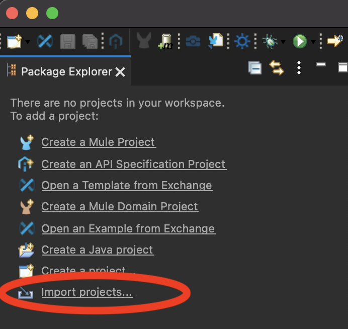
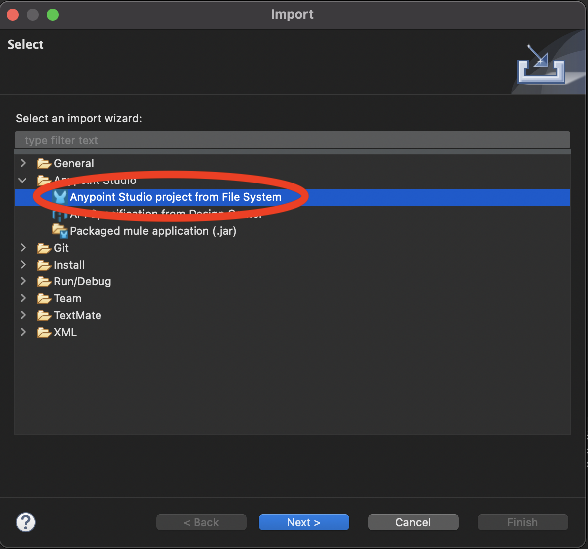

import ClearscapeDocsNote from '../_partials/vantage_clearscape_analytics.mdx'
import CommunityLink from '../_partials/community_link.mdx'

# Mule サービスから Teradata Vantage をクエリーMule サービスから Teradata Vantage をクエリーするする方法

## 概要

この例は、Mulesoft MySQL サンプル プロジェクトのクローンです。
Teradata データベースにクエリーを実行し、REST API 経由で結果を公開する方法を示します。

## 前提条件

* Mulesoft Anypoint Studio。https://www.mulesoft.com/platform/studio から 30 日間の試用版をダウンロードできます。
* Teradata Vantageインスタンスへのアクセス。

<ClearscapeDocsNote />

## サービス例

このサンプル Mule サービスは、HTTP リクエストを受け取り、Teradata Vantage データベースにクエリーを実行し、結果を JSON 形式で返します。



Mule HTTP コネクタは、次の形式の HTTP GET リクエストをリッスンします。`http://<host>:8081/?lastname=<parameter>`.
HTTP コネクタは、メッセージ プロパティの 1 つとして `<parameter>` の値をデータベース コネクタに渡します。
データベース コネクタは、この値を抽出して以下の SQL クエリーで使用するように構成されています。

```sql
SELECT * FROM hr.employees WHERE LastName = :lastName
```

ご覧のとおり、HTTP コネクタに渡されたパラメータの値を参照してパラメータ化されたクエリーを使用しています。
したがって、HTTP コネクタが http://localhost:8081/?lastname=Smith を受信する場合、SQL クエリーは次のようになります。

```sql
SELECT * FROM employees WHERE last_name = Smith
```

データベース コネクタは、データベース サーバーに SQL クエリーを実行するように指示し、クエリーの結果を取得して、その結果を JSON に変換する変換メッセージ プロセッサに渡します。
HTTP コネクタはリクエスト/応答として構成されているため、結果は元の HTTP クライアントに返されます。

## 設定

*  `Teradata/mule-jdbc-example` リポジトリのクローンを作成します。
```bash
  git clone https://github.com/Teradata/mule-jdbc-example
```

* `src/main/mule/querying-a-teradata-database.xml` を編集し、Teradata接続文字列 `jdbc:teradata://<HOST>/user=<username>,password=<password>` を検索し、Teradata接続パラメータを使用環境に合わせて置換します。

:::note
Vantage インスタンスが ClearScape Analytics Experience 経由でアクセス可能な場合は、 `<HOST>` をClearScape Analytics Experience 環境のホスト URL に置き換える必要があります。さらに、「user」と「password」を更新して、ClearScape Analytics Environment のユーザー名とパスワードを反映させる必要があります。
:::

* Vantage インスタンスにサンプル データベースを作成します。
サンプルデータを入力します。

```sql
 -- create database
 CREATE DATABASE HR
   AS PERMANENT = 60e6, SPOOL = 120e6;

 -- create table
 CREATE SET TABLE HR.Employees (
   GlobalID INTEGER,
   FirstName VARCHAR(30),
   LastName VARCHAR(30),
   DateOfBirth DATE FORMAT 'YYYY-MM-DD',
   JoinedDate DATE FORMAT 'YYYY-MM-DD',
   DepartmentCode BYTEINT
 )
 UNIQUE PRIMARY INDEX ( GlobalID );

 -- insert a record
 INSERT INTO HR.Employees (
   GlobalID,
   FirstName,
   LastName,
   DateOfBirth,
   JoinedDate,
   DepartmentCode
 ) VALUES (
   101,
   'Test',
   'Testowsky',
   '1980-01-05',
   '2004-08-01',
   01
 );
```

* Anypoint Studio でプロジェクトを開きます。
    * Anypoint Studio に入ったら、 `Import projects..` をクリックします。

    

    *  `Anypoint Studio project from File System` を選択します。

    

    * Gitリポジトリをクローンしたディレクトリを `Project Root`として使用します。その他の設定はすべてデフォルト値のままにします。

## Run

*  `Run` メニューを使用して、Anypoint Studio でサンプル アプリケーションを実行します。
プロジェクトがビルドされ、実行されます。 1 分ほどかかります。
* Web ブラウザーにアクセスし、次のリクエストを送信します: http://localhost:8081/?lastname=Testowsky。

以下の JSON 応答を取得する必要があります。


```json
[
  {
    "JoinedDate": "2004-08-01T00:00:00",
    "DateOfBirth": "1980-01-05T00:00:00",
    "FirstName": "Test",
    "GlobalID": 101,
    "DepartmentCode": 1,
    "LastName": "Testowsky"
  }
]
```

## さらに詳しく

* マシン上でデータベースコネクタを設定する方法の詳細については、この [ドキュメント](http://www.mulesoft.org/documentation/display/current/Database+Connector)を参照してください。
* データベース コネクタのアクセス プレーン [参考資料](http://www.mulesoft.org/documentation/display/current/Database+Connector+Reference) 。
*  [DataSense](http://www.mulesoft.org/documentation/display/current/DataSense)について詳しくはこちらをご覧ください。

<CommunityLink />