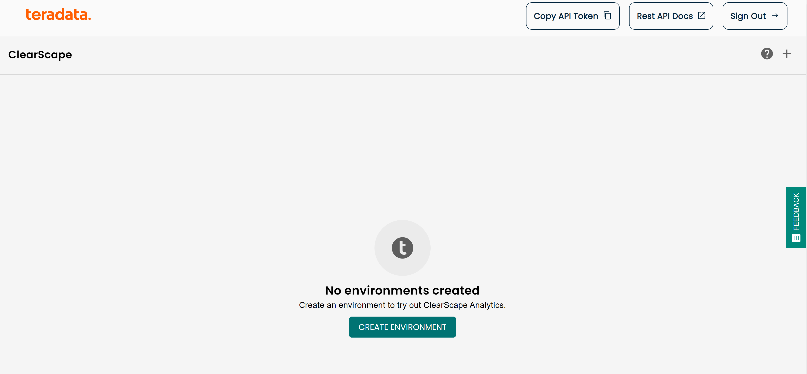
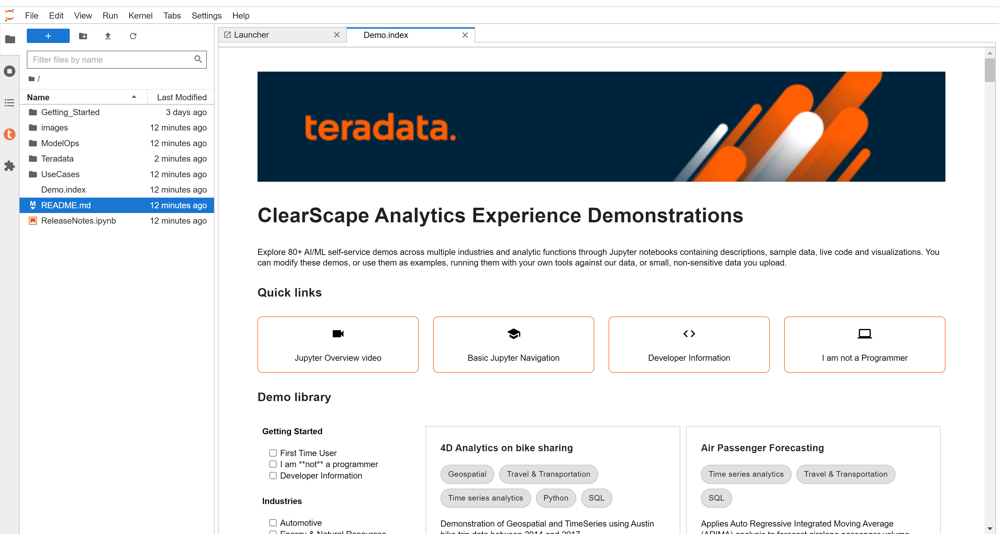

# ClearScape Analytics Experience を始める

## 概要

[ClearScape AnalyticsTM](https://www.teradata.com/platform/clearscape-analytics) は [Teradata VantageCloud](https://www.teradata.com/platform/vantagecloud)の強力な分析エンジンです。市場で最も強力でオープンかつ接続された AI/ML 機能により、企業全体に画期的なパフォーマンス、価値、成長をもたらします。ClearClearScape AnalyticsTM と Teradata Vantage は、 [ClearScape Analytics Experience](https://www.teradata.com/experience)を通じて非本番環境で体験できます。

このハウツーでは、ClearScape Analytics Experience で環境を作成し、デモにアクセスする手順について説明します。

  
## ClearScape Analytics Experience アカウントを作成する

 [ClearScape Analytics Experience](https://www.teradata.com/experience) にアクセスして無料アカウントを作成してください。

環境を作成し、デモにアクセスするには、 [ClearScape Analyticsアカウント](https://clearscape.teradata.com/sign-in) にサインインしてください。

## 環境を作成する

サインインしたら次をクリックします。 **CREATE ENVIRONMENT**

以下の情報を提供する必要があります:

| 変数             | 値                                                                 |
|----------------------|-----------------------------------------------------------------------|
| **environment name** | 環境の名前（例："demo"）                              |
| **database password**| 選択したパスワード。このパスワードは、`dbc` および  `demo_user` ユーザーに割り当てられます。 |
| **Region**           | ドロップダウンからリージョンを選択します。                                     |

:::info
データベースのパスワードを書き留めてください。データベースに接続する際に必要になります。
:::

*CREATE* ボタンをクリックして環境の作成を完了すると、環境の詳細が表示されます。

## デモにアクセスする

ClearScape Analytics Experience 環境には、分析を使用してさまざまな業界のビジネス上の問題を解決する方法を紹介するさまざまなデモが含まれています。 

デモにアクセスするには、 **RUN DEMOS USING JUPYTER** ボタンをクリックします。ブラウザの新しいタブに Jupyter 環境が開きます。 

:::note
デモの詳細はすべて、デモ インデックス ページでご覧いただけます。
:::

## まとめ

このクイック スタートでは、ClearScape Analytics Experience で環境を作成し、デモにアクセスする方法を学びました。

## さらに詳しく

* [ClearScape Analytics Experience API ドキュメント](https://api.clearscape.teradata.com/api-docs/)
* [Teradata ドキュメント](https://docs.teradata.com/)

