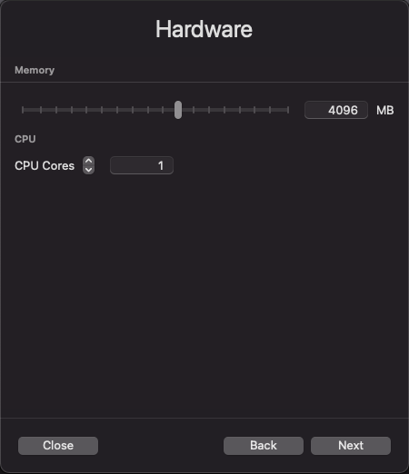

import GettingStartedIntro from '../../_partials/getting-started-intro.mdx';
import RunVantage from '../../_partials/run-vantage.mdx';
import RunSimpleQueries from '../../_partials/running-sample-queries.mdx';
import GettingStartedSummary from '../../_partials/getting-started-summary.mdx';
import CommunityLink from '../../_partials/community_link.mdx';

# UTM で Vantage Express を実行する方法

<GettingStartedIntro />

## 前提条件

1. Mac コンピューター。Intel チップと M1/2 チップの両方がサポートされています。

:::note
Vantage Express は x86 アーキテクチャで動作します。M1/2 チップで VM を実行する場合、UTM は x86 をエミュレートする必要があります。これは仮想化よりも大幅に遅くなります。M1/M2 上の Vantage Express がニーズに対して遅すぎると判断した場合は、クラウドで Vantage Express を実行することを検討してください: [AWS](../on-your-cloud-infrastructure/run-vantage-express-on-aws.md)、 [Azure](../on-your-cloud-infrastructure/run-vantage-express-on-microsoft-azure.md)、 [Google Cloud](../on-your-cloud-infrastructure/vantage-express-gcp.md)。
:::

2. 少なくとも 1 つのコアと 4GB RAM を仮想マシン専用にできる 30GB のディスク領域と十分な CPU および RAM。
3. ソフトウェアをインストールして実行できる管理者権限。

:::note
ローカルマシンに管理者権限がありませんか? [AWS](../on-your-cloud-infrastructure/run-vantage-express-on-aws.md)、 [Azure](../on-your-cloud-infrastructure/run-vantage-express-on-microsoft-azure.md)、 [Google Cloud](../on-your-cloud-infrastructure/vantage-express-gcp.md)で Vantage Express を実行する方法をご覧ください。
:::

## インストール

### 必要なソフトウェアをダウンロードする

1. [Vantage Express](https://downloads.teradata.com/download/database/teradata-express-for-vmware-player)の最新バージョン。これまでに Teradata Downloads Web サイトを使用したことがない場合は、登録する必要があります。
2. [UTM](https://mac.getutm.app)の最新バージョン。

### UTMインストーラーを実行する

1. インストーラを実行し、デフォルト値を受け入れてUTMをインストールします。

### Vantage Expressを実行する

1. Vantage Express をダウンロードしたディレクトリに移動し、ダウンロードしたファイルを解凍します。
2. UTM を起動し、 `+` の記号をクリックして、 `Virtualize` (Intel Mac の場合) または `Emulate` (M1 Mac の場合) を選択します。
3.  `Operating System` 画面で `Other`を選択します。
4.  `Other` 画面で `Skip ISO Boot`を選択します。
5.  `Hardware` 画面で、少なくとも 4GB のメモリと少なくとも 1 つの CPU コアを割り当てます。10GB の RAM と 2 つの CPU を推奨します。

    

6. `Storage` 画面で `Next` をクリックして、デフォルトを受け入れます。
7. `Shared Direct` 画面で `Next` をクリックします。
8.  `Summary` 画面で `Open VM Settings` にチェックを入れ、 `Save`をクリックします。
9. セットアップ ウィザードを実行します。次のタブを調整するだけです。
    - **QEMU** - `UEFI Boot` オプションを無効にします。
    - **Network** - ホスト コンピューター上で ssh (22) ポートと Vantage (1025) ポートを公開します。

    

10. ドライブをマップします。
    * デフォルトの `IDE Drive` を削除します。
    * ダウンロードした VM の zip ファイルからディスク ファイルをインポートして、3 つの Vantage Express ドライブをマップします。正しい順序 (`-disk1`、 `-disk2`、 `-disk3`) でマップするようにしてください。最初のディスクはブート可能で、データベース自体が含まれています。ディスク 2 と 3 は `pdisks` と呼ばれ、データが含まれています。ファイルをインポートすると、UTM によって自動的に `vmdk` 形式から `qcow2` 形式に変換されます。各ディスクが `IDE` インターフェイスを使用して構成されていることを確認してください。

    

    * 3 つのドライブすべてのマッピングが完了すると、構成は次のようになります。

    

11. 構成を保存し、VM を起動します。

<RunVantage />

<RunSimpleQueries />

<GettingStartedSummary />

## 次のステップ
* [オブジェクトストレージに保存されたクエリーデータ](../../manage-data/nos.md)

## さらに詳しく
* [Teradata®Studio™およびStudio™Expressインストール ガイド](https://docs.teradata.com/r/Teradata-StudioTM-and-StudioTM-Express-Installation-Guide-17.20)

<CommunityLink />
