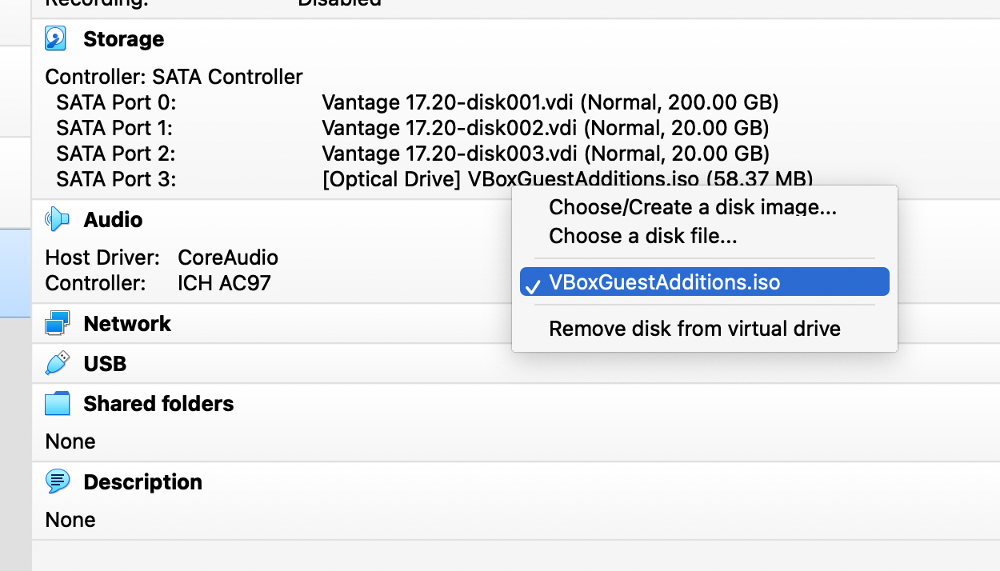

import GettingStartedIntro from '../../_partials/getting-started-intro.mdx';
import RunVantage from '../../_partials/run-vantage.mdx';
import RunSimpleQueries from '../../_partials/running-sample-queries.mdx';
import GettingStartedSummary from '../../_partials/getting-started-summary.mdx';
import CommunityLink from '../../_partials/community_link.mdx';

# VirtualBox で Vantage Express を実行する方法

<GettingStartedIntro />

## 前提条件

1. 以下のオペレーティング システムのいずれかを使用するコンピューター: Windows 10、Linux、または Intel ベースの MacOS。

    :::note
    M1/M2 MacOSシステムについては、[ UTM で Vantage Express を実行する方法](getting-started-utm.md)を参照してください。
    :::

2. 少なくとも 1 つのコアと 6GB RAM を仮想マシン専用にできる 30GB のディスク領域と十分な CPU および RAM。
3. ソフトウェアをインストールして実行できる管理者権限。


## インストール

### 必要なソフトウェアをダウンロードする

1. [Vantage Express VirtualBox オープン仮想アプライアンス (OVA)](https://downloads.teradata.com/download/database/teradata-express-for-vmware-player)の最新バージョン。

    :::note
    これまでに Teradata Downloads Web サイトを使用したことがない場合は、まず登録する必要があります。
    :::

2. [VirtualBox](https://www.virtualbox.org/wiki/Downloads)バージョン 6.1。

    :::note
    `brew` およびその他のパッケージ マネージャを使用して VirtualBox をインストールすることもできます。
    :::

### インストーラを実行する

1. インストーラーを実行し、デフォルト値を受け入れて、VirtualBox をインストールします。

    :::note
    VirtualBox には、昇格された権限を必要とする機能が含まれています。VirtualBox を初めて起動すると、この昇格されたアクセスを確認するように求められます。VirtualBox カーネル プラグインを有効にするには、マシンを再起動する必要がある場合もあります。
    :::

### Vantage Express を実行する

- VirtualBoxを起動します。
- `File -> Import Appliance...` メニューに移動します。
-  `File` フィールドで、ダウンロードしたOVAファイルを選択します。
- 以下の画面で、デフォルトを受け入れて `Import` をクリックします。
- メインの VirtualBox パネルに戻り、VM `Vantage 17.20` をダブルクリックして Vantage Express アプライアンスを起動します。

    

<RunVantage />

<RunSimpleQueries />

## VirtualBox ゲスト拡張機能を更新する

VirtualBox ゲスト拡張機能は、VM で実行されるソフトウェアです。VirtualBox での VM の実行速度が向上します。また、VM 画面の解像度とサイズ変更に対する応答性が向上します。双方向クリップボードと、ホストとゲスト間のドラッグ アンド ドロップが実装されています。VM の VirtualBox ゲスト拡張機能は、VirtualBox インストールのバージョンと一致している必要があります。最適なパフォーマンスを得るには、VirtualBox ゲスト拡張機能を更新する必要がある可能性があります。

VirtualBox ゲスト拡張機能を更新するには:

1.  `Storage` セクションの `SATA Port 3: [Optical Drive]` をクリックして、VirtualBox ゲスト拡張機能DVD を挿入します。



2. VMウィンドウに戻り、`Gnome Terminal` アプリケーションを起動します。
3. ターミナルで以下のコマンドを実行します。

```bash
mount /dev/cdrom /media/dvd; /media/dvd/VBoxLinuxAdditions.run
```

<GettingStartedSummary />

## 次のステップ
* [オブジェクトストレージに保存されたクエリーデータ](../../manage-data/nos.md)

## さらに詳しく
* [Teradata®Studio™およびStudio™Expressインストール ガイド](https://docs.teradata.com/r/Teradata-StudioTM-and-StudioTM-Express-Installation-Guide-17.20)

<CommunityLink />