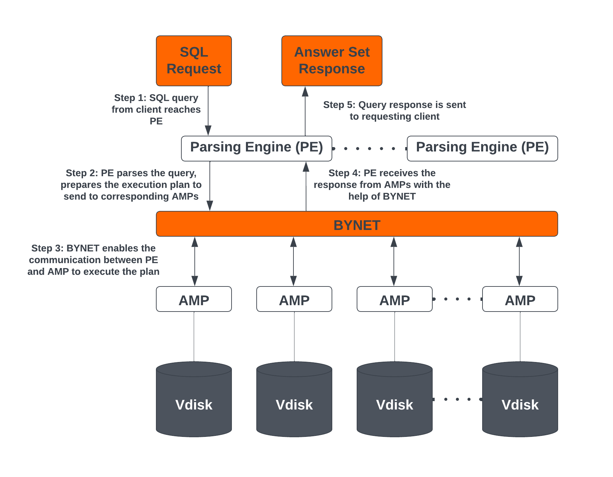
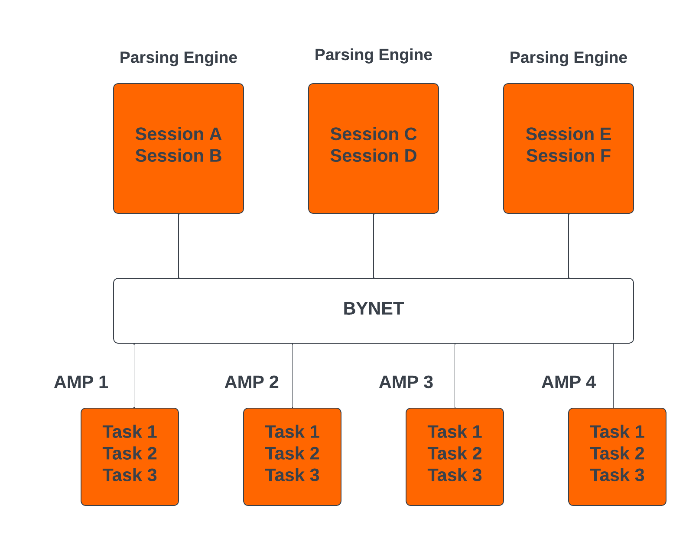
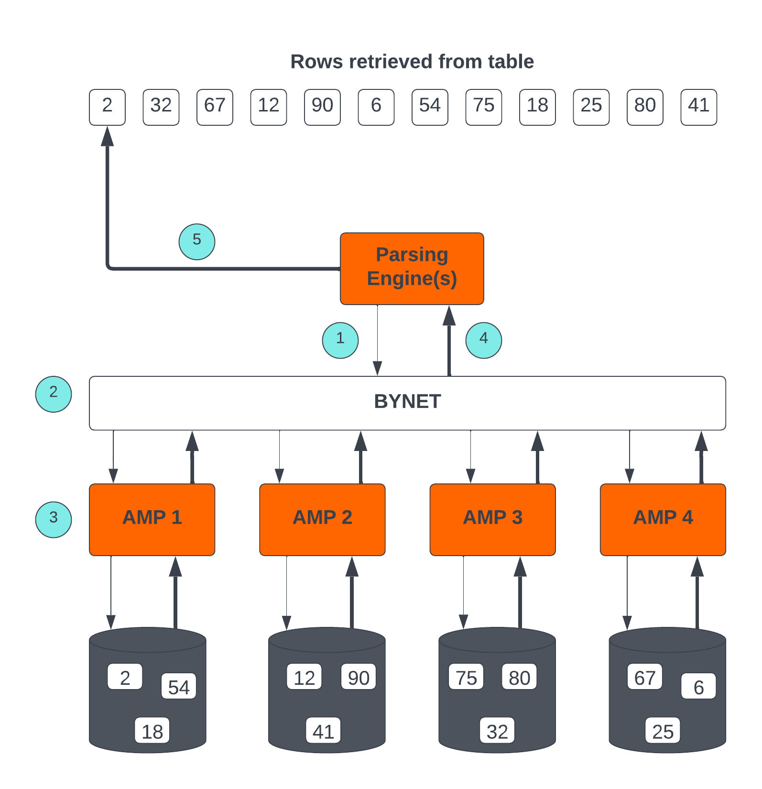
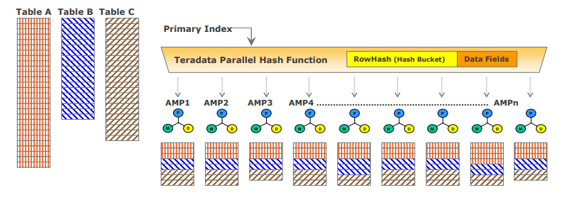

# Teradata Vantage エンジンのアーキテクチャと概念

### 概要

この記事では、Teradata Vantage エンジン アーキテクチャの基本的な概念について説明します。VantageCloud Lake のプライマリ クラスターを含む Vantage のすべてのエディションは同じエンジンを使用します。  

Teradata のアーキテクチャは、高性能なデータ処理と分析を可能にする超並列処理 (MPP)、シェアードナッシング アーキテクチャに基づいて設計されています。MPP アーキテクチャは、ワークロードを複数の vproc または仮想プロセッサに分散します。クエリー処理が行われる仮想プロセッサは、一般にアクセス モジュール プロセッサ (AMP) と呼ばれます。各 AMP は他の AMP から分離されており、クエリーを並列処理することで、Teradata が大量のデータを迅速に処理できるようにします。 

Teradata Vantage エンジンの主要なアーキテクチャ コンポーネントには、解析エンジン (PE)、BYNET、アクセス モジュール プロセッサ (AMP)、仮想ディスク (Vdisk) が含まれます。Vdisk は、エンタープライズ プラットフォームでは AMP に割り当てられ、VantageCloud Lake 環境の場合はプライマリ クラスターに割り当てられます。 

## Teradata Vantage エンジンの アーキテクチャ構成要素
Teradata Vantage エンジンは、以下の構成要素で構成されています。

### Parsing Engine (PE)
SQL クエリーが Teradata で実行されると、まず解析エンジンに到達します。解析エンジンの機能は次のとおりです。

* 個々のユーザー セッション (最大 120) を管理します。 
* SQL クエリーで使用されているオブジェクトが存在するかどうかを確認します。  
* ユーザーが SQL クエリーで使用されるオブジェクトに対して必要な権限を持っているかどうかを確認します。  
* SQL クエリーを解析して最適化します。  
* SQL クエリーを実行するための実行プランを準備し、それを対応する AMP に渡します。 
* AMP から応答を受信し、それを要求元のクライアントに送り返します。 

### BYNET 
BYNET は、コンポーネント通信を可能にするシステムです。BYNET システムは、高速双方向ブロードキャスト、マルチキャスト、ポイントツーポイント通信、およびマージ機能を提供します。このシステムは、マルチ AMP クエリーの調整、複数の AMP からのデータの読み取り、輻輳を防ぐためのメッセージ フローの調整、およびプラットフォーム スループットの処理という 3 つの主要な機能を実行します。BYNET のこれらの機能により、Vantage は高度にスケーラブルになり、超並列処理 (MPP) 機能が有効になります。  

### Parallel Database Extension (PDE)
Parallel Database Extension (PDE) は、オペレーティング システムと Teradata Vantage データベースの間に位置する中間ソフトウェア レイヤーです。PDE により、MPP システムで BYNET や共有ディスクなどの機能を使用できるようになります。これにより、Teradata Vantage データベースの速度と線形スケーラビリティを実現する並列処理が容易になります。  

### Access Module Processor (AMP)
AMP はデータの保存と取得を担当します。各 AMP は、データが保存される独自の仮想ディスク (Vdisk) セットに関連付けられており、シェアード ナッシング アーキテクチャに従って、他の AMP はそのコンテンツにアクセスできません。AMP の機能は次のとおりです。

* Vantage の Block File System ソフトウェアを使用してストレージにアクセスする  
* ロックを管理する 
* 行の並べ替え 
* 列の集約 
* 結合処理 
* 出力変換 
* ディスク領の管理 
* アカウンティング 
* 回復処理 

:::note
VantageCore IntelliFlex、VantageCore VMware、VantageCloud Enterprise、および VantageCloud Lake の場合のプライマリ クラスターの AMP は、データをブロック ファイル システム (BFS) 形式で Vdisk に保存します。VantageCloud Lake のコンピューティング クラスターとコンピューティング ワーカー ノードの AMP には BFS がないため、オブジェクト ファイル システム (OFS) を使用してオブジェクト ストレージのデータにのみアクセスできます。 
:::

### 仮想ディスク (Vdisks)
これらは、AMP が所有するストレージ スペースの単位です。仮想ディスクは、ユーザー データ (テーブル内の行) を保持するために使用されます。仮想ディスクは、ディスク上の物理スペースにマップされます。

### ノード
Teradata システムのコンテキストでは、ノードはデータベース ソフトウェアのハードウェア プラットフォームとして機能する個別のサーバーを表します。ノードは、単一のオペレーティング システムの制御下でデータベース操作が実行される処理ユニットとして機能します。Teradata がクラウドにデプロイされる場合、同じ MPP、シェアード ナッシング アーキテクチャに従いますが、物理ノードは仮想マシン (VM) に置き換えられます。 

## Teradata Vantage のアーキテクチャと概念
以下の概念は Teradata Vantage に適用されます

### 直線的な成長と拡張性 
Teradata は線形に拡張可能な RDBMS です。ワークロードとデータ量が増加すると、サーバーやノードなどのハードウェア リソースを追加すると、パフォーマンスと容量が比例して増加します。線形スケーラビリティにより、スループットを低下させることなくワークロードを増やすことができます。  

### Teradata Parallelism (並列処理) 
Teradata の並列処理とは、複数のノードまたは構成要素間で同時にデータとクエリーの並列処理を実行する Teradata Database の固有の機能を指します。

* Teradata の各Parsing Engine (PE) には、最大 120 のセッションを同時に処理する機能があります。
* Teradata の BYNET により、後続のタスクのデータ再配置を含む、すべてのメッセージ アクティビティの並列処理が可能になります。 
* Teradata のすべてのアクセス モジュール プロセッサ (AMP) は、並行して連携して受信リクエストに対応できます。 
* 各 AMP は複数のリクエストを同時に処理できるため、効率的な並列処理が可能になります。  

### Teradata Retrieval Architecture (取得アーキテクチャ)
Teradata Retrieval Architecture (取得アーキテクチャ)に含まれる主な手順は以下のとおりです。

1. Parsing Engineは、1 つ以上の行を取得するリクエストを送信する。 
2. BYNETは、処理のために関連するAMPを活性化する。 
3. AMPは、並列アクセスを介して、目的の行を同時に見つけて検索する。 
4. BYNET は、取得した行をParsing Engineに返す。 
5. 次に、Parsing Engineは、リクエスト元のクライアント アプリケーションに行を返す。 

### Teradata Data Distribution (データ分散)
Teradata の MPP アーキテクチャでは、データを効率的に分散および取得する手段が必要であり、ハッシュ パーティション化を使用してこれを行います。Vantage のほとんどのテーブルでは、ハッシュを使用して、行のプライマリ インデックス (PI) の値に基づいてテーブルのデータをブロック ファイル システム (BFS) のディスク ストレージに分散し、テーブル全体をスキャンするか、インデックスを使用してデータにアクセスします。このアプローチにより、スケーラブルなパフォーマンスと効率的なデータ アクセスが保証されます。

* プライマリ インデックスが一意である場合、テーブル内の行はハッシュ パーティション化によって自動的に均等に分散されます。 
* 指定されたプライマリ インデックス列はハッシュされ、同じ値に対して一貫したハッシュ コードが生成されます。 
* 再編成、再パーティション化、またはスペース管理は必要ありません。 
* 通常、各 AMP にはすべてのテーブルの行が含まれており、効率的なデータ アクセスと処理が保証されます。 

## まとめ 
この記事では、Parsing Engines (PE)、BYNET、Access Module Processors (AMP)、Virtual Disk (Vdisk)などのTeradata Vantageの主要なアーキテクチャ コンポーネント、Parallel Database Extension(PDE)、Nodeなどのその他のアーキテクチャ コンポーネント、および線形拡張と拡張性、並列処理、データ取得、データ分散などのTeradata Vantageの基本的な概念について説明しました。   

## さらに詳しく 
* [Parsing Engine](https://docs.teradata.com/r/Enterprise_IntelliFlex_VMware/Database-Introduction/Vantage-Hardware-and-Software-Architecture/Virtual-Processors/Parsing-Engine)
* [BYNET](https://www.teradata.com/Blogs/What-Is-the-BYNET-and-Why-Is-It-Important-to-Vantage)
* [Access Module Processor](https://docs.teradata.com/r/Enterprise_IntelliFlex_VMware/Database-Introduction/Vantage-Hardware-and-Software-Architecture/Virtual-Processors/Access-Module-Processor)
* [Parallel Database Extensions](https://docs.teradata.com/r/Enterprise_IntelliFlex_VMware/Database-Introduction/Vantage-Hardware-and-Software-Architecture/Parallel-Database-Extensions)
* [Teradata データ分散およびデータ アクセス方法](https://docs.teradata.com/r/Enterprise_IntelliFlex_VMware/Database-Introduction/Data-Distribution-and-Data-Access-Methods)