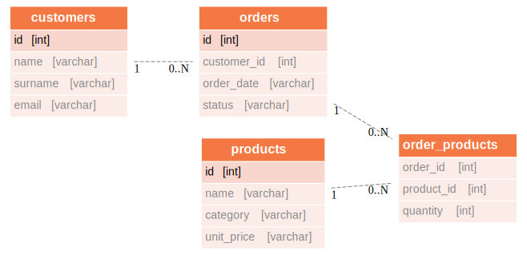
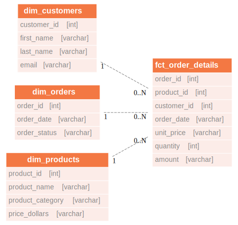

import ClearscapeDocsNote from '../_partials/vantage_clearscape_analytics.mdx'
import CommunityLink from '../_partials/community_link.mdx'

# Teradata Vantage を使用した高度な dbt のユースケース

## 概要

このプロジェクトでは、上級ユーザーの観点から dbt と Teradata Vantage の統合を紹介します。dbtを使ったデータエンジニアリングを初めて行う場合は、まずは [入門プロジェクト。](dbt.md)

デモで紹介されている高度なユースケースは以下のとおりです。

* 増分マテリアライズド
* ユーティリティ マクロ
* Teradata 固有の修飾子を使用したテーブル/ビューの作成の最適化

これらの概念の適用は、架空の店舗である `teddy_retailers` のELTプロセスを通じて説明されています。  

## 前提条件

* Teradata Vantageインスタンスへのアクセス。

    <ClearscapeDocsNote />

* Python **3.7**、**3.8**、**3.9**、または **3.10** がインストールされていること。

* データベース コマンドを実行するためのデータベース クライアント。 このようなクライアントの構成例は、[このチュートリアル。](../connect-to-vantage/configure-a-teradata-vantage-connection-in-dbeaver.md)に示されています。

## デモプロジェクトのセットアップ

1. チュートリアル リポジトリのクローンを作成し、プロジェクト ディレクトリに移動します。
    ```bash
    git clone https://github.com/Teradata/teddy_retailers_dbt-dev teddy_retailers
    cd teddy_retailers
    ```

2. dbt とその依存関係を管理するための新しい Python 環境を作成します。環境の作成に使用している Python バージョンが、上記のサポートされているバージョン内であることを確認します。
    ```bash
    python -m venv env
    ```

3. オペレーティング システムに応じて Python 環境を有効化します。
    ```bash
    source env/bin/activate
    ```

    Mac、Linux、または

    ```bash
    env\Scripts\activate
    ```
    Windows用

4. `dbt-teradata`モジュールをインストールします。dbtのコアモジュールも依存関係のあるモジュールとして含まれているので、別にインストールする必要はありません。

    ```bash
    pip install dbt-teradata
    ```

5. プロジェクトの依存関係 `dbt-utils` と `teradata-utils`をインストールします。これは次のコマンドで実行できます。

    ```bash
    dbt deps
    ```

## データ ウェアハウスを設定する

デモ プロジェクトでは、ソース データがデータ ウェアハウスにすでに読み込まれていることを前提としています。これは、実働環境での dbt の使用方法を模倣しています。この目的を達成するために、Google Cload Platform(GCP)で利用可能な公開データセットと、それらのデータセットをモックデータウェアハウスにロードするためのスクリプトを提供します。 

1. 作業データベースを作成または選択します。プロジェクトの dbt プロファイルは `teddy_retailers`というデータベースを指します。 `schema` の値を変更して Teradata Vantage インスタンス内の既存のデータベースを指すようにすることも、データベース クライアントで次のスクリプトを実行して `teddy_retailers` データベースを作成することもできます。
    ```sql
    CREATE DATABASE teddy_retailers
    AS PERMANENT = 110e6,
        SPOOL = 220e6;
    ```
2. 初期データセットをロードします。初期データセットをデータウェアハウスにロードするために、必要なスクリプトがプロジェクトの `references/inserts/create_data.sql` パスで使用できます。
これらのスクリプトは、データベース クライアントにコピーして貼り付けることで実行できます。特定のケースでこれらのスクリプトを実行する方法については、データベース クライアントのドキュメントを参照してください。

## dbtを構成する

ここで、dbtを設定してVantageデータベースに接続します。次の内容のファイル `$HOME/.dbt/profiles.yml` を作成します。 `<host>`、 `<user>`、 `<password>` を Teradata Vantage インスタンスに合わせて調整します。
ご使用の環境ですでに dbt を使用したことがある場合は、ホームのディレクトリの `.dbt/profiles.yml` ファイルにプロジェクトのプロファイルを追加するだけで済みます。
ディレクトリ.dbtがまだシステムに存在しない場合は、それを作成し、dbtプロファイルを管理するためにprofiles.ymlを追加する必要があります。


```bash
teddy_retailers:
  outputs:
    dev:
      type: teradata
      host: <host>
      user: <user>
      password: <password>
      logmech: TD2
      schema: teddy_retailers
      tmode: ANSI
      threads: 1
      timeout_seconds: 300
      priority: interactive
      retries: 1
  target: dev
```

プロファイルファイルが用意できたので、設定を検証できます。

```bash
dbt debug
```

デバッグ コマンドがエラーを返した場合は、 `profiles.yml` の内容に問題がある可能性があります。

## Teddy Retailers のウェアハウスについて

前述のように、`teddy_retailers` は架空の店舗です。dbt 主導の変換を通じて、`teddy_retailers`トランザクション データベースから取り込まれたソース データを、分析に使用できるスター スキーマに変換します。

### データ モデル

ソース データは、以下のエンティティリレーションシップ図に従って、customers、orders、products、order_products のテーブルで構成されます。



dbt を使用して、ソース データ テーブルを利用して、分析ツール用に最適化された以下のディメンションモデルを構築します。



### ソース

* Teddy Retailersの場合、`orders` と `order_products` のソースは、組織のELT(抽出、ロード、変換)プロセスによって定期的に更新される。 
* 更新されたデータには、データセット全体ではなく、最新の変更のみが含まれる。これは、データセットが大量であるためです。 
* この課題に対処するには、以前に利用可能なデータを保持しながら、これらの増分更新をキャプチャする必要があります。

## dbtモデル

プロジェクトのモデル ディレクトリにある `schema.yml` ファイルは、モデルのソースを指定します。これらのソースは、SQL スクリプトを使用して GCP から読み込んだデータと一致します。

### ステージング エリア

ステージング エリア モデルは、各ソースからデータを取り込み、必要に応じて各フィールドの名前を変更するだけです。このディレクトリの schema.yml では、主キーの基本的な保全性チェックを定義します。 

### コア エリア

この段階では、以下の高度な dbt 概念がモデルに適用されます。 

#### 増分マテリアライズド

このディレクトリ内の `schema.yml` ファイルは、構築している 2 つのモデルのマテリアライズドが増分であることを指定します。これらのモデルには異なる戦略を採用しています。

*  `all_orders model`については、削除 + 挿入戦略を利用します。この戦略は、データ更新に含まれる注文のステータスが変更される可能性があるために実装されます。
*  `all_order_products` モデルでは、デフォルトの追加戦略を採用しています。このアプローチが選択されるのは、 `order_id` と `product_id` の同じ組み合わせがソース内に複数回出現する可能性があるためです。これは、同じ製品の新しい数量が特定の注文に追加または削除されたことを示します。

#### マクロ支援アサーション

 `all_order_products` モデル内には、マクロを使用してアサーションを組み込み、結果のモデルに `order_id` と `product_id`の一意の組み合わせが含まれていることをテストして保証しています。この組み合わせは、注文ごとに特定の種類の製品の最新の数量を示します。

#### Teradata 修飾子

 `all_order` モデルと `all_order_products` モデルの両方について、これら 2 つのコア モデルの追跡を強化するために Teradata 修飾子を組み込みました。
統計の収集を容易にするために、データベース コネクタに適切な指示を与える `post_hook` を追加しました。また、 `all_orders` テーブル内の `order_id` 列にインデックスを作成しました。


## 変換を実行する

### ベースライン データを使用してディメンションモデルを作成する

dbt を実行することで、ベースライン データを使用してディメンションモデルを生成します。


``` bash
dbt run
```

これにより、ベースラインデータを使用して、コアモデルと次元モデルの両方が作成されます。

### データをテストする

以下を実行することで、定義したテストを実行できます。


```bash
dbt test
```

### サンプルクエリーを実行する

サンプルのビジネス インテリジェンス クエリーは、プロジェクトの `references/query` パスにあります。これらのクエリーを使用すると、顧客、注文、製品などのディメンションに基づいて事実データを分析できます。

### ELTプロセスをモック化する

更新をソースデータセットにロードするためのスクリプトは、プロジェクトの `references/inserts/update_data.sql` パスにあります。

データ ソースを更新したら、前述の手順 (dbt の実行、データのテスト、サンプル クエリーの実行) に進むことができます。これにより、データの変化と増分更新を視覚化できます。

## まとめ

このチュートリアルでは、Teradata Vantage を使用した高度な dbt コンセプトの利用方法を検討しました。サンプル プロジェクトでは、ソース データの次元データ マートへの変換を紹介しました。プロジェクト全体を通じて、増分マテリアライゼーション、ユーティリティ マクロ、Teradata修飾子など、いくつかの高度な dbt コンセプトを実装しました。

<CommunityLink />