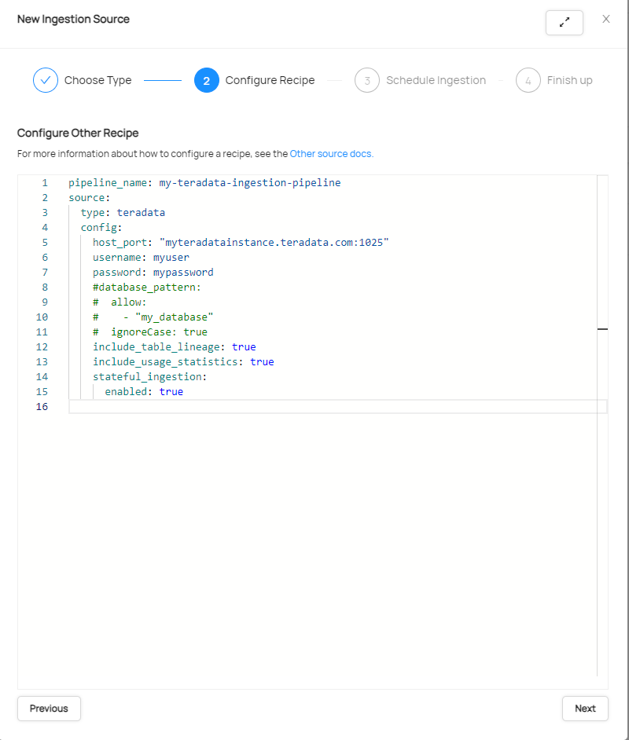
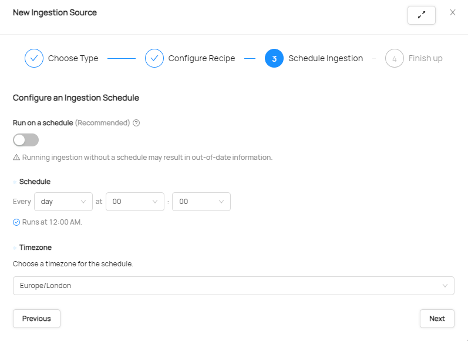
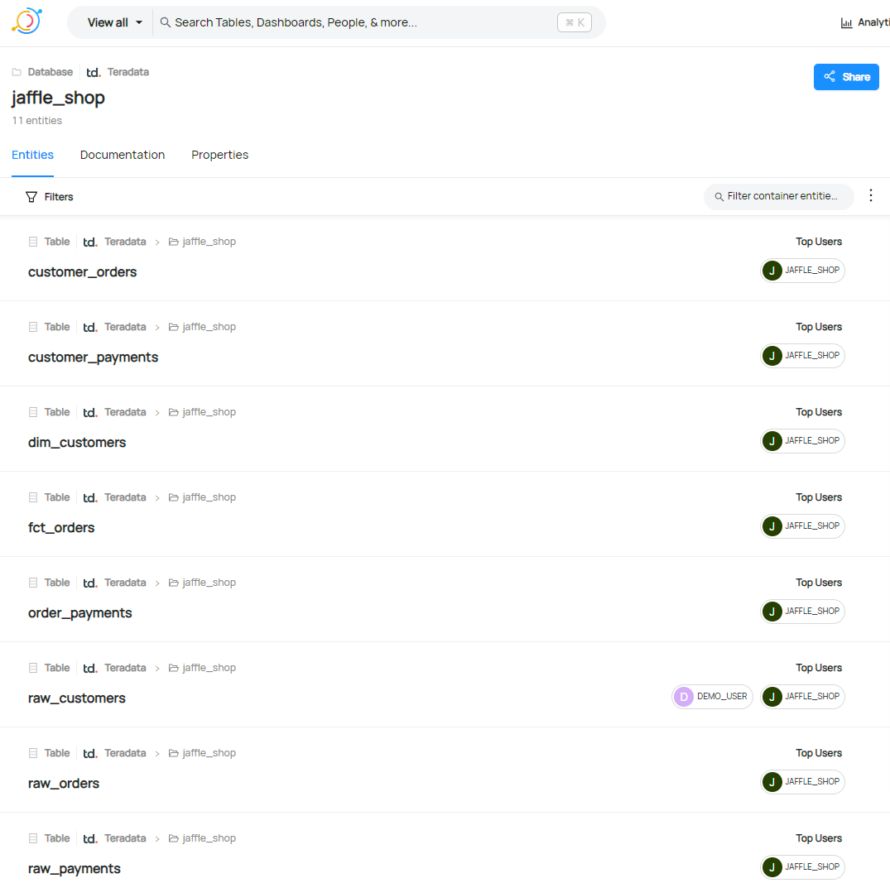

# DataHubでのTeradata Vantageの接続設定

## 概要

このハウツーでは、DataHub を使用して Teradata Vantage への接続を作成し、テーブルとビューに関するメタデータを使用状況と系統情報とともに取り込む方法を示します。

## 前提条件

import ClearscapeDocsNote from '../_partials/vantage_clearscape_analytics.mdx'

* Teradata Vantageインスタンスへのアクセス。
  <ClearscapeDocsNote />
* DataHubがインストールされています。 [ DataHubクイックスタートガイド](https://datahubproject.io/docs/quickstart)

## DataHubのセットアップ

* DataHubがインストールされている環境にDataHub用のTeradataプラグインをインストールします。

``` bash
pip install 'acryl-datahub[teradata]'
```

* Teradataユーザーを設定し、そのユーザーがディクショナリ テーブルを読み取ることができるように権限を設定する

``` sql
CREATE USER datahub FROM <database> AS PASSWORD = <password> PERM = 20000000;

GRANT SELECT ON dbc.columns TO datahub;
GRANT SELECT ON dbc.databases TO datahub;
GRANT SELECT ON dbc.tables TO datahub;
GRANT SELECT ON DBC.All_RI_ChildrenV TO datahub;
GRANT SELECT ON DBC.ColumnsV TO datahub;
GRANT SELECT ON DBC.IndicesV TO datahub;
GRANT SELECT ON dbc.TableTextV TO datahub;
GRANT SELECT ON dbc.TablesV TO datahub;
GRANT SELECT ON dbc.dbqlogtbl TO datahub; -- if lineage or usage extraction is enabled
```
* プロファイリングを実行する場合は、プロファイリングするすべてのテーブルに対する選択権限を付与する必要があります。

* Lineageまたは使用状況のメタデータを抽出する場合は、クエリー ログを有効にし、クエリーに適したサイズに設定する必要があります (Teradata がキャプチャするデフォルトのクエリー テキスト サイズは最大 200 文字です)。すべてのユーザーに対して設定する方法の例 :

``` sql
-- set up query logging on all

REPLACE QUERY LOGGING LIMIT SQLTEXT=2000 ON ALL;
```

## DataHubにTeradataの接続を追加する
DataHubが実行されている状態で、DataHub GUIを開き、ログインします。この例では、localhost:9002 で実行されています。 

* インジェストプラグアイコンをクリックして、新しい接続ウィザードを開始します。 


  「Create new source」を選択します。 
  


* 使用可能なソースのリストをスクロールし、[Other]を選択します。 


* Teradata への接続を構成し、テーブルと列の系統をキャプチャするか、データのプロファイリングを行うか、使用統計を取得するかなど、必要なオプションを定義するには、Recipeが必要です。以下は、開始するための簡単なレシピです。ホスト、ユーザー名、パスワードは、環境に合わせて変更する必要があります。

``` yaml
pipeline_name: my-teradata-ingestion-pipeline
source:
  type: teradata
  config:
    host_port: "myteradatainstance.teradata.com:1025"
    username: myuser
    password: mypassword
    #database_pattern:
    #  allow:
    #    - "my_database"
    #  ignoreCase: true
    include_table_lineage: true
    include_usage_statistics: true
    stateful_ingestion:
      enabled: true
```

Recipeをウィンドウに貼り付けると、次のようになります。 


* [Next]をクリックして、必要なスケジュールを設定します。 


* [次へ] をクリックして完了し、接続に名前を付けます。[詳細] をクリックして、正しい CLI バージョンを設定できるようにします。Teradata の DataHub サポートは、CLI 0.12.x で利用可能になりました。最適な互換性を確保するには、最新バージョンを選択することをお勧めします。


* 新しいソースを保存したら、「Run」をクリックして手動で実行できます。 


実行が成功した後に「Succeeded」をクリックすると、これと同様のダイアログが表示され、DataHub に取り込まれたデータベース、テーブル、ビューが表示されます。  


* GUI で以下を参照してメタデータを探索できるようになりました。
  * DataSets は、ロードされたデータセット (テーブルとビュー) のリストを提供します。

  * データベースから取得されたエンティティ

  * 列/フィールド名、データ型、およびキャプチャされている場合の使用法を示すエンティティのスキーマ

  * Lineageは、テーブルとビューの間でデータがどのようにリンクされているかを視覚的に表現します。


## まとめ

このハウツーでは、テーブル、ビューのメタデータをリネージおよび使用統計とともにキャプチャするために、DataHub を使用して Teradata Vantage への接続を作成する方法を説明しました。

## さらに詳しく
* [DataHub と Teradata Vantage を統合する](https://datahubproject.io/docs/generated/ingestion/sources/teradata)
* [RecipesのDataHub統合オプション](https://datahubproject.io/docs/metadata-ingestion/#recipes)

import CommunityLinkPartial from '../_partials/community_link.mdx';

<CommunityLinkPartial />
