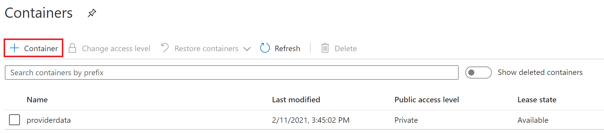
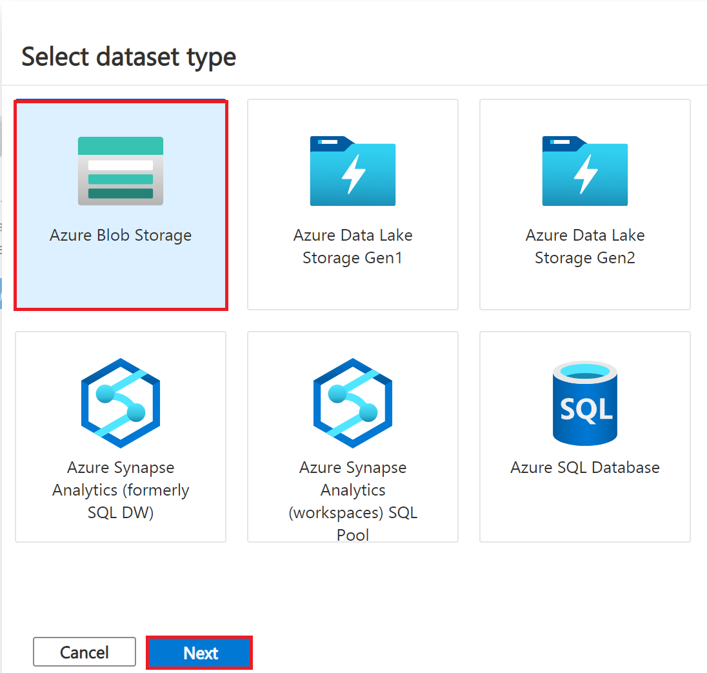
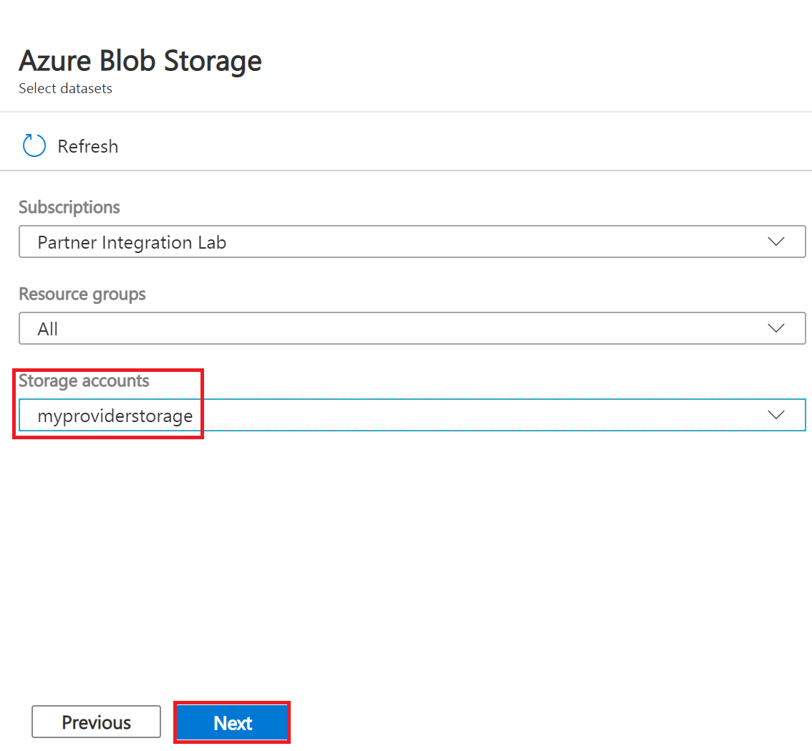
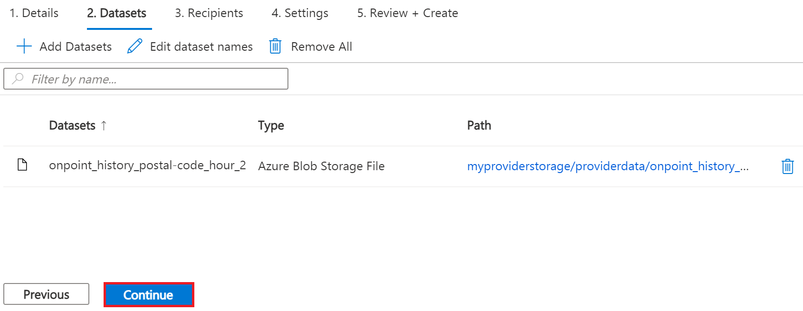
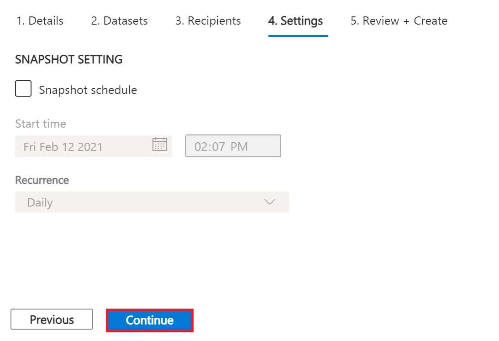
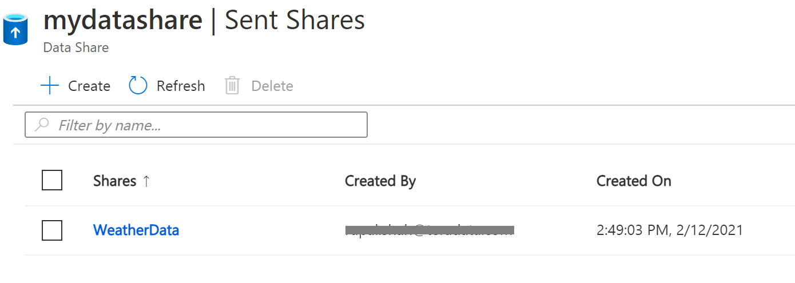
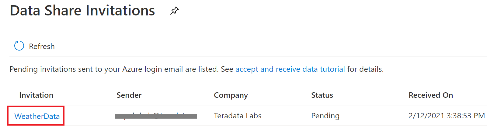
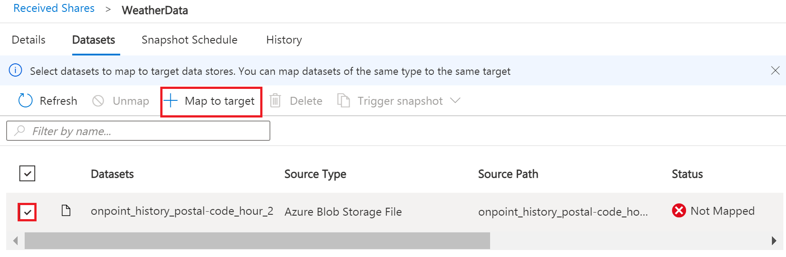
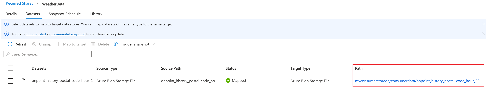
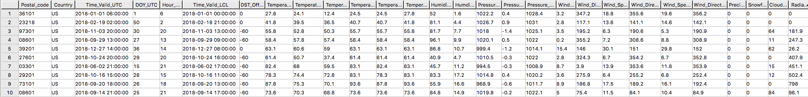

# Azure Data Share を Teradata Vantage に接続する

### 概要

この記事では、Azure Data Share サービスを使用して Azure Blob Storage データセットをあるユーザーから別のユーザーと共有し、ネイティブ オブジェクト ストア (NOS) 機能を活用して Teradata Vantage でクエリーを実行するプロセスについて説明します。両方のユーザーに対してストレージ アカウントとデータ共有アカウントを作成して使用します。

これは、ワークフローの図です。


### Azure Data Shareについて

[Azure データ共有](https://docs.microsoft.com/en-us/azure/data-share/overview) を使用すると、組織は複数の顧客やパートナーとデータを簡単かつ安全に共有できます。データを共有および受信するには、データ プロバイダとデータ コンシューマーの両方が Azure サブスクリプションを持っている必要があります。Azure Data Share は現在、スナップショット ベースの共有とインプレース共有を提供しています。現在、Azure Data Share [サポートされているデータストア](https://docs.microsoft.com/en-us/azure/data-share/supported-data-stores) には、Azure Blob Storage、Azure Data Lake Storage Gen1 および Gen2、Azure SQL Database、Azure Synapse Analytics、Azure Data Explorer が含まれます。Azure Data Share を使用してデータセット共有が送信されると、データ コンシューマーは Azure Blob Storage などの任意のデータ ストアでそのデータを受信し、Teradata Vantage を使用してデータを探索および分析できます。

詳細については、[ドキュメント](https://docs.microsoft.com/en-us/azure/data-share)を参照してください。

### Teradata Vantage について

Vantageは、データウェアハウス、データレイク、アナリティクスを単一の接続されたエコシステムに統合する最新のクラウドプラットフォームです。

Vantageは、記述的分析、予測的分析、処方的分析、自律的意思決定、ML機能、可視化ツールを統合したプラットフォームで、データの所在を問わず、リアルタイムのビジネスインテリジェンスを大規模に発掘することが可能です。

Vantageは、小規模から始めて、コンピュートやストレージを弾力的に拡張し、使用した分だけ支払い、低コストのオブジェクトストアを活用し、分析ワークロードを統合することを可能にします。

Vantage は、R、Python、Teradata Studio、およびその他の SQL ベースのツールをサポートしています。Vantage は、パブリック クラウド、オンプレミス、最適化されたインフラストラクチャまたはコモディティ インフラストラクチャ、またはサービスとして導入できます。

Teradata Vantage Native Object Store (NOS) を使用すると、標準 SQL を使用して、Azure Blob Storage などの外部オブジェクト ストア内のデータを探索できます。NOS を使用するには、特別なオブジェクト ストレージ側のコンピューティング インフラストラクチャは必要ありません。コンテナを指す NOS テーブル定義を作成するだけで、Blob Storage コンテナ内のデータを探索できます。NOS を使用すると、Blob Storage からデータをすばやくインポートしたり、データベース内の他のテーブルに結合したりすることもできます。

あるいは、Teradata Parallel Transporter (TPT) ユーティリティを使用して、Blob Storage から Teradata Vantage にデータを一括インポートすることもできます。データがロードされると、Vantage 内でデータを効率的にクエリーできます。

詳細については、[*ドキュメント*](https://docs.teradata.com/home)を参照してください。

### 前提条件

import ClearscapeDocsNote from '../_partials/vantage_clearscape_analytics.mdx'

* Teradata Vantageインスタンスへのアクセス。
  <ClearscapeDocsNote />
* Azure アカウント。 [無料アカウント](https://azure.microsoft.com/free)で始めることができます。
* データセットを保存するための [Azure Blob Storage](https://docs.microsoft.com/en-us/azure/storage/common/storage-quickstart-create-account?tabs=azure-portal) アカウント

### 手順

前提条件を満たした上で、以下の手順で行います。

1. Azure Blob Storage アカウントとコンテナーを作成する
2. データシェアアカウントの作成
3. 共有を作成する
4. データ共有を使用してデータを受信および受信する
5. Blob Storage への NOS アクセスを構成する
6. Blob Storageのデータセットにクエリーを実行する
7. Blob StorageからVantageにデータをロードする（オプション）

### Azure Blob Storageアカウントとコンテナを作成する

* ブラウザで [Azureポータル](https://portal.azure.com/) を開き（Chrome、Firefox、Safariでうまくいきます）、この記事の _myProviderStorage_rg_ というリソースグループに [ストレージアカウントを作成する](https://docs.microsoft.com/en-us/azure/storage/common/storage-account-create?tabs=azure-portal#create-a-storage-account-1)の手順に従います。

* ストレージ名と接続方法を入力します。この記事では _myproviderstorage_ と _public endpoint_ を使用します。

:::note
作成するすべてのサービスに同じ場所を使用することをお勧めします。
:::

*  **Review + create** を選択し、**Create** を選択します。

* *Go to resource* をクリックし、 **Containers** をクリックし、コンテナを作成します。

*  **+ Container** ボタンをクリックします。

* コンテナ名を入力します。この記事では _providerdata_ を使用します。


* **作成** をクリックします。

### データシェアアカウントの作成

データセットを共有するプロバイダーのデータ共有アカウントを作成します。

この記事の [Azure データ共有アカウントを作成する](https://docs.microsoft.com/en-us/azure/data-share/share-your-data?tabs=azure-portal#create-a-data-share-account) 手順に従って、 _マイデータシェアプロバイダ_rg_ というリソース グループにリソースを作成します。

*  **Basics** タブにデータ共有アカウント名を入力します。この記事では _mydatashareprovider_ を使用します。

:::note
作成するすべてのサービスに同じ場所を使用することをお勧めします。
:::

*  **Review + create** を選択し、**Create** を選択します。

* デプロイが完了したら、*Go to resource* を選択します。

### 共有の作成

* [データ共有]の概要ページに移動し、 [共有を作成する](https://docs.microsoft.com/en-us/azure/data-share/share-your-data?tabs=azure-portal#create-a-share) の手順に従います。

* **Start sharing your data** を選択します。

* + **Create** を選択します。

*  **Details** タブで、共有名と共有タイプを入力します。この記事では _WeatherData_ と _Snapshot_ を使用します。


:::note スナップショットの共有
受信者にデータのコピーを提供するために、スナップショット共有を選択します。

サポートされているデータストア Azure Blob Storage、Azure Data Lake Storage Gen1、Azure Data Lake Storage Gen2、Azure SQL Database、Azure Synapse Analytics (旧 SQL DW)
:::

:::note インプレース共有

データへのアクセスをソースで提供するために、インプレース共有を選択します。

サポートされているデータストア Azure データエクスプローラ
:::

* **Continue** をクリックします。

* *Datasets* タブで、 *Add datasets* をクリックします。

* *Azure Blob Storage* を選択します。


* *Next* をクリックします。

* データセットを提供するストレージ アカウントを入力します。この記事では _myproviderstorage_ を使用します。



*  ***次へ**をクリックします。

* コンテナをダブルクリックしてデータセットを選択します。この記事では _providerdata_ と _onpoint_history_postal-code_hour.csv_ ファイルを使用します。


図 6 ストレージ コンテナとデータセットの選択

:::note
Azure Data Share は、フォルダ レベルとファイル レベルで共有できます。Azure Blob Storage リソースを使用してファイルをアップロードします。
:::

* **Next** をクリックします。

* フォルダとデータセットに対して消費者が見るデータセット名を入力します。デフォルトの名前を使用しますが、この記事では providerdata フォルダを削除します。 *Add datasets*をクリックします。


* **Add datasets** をクリックします。


* **Continue** をクリックします。

*  *Recipients* タブで、 *Add recipient* の電子メールアドレスを追加するをクリックします。。

* 消費者の電子メールアドレスを入力します。


:::tip
消費者が受け入れることができるシェア有効期限を設定します。
:::

* **Continue** をクリックします。

*  *Settings* タブでスナップショットのスケジュールを設定します。この記事ではデフォルトの _チェックを外して_ を使用します。


* *Continue* をクリックします。

* *Review + Create* タブの  *Create* をクリックします。


* これでAzureデータ共有が作成され、データ共有の受信者が招待を受け入れる準備ができました。


### Azure Data Share を使用したデータの受理と受信

今回は、受信者/消費者が Azure Blob ストレージ アカウントにデータを受信することを想定しています。

データ共有 _プロバイダ_ と同様に、データ共有の招待を受け入れる前に、_コンシューマ_ のすべての事前要件が完了していることを確認します。

* Azureのサブスクリプション。持っていない場合は、事前に [+++free account+++](https://azure.microsoft.com/free/) を作成してください。
* Azure Blob Storage アカウントとコンテナ:  _myConsumerStorage_rg_ というリソース グループを作成し、アカウント名 _myconsumerstorage_ とコンテナ _consumerdata_ を作成します。
* Azure Data Share アカウント: _myDataShareConsumer_rg_ というリソース グループを作成し、 _mydatashareconsumer_ というデータ共有アカウント名を作成して、データを受け入れます。

 [Azure Data Share を使用したデータの受理と受信](https://docs.microsoft.com/en-us/azure/data-share/subscribe-to-data-share?tabs=azure-portal)の手順に従ってください。

#### 招待状を開く

* メールには、Microsoft Azureから「Azure Data Share invitation from *[+++yourdataprovider@domain.com+++](mailto:yourdataprovider@domain.com).*という件名の招待状が届いています。 *View invitation(招待状を表示する)*をクリックすると、Azureで招待状を表示することができます。


* ブラウザでData Shareの招待状の一覧を表示するアクションです。


* 表示したいシェアを選択してください。この記事では _WeatherData_ を選択します。

#### 招待を承諾

*  _Target Data Share Account(ターゲット データ共有アカウント)_ で、データシェアをデプロイするサブスクリプションとリソースグループを選択するか、ここで新しいデータシェアを作成することができます。

:::note
プロバイダが利用規約の承諾を必要とする場合、ダイアログボックスが表示され、利用規約に同意することを示すボックスにチェックを入れる必要があります。
:::

* リソース グループとデータ共有アカウントを入力します。この記事では _myDataShareConsumer_rg_ と _mydatashareconsumer_ アカウントを使用します。


*  *Accept and configure* を選択すると、Share subscriptionが作成されます。

#### 受信共有の設定

*  **Datasets** タブを選択します。宛先を割り当てるデータセットの横にあるチェックボックスをオンにします。+ *Map to target* を選択して、ターゲット データ ストアを選択します。


* データの保存先となるターゲット データ ストアの種類とパスを選択します。この記事のスナップショットの例では、コンシューマーの Azure Blob Storage アカウント _myconsumerstorage_ とコンテナ _consumerdata_ を使用します。

:::note
Azure Data Share は、さまざまなデータ ストア間で共有する機能など、オープンで柔軟なデータ共有を提供します。スナップショットとインプレース共有を受け入れることができる [サポートされている](https://docs.microsoft.com/en-us/azure/data-share/supported-data-stores#supported-data-stores) データ ソースを確認します。
:::


* **Map to target** をクリックします。

* マッピングが完了したら、スナップショットベースの共有の場合は *Details* タブをクリックし、 _Full_ または _Incremental_の場合は *Trigger snapshot* をクリックします。プロバイダからデータを受信するのは初めてなので、完全コピーを選択します。


* 最終実行ステータスが _成功_の場合、ターゲット データ ストアに移動して受信したデータを表示します。 *Datasets*を選択し、ターゲット パスのリンクをクリックします。



### Azure Blob Storage への NOS アクセスの構成

Native Object Store（NOS）は、Azure Blob Storageのデータを直接読み込むことができるため、明示的にデータを読み込むことなくBlob Storageのデータを探索、分析することが可能です。

#### 外部テーブル定義の作成

外部テーブル定義により、Blob Storage内のデータをAdvanced SQL Engine内で簡単に参照することができ、構造化されたリレーショナル形式でデータを利用できるようになります。

:::note
NOSは、CSV、JSON、Parquet形式のデータをサポートしています。
:::

* Teradata Studio を使用して Vantage システムにログインします。

* 以下のSQLコマンドを使用して、Blob StorageコンテナにアクセスするためのAUTHORIZATIONオブジェクトを作成します。

``` sql
CREATE AUTHORIZATION DefAuth_AZ
AS DEFINER TRUSTED
USER 'myconsumerstorage' /* Storage Account Name */
PASSWORD '*****************' /* Storage Account Access Key or SAS Token */
```

** _USER_の文字列は、ストレージアカウント名に置き換えてください。
** _PASSWORD_ の文字列を、ストレージアカウントのアクセスキーまたはSASトークンに置き換えます。

* 以下のSQLコマンドで、Blob Storage上のCSVファイルに対する外部テーブル定義を作成します。

``` sql
CREATE MULTISET FOREIGN TABLE WeatherData,
EXTERNAL SECURITY DEFINER TRUSTED DefAuth_AZ (
  Location VARCHAR(2048) CHARACTER SET UNICODE CASESPECIFIC,
  Payload DATASET INLINE LENGTH 64000 STORAGE FORMAT CSV
)
USING (
  LOCATION ('/AZ/myconsumerstorage.blob.core.windows.net/consumerdata/')
)
```

:::note
最低限、外部テーブルの定義には、テーブル名（WeatherData）と、オブジェクトストアのデータを指し示すロケーション句を含める必要があります。
:::

 _LOCATION_ にはストレージ アカウント名とコンテナ名が必要です。これを独自のストレージ アカウントとコンテナ名に置き換える必要があります。

オブジェクトに標準拡張子 (例えば、「.json」、「.csv」、「.parquet」) がない場合、 _Location…Payload_ 列定義句も必要であり、LOCATION フェーズにファイル名を含める必要があります。例: LOCATION (`AZ/<storage account name>.blob.core.windows.net/<container>/<filename>`)。

外部テーブルは常にNo Primary Index (NoPI)テーブルとして定義される。

### Azure Blob Storage のデータセットにクエリーを実行する

以下のSQL コマンドを実行して、データセットにクエリーを実行します。

``` sql
SELECT * FROM WeatherData SAMPLE 10;
```

外部テーブルには、Location と Payload の 2 つの列のみが含まれます。Location は、オブジェクト ストア システム内のアドレスです。データ自体は payload 列に表され、外部テーブルの各レコード内の payload 値は 1 つの CSV 行を表します。


以下のSQLコマンドを実行し、オブジェクト内のデータに注目します。

``` sql
SELECT payload..* FROM WeatherData SAMPLE 10;
```


#### ビューを作成する

ビューを使用すると、ペイロード属性に関連する名前を簡素化でき、オブジェクトデータに対するSQLを簡単にコーディングでき、外部テーブルのLocation参照を隠蔽できます。


:::note
Vantage の外部テーブルでは、オブジェクト名と列名の区切りに `..` (ダブルドットまたはダブルピリオド) オペレータが使用されます。
:::

* 以下の SQL コマンドを実行し、ビューを作成します。

``` sql
REPLACE VIEW WeatherData_view AS (
  SELECT
    CAST(payload..postal_code AS VARCHAR(10)) Postal_code,
    CAST(payload..country AS CHAR(2)) Country,
    CAST(payload..time_valid_utc AS TIMESTAMP(0) FORMAT 'YYYY-MM-DDBHH:MI:SS') Time_Valid_UTC,
    CAST(payload..doy_utc AS INTEGER) DOY_UTC,
    CAST(payload..hour_utc AS INTEGER) Hour_UTC,
    CAST(payload..time_valid_lcl AS TIMESTAMP(0) FORMAT 'YYYY-MM-DDBHH:MI:SS') Time_Valid_LCL,
    CAST(payload..dst_offset_minutes AS INTEGER) DST_Offset_Minutes,
    CAST(payload..temperature_air_2m_f AS DECIMAL(4,1)) Temperature_Air_2M_F,
    CAST(payload..temperature_wetbulb_2m_f AS DECIMAL(3,1)) Temperature_Wetbulb_2M_F,
    CAST(payload..temperature_dewpoint_2m_f AS DECIMAL(3,1)) Temperature_Dewpoint_2M_F,
    CAST(payload..temperature_feelslike_2m_f AS DECIMAL(4,1)) Temperature_Feelslike_2M_F,
    CAST(payload..temperature_windchill_2m_f AS DECIMAL(4,1)) Temperature_Windchill_2M_F,
    CAST(payload..temperature_heatindex_2m_f AS DECIMAL(4,1)) Temperature_Heatindex_2M_F,
    CAST(payload..humidity_relative_2m_pct AS DECIMAL(3,1)) Humidity_Relative_2M_Pct,
    CAST(payload..humidity_specific_2m_gpkg AS DECIMAL(3,1)) Humdity_Specific_2M_GPKG,
    CAST(payload..pressure_2m_mb AS DECIMAL(5,1)) Pressure_2M_Mb,
    CAST(payload..pressure_tendency_2m_mb AS DECIMAL(2,1)) Pressure_Tendency_2M_Mb,
    CAST(payload..pressure_mean_sea_level_mb AS DECIMAL(5,1)) Pressure_Mean_Sea_Level_Mb,
    CAST(payload..wind_speed_10m_mph AS DECIMAL(3,1)) Wind_Speed_10M_MPH,
    CAST(payload..wind_direction_10m_deg AS DECIMAL(4,1)) Wind_Direction_10M_Deg,
    CAST(payload..wind_speed_80m_mph AS DECIMAL(3,1)) Wind_Speed_80M_MPH,
    CAST(payload..wind_direction_80m_deg AS DECIMAL(4,1)) Wind_Direction_80M_Deg,
    CAST(payload..wind_speed_100m_mph AS DECIMAL(3,1)) Wind_Speed_100M_MPH,
    CAST(payload..wind_direction_100m_deg AS DECIMAL(4,1)) Wind_Direction_100M_Deg,
    CAST(payload..precipitation_in AS DECIMAL(3,2)) Precipitation_in,
    CAST(payload..snowfall_in AS DECIMAL(3,2)) Snowfall_in,
    CAST(payload..cloud_cover_pct AS INTEGER) Cloud_Cover_Pct,
    CAST(payload..radiation_solar_total_wpm2 AS DECIMAL(5,1)) Radiation_Solar_Total_WPM2
  FROM WeatherData
)
```

* 以下の SQL コマンドを実行し、ビューを検証します。

``` sql
SELECT * FROM WeatherData_view SAMPLE 10;
```


ビューを作成したので、クエリーでオブジェクト ストア データを簡単に参照し、他のテーブル (Vantage 内のリレーショナル テーブルとオブジェクト ストア内の外部テーブルの両方) と組み合わせることができます。これにより、データがどこにあっても、Vantage の完全な分析機能を 100% のデータに対して活用できます。

### Blob StorageからVantageへのデータのロード（オプション）

Blob Storage データの永続的なコピーがあると、同じデータに繰り返しアクセスすることが予想される場合に便利です。NOS は、Blob Storage データの永続的なコピーを自動的に作成しません。外部テーブルを参照するたびに、Vantage は Blob Storage からデータを取得します。(一部のデータはキャッシュされる場合がありますが、これは Blob Storage のデータのサイズと Vantage 内のその他のアクティブなワークロードによって異なります。)

さらに、Blob Storage から転送されたデータに対してネットワーク料金が請求される場合があります。Blob Storage 内のデータを複数回参照する場合は、一時的にでも Vantage にロードすることでコストを削減できます。

Vantageにデータをロードする方法は、以下の中から選択できます。

#### 単一のステートメントでテーブルの作成とデータの読み込みを行う

1 つのステートメントを使用して、テーブルの作成とデータのロードの両方を行うことができます。外部テーブル ペイロードから必要な属性と、リレーショナル テーブルでのそれらの名前を選択できます。

  **CREATE TABLE AS … WITH DATA**ステートメントは、ソーステーブルとして外部テーブル定義を使用することができます。

* 以下のSQLコマンドを実行してリレーショナル テーブルを作成しデータをロードします。

``` sql
CREATE MULTISET TABLE WeatherData_temp AS (
  SELECT
    CAST(payload..postal_code AS VARCHAR(10)) Postal_code,
    CAST(payload..country AS CHAR(2)) Country,
    CAST(payload..time_valid_utc AS TIMESTAMP(0) FORMAT 'YYYY-MM-DDBHH:MI:SS') Time_Valid_UTC,
    CAST(payload..doy_utc AS INTEGER) DOY_UTC,
    CAST(payload..hour_utc AS INTEGER) Hour_UTC,
    CAST(payload..time_valid_lcl AS TIMESTAMP(0) FORMAT 'YYYY-MM-DDBHH:MI:SS') Time_Valid_LCL,
    CAST(payload..dst_offset_minutes AS INTEGER) DST_Offset_Minutes,
    CAST(payload..temperature_air_2m_f AS DECIMAL(4,1)) Temperature_Air_2M_F,
    CAST(payload..temperature_wetbulb_2m_f AS DECIMAL(3,1)) Temperature_Wetbulb_2M_F,
    CAST(payload..temperature_dewpoint_2m_f AS DECIMAL(3,1)) Temperature_Dewpoint_2M_F,
    CAST(payload..temperature_feelslike_2m_f AS DECIMAL(4,1)) Temperature_Feelslike_2M_F,
    CAST(payload..temperature_windchill_2m_f AS DECIMAL(4,1)) Temperature_Windchill_2M_F,
    CAST(payload..temperature_heatindex_2m_f AS DECIMAL(4,1)) Temperature_Heatindex_2M_F,
    CAST(payload..humidity_relative_2m_pct AS DECIMAL(3,1)) Humidity_Relative_2M_Pct,
    CAST(payload..humidity_specific_2m_gpkg AS DECIMAL(3,1)) Humdity_Specific_2M_GPKG,
    CAST(payload..pressure_2m_mb AS DECIMAL(5,1)) Pressure_2M_Mb,
    CAST(payload..pressure_tendency_2m_mb AS DECIMAL(2,1)) Pressure_Tendency_2M_Mb,
    CAST(payload..pressure_mean_sea_level_mb AS DECIMAL(5,1)) Pressure_Mean_Sea_Level_Mb,
    CAST(payload..wind_speed_10m_mph AS DECIMAL(3,1)) Wind_Speed_10M_MPH,
    CAST(payload..wind_direction_10m_deg AS DECIMAL(4,1)) Wind_Direction_10M_Deg,
    CAST(payload..wind_speed_80m_mph AS DECIMAL(3,1)) Wind_Speed_80M_MPH,
    CAST(payload..wind_direction_80m_deg AS DECIMAL(4,1)) Wind_Direction_80M_Deg,
    CAST(payload..wind_speed_100m_mph AS DECIMAL(3,1)) Wind_Speed_100M_MPH,
    CAST(payload..wind_direction_100m_deg AS DECIMAL(4,1)) Wind_Direction_100M_Deg,
    CAST(payload..precipitation_in AS DECIMAL(3,2)) Precipitation_in,
    CAST(payload..snowfall_in AS DECIMAL(3,2)) Snowfall_in,
    CAST(payload..cloud_cover_pct AS INTEGER) Cloud_Cover_Pct,
    CAST(payload..radiation_solar_total_wpm2 AS DECIMAL(5,1)) Radiation_Solar_Total_WPM2
  FROM
    WeatherData
  WHERE
    Postal_Code = '36101'
)
WITH DATA
NO PRIMARY INDEX
```

* 以下の SQL コマンドを実行し、テーブルの内容を検証します。

``` sql
SELECT * FROM WeatherData_temp SAMPLE 10;
```
[Weather data,width=624,height=87]

#### 複数のステートメントでテーブルを作成し、データをロードする

複数のステートメントを使用して、最初にリレーショナル テーブルを作成し、次にデータをロードすることもできます。この選択の利点は、複数のロードを実行できることです。異なるデータを選択したり、オブジェクトが非常に大きい場合は小さな増分でロードしたりすることができます。

* 以下の SQLコマンドを実行し、リレーショナルテーブルを作成します。

``` sql
CREATE MULTISET TABLE WeatherData_temp (
  Postal_code VARCHAR(10),
  Country CHAR(2),
  Time_Valid_UTC TIMESTAMP(0) FORMAT 'YYYY-MM-DDBHH:MI:SS',
  DOY_UTC INTEGER,
  Hour_UTC INTEGER,
  Time_Valid_LCL TIMESTAMP(0) FORMAT 'YYYY-MM-DDBHH:MI:SS',
  DST_Offset_Minutes INTEGER,
  Temperature_Air_2M_F DECIMAL(4,1),
  Temperature_Wetbulb_2M_F DECIMAL(3,1),
  Temperature_Dewpoint_2M_F DECIMAL(3,1),
  Temperature_Feelslike_2M_F DECIMAL(4,1),
  Temperature_Windchill_2M_F DECIMAL(4,1),
  Temperature_Heatindex_2M_F DECIMAL(4,1),
  Humidity_Relative_2M_Pct DECIMAL(3,1),
  Humdity_Specific_2M_GPKG DECIMAL(3,1),
  Pressure_2M_Mb DECIMAL(5,1),
  Pressure_Tendency_2M_Mb DECIMAL(2,1),
  Pressure_Mean_Sea_Level_Mb DECIMAL(5,1),
  Wind_Speed_10M_MPH DECIMAL(3,1),
  Wind_Direction_10M_Deg DECIMAL(4,1),
  Wind_Speed_80M_MPH DECIMAL(3,1),
  Wind_Direction_80M_Deg DECIMAL(4,1),
  Wind_Speed_100M_MPH DECIMAL(3,1),
  Wind_Direction_100M_Deg DECIMAL(4,1),
  Precipitation_in DECIMAL(3,2),
  Snowfall_in DECIMAL(3,2),
  Cloud_Cover_Pct INTEGER,
  Radiation_Solar_Total_WPM2 DECIMAL(5,1)
)
UNIQUE PRIMARY INDEX ( Postal_Code, Time_Valid_UTC )
```

* 以下の SQLを実行し、データをテーブルにロードします。

``` sql
INSERT INTO WeatherData_temp
  SELECT
    CAST(payload..postal_code AS VARCHAR(10)) Postal_code,
    CAST(payload..country AS CHAR(2)) Country,
    CAST(payload..time_valid_utc AS TIMESTAMP(0) FORMAT 'YYYY-MM-DDBHH:MI:SS') Time_Valid_UTC,
    CAST(payload..doy_utc AS INTEGER) DOY_UTC,
    CAST(payload..hour_utc AS INTEGER) Hour_UTC,
    CAST(payload..time_valid_lcl AS TIMESTAMP(0) FORMAT 'YYYY-MM-DDBHH:MI:SS') Time_Valid_LCL,
    CAST(payload..dst_offset_minutes AS INTEGER) DST_Offset_Minutes,
    CAST(payload..temperature_air_2m_f AS DECIMAL (4,1)) Temperature_Air_2M_F,
    CAST(payload..temperature_wetbulb_2m_f AS DECIMAL(3,1)) Temperature_Wetbulb_2M_F,
    CAST(payload..temperature_dewpoint_2m_f AS DECIMAL(3,1)) Temperature_Dewpoint_2M_F,
    CAST(payload..temperature_feelslike_2m_f AS DECIMAL(4,1)) Temperature_Feelslike_2M_F,
    CAST(payload..temperature_windchill_2m_f AS DECIMAL(4,1)) Temperature_Windchill_2M_F,
    CAST(payload..temperature_heatindex_2m_f AS DECIMAL(4,1)) Temperature_Heatindex_2M_F,
    CAST(payload..humidity_relative_2m_pct AS DECIMAL(3,1)) Humidity_Relative_2M_Pct,
    CAST(payload..humidity_specific_2m_gpkg AS DECIMAL(3,1)) Humdity_Specific_2M_GPKG,
    CAST(payload..pressure_2m_mb AS DECIMAL(5,1)) Pressure_2M_Mb,
    CAST(payload..pressure_tendency_2m_mb AS DECIMAL(2,1)) Pressure_Tendency_2M_Mb,
    CAST(payload..pressure_mean_sea_level_mb AS DECIMAL(5,1)) Pressure_Mean_Sea_Level_Mb,
    CAST(payload..wind_speed_10m_mph AS DECIMAL(3,1)) Wind_Speed_10M_MPH,
    CAST(payload..wind_direction_10m_deg AS DECIMAL(4,1)) Wind_Direction_10M_Deg,
    CAST(payload..wind_speed_80m_mph AS DECIMAL(3,1)) Wind_Speed_80M_MPH,
    CAST(payload..wind_direction_80m_deg AS DECIMAL(4,1)) Wind_Direction_80M_Deg,
    CAST(payload..wind_speed_100m_mph AS DECIMAL(3,1)) Wind_Speed_100M_MPH,
    CAST(payload..wind_direction_100m_deg AS DECIMAL(4,1)) Wind_Direction_100M_Deg,
    CAST(payload..precipitation_in AS DECIMAL(3,2)) Precipitation_in,
    CAST(payload..snowfall_in AS DECIMAL(3,2)) Snowfall_in,
    CAST(payload..cloud_cover_pct AS INTEGER) Cloud_Cover_Pct,
    CAST(payload..radiation_solar_total_wpm2 AS DECIMAL(5,1)) Radiation_Solar_Total_WPM2
  FROM
    WeatherData
  WHERE
    Postal_Code = '30301'
```

* 以下の SQL コマンドを実行し、テーブルの内容を検証します。

``` sql
SELECT * FROM WeatherData_temp SAMPLE 10;
```
[WeatherData_temp,width=624,height=84]

#### READ_NOS - 外部テーブルの代替方法

外部テーブルを定義する代わりに、 `READ_NOS` テーブル演算子を使用することもできます。このテーブル演算子を使用すると、最初に外部テーブルを作成せずにオブジェクト ストアから直接データにアクセスしたり、Location 句で指定されたすべてのオブジェクトに関連付けられたキーのリストを表示したりできます。

 `READ_NOS` テーブルオペレータを使用すると、オブジェクト内のデータを探索することができます。

* 以下のコマンドを実行し、オブジェクト内のデータを調査します。

``` sql , id="azure_data_share_first_run", role="content-editable emits-gtm-events"
SELECT
  TOP 5 payload..*
FROM
  READ_NOS (
    ON (SELECT CAST( NULL AS DATASET STORAGE FORMAT CSV))
    USING
      LOCATION ('/AZ/myconsumerstorage.blob.core.windows.net/consumerdata')
      ACCESS_ID('myconsumerstorage')
      ACCESS_KEY('*****')
  ) AS THE_TABLE
  ORDER BY 1
```

  *  _LOCATION_ にはストレージ アカウント名とコンテナ名が必要です。これは上記で黄色で強調表示されています。これを独自のストレージ アカウントとコンテナ名に置き換える必要があります。
  *  _ACCESS_ID_ の文字列は、ストレージアカウント名に置き換えてください。
  * _ACCES_KEY_  の文字列を、ストレージアカウントのアクセスキーまたはSASトークン に置き換えます。

[READ_NOS,width=624,height=86]

また、READ_NOSテーブルオペレータを活用して、オブジェクトの長さ（サイズ）を取得することも可能です。

* 以下の SQL コマンドを実行し、オブジェクトのサイズを表示します。

``` sql
SELECT
  location(CHAR(120)), ObjectLength
FROM
  READ_NOS (
    ON (SELECT CAST( NULL AS DATASET STORAGE FORMAT CSV))
    USING
      LOCATION ('/AZ/myconsumerstorage.blob.core.windows.net/consumerdata')
      ACCESS_ID('myconsumerstorage')
      ACCESS_KEY('*****')
      RETURNTYPE('NOSREAD_KEYS')
  ) AS THE_TABLE
ORDER BY 1
```
  *  _LOCATION_、 _ACCESS_ID_、および  _ACCESS_KEY_ の値を入れ替えてください。


NOS_READテーブルオペレータは、上記セクションの外部テーブル定義で、データをリレーショナルテーブルに読み込むために代用することができます。

``` sql
CREATE MULTISET TABLE WeatherData_temp AS (
  SELECT
    CAST(payload..postal_code AS VARCHAR(10)) Postal_code,
    CAST(payload..country AS CHAR(2)) Country,
    CAST(payload..time_valid_utc AS TIMESTAMP(0) FORMAT 'YYYY-MM-DDBHH:MI:SS') Time_Valid_UTC,
    CAST(payload..doy_utc AS INTEGER) DOY_UTC,
    CAST(payload..hour_utc AS INTEGER) Hour_UTC,
    CAST(payload..time_valid_lcl AS TIMESTAMP(0) FORMAT 'YYYY-MM-DDBHH:MI:SS') Time_Valid_LCL,
    CAST(payload..dst_offset_minutes AS INTEGER) DST_Offset_Minutes,
    CAST(payload..temperature_air_2m_f AS DECIMAL (4,1)) Temperature_Air_2M_F,
    CAST(payload..temperature_wetbulb_2m_f AS DECIMAL(3,1)) Temperature_Wetbulb_2M_F,
    CAST(payload..temperature_dewpoint_2m_f AS DECIMAL(3,1)) Temperature_Dewpoint_2M_F,
    CAST(payload..temperature_feelslike_2m_f AS DECIMAL(4,1)) Temperature_Feelslike_2M_F,
    CAST(payload..temperature_windchill_2m_f AS DECIMAL(4,1)) Temperature_Windchill_2M_F,
    CAST(payload..temperature_heatindex_2m_f AS DECIMAL(4,1)) Temperature_Heatindex_2M_F,
    CAST(payload..humidity_relative_2m_pct AS DECIMAL(3,1)) Humidity_Relative_2M_Pct,
    CAST(payload..humidity_specific_2m_gpkg AS DECIMAL(3,1)) Humdity_Specific_2M_GPKG,
    CAST(payload..pressure_2m_mb AS DECIMAL(5,1)) Pressure_2M_Mb,
    CAST(payload..pressure_tendency_2m_mb AS DECIMAL(2,1)) Pressure_Tendency_2M_Mb,
    CAST(payload..pressure_mean_sea_level_mb AS DECIMAL(5,1)) Pressure_Mean_Sea_Level_Mb,
    CAST(payload..wind_speed_10m_mph AS DECIMAL(3,1)) Wind_Speed_10M_MPH,
    CAST(payload..wind_direction_10m_deg AS DECIMAL(4,1)) Wind_Direction_10M_Deg,
    CAST(payload..wind_speed_80m_mph AS DECIMAL(3,1)) Wind_Speed_80M_MPH,
    CAST(payload..wind_direction_80m_deg AS DECIMAL(4,1)) Wind_Direction_80M_Deg,
    CAST(payload..wind_speed_100m_mph AS DECIMAL(3,1)) Wind_Speed_100M_MPH,
    CAST(payload..wind_direction_100m_deg AS DECIMAL(4,1)) Wind_Direction_100M_Deg,
    CAST(payload..precipitation_in AS DECIMAL(3,2)) Precipitation_in,
    CAST(payload..snowfall_in AS DECIMAL(3,2)) Snowfall_in,
    CAST(payload..cloud_cover_pct AS INTEGER) Cloud_Cover_Pct,
    CAST(payload..radiation_solar_total_wpm2 AS DECIMAL(5,1)) Radiation_Solar_Total_WPM2
  FROM
    READ_NOS (
      ON (SELECT CAST( NULL AS DATASET STORAGE FORMAT CSV))
      USING
        LOCATION ('/AZ/myconsumerstorage.blob.core.windows.net/consumerdata')
        ACCESS_ID('myconsumerstorage')
        ACCESS_KEY('*****')
    ) AS THE_TABLE
  WHERE
    Postal_Code = '36101'
)
WITH DATA
```

import CommunityLinkPartial from '../_partials/community_link.mdx';

<CommunityLinkPartial />
