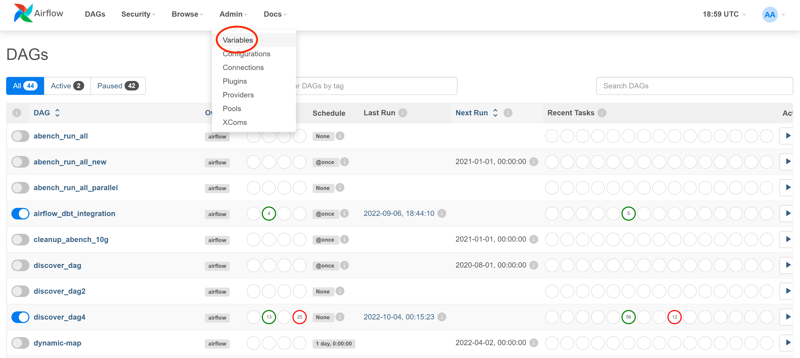
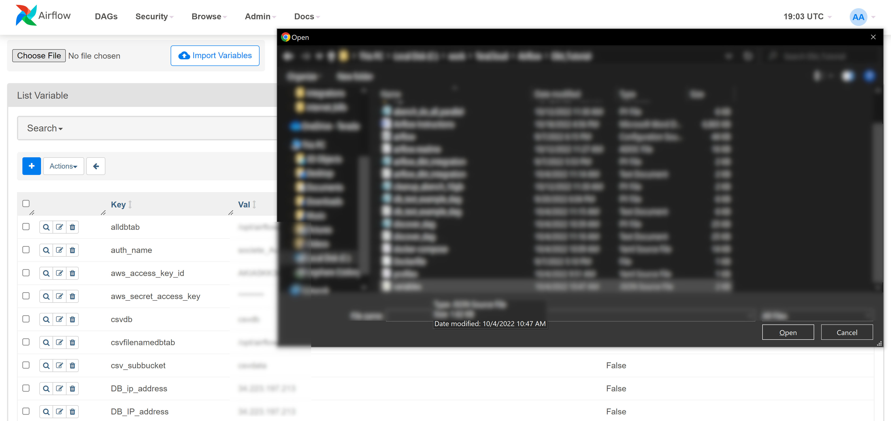

#  dbtを使用するAirflowワークフローをTeradata Vantageを使って実行してみる

## 概要

このチュートリアルでは、AWS EC2 VM に Airflow をインストールし、ワークフローが dbt を使用するように構成し、それを Teradata Vantage データベースに対して実行する方法を説明します。Airflow は、通常、データ パイプラインを構築してデータを処理およびロードするために使用されるタスク スケジューリング ツールです。この例では、Docker ベースの Airflow 環境を作成する Airflow インストール プロセスについて説明します。Airflow がインストールされたら、データを Teradata Vantage データベースにロードするいくつかの Airflow DAG (Direct Acyclic Graph、または単にワークフロー) の例を実行します。

## 前提条件

1. AWS（Amazon Web Services）にアクセスしVMを作成するための権限を持つこと
:::tip
このチュートリアルは、このドキュメントで説明されているマシン (約 100 GB のストレージを備えた AWS 上の t2.2xlarge EC2) と同等のコンピューティングおよびストレージ容量があり、インターネットに接続されている限り、他のコンピューティング プラットフォームやベア メタル マシンに合わせて調整できます。別のコンピューティング プラットフォームを使用する場合は、チュートリアルの一部の手順を変更する必要があります。
:::
2. SSHクライアントが必要です。
:::tip
Mac または Linux マシンを使用している場合は、これらのツールがすでに含まれています。Windows の場合は、 [PuTTY](https://www.putty.org) または [MobaXterm](https://mobaxterm.mobatek.net/download.html)を検討してください。
:::
3. Teradata Vantage データベースへのアクセス。Teradata Vantage にアクセスできない場合は、開発者向けの無料エディションである [Vantage Express](../get-access-to-vantage/on-your-local/getting-started-utm.md) をご覧ください。

## Airflow をインストールして実行する

### VMを作成する
1. AWS EC2コンソールに移動し、`Launch instance`をクリックします。
2. オペレーティングシステムイメージの`Red Hat`を選択します。
3. インスタンスタイプは `t2.2xlarge` を選択します。
4. 新しいキー ペアを作成するか、既存のキー ペアを使用します。
5. サーバーに SSH 接続できるようにネットワーク設定を適用すると、サーバーはインターネットへの送信接続が可能になります。通常は、デフォルト設定を適用すれば十分です。
6. 100 GBのストレージを割り当てます。

### Pythonのインストール

1. `ec2-user`ユーザーを使用してマシンにsshします。

2. Python がインストールされているかどうかを確認します (Python 3.7 以上である必要があります)。コマンド ラインに `python` または `python3` と入力します。

3. Python がインストールされていない場合 ( `command not found` メッセージが表示される)、以下のコマンドを実行してインストールします。コマンドでは、 `y` と入力して Enter し、インストールを確認する必要がある場合があります。

``` bash , id="install_python", role="content-editable emits-gtm-events"
sudo yum install python3
# create a virtual environment for the project
sudo yum install python3-pip
sudo pip3 install virtualenv
```

### Airflow環境の構築

1. Airflowディレクトリ構造を作成します(ec2-userホームディレクトリ/home/ec2-userから)

``` bash , id="install_airflow", role="content-editable emits-gtm-events"
mkdir airflow
cd airflow
mkdir -p ./dags ./logs ./plugins ./data ./config ./data
echo -e "AIRFLOW_UID=$(id -u)" > .env
```

2. お好みのファイル転送ツール ( `scp`、 `PuTTY`、`MobaXterm`  など) を使用して、[airflow.cfg](../other-integrations/attachments/execute-airflow-workflows-that-use-dbt-with-teradata-vantage/airflow.cfg) ファイルを `airflow/config` ディレクトリにアップロードします。

### Dockerのインストール

Dockerはコンテナ化ツールであり、Airflowをコンテナ環境にインストールすることができます。

:::note
手順は、`airflow` ディレクトリで実行する必要があります。
:::

1. podman (RHELのコンテナ化ツール)をアンインストールします。

``` bash , id="uninstall_podman", role="content-editable emits-gtm-events"
sudo yum remove docker \
docker-client \
docker-client-latest \
docker-common \
docker-latest \
docker-latest-logrotate \
docker-logrotate \
docker-engine \
podman \
runc
```

2. yumユーティリティをインストールします。

``` bash , id="install_yum", role="content-editable emits-gtm-events"
sudo yum install -y yum-utils
```

3. Dockerを yum リポジトリに追加します。

``` bash , id="add_docker_to_yum", role="content-editable emits-gtm-events"
sudo yum-config-manager \
--add-repo \
https://download.docker.com/linux/centos/docker-ce.repo
```

4.  Dockerをインストールします。

``` bash , id="install_docker", role="content-editable emits-gtm-events"
sudo yum install docker-ce docker-ce-cli containerd.io
```

5. docker をサービスとして起動します。最初のコマンドは、システムの次回起動時に docker サービスを自動的に実行します。2 番目のコマンドは、Docker を今すぐ起動します。

``` bash , id="start_docker", role="content-editable emits-gtm-events"
sudo systemctl enable docker
sudo systemctl start docker
```

6. Docker が正しくインストールされているかどうかを確認します。このコマンドは、コンテナの空のリストを返すはずです (まだコンテナを起動していないため)。

``` bash , id="check_docker", role="content-editable emits-gtm-events"
sudo docker ps
```

###  `docker-compose` とDocker環境設定ファイルのインストール

1.  [Dockerファイル](../other-integrations/attachments/execute-airflow-workflows-that-use-dbt-with-teradata-vantage/docker-compose.yaml) および [Dockerファイル](attachments/Dockerfile.txt) ファイルを VM にアップロードし、 `airflow` ディレクトリに保存します。

:::tip `docker-compose.yaml` と `Dockerfile` は何をするのか
`docker-compose.yaml` および `Dockerfile` ファイルは、インストール中に環境を構築するために必要です。 `docker-compose.yaml` ファイルは、Airflow Docker コンテナをダウンロードしてインストールします。コンテナには、Web UI、メタデータ用の Postgres データベース、スケジューラ、3 つのワーカー (3 つのタスクを並行して実行できます)、トリガー、および `dbt`によって生成されたドキュメントを表示するための nginx Web サーバーが含まれています。さらに、ホスト ディレクトリがコンテナにマウントされ、その他のさまざまなインストール プロセスが実行されます。 `Dockerfile` は、各コンテナに必要なパッケージをさらにインストールします。

 `docker-compose.yaml` および `Dockerfile` ファイルの機能について詳しく知りたい場合は、これらのファイルを調べてください。インストールされる内容とその理由を説明するコメントがあります。
:::

2. docker-composeをインストールします(yamlファイルを実行するために必要)。

:::note
手順はバージョン 1.29.2 に基づいています。最新リリースについては https://github.com/docker/compose/releases サイトを確認し、必要に応じて以下のコマンドを更新してください。
:::

``` bash , id="install_docker_compose", role="content-editable emits-gtm-events"
sudo curl -L https://github.com/docker/compose/releases/download/1.29.2/docker-compose-$(uname -s)-$(uname -m) -o /usr/local/bin/docker-compose
sudo chmod +x /usr/local/bin/docker-compose
sudo ln -s /usr/local/bin/docker-compose /usr/bin/docker-compose
```

3. docker-compose のインストールをテストします。コマンドは docker-compose のバージョンを返します (例: `docker-compose version 1.29.2, build 5becea4c`) 。

``` bash , id="check_docker_compose", role="content-editable emits-gtm-events"
docker-compose --version
```

### テスト  dbt  プロジェクトのインストール

:::note
これらの手順では、サンプル dbt プロジェクトをセットアップします。`dbt` ツール自体は、後で `docker-compose` によってコンテナにインストールされます。
:::

1. git をインストールします:

``` bash , id="install_git", role="content-editable emits-gtm-events"
sudo yum install git
```

2. サンプルの Jaffle Shop DBT プロジェクトを入手します。

:::note
dbt ディレクトリはホーム ディレクトリの下に作成されます ( `airflow`の下ではありません)。この例では、ホーム ディレクトリは `/home/ec2-user`です。
:::

``` bash , id="download_sample_dbt_project", role="content-editable emits-gtm-events"
# move to home dir
cd
mkdir dbt
cd dbt
git clone https://github.com/Teradata/jaffle_shop-dev.git jaffle_shop
cd jaffle_shop
mkdir target
chmod 777 target
echo '' > target/index.html
chmod o+w target/index.html
```

3. お好みのデータベース ツール (Teradata Studio Express、 `bteq` または類似のもの) を使用して、Teradata データベースに `airflowtest` および `jaffle_shop` ユーザー/データベースを作成します。 `dbc`としてデータベースにログインし、コマンドを実行します (必要に応じてパスワードを変更します)。

``` sql , id="create_databases", role="content-editable emits-gtm-events"
CREATE USER "airflowtest" FROM "dbc" AS PERM=5000000000 PASSWORD="abcd";
CREATE USER "jaffle_shop" FROM "dbc" AS PERM=5000000000 PASSWORD="abcd";
```

4. dbt構成ディレクトリを作成します。

``` bash , id="create_dbt_config_dir", role="content-editable emits-gtm-events"
cd
mkdir .dbt
```

5.  [profiles.yml](../other-integrations/attachments/execute-airflow-workflows-that-use-dbt-with-teradata-vantage/profiles.yml) を `.dbt` ディレクトリにコピーします。

6. Teradata データベースの設定に合わせてファイルを編集します。少なくとも、ホスト、ユーザー、パスワードを変更する必要があります。手順 3 で設定した `jaffle_shop` ユーザー資格情報を使用します。

### DockerでAirflow環境を作成する

1.  `Dockerfile` と `docker-compose.yaml` がある `airflow` ディレクトリで、Docker環境作成スクリプトを実行します。

``` bash , id="run_docker_compose", role="content-editable emits-gtm-events"
cd ~/airflow
sudo docker-compose up --build
```

これには 5 ～ 10 分かかる場合があります。インストールが完了すると、画面に次のようなメッセージが表示されます。

``` bash , id="run_docker_compose_response", role="content-editable emits-gtm-events"
airflow-webserver_1  | 127.0.0.1 - - [13/Sep/2022:00:20:48 +0000] "GET /health HTTP/1.1" 200 187 "-" "curl/7.74.0"
```

これは、Airflow Web サーバーが通話を受け入れる準備ができていることを意味します。

2. これでAirflowが起動するはずです。インストール中に使用したターミナルセッションはログメッセージの表示に使用されるため、
後続の手順のために別のターミナルセッションを開きます。Airflow のインストール タイプを確認するには:

``` bash , id="check_airflow_in_docker", role="content-editable emits-gtm-events"
sudo docker ps
```

結果は以下のようになります。

``` bash , id="check_airflow_in_docker_output", role="content-editable emits-gtm-events"
CONTAINER ID   IMAGE                  COMMAND                  CREATED          STATUS                    PORTS                                                 NAMES
60d50d9f43f5   apache/airflow:2.2.4   "/usr/bin/dumb-init …"   18 minutes ago   Up 18 minutes (healthy)   8080/tcp                                              airflow_airflow-scheduler_1
e2b46ec98274   apache/airflow:2.2.4   "/usr/bin/dumb-init …"   18 minutes ago   Up 18 minutes (healthy)   8080/tcp                                              airflow_airflow-worker_3_1
7b44004c7277   apache/airflow:2.2.4   "/usr/bin/dumb-init …"   18 minutes ago   Up 18 minutes (healthy)   8080/tcp                                              airflow_airflow-worker_1_1
4017b8ce9235   apache/airflow:2.2.4   "/usr/bin/dumb-init …"   18 minutes ago   Up 18 minutes (healthy)   0.0.0.0:8080->8080/tcp, :::8080->8080/tcp             airflow_airflow-webserver_1
3cc407e2d565   apache/airflow:2.2.4   "/usr/bin/dumb-init …"   18 minutes ago   Up 18 minutes (healthy)   0.0.0.0:5555->5555/tcp, :::5555->5555/tcp, 8080/tcp   airflow_flower_1
340a83b202e3   apache/airflow:2.2.4   "/usr/bin/dumb-init …"   18 minutes ago   Up 18 minutes (healthy)   8080/tcp                                              airflow_airflow-triggerer_1
82198f0d8b84   apache/airflow:2.2.4   "/usr/bin/dumb-init …"   18 minutes ago   Up 18 minutes (healthy)   8080/tcp                                              airflow_airflow-worker_2_1
382c3077c1e5   redis:latest           "docker-entrypoint.s…"   18 minutes ago   Up 18 minutes (healthy)   6379/tcp                                              airflow_redis_1
8a3be8d8a7f4   nginx                  "/docker-entrypoint.…"   18 minutes ago   Up 18 minutes (healthy)   0.0.0.0:4000->80/tcp, :::4000->80/tcp                 airflow_nginx_1
9ca888e9e8df   postgres:13            "docker-entrypoint.s…"   18 minutes ago   Up 18 minutes (healthy)   5432/tcp                                              airflow_postgres_1
```

3. Dockerのインストールを削除したい場合（例えば、docker-compose.yamlとDockerfileファイルを更新して別の環境を再作成する場合）、コマンドは（これらのファイルがあるairflowディレクトリから）です。

``` bash , id="docker_compose_down", role="content-editable emits-gtm-events"
sudo docker-compose down --volumes --rmi all
```

スタックが停止したら、設定ファイルを更新し、手順 1 のコマンドを実行して再起動します。


4. Airflow Web UI が動作するかどうかをテストするには、ブラウザに次の URL を入力します。 `<VM_IP_ADDRESS>` をVM の外部 IP アドレスに置き換えます。
  * DAG UI: `http://<YOUR_IP_ADDRESS>:8080/home` - username: airflow / password: airflow
  * Flower Airflow UI (worker control): `http://<YOUR_IP_ADDRESS>:5555/`

### Airflow DAG の実行

1.  [airflow_dbt_integration.py](../other-integrations/attachments/execute-airflow-workflows-that-use-dbt-with-teradata-vantage/airflow_dbt_integration.py)、 [db_test_example_dag.py](../other-integrations/attachments/execute-airflow-workflows-that-use-dbt-with-teradata-vantage/db_test_example_dag.py)、 [discover_dag.py](../other-integrations/attachments/execute-airflow-workflows-that-use-dbt-with-teradata-vantage/discover_dag.py)、 [variables.json](../other-integrations/attachments/execute-airflow-workflows-that-use-dbt-with-teradata-vantage/variables.json) ファイルを `/home/ec2-user/airflow/dags`にコピーします。
2. ファイルを調べます:
* `airflow_dbt_integration.py` - いくつかのテーブルを作成し、クエリーを実行する簡単な Teradata SQL の例です。
* `db_test_example_dag.py` - dbt の例 (つまり、dbt と airflow を Teradata データベースと統合) を実行します。この例では、架空の jaffle_shop データ モデルが作成、ロードされ、このプロジェクトのドキュメントが生成されます (ブラウザーで `http://<VM_IP_ADDRESS>:4000/`を指定すると表示できます)

:::note
[`db_test_example_dag.py`を調整する]
`db_test_example_dag.py` を更新して、TeradataデータベースのIPアドレスがあなたのデータベースを指すようにする必要があります。
:::

* `discover_dag.py` - さまざまな種類のデータ ファイル (CSV、Parquet、JSON) をロードする方法の例。ソース コード ファイルには、プログラムの動作と使用方法を説明するコメントが含まれています。この例は `variables.json` ファイルに依存しています。このファイルは Airflow にインポートする必要があります。これは後続の手順で行われます。

3. これらの dag ファイルが Airflow ツールによって取得されるまで、数分間お待ちください。取得されると、Airflow ホームページの dag のリストに表示されます。

4. `variables.json`ファイルを変数ファイルとして Airflow にインポートします。
* `Admin -> Variables` メニューアイテムをクリックし、Variables ページに移動します。

*  `Choose File` をクリックし、ファイル エクスプローラで `variable.json` を選択して `Import Variables` をクリックします。

* お使いの環境に合わせて、変数を編集します。


5. UIからDAGを実行し、ログを確認します。


## まとめ

このチュートリアルの目的は、Linux サーバーに Airflow 環境をインストールする方法と、Airflow を使用して Teradata Vantage データベースとやり取りする方法を実際に体験することです。また、Airflow とデータ モデリングおよびメンテナンス ツール dbt を統合して Teradata Vantage データベースを作成してロードする方法についても例を示します。

## さらに詳しく
* [Teradata Vantage で dbt (データ構築ツール) を使用する](dbt.md)

import CommunityLinkPartial from '../_partials/community_link.mdx';

<CommunityLinkPartial />