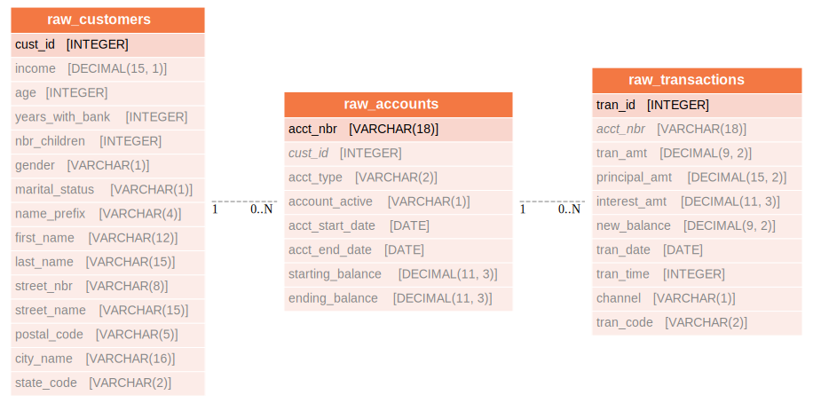

import ClearscapeDocsNote from '../_partials/vantage_clearscape_analytics.mdx'

# dbt と FEAST を使用して Teradata Vantage でフィーチャストアを構築する方法

## 概要

このチュートリアルでは、生データを取得して FEAST 機能に変換する dbt パイプラインを作成する方法を示します。パイプラインは、データ変換に '[ClearScape Analyticsの機能](https://docs.teradata.com/r/Enterprise_IntelliFlex_VMware/Teradata-VantageTM-Analytics-Database-Analytic-Functions-17.20)' を活用します。変換の出力は FEAST に読み込まれ、ML モデルで使用できる機能を実現します。

## はじめに
### dbt
[dbt](https://www.getdbt.com/product/what-is-dbt) (データ ビルド ツール) は、モダン データ スタックの基礎となるデータ変換ツールです。ELT (抽出、ロード、変換) の T を担当します。他のプロセスによって生データがデータ ウェアハウスまたはデータ レイクに取り込まれることが前提となります。その後、このデータを変換する必要があります。

### Feast
[Feast](https://docs.feast.dev) (Feature Store) は、既存のテクノロジーを活用して機械学習機能をリアルタイム モデルに管理および提供する柔軟なデータ システムです。特定のニーズに合わせてカスタマイズできます。また、トレーニングとサービスに機能を一貫して利用できるようにし、データ漏洩を回避し、ML をデータ インフラストラクチャから切り離すこともできます。


## 前提条件

* Teradata Vantageインスタンスへのアクセス。

        <ClearscapeDocsNote />

* Feast-Teradata  がローカルにインストールされている。[ Feast-Teradata のインストール手順](using-feast-feature-store-with-teradata-vantage.md) を参照してください。

* dbtがローカルにインストールされている。 [ dbtのインストール手順](dbt.md) を参照してください。

## 目的
目標は、Teradata Vantage をソースとしてデータ パイプラインを作成し、dbt のいくつかの変数に対してデータ変換を実行することです。dbt で行うデータ変換の基本は、性別、婚姻状況、州コードなどの複数の列のワンホット エンコーディングです。さらに、アカウント タイプ列のデータは、いくつかの列に対して集計操作を実行することによって変換されます。これらすべてを組み合わせることで、変換されたデータを含む目的のデータセットが生成されます。変換されたデータセットは、FEAST への入力として使用され、特徴を保存します。その後、特徴を使用してモデルのトレーニング データセットが生成されます。


## 始めましょう
1. dbt、feast、およびそれらの依存関係を管理するための新しい Python 環境を作成します。環境をアクティブ化します。

        ``` bash
        python3 -m venv env
        source env/bin/activate
        ```

2. チュートリアル リポジトリのクローンを作成し、ディレクトリをプロジェクト ディレクトリに変更します。

        ``` bash
        git clone https://github.com/Teradata/tdata-pipeline.git
        ```

    クローンされたプロジェクトのディレクトリ構造は以下のようになります。

        ```
        tdata-pipeline/
            feature_repo/
                feature_views.py
                feature_store.yml
            dbt_transformation/
                ...
                macros
                models
                ...
            generate_training_data.py
            CreateDB.sql
            dbt_project.yml
        ```


## 銀行ウェアハウスについて
teddy_bankは銀行顧客の架空のデータセットであり、主に顧客、口座、および
トランザクションは次のエンティティ関係図で表されます。




dbt はこの生データを取得し、ML モデリングおよび分析ツールにより適した以下のモデルを構築します。


## dbtを構成する
次の内容でファイル `$HOME/.dbt/profiles.yml` を作成します。Teradata インスタンスに合わせて `<host>`、`<user>`、`<password>` を調整します。

:::note **データベースを設定する**
次の dbt プロファイルは `teddy_bank`というデータベースを指しています。 `schema` の値を、Teradata Vantage インスタンス内の既存のデータベースを指すように変更できます。
:::

``` yaml , id="dbt_first_config", role="emits-gtm-events"
dbt_transformation:
  target: dev
  outputs:
    dev:
      type: teradata
      host: <host>
      user: <user>
      password: <password>
      schema: teddy_bank
      tmode: ANSI
```
設定を検証します。

``` bash
dbt debug
```

デバッグ コマンドがエラーを返した場合は、 `profiles.yml` の内容に問題がある可能性があります。

## FEASTを構成する
Feast構成はVantageデータベースへの接続を指定します。Feastの初期化中に作成されたyamlファイル
プロジェクト、 `$HOME/.feast/feature_repo/feature_store.yml` はオフラインストレージ、オンラインストレージ、プロバイダの詳細を保持できます
およびレジストリ。Teradata インスタンスに合わせて `<host>`、 `<user>`、 `<password>` を調整します。

:::note **データベースを設定する**
次のdbtプロファイルは `teddy_bank`というデータベースを指しています。 `schema` の値を変更して、
Teradata Vantageインスタンス内の既存のデータベース
:::

### オフラインストアの設定

``` yaml , id="feast_first_config", role="emits-gtm-events"
project: td_pipeline
registry:
    registry_type: sql
    path: teradatasql://<user>:<password>@<hostIP>/?database=teddy_bank&LOGMECH=TDNEGO
provider: local
offline_store:
    type: feast_teradata.offline.teradata.TeradataOfflineStore
    host: <host>
    database: teddy_bank
    user: <user>
    password: <password>
    log_mech: TDNEGO
entity_key_serialization_version: 2
```

### Teradata SQL レジストリの構文
``` python
path = 'teradatasql://'+ teradata_user +':' + teradata_password + '@'+host + '/?database=' +
        teradata_database + '&LOGMECH=' + teradata_log_mech
```
## dbtを実行する
このステップでは、`customers`、`accounts`、`transactions` のデータテーブルを入力します。

``` bash
dbt seed
```

### ディメンションモデルを作成しする
生データ テーブルができたので、ディメンションモデルを作成するように dbt に指示できます。

``` bash
dbt run --select Analytic_Dataset
```

## FEASTの実行
### Feature Repositoryの定義
* `TeradataSource:` Teradata (Enterprise または Lake) に格納された機能、または Teradata (NOS, QueryGrid) からの外部テーブルを介してアクセス可能な機能のデータソース

* `Entity:` 意味的に関連するフィーチャーの集合体

* `Feature View:` フィーチャビューは、特定のデータソースからのフィーチャデータのグループです。フィーチャビューを使用すると、フィーチャとそのデータソースを一貫して定義できるため、プロジェクト全体でフィーチャグループを再利用できるようになります。


``` python
DBT_source = TeradataSource( database=dbload, table=f"Analytic_Dataset", timestamp_field="event_timestamp")

customer = Entity(name = "customer", join_keys = ['cust_id'])

ads_fv = FeatureView(name="ads_fv",entities=[customer],source=DBT_source, schema=[
        Field(name="age", dtype=Float32),
        Field(name="income", dtype=Float32),
        Field(name="q1_trans_cnt", dtype=Int64),
        Field(name="q2_trans_cnt", dtype=Int64),
        Field(name="q3_trans_cnt", dtype=Int64),
        Field(name="q4_trans_cnt", dtype=Int64),
    ],)
```
### トレーニングデータを生成します
トレーニング データを生成する方法はさまざまです。要件に応じて、機能ビュー マッピングを使用して 'entitydf' をソース データ テーブルと結合できます。以下は、トレーニング データセットを生成するサンプル関数です。
``` python
def get_Training_Data():
    # Initialize a FeatureStore with our current repository's configurations
    store = FeatureStore(repo_path="feature_repo")
    con = create_context(host = os.environ["latest_vm"], username = os.environ["dbc_pwd"],
            password = os.environ["dbc_pwd"], database = "EFS")
    entitydf = DataFrame('Analytic_Dataset').to_pandas()
    entitydf.reset_index(inplace=True)
    print(entitydf)
    entitydf = entitydf[['cust_id','event_timestamp']]
    training_data = store.get_historical_features(
        entity_df=entitydf,
        features=[
        "ads_fv:age"
        ,"ads_fv:income"
        ,"ads_fv:q1_trans_cnt"
        ,"ads_fv:q2_trans_cnt"
        ,"ads_fv:q3_trans_cnt"
        ,"ads_fv:q4_trans_cnt"
        ],
        full_feature_names=True
    ).to_df()

    return training_data


```

## まとめ
このチュートリアルでは、Teradata Vantage で dbt と FEAST を使用する方法を説明しました。サンプル プロジェクトは、Teradata Vantage から生データを取得し、dbt を使用して機能を生成します。次に、モデルのトレーニング データセットを生成するためのベースとなる機能のメタデータが FEAST を使用して作成され、機能ストアを作成するすべての対応するテーブルも、実行時に同じデータベース内で生成されます。

## さらに詳しく
* [dbt のドキュメント](https://docs.getdbt.com/docs)
* [dbt-teradata プラグインのドキュメント](https://github.com/Teradata/dbt-teradata)
* [Feast ののスケーラブルなレジストリScalable Registry](https://docs.feast.dev/tutorials/using-scalable-registry)
* [Teradata Vantage と FEAST で拡張性の高い機能ストアを実現する （英語）](https://medium.com/teradata/enabling-highly-scalable-feature-store-with-teradata-vantage-and-feast-e01008fa8fdb)
* [Gitリポジトリ](https://github.com/Teradata/tdata-pipeline) このプロジェクトのために。
