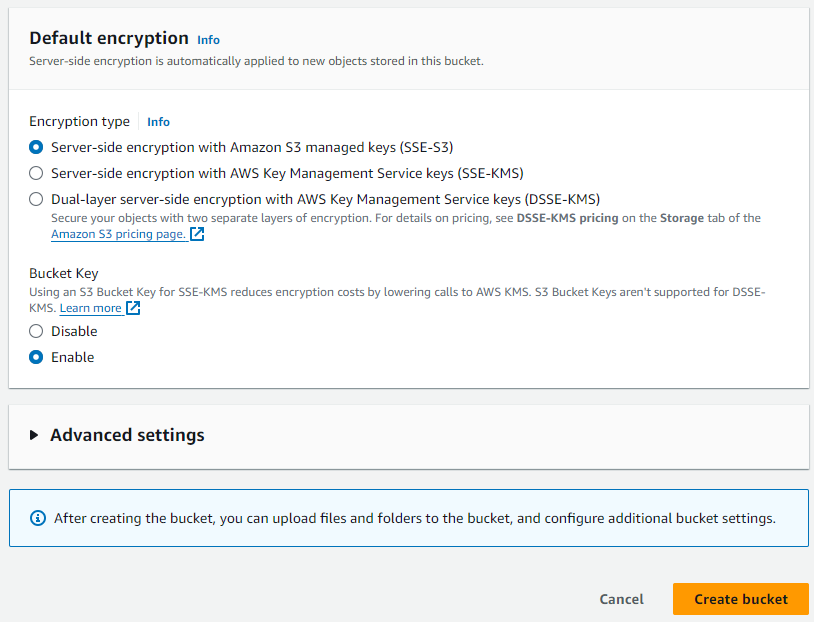
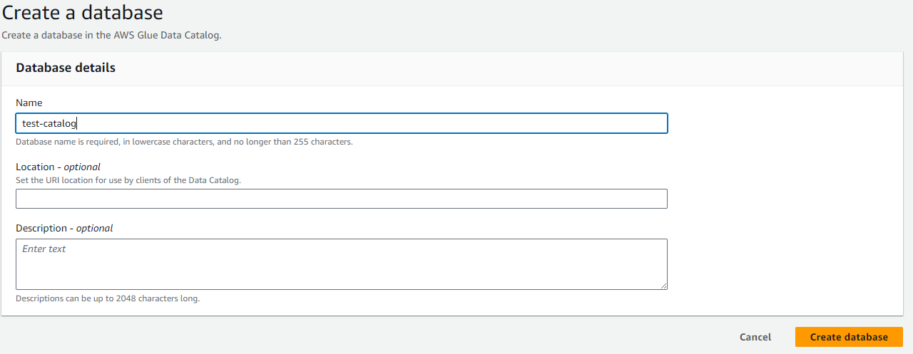
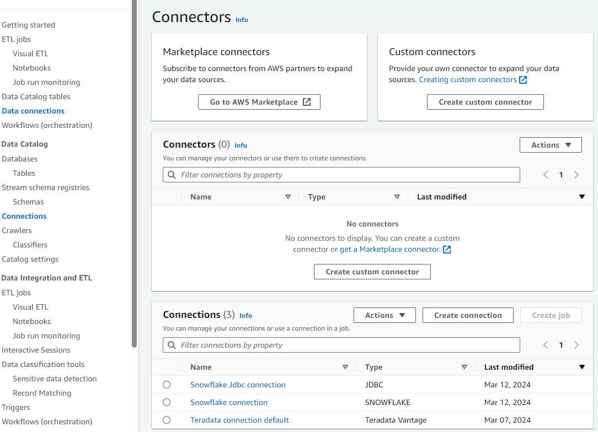

# AWS Glue スクリプトを使用して Teradata Vantage から Amazon S3 にデータを取り込み、カタログ化する

### 概要
このクイックスタートでは、AWS Glue を使用して Teradata Vantage から Amazon S3 にデータを取り込み、カタログ化するプロセスについて詳しく説明します。 

:::tip
カタログ化が必須でない場合に Amazon S3 にデータを取り込むには、 [Teradata 書き込み NOS 機能](https://docs.teradata.com/r/Enterprise_IntelliFlex_VMware/SQL-Data-Manipulation-Language/Working-with-External-Data/WRITE_NOS)を検討してください。
:::


### 前提条件

import ClearscapeDocsNote from '../_partials/vantage_clearscape_analytics.mdx'

* アクセス [Amazon AWS アカウント](https://aws.amazon.com)
* Teradata Vantageインスタンスへのアクセス。
  <ClearscapeDocsNote />
* テストデータをロードするためのクエリーを送信するデータベース [クライアント](../connect-to-vantage/configure-a-teradata-vantage-connection-in-dbeaver.md) 

### テストデータの読み込み
* お気に入りのデータベースクライアントで次のクエリーを実行します

``` sql
CREATE DATABASE teddy_retailers_inventory
AS PERMANENT = 110e6;

CREATE TABLE teddy_retailers_inventory.source_catalog AS
(
  SELECT product_id, product_name, product_category, price_cents
    FROM (
		LOCATION='/s3/dev-rel-demos.s3.amazonaws.com/demo-datamesh/source_products.csv') as products
) WITH DATA;

CREATE TABLE teddy_retailers_inventory.source_stock AS
(
  SELECT entry_id, product_id, product_quantity, purchase_price_cents, entry_date
    FROM (
		LOCATION='/s3/dev-rel-demos.s3.amazonaws.com/demo-datamesh/source_stock.csv') as stock
) WITH DATA;
```

### Amazon AWS セットアップ
このセクションでは、以下の各手順について詳しく説明します。

* データを取り込むための Amazon S3 バケットを作成する
* メタデータを保存するための AWS Glue カタログデータベースを作成する
* AWS Secrets ManagerにTeradata Vantageの認証情報を保存する
* ETLジョブに割り当てるAWS Glueサービスロールを作成する
* AWS Glue で Teradata Vantage インスタンスへの接続を作成する
* AWS Glue ジョブを作成する
* Teradata Vantage データを Amazon S3 に自動的に取り込み、カタログ化するためのスクリプトを作成します。

### データを取り込むための Amazon S3 バケットを作成する
* Amazon S3で `Create bucket`を選択します。

* バケットに名前を割り当てて、メモしておきます。

* すべての設定をデフォルト値のままにします。
* `Create bucket` をクリックします。


### すべての設定をデフォルト値のままにします。

* AWS Glue で、データカタログ、データベースを選択します。
* `Add database` をクリックします。

* データベース名を定義し、 `Create database`をクリックします。


### AWS Secrets ManagerにTeradata Vantageの認証情報を保存する

* AWS Secrets Managerで、 `Create new secret`を選択します。

* シークレットは、Teradata Vantage インスタンスに応じて、次のキーと値を持つ `Other type of secret` である必要があります。
    * USER
    * PASSWORD
:::tip
ClearScape Analytics Experience の場合、ユーザーは常に「demo_user」であり、パスワードは ClearScape Analytics Experience 環境の作成時に定義したパスワードです。
:::

* シークレットに名前を割り当てます。
* 残りの手順はデフォルト値のままにしておきます。
* 秘密を作成します。

### ETL ジョブに割り当てる AWS Glue サービスロールを作成する
作成するロールには、Glue サービス ロールの一般的な権限へのアクセス権だけでなく、作成したシークレットと S3 バケットを読み取るアクセス権も付与する必要があります。

* AWS で、IAM サービスに移動します。
* アクセス管理で `Roles`を選択します。
* ロールで `Create role`をクリックします。

* 信頼できるエンティティの選択で、 `AWS service` を選択し、ドロップダウンから `Glue` を選択します。

* 権限の追加:
    * 検索する `AWSGlueServiceRole`。
    * 関連するチェックボックスをクリックします。
    * 検索する `SecretsManagerReadWrite`。
    * 関連するチェックボックスをクリックします。
* 名前で確認して作成します。
    * ロールの名前を定義します。

* `Create role` をクリックします。
* 「アクセス管理」、「ロール」に戻り、作成したロールを検索します。
* 役割を選択してください。
*  `Add permissions`をクリックしてから `Create inline policy`をクリックします。
* `JSON` をクリックします。
* ポリシー エディターで、作成したバケットの名前を置き換えて、以下の JSON オブジェクトを貼り付けます。
``` json
{
    "Version": "2012-10-17",
    "Statement": [
        {
            "Sid": "FullAccessToSpecificBucket",
            "Effect": "Allow",
            "Action": "s3:*",
            "Resource": [1
                "arn:aws:s3:::<bucket-name>",
                "arn:aws:s3:::<bucket-name>/*"
            ]
        }
    ]
}
```
* `Next` をクリックします。

* ポリシーに名前を割り当てます。
* `Create policy` をクリックします。

### AWS Glue で Teradata Vantage インスタンスへの接続を作成する

* AWS Glue で `Data connections`を選択します。

* コネクタの下で、 `Create connection`を選択します。
* Teradata Vantage データ ソースを検索して選択します。

* ダイアログ ボックスに、Teradata Vantage インスタンスの URL を JDBC 形式で入力します。
:::tip
ClearScape Analytics Experience の場合、URL は次の構造に従います。 
`jdbc:teradata://<URL Host>/DATABASE=demo_user,DBS_PORT=1025`
:::
* 前の手順で作成した AWS シークレットを選択します。
* 接続に名前を付けて、作成プロセスを終了します。


### AWS Glue ジョブを作成する
* AWS Glue で `ETL Jobs` を選択し、 `Script editor`をクリックします。

* エンジンとして `Spark` を選択し、新しく開始することを選択します。


### Teradata Vantage データを Amazon S3 に自動的に取り込み、カタログ化するためのスクリプトを作成します。

* 次のスクリプトをエディターにコピーします。
    * スクリプトには次の変更が必要です。
        * S3 バケットの名前を置き換えます。
        * Glue カタログ データベースの名前を置き換えます。
        * ガイドの例に従わない場合は、データベース名と、取り込んでカタログ化するテーブルを変更します。
        * カタログ作成の目的で、例では各テーブルの最初の行のみが取り込まれます。このクエリーを変更して、テーブル全体を取り込んだり、選択した行をフィルタ処理したりできます。

``` python , id="glue-script-first-run" role="emits-gtm-events"
# Import section
import sys
from awsglue.transforms import *
from awsglue.utils import getResolvedOptions
from pyspark.context import SparkContext
from awsglue.context import GlueContext
from awsglue.job import Job
from pyspark.sql import SQLContext

# PySpark Config Section
args = getResolvedOptions(sys.argv, ["JOB_NAME"])
sc = SparkContext()
glueContext = GlueContext(sc)
spark = glueContext.spark_session
job = Job(glueContext)
job.init(args["JOB_NAME"], args)

#ETL Job Parameters Section
# Source database
database_name = "teddy_retailers_inventory"

# Source tables
table_names = ["source_catalog","source_stock"]

# Target S3 Bucket
target_s3_bucket = "s3://<your-bucket-name>"

#Target catalog database 
catalog_database_name = "<your-catalog-database-name>" 


# Job function abstraction
def process_table(table_name, transformation_ctx_prefix, catalog_database, catalog_table_name):
    dynamic_frame = glueContext.create_dynamic_frame.from_options(
        connection_type="teradata",
        connection_options={
            "dbtable": table_name,
            "connectionName": "Teradata connection default",
            "query": f"SELECT TOP 1 * FROM {table_name}", # This line can be modified to ingest the full table or rows that fulfill an specific condition
        },
        transformation_ctx=transformation_ctx_prefix + "_read",
    )

    s3_sink = glueContext.getSink(
        path=target_s3_bucket,
        connection_type="s3",
        updateBehavior="UPDATE_IN_DATABASE",
        partitionKeys=[],
        compression="snappy",
        enableUpdateCatalog=True,
        transformation_ctx=transformation_ctx_prefix + "_s3",
    )
    # Dynamically set catalog table name based on function parameter
    s3_sink.setCatalogInfo(
        catalogDatabase=catalog_database, catalogTableName=catalog_table_name
    )
    s3_sink.setFormat("csv")
    s3_sink.writeFrame(dynamic_frame)


# Job execution section
for table_name in table_names:
    full_table_name = f"{database_name}.{table_name}"  
    transformation_ctx_prefix = f"{database_name}_{table_name}"  
    catalog_table_name = f"{table_name}_catalog"  
    # Call your process_table function for each table
    process_table(full_table_name, transformation_ctx_prefix, catalog_database_name, catalog_table_name)

job.commit()
```

* スクリプトに名前を割り当てる


* ジョブの詳細の基本プロパティ:
    * ETL ジョブ用に作成した IAM ロールを選択します。
    * テストの場合、要求されるワーカー数として「2」を選択します。これが最小許容数です。

    \* `Advanced properties`、 `Connections` で Teradata Vantage への接続を選択します。 
:::tip
作成された接続は、ジョブ構成で 1 回、スクリプト自体で 1 回、合わせて 2 回参照する必要があります。
:::

* `Save` をクリックします。
* `Run` をクリックします。
    * ETL ジョブが完了するまでに数分かかります。この時間のほとんどは Spark クラスターの起動に関連しています。

### 結果の確認

* ジョブが完了したら:
    * データ カタログ、データベースに移動します。
    * 作成したカタログ データベースをクリックします。
    * この場所に、Glue ETL ジョブを通じて抽出されカタログ化されたテーブルが表示されます。


* 取り込まれたすべてのテーブルは、S3 に圧縮ファイルとしても存在します。まれに、これらのファイルが直接クエリーされることがあります。AWS Athena などのサービスを使用して、カタログ メタデータに依存するファイルをクエリーできます。

### まとめ

このクイックスタートでは、AWS Glue スクリプトを使用して Teradata Vantage のデータを Amazon S3 に取り込み、カタログ化する方法を学びました。

### さらに詳しく
* [Teradata VantageとGoogle Cloud Data Catalogを統合する](./integrate-teradata-vantage-with-google-cloud-data-catalog.md)

import CommunityLinkPartial from '../_partials/community_link.mdx';

<CommunityLinkPartial />