# Amazon Appflowを使用してVantageからSalesforceへ接続する方法

### 概要

このハウツーでは、SalesforceとTeradata Vantageの間でデータを移行するプロセスについて説明します。これには 2 つのユースケースが含まれます。

1. Salesforceから顧客情報を取得し、Vantageから注文および出荷情報と組み合わせて、分析的な洞察を得ます。
2. Vantage の `newleads` テーブルを Salesforce のデータで更新し、AppFlow を使用して新しいリードを Salesforce に追加します。

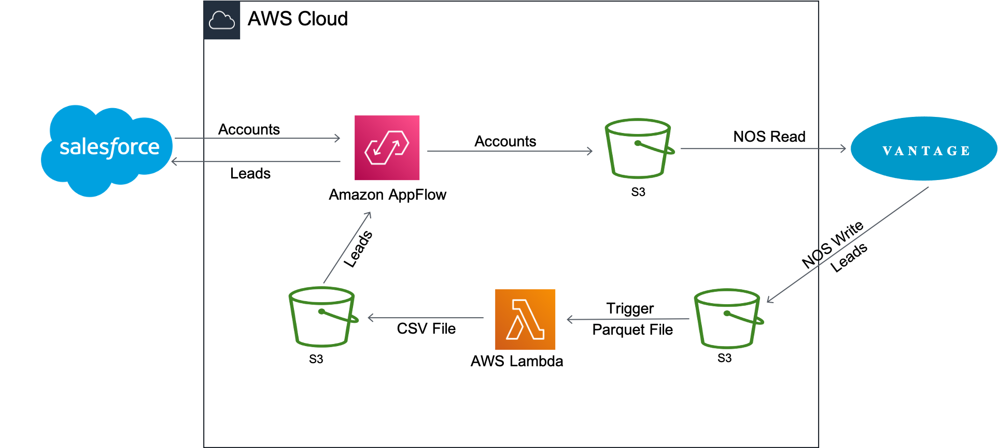

Amazon AppFlow は、顧客アカウント データを Salesforce から Amazon S3 に転送します。その後、Vantage は Native Object Store (NOS) の読み取り機能を使用して、Amazon S3 のデータと Vantage のデータを 1 つのクエリーで結合します。

アカウント情報は、Vantage の `newleads` テーブルを更新するために使用されます。テーブルが更新されると、Vantage は NOS Write を使用してそれを Amazon S3 バケットに書き戻します。新しいリード データ ファイルが到着すると、Lambda 関数がトリガーされ、データ ファイルが Parquet 形式から CSV 形式に変換され、AppFlow によって新しいリードが Salesforce に挿入されます。

### Amazon AppFlow について

Amazon AppFlow は、Salesforce、Marketo、Slack、ServiceNow などの Software-as-a-Service (SaaS) アプリケーションと、Amazon S3 や Amazon Redshift などの AWS サービス間でデータを安全に転送できる、フルマネージド型の統合サービスです。AppFlow は移動中のデータを自動的に暗号化し、AWS PrivateLink と統合された SaaS アプリケーションのデータがパブリックインターネットを経由しないように制限できるため、セキュリティの脅威にさらされる可能性が減ります。

現在、Amazon AppFlowは16のソースから選択でき、4つの宛先にデータを送信することができます。

### Teradata Vantage について

Teradata Vantageは、エンタープライズ分析のためのマルチクラウド対応データプラットフォームであり、データに関する課題を最初から最後まで解決します。

Vantage を使用すると、企業は小規模から始めてコンピューティングやストレージを柔軟に拡張し、使用した分だけ支払い、低コストのオブジェクト ストアを活用し、分析ワークロードを統合することができます。Vantage は、R、Python、Teradata Studio、およびその他の SQL ベースのツールをサポートしています。

Vantageは、記述的分析、予測的分析、処方的分析、自律的意思決定、ML機能、可視化ツールを統合したプラットフォームで、データがどこにあっても、リアルタイムのビジネスインテリジェンスを大規模に発掘することができます。

Teradata Vantage Native Object Store (NOS) can be used to explore data in external object stores, like Amazon S3, using standard SQL. No special object storage-side compute infrastructure is required to use NOS. Users can explore data located in an Amazon S3 bucket by simply creating a NOS table definition that points to your bucket. With NOS, you can quickly import data from Amazon S3 or even join it with other tables in the Vantage database.

### 前提条件

Amazon AppFlowサービスおよびTeradata Vantageに精通していることが前提です。

以下のアカウントとシステムが必要です。

import ClearscapeDocsNote from '../_partials/vantage_clearscape_analytics.mdx'

* Teradata Vantageインスタンスへのアクセス。
  <ClearscapeDocsNote />
* フローの作成と実行が可能なロールを持つAWSアカウント。
* Salesforce データを保存するための Amazon S3 バケット (例: ptctsoutput)
* 生のVantageデータ（Parquetファイル）を保存するAmazon S3バケット（つまり、vantageparquet）。このバケットには、Amazon AppFlowアクセスを許可するポリシーが必要です。
* 変換された Vantage データ (CSV ファイル) を保存する Amazon S3 バケット (例: vantagecsv)
* 以下の要件を満たすSalesforceアカウント。
  * Salesforce アカウントで API アクセスを有効にする必要があります。API アクセスは、Enterprise、Unlimited、Developer、および Performance エディションではデフォルトで有効になっています。
  * Salesforce アカウントでは、接続されたアプリケーションのインストールが許可されている必要があります。これが無効になっている場合は、Salesforce 管理者に問い合わせてください。Amazon AppFlow で Salesforce 接続を作成した後、「Amazon AppFlow Embedded Login App」という名前の接続されたアプリケーションが Salesforce アカウントにインストールされていることを確認します。
  * 「Amazon AppFlow Embedded Login App」のリフレッシュ トークン ポリシーは、「リフレッシュ トークンは取り消されるまで有効」に設定する必要があります。そうしないと、リフレッシュ トークンの有効期限が切れたときにフローが失敗します。
  * イベント駆動型フロートリガーを使用するには、Salesforce で変更データキャプチャを有効にする必要があります。[設定] から、[クイック検索] に「変更データキャプチャ」と入力します。
  * Salesforce アプリが IP アドレスの制限を実施している場合、Amazon AppFlow で使用するアドレスをホワイトリストに登録する必要があります。詳細については、_Amazon Web Services 全般リファレンス_の[AWS IP アドレス範囲](https://docs.aws.amazon.com/general/latest/gr/aws-ip-ranges.html)を参照してください。
  * 100 万件を超える Salesforce レコードを転送する場合、Salesforce 複合フィールドを選択することはできません。Amazon AppFlow は転送に Salesforce Bulk API を使用しますが、複合フィールドの転送は許可されません。
  * AWS PrivateLink を使用してプライベート接続を作成するには、Salesforce アカウントで「メタデータの管理者」と「外部接続の管理」の両方のユーザー権限を有効にする必要があります。プライベート接続は現在、us-east-1 および us-west-2 AWS リージョンで利用できます。
  * 履歴オブジェクトなど、一部の Salesforce オブジェクトは更新できません。これらのオブジェクトの場合、Amazon AppFlow はスケジュールトリガーフローの増分エクスポート ([新しいデータのみを転送] オプション) をサポートしていません。代わりに、[すべてのデータを転送] オプションを選択し、適切なフィルタを選択して転送するレコードを制限できます。

### 手順

前提条件を満たした上で、以下の手順で行います。


1. Salesforce to Amazon S3 フローの作成する
2. NOSを使ったデータを探索する
3. NOS を使用して Vantage データを Amazon S3 にエクスポートする
4. Amazon S3からSalesforceへのフローを作成する

### Salesforce to Amazon S3 フローの作成する

このステップでは、Amazon AppFlow を使用してフローを作成します。この例では、 [Salesforce 開発者アカウント](https://developer.salesforce.com/signup) を使用して Salesforce に接続しています。

 [AppFlowコンソール](https://console.aws.amazon.com/appflow)に移動し、AWS ログイン認証情報でサインインして *Create flow*をクリックします。正しいリージョンにいることを確認し、Salesforce データを保存するためのバケットが作成されていることを確認します。


#### ステップ1：フローの詳細を指定する

このステップでは、フローの基本情報を提供する。

 **Flow name** (例： _salesforce_) と **Flow description (optional)** を入力し、 **Customize encryption settings (advanced)** のチェックを外したままにします。**Next**をクリックします。

#### ステップ2. フローを構成する

このステップでは、フローのソースと宛先に関する情報を提供します。この例では、ソースとして **_Salesforce_** を使用し、宛先として **_Amazon S3_** を使用します。

*  *Source name* で _Salesforce_ を選択し、*Choose Salesforce connection*で  * _Create new connection_*を選択します。
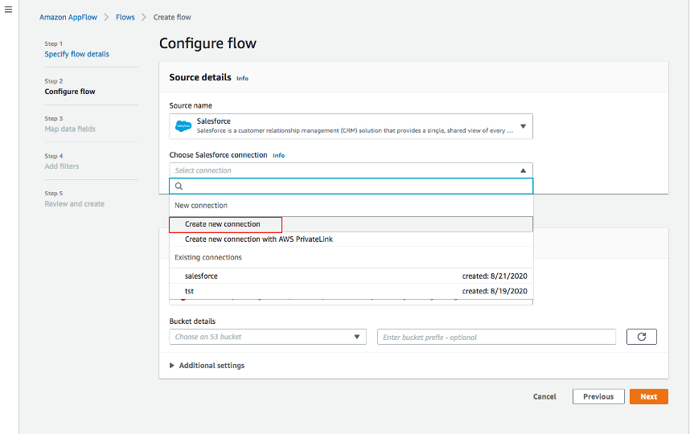

*  **Salesforce環境** と **データの暗号化**にはデフォルトを使用します。接続に名前 (つまり _salesforce_) を付けて **Continue**をクリックします。


* salesforceのログインウィンドウで、  **Username**と **Password** を入力します。**ログイン**をクリックします。
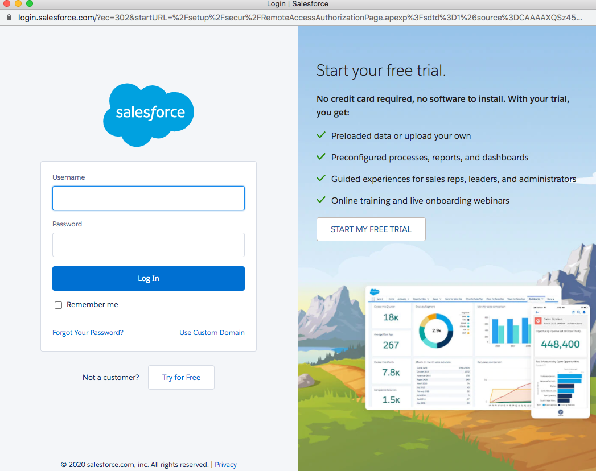

*  **Allow** をクリックして、AppFlowによるSalesforceのデータおよび情報へのアクセスを認証します。


* AppFlow の **Configure flow** ウィンドウに戻り、 **Salesforce オブジェクト** を使用し、Salesforce オブジェクトとして _Account_ を選択します。
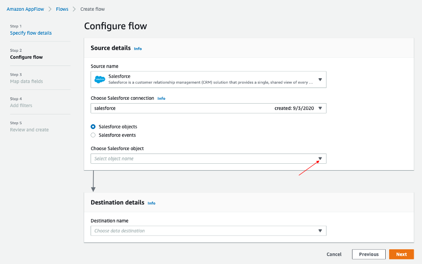
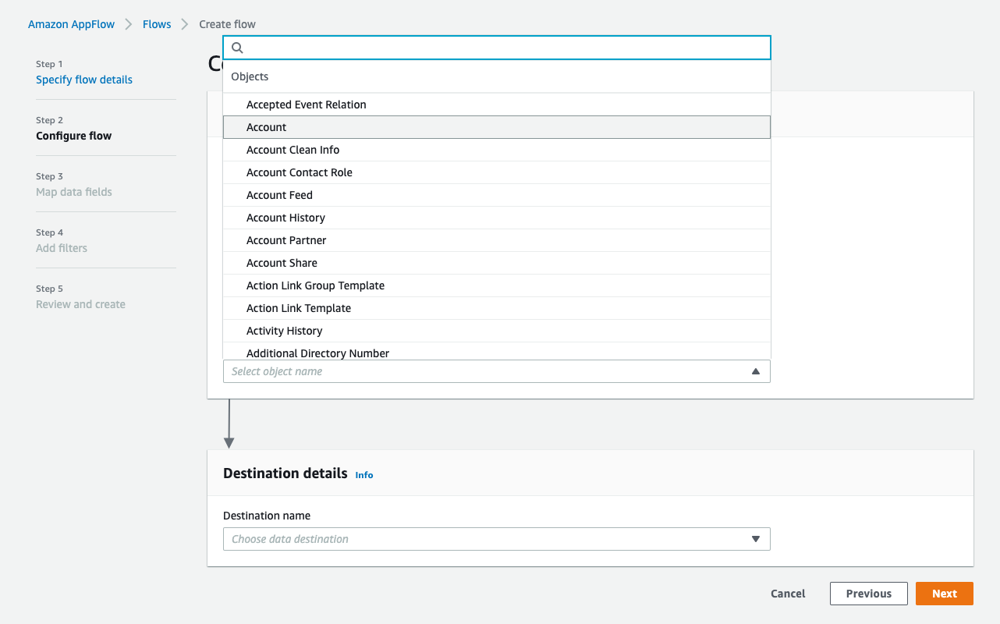

* _Amazon S3_を**Destination name**として使用します。データを保存する、作成したバケット（[以前](#prerequisites)）を選択します（つまり、_ptctsoutput_）。
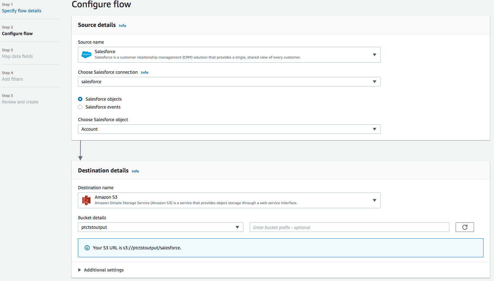

* **Flow trigger** は _Run on demand_です。 **Next**をクリックします。


#### ステップ3：データフィールドのマッピング

このステップでは、データがソースから宛先に転送される方法を決定します。

* **マッピング方法** として、_Manually map fields_ を使用します
* 簡単のため、 **送信元から送信先へのマッピング** には _Map all fields directly_ を選択します。


「_Map all fields directly_」をクリックすると、すべてのフィールドが **Mapped fields**の下に表示されます。 **Add formula (concatenates)**、 **Modify values (mask or truncate field values)**、または **Remove selected mappings**するフィールドのチェックボックスをクリックします。

この例では、チェックボックスはオンになりません。

*  **　_Validations_** では、「_Billing Address_」が含まれていないレコードを無視する条件を追加します（オプション）。**Next**をクリックします。
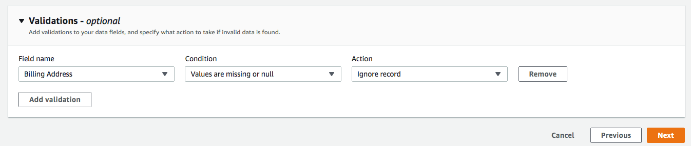

#### ステップ4：フィルタの追加

転送するレコードを決定するためのフィルタを指定できます。この例では、削除されるレコードを除外する条件を追加します (オプション)。 **Next**をクリックします。


#### ステップ5. レビューして作成する

入力したすべての情報を確認します。必要に応じて修正します。 **Create flow**をクリックします。

フローが作成されると、フロー情報とともにフロー作成成功のメッセージが表示されます。

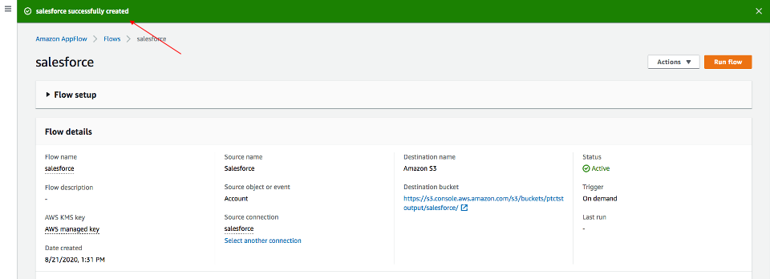

#### Run flow

右上の **Run flow** をクリックします。

フローの実行が完了すると、実行に成功したことを示すメッセージが表示されます。

メッセージの例:

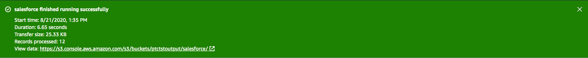

データを表示するには、バケットへのリンクをクリックします。Salesforce データは JSON 形式になります。

#### データファイルのプロパティを変更する

デフォルトでは、Salesforce データは暗号化されています。NOS がアクセスするには、暗号化を解除する必要があります。

Amazon S3バケット内のデータファイルをクリックし、 **Properties** タブをクリックします。

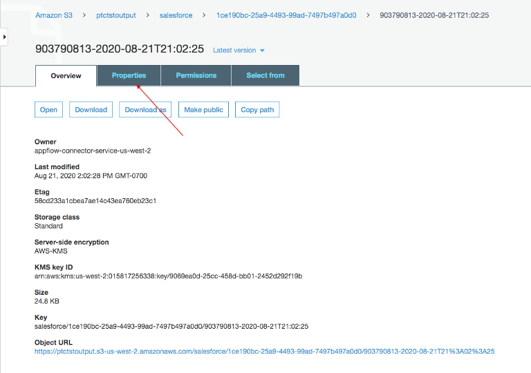

 **Encryption** から _AWS-KMS_ をクリックし、_AWS-KMS_ 暗号化から _None_ に変更します。**Save**をクリックします。

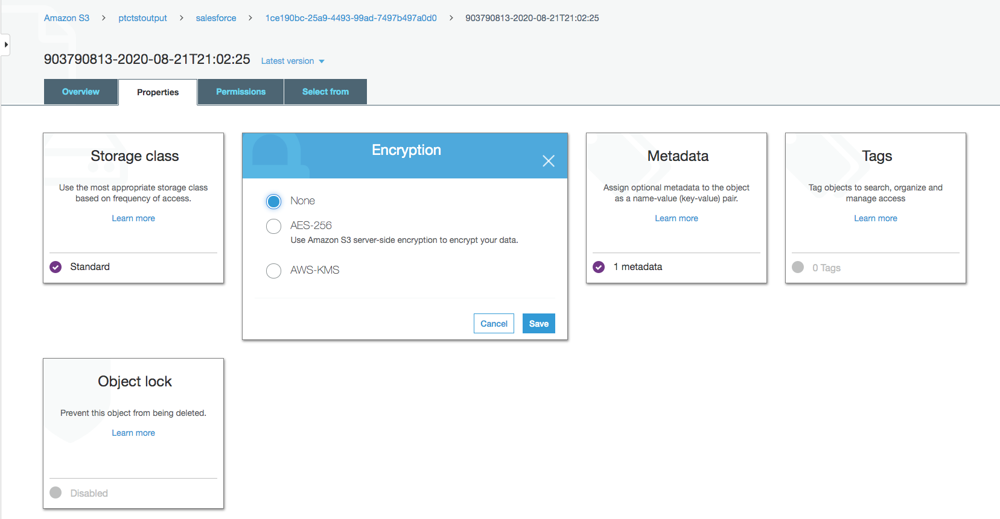

### NOSを使ったデータを探索する

Native Object Store には、Amazon S3 のデータを探索および分析するための機能が組み込まれています。このセクションでは、NOS のよく使用される機能をいくつか紹介します。

#### 外部テーブルを作成する

外部テーブルを使用すると、Vantage Advanced SQL Engine 内で外部データを簡単に参照できるようになり、構造化されたリレーショナル形式でデータを利用できるようになります。

外部テーブルを作成するには、まず資格情報を使用して Teradata Vantage システムにログインします。Amazon S3 バケット アクセス用のアクセス キーを使用して AUTHORIZATION オブジェクトを作成します。Authorization オブジェクトは、外部テーブルを使用して Amazon S3 データにアクセスできるユーザーを制御することで、セキュリティを強化します。

``` sql
CREATE AUTHORIZATION DefAuth_S3
AS DEFINER TRUSTED
USER 'A*****************' /* AccessKeyId */
PASSWORD '********'; /* SecretAccessKey */
```

"USER "はAWSアカウントのAccessKeyId、"PASSWORD "はSecretAccessKeyです。

Amazon S3上のJSONファイルに対して、以下のコマンドで外部テーブルを作成します。

``` sql
CREATE MULTISET FOREIGN TABLE salesforce,
EXTERNAL SECURITY DEFINER TRUSTED DefAuth_S3
(
  Location VARCHAR(2048) CHARACTER SET UNICODE CASESPECIFIC,
  Payload JSON(8388096) INLINE LENGTH 32000 CHARACTER SET UNICODE
)
USING
(
  LOCATION ('/S3/s3.amazonaws.com/ptctstoutput/salesforce/1ce190bc-25a9-4493-99ad-7497b497a0d0/903790813-2020-08-21T21:02:25')
);
```

少なくとも、外部テーブル定義には、オブジェクト ストア データを指すテーブル名と場所句 (黄色で強調表示) が含まれている必要があります。場所には、Amazon で「バケット」と呼ばれる最上位の単一の名前が必要です。

ファイル名の末尾に標準的な拡張子（.json, .csv, .parquet）がない場合、データファイルの種類を示すために、LocationとPayload列の定義も必要です（ターコイズ色でハイライトされている）。

外部テーブルは常にNo Primary Index (NoPI)テーブルとして定義される。

外部テーブルが作成されると、外部テーブル上で "選択 "を実行することにより、Amazon S3データセットの内容を照会することができます。

``` sql
SELECT * FROM salesforce;
SELECT payload.* FROM salesforce;
```

外部テーブルには、Location と Payload の 2 つの列のみが含まれます。Location は、オブジェクト ストア システム内のアドレスです。データ自体は payload 列に表され、外部テーブルの各レコード内の payload 値は、単一の JSON オブジェクトとそのすべての名前と値のペアを表します。

”SELECT * FROM salesforce;” からの出力例。


サンプル出力形式 "SELECT payload.* FROM salesforce;"。

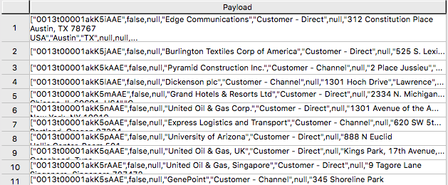

#### JSON_KEYS テーブルオペレータ

JSON データには、レコードごとに異なる属性が含まれる場合があります。データ ストア内の可能な属性の完全なリストを確認するには、JSON_KEYS を使用します。

``` sql
|SELECT DISTINCT * FROM JSON_KEYS (ON (SELECT payload FROM salesforce)) AS j;
```

部分出力

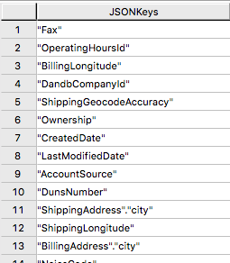

#### ビューを作成する

ビューは、ペイロード属性に関連する名前を単純化し、オブジェクトストアのデータに対して実行可能なSQLを簡単にコーディングできるようにし、外部テーブルのLocation参照を隠して通常の列のように見えるようにすることができます。

以下は、上記の JSON_KEYS テーブルオペレータから検出された属性を使用したビュー作成文のサンプルです。

``` sql
REPLACE VIEW salesforceView AS (
  SELECT
    CAST(payload.Id AS VARCHAR(20)) Customer_ID,
    CAST(payload."Name" AS VARCHAR(100)) Customer_Name,
    CAST(payload.AccountNumber AS VARCHAR(10)) Acct_Number,
    CAST(payload.BillingStreet AS VARCHAR(20)) Billing_Street,
    CAST(payload.BillingCity AS VARCHAR(20)) Billing_City,
    CAST(payload.BillingState AS VARCHAR(10)) Billing_State,
    CAST(payload.BillingPostalCode AS VARCHAR(5)) Billing_Post_Code,
    CAST(payload.BillingCountry AS VARCHAR(20)) Billing_Country,
    CAST(payload.Phone AS VARCHAR(15)) Phone,
    CAST(payload.Fax AS VARCHAR(15)) Fax,
    CAST(payload.ShippingStreet AS VARCHAR(20)) Shipping_Street,
    CAST(payload.ShippingCity AS VARCHAR(20)) Shipping_City,
    CAST(payload.ShippingState AS VARCHAR(10)) Shipping_State,
    CAST(payload.ShippingPostalCode AS VARCHAR(5)) Shipping_Post_Code,
    CAST(payload.ShippingCountry AS VARCHAR(20)) Shipping_Country,
    CAST(payload.Industry AS VARCHAR(50)) Industry,
    CAST(payload.Description AS VARCHAR(200)) Description,
    CAST(payload.NumberOfEmployees AS VARCHAR(10)) Num_Of_Employee,
    CAST(payload.CustomerPriority__c AS VARCHAR(10)) Priority,
    CAST(payload.Rating AS VARCHAR(10)) Rating,
    CAST(payload.SLA__c AS VARCHAR(10)) SLA,
    CAST(payload.AnnualRevenue AS VARCHAR(10)) Annual_Revenue,
    CAST(payload."Type" AS VARCHAR(20)) Customer_Type,
    CAST(payload.Website AS VARCHAR(100)) Customer_Website,
    CAST(payload.LastActivityDate AS VARCHAR(50)) Last_Activity_Date
  FROM salesforce
);
```

``` sql
SELECT * FROM salesforceView;
```

部分出力

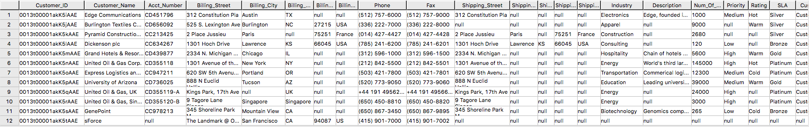

#### READ_NOSテーブルオペレータ

READ_NOSテーブルオペレータは、最初に外部テーブルを定義せずにデータの一部をサンプリングして調査したり、Location句で指定したすべてのオブジェクトに関連するキーのリストを表示するために使用できます。

``` sql
SELECT top 5 payload.*
FROM READ_NOS (
 ON (SELECT CAST(NULL AS JSON CHARACTER SET Unicode))
USING
LOCATION ('/S3/s3.amazonaws.com/ptctstoutput/salesforce/1ce190bc-25a9-4493-99ad-7497b497a0d0/903790813-2020-08-21T21:02:25')
 ACCESS_ID ('A**********') /* AccessKeyId */
 ACCESS_KEY ('***********') /* SecretAccessKey */
 ) AS D
GROUP BY 1;
```

出力:

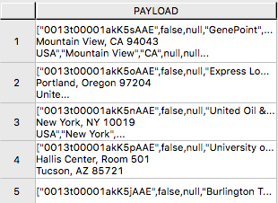

#### Amazon S3 データとデータベース内テーブルの結合

外部テーブルを Vantage のテーブルと結合して、さらに分析することができます。たとえば、注文と配送の情報は、Vantage の 3 つのテーブル (Orders、Order_Items、Shipping_Address) にあります。

Orders の DDL:

``` sql
CREATE TABLE Orders (
  Order_ID INT NOT NULL,
  Customer_ID VARCHAR(20) CHARACTER SET LATIN CASESPECIFIC,
  Order_Status INT,
  -- Order status: 1 = Pending; 2 = Processing; 3 = Rejected; 4 = Completed
  Order_Date DATE NOT NULL,
  Required_Date DATE NOT NULL,
  Shipped_Date DATE,
  Store_ID INT NOT NULL,
  Staff_ID INT NOT NULL
) Primary Index (Order_ID);
```

Order_Items の DDL:

``` sql
CREATE TABLE Order_Items(
  Order_ID INT NOT NULL,
  Item_ID INT,
  Product_ID INT NOT NULL,
  Quantity INT NOT NULL,
  List_Price DECIMAL (10, 2) NOT NULL,
  Discount DECIMAL (4, 2) NOT NULL DEFAULT 0
) Primary Index (Order_ID, Item_ID);
```

Shipping_Address の DDL:

``` sql
CREATE TABLE Shipping_Address (
  Customer_ID VARCHAR(20) CHARACTER SET LATIN CASESPECIFIC NOT NULL,
  Street VARCHAR(100) CHARACTER SET LATIN CASESPECIFIC,
  City VARCHAR(20) CHARACTER SET LATIN CASESPECIFIC,
  State VARCHAR(15) CHARACTER SET LATIN CASESPECIFIC,
  Postal_Code VARCHAR(10) CHARACTER SET LATIN CASESPECIFIC,
  Country VARCHAR(20) CHARACTER SET LATIN CASESPECIFIC
) Primary Index (Customer_ID);
```

そして、テーブルには以下のデータがあります。

Orders:

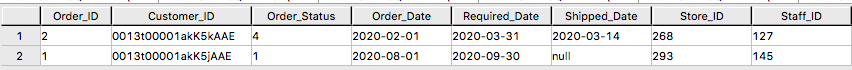

Order_Items:

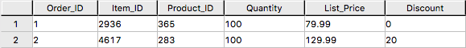

Shipping_Address:


データベースのOrders, Order_Items, Shipping_Address テーブルにsalesforceの外部テーブルを結合することで、顧客の注文情報を顧客の配送情報とともに取得することができます。

``` sql
SELECT
  s.payload.Id as Customer_ID,
  s.payload."Name" as Customer_Name,
  s.payload.AccountNumber as Acct_Number,
  o.Order_ID as Order_ID,
  o.Order_Status as Order_Status,
  o.Order_Date as Order_Date,
  oi.Item_ID as Item_ID,
  oi.Product_ID as Product_ID,
  sa.Street as Shipping_Street,
  sa.City as Shipping_City,
  sa.State as Shipping_State,
  sa.Postal_Code as Shipping_Postal_Code,
  sa.Country as Shipping_Country
FROM
  salesforce s, Orders o, Order_Items oi, Shipping_Address sa
WHERE
  s.payload.Id = o.Customer_ID
  AND o.Customer_ID = sa.Customer_ID
  AND o.Order_ID = oi.Order_ID
ORDER BY 1;
```

結果：

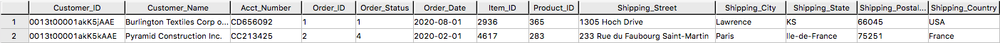

#### Amazon S3 データを Vantage にインポートする

Amazon S3 データの永続的なコピーがあると、同じデータに繰り返しアクセスすることが予想される場合に便利です。NOS 外部テーブルは、Amazon S3 データの永続的なコピーを自動的に作成しません。データベースにデータをキャプチャするためのいくつかの方法を次に説明します。

「CREATE TABLE AS … WITH DATA」ステートメントは、ソース テーブルとして機能する外部テーブル定義で使用できます。このアプローチを使用すると、外部テーブル ペイロード内のどの属性をターゲット テーブルに含めるか、およびリレーショナル テーブル列にどのような名前を付けるかを、選択的に選択できます。

``` sql
CREATE TABLE salesforceVantage AS (
  SELECT
    CAST(payload.Id AS VARCHAR(20)) Customer_ID,
    CAST(payload."Name" AS VARCHAR(100)) Customer_Name,
    CAST(payload.AccountNumber AS VARCHAR(10)) Acct_Number,
    CAST(payload.BillingStreet AS VARCHAR(20)) Billing_Street,
    CAST(payload.BillingCity AS VARCHAR(20)) Billing_City,
    CAST(payload.BillingState AS VARCHAR(10)) Billing_State,
    CAST(payload.BillingPostalCode AS VARCHAR(5)) Billing_Post_Code,
    CAST(payload.BillingCountry AS VARCHAR(20)) Billing_Country,
    CAST(payload.Phone AS VARCHAR(15)) Phone,
    CAST(payload.Fax AS VARCHAR(15)) Fax,
    CAST(payload.ShippingStreet AS VARCHAR(20)) Shipping_Street,
    CAST(payload.ShippingCity AS VARCHAR(20)) Shipping_City,
    CAST(payload.ShippingState AS VARCHAR(10)) Shipping_State,
    CAST(payload.ShippingPostalCode AS VARCHAR(5)) Shipping_Post_Code,
    CAST(payload.ShippingCountry AS VARCHAR(20)) Shipping_Country,
    CAST(payload.Industry AS VARCHAR(50)) Industry,
    CAST(payload.Description AS VARCHAR(200)) Description,
    CAST(payload.NumberOfEmployees AS INT) Num_Of_Employee,
    CAST(payload.CustomerPriority__c AS VARCHAR(10)) Priority,
    CAST(payload.Rating AS VARCHAR(10)) Rating,
    CAST(payload.SLA__c AS VARCHAR(10)) SLA,
    CAST(payload."Type" AS VARCHAR(20)) Customer_Type,
    CAST(payload.Website AS VARCHAR(100)) Customer_Website,
    CAST(payload.AnnualRevenue AS VARCHAR(10)) Annual_Revenue,
    CAST(payload.LastActivityDate AS DATE) Last_Activity_Date
  FROM salesforce)
WITH DATA
NO PRIMARY INDEX;
```

* `SELECT* * *FROM* salesforceVantage;` 部分的な結果:

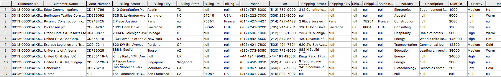

外部テーブルを使用する代わりに、READ_NOS テーブル演算子を使用することもできます。このテーブル演算子を使用すると、最初に外部テーブルを構築せずに、オブジェクト ストアから直接データにアクセスできます。READ_NOS と CREATE TABLE AS 句を組み合わせて、データベースにデータの永続バージョンを構築します。

``` sql
CREATE TABLE salesforceReadNOS AS (
 SELECT
    CAST(payload.Id AS VARCHAR(20)) Customer_ID,
    CAST(payload."Name" AS VARCHAR(100)) Customer_Name,
    CAST(payload.AccountNumber AS VARCHAR(10)) Acct_Number,
    CAST(payload.BillingStreet AS VARCHAR(20)) Billing_Street,
    CAST(payload.BillingCity AS VARCHAR(20)) Billing_City,
    CAST(payload.BillingState AS VARCHAR(10)) Billing_State,
    CAST(payload.BillingPostalCode AS VARCHAR(5)) Billing_Post_Code,
    CAST(payload.BillingCountry AS VARCHAR(20)) Billing_Country,
    CAST(payload.Phone AS VARCHAR(15)) Phone,
    CAST(payload.Fax AS VARCHAR(15)) Fax,
    CAST(payload.ShippingStreet AS VARCHAR(20)) Shipping_Street,
    CAST(payload.ShippingCity AS VARCHAR(20)) Shipping_City,
    CAST(payload.ShippingState AS VARCHAR(10)) Shipping_State,
    CAST(payload.ShippingPostalCode AS VARCHAR(5)) Shipping_Post_Code,
    CAST(payload.ShippingCountry AS VARCHAR(20)) Shipping_Country,
    CAST(payload.Industry AS VARCHAR(50)) Industry,
    CAST(payload.Description AS VARCHAR(200)) Description,
    CAST(payload.NumberOfEmployees AS INT) Num_Of_Employee,
    CAST(payload.CustomerPriority__c AS VARCHAR(10)) Priority,
    CAST(payload.Rating AS VARCHAR(10)) Rating,
    CAST(payload.SLA__c AS VARCHAR(10)) SLA,
    CAST(payload."Type" AS VARCHAR(20)) Customer_Type,
    CAST(payload.Website AS VARCHAR(100)) Customer_Website,
    CAST(payload.AnnualRevenue AS VARCHAR(10)) Annual_Revenue,
    CAST(payload.LastActivityDate AS DATE) Last_Activity_Date
  FROM READ_NOS (
    ON (SELECT CAST(NULL AS JSON CHARACTER SET Unicode))
    USING
      LOCATION ('/S3/s3.amazonaws.com/ptctstoutput/salesforce/1ce190bc-25a9-4493-99ad-7497b497a0d0/903790813-2020-08-21T21:02:25')
      ACCESS_ID ('A**********') /* AccessKeyId */
      ACCESS_KEY ('***********') /* SecretAccessKey */
  ) AS D
) WITH DATA;
```

`salesforceReadNOS` テーブルからの結果:

``` sql
SELECT * FROM salesforceReadNOS;
```

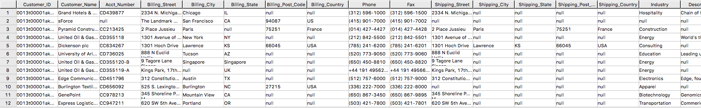

Amazon S3 データをリレーショナル テーブルに配置する別の方法は、「INSERT SELECT」を使用することです。このアプローチでは、外部テーブルがソース テーブルとなり、新しく作成された永続テーブルが挿入先のテーブルとなります。上記の READ_NOS の例とは異なり、このアプローチでは永続テーブルを事前に作成しておく必要があります。

INSERT SELECT メソッドの利点の 1 つは、ターゲット テーブルの属性を変更できることです。たとえば、ターゲット テーブルが `MULTISET` であるかどうかを指定したり、別のプライマリ インデックスを選択したりできます。

``` sql
CREATE TABLE salesforcePerm, FALLBACK ,
NO BEFORE JOURNAL,
NO AFTER JOURNAL,
CHECKSUM = DEFAULT,
DEFAULT MERGEBLOCKRATIO,
MAP = TD_MAP1
(
  Customer_Id VARCHAR(20) CHARACTER SET LATIN NOT CASESPECIFIC,
  Customer_Name VARCHAR(100) CHARACTER SET LATIN NOT CASESPECIFIC,
  Acct_Number VARCHAR(10) CHARACTER SET LATIN NOT CASESPECIFIC,
  Billing_Street VARCHAR(20) CHARACTER SET LATIN NOT CASESPECIFIC,
  Billing_City VARCHAR(20) CHARACTER SET LATIN NOT CASESPECIFIC,
  Billing_State VARCHAR(10) CHARACTER SET LATIN NOT CASESPECIFIC,
  Billing_Post_Code VARCHAR(5) CHARACTER SET LATIN NOT CASESPECIFIC,
  Billing_Country VARCHAR(20) CHARACTER SET LATIN NOT CASESPECIFIC,
  Phone VARCHAR(15) CHARACTER SET LATIN NOT CASESPECIFIC,
  Fax VARCHAR(15) CHARACTER SET LATIN NOT CASESPECIFIC,
  Shipping_Street VARCHAR(20) CHARACTER SET LATIN NOT CASESPECIFIC,
  Shipping_City VARCHAR(20) CHARACTER SET LATIN NOT CASESPECIFIC,
  Shipping_State VARCHAR(10) CHARACTER SET LATIN NOT CASESPECIFIC,
  Shipping_Post_Code VARCHAR(5) CHARACTER SET LATIN NOT CASESPECIFIC,
  Shipping_Country VARCHAR(20) CHARACTER SET LATIN NOT CASESPECIFIC,
  Industry VARCHAR(50) CHARACTER SET LATIN NOT CASESPECIFIC,
  Description VARCHAR(200) CHARACTER SET LATIN NOT CASESPECIFIC,
  Num_Of_Employee INT,
  Priority VARCHAR(10) CHARACTER SET LATIN NOT CASESPECIFIC,
  Rating VARCHAR(10) CHARACTER SET LATIN NOT CASESPECIFIC,
  SLA VARCHAR(10) CHARACTER SET LATIN NOT CASESPECIFIC,
  Customer_Type VARCHAR(20) CHARACTER SET LATIN NOT CASESPECIFIC,
  Customer_Website VARCHAR(100) CHARACTER SET LATIN NOT CASESPECIFIC,
  Annual_Revenue VARCHAR(10) CHARACTER SET LATIN NOT CASESPECIFIC,
  Last_Activity_Date DATE
) PRIMARY INDEX (Customer_ID);
```

``` sql
INSERT INTO salesforcePerm
  SELECT
    CAST(payload.Id AS VARCHAR(20)) Customer_ID,
    CAST(payload."Name" AS VARCHAR(100)) Customer_Name,
    CAST(payload.AccountNumber AS VARCHAR(10)) Acct_Number,
    CAST(payload.BillingStreet AS VARCHAR(20)) Billing_Street,
    CAST(payload.BillingCity AS VARCHAR(20)) Billing_City,
    CAST(payload.BillingState AS VARCHAR(10)) Billing_State,
    CAST(payload.BillingPostalCode AS VARCHAR(5)) Billing_Post_Code,
    CAST(payload.BillingCountry AS VARCHAR(20)) Billing_Country,
    CAST(payload.Phone AS VARCHAR(15)) Phone,
    CAST(payload.Fax AS VARCHAR(15)) Fax,
    CAST(payload.ShippingStreet AS VARCHAR(20)) Shipping_Street,
    CAST(payload.ShippingCity AS VARCHAR(20)) Shipping_City,
    CAST(payload.ShippingState AS VARCHAR(10)) Shipping_State,
    CAST(payload.ShippingPostalCode AS VARCHAR(5)) Shipping_Post_Code,
    CAST(payload.ShippingCountry AS VARCHAR(20)) Shipping_Country,
    CAST(payload.Industry AS VARCHAR(50)) Industry,
    CAST(payload.Description AS VARCHAR(200)) Description,
    CAST(payload.NumberOfEmployees AS INT) Num_Of_Employee,
    CAST(payload.CustomerPriority__c AS VARCHAR(10)) Priority,
    CAST(payload.Rating AS VARCHAR(10)) Rating,
    CAST(payload.SLA__c AS VARCHAR(10)) SLA,
    CAST(payload."Type" AS VARCHAR(20)) Customer_Type,
    CAST(payload.Website AS VARCHAR(100)) Customer_Website,
    CAST(payload.AnnualRevenue AS VARCHAR(10)) Annual_Revenue,
    CAST(payload.LastActivityDate AS DATE) Last_Activity_Date
  FROM salesforce;
```

``` sql
SELECT * FROM salesforcePerm;
```

結果のサンプル:

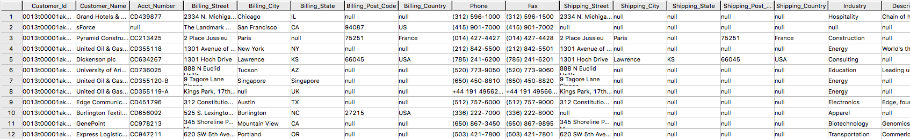

### NOS を使用して Vantage データを Amazon S3 にエクスポートする

Vantage システムで1 行を含む `newleads` テーブルがあります。

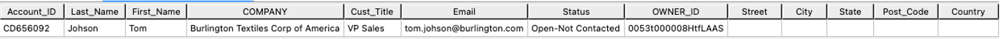

このリードには住所情報がないことに注意してください。Salesforceから取得したアカウント情報を使用して `newleads` テーブルを更新しましょう。

``` sql
UPDATE nl
FROM
  newleads AS nl,
  salesforceReadNOS AS srn
SET
  Street = srn.Billing_Street,
  City = srn.Billing_City,
  State = srn.Billing_State,
  Post_Code = srn.Billing_Post_Code,
  Country = srn.Billing_Country
  WHERE Account_ID = srn.Acct_Number;
```

これで、新しいリードにアドレス情報が付与されました。


WRITE_NOSを使用して、新しいリード情報をS3バケットに書き込みます。

``` sql , id="salesforce_first_run", role="content-editable emits-gtm-events"
SELECT * FROM WRITE_NOS (
ON (
  SELECT
    Account_ID,
    Last_Name,
    First_Name,
    Company,
    Cust_Title,
    Email,
    Status,
    Owner_ID,
    Street,
    City,
    State,
    Post_Code,
    Country
  FROM newleads
)
USING
  LOCATION ('/s3/vantageparquet.s3.amazonaws.com/')
  AUTHORIZATION ('{"Access_ID":"A*****","Access_Key":"*****"}')
  COMPRESSION ('SNAPPY')
  NAMING ('DISCRETE')
  INCLUDE_ORDERING ('FALSE')
  STOREDAS ('CSV')
) AS d;
```

ここで、Access_IDはAccessKeyID、Access_KeyはBucketに対するSecretAccessKeyです。

### Amazon S3からSalesforceへのフローを作成する

ステップ1を繰り返し、ソースにAmazon S3、宛先にSalesforceを使用したフローを作成します。

#### ステップ1. フローの詳細を指定する

このステップでは、フローの基本情報を提供する。

 *Flow name* (例： _vantage2SF_) と *Flow description (optional)* を入力し、 *Customize encryption settings (advanced)* のチェックを外したままにします。*Next*をクリックします。

#### ステップ2. フローを構成する

このステップでは、フローのソースと宛先に関する情報を提供します。この例では、ソースとして *_Amazon S3_* を使用し、宛先として *_Salesforce_* を使用します。

*  *Source details* は、 _Amazon S3_ を選択し、CSVファイルを書き込んだバケットを選択します（例：vantagecsv）。
* *Destination details* は、_Salesforce_ を選択し、*Choose Salesforce connection* のドロップダウンリストでStep1で作成した接続を使用し、*Choose Salesforce object* として_Lead_ を選択します。
* *Error handling* の場合は、デフォルトの _Stop the current flow run_ を使用する。 
* *Flow trigger* は _Run on demand_です。 *Next*をクリックしてください。

#### ステップ3. データフィールドをマッピングする

このステップでは、ソースからデスティネーションへのデータ転送の方法を決定します。

* *Mapping method* として、_Manually map fields_ を使用します
* *Destination record preference* として、_Insert new records (default)_ を使用します
*  *送信元から送信先へのマッピング* には、次のマッピングを使用します

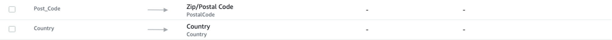

* *Next* をクリックします。

#### ステップ4．フィルタを追加する

転送するレコードを決定するためのフィルタを指定できます。この例では、フィルタは追加されていません。 *Next*をクリックします。

#### ステップ5. レビューして作成する

入力したすべての情報を確認します。必要に応じて修正します。 *Create flow*をクリックします。

フローが作成されると、フロー情報とともにフロー作成成功のメッセージが表示されます。

#### Run flow

右上の *Run flow* をクリックします。

フローの実行が完了すると、実行に成功したことを示すメッセージが表示されます。

メッセージの例:


Salesforceのページを参照すると、新しいリードTom Johnsonが追加されています。

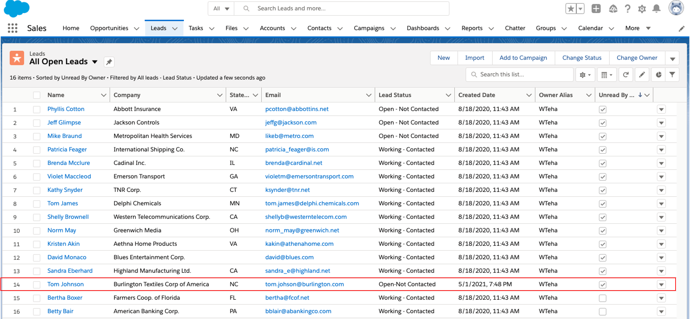

### クリーンアップする(オプション)

Salesforce データの使用が完了したら、使用したリソースに対して AWS アカウント ([AppFlow](https://aws.amazon.com/appflow/pricing/)、 Amazon [S3](https://aws.amazon.com/s3/pricing)、 [Vantage](https://www.teradata.com/Cloud/AWS/Do-it-Yourself/Pricing) 、 [VM](https://aws.amazon.com/ec2/pricing/)など) に請求されないように、以下の手順を実行します。

1. AppFlow:
    * フローに作成した「接続」を削除する
    * フローを削除する

2. Amazon S3 バケットとファイル:
    * Vantage データファイルが保存されている Amazon S3 バケットに移動し、ファイルを削除する
    * バケットを保持する必要がない場合は、バケットを削除する

3. Teradata Vantage インスタンス
    * 不要になったインスタンスを停止/終了する

import CommunityLinkPartial from '../_partials/community_link.mdx';

<CommunityLinkPartial />
