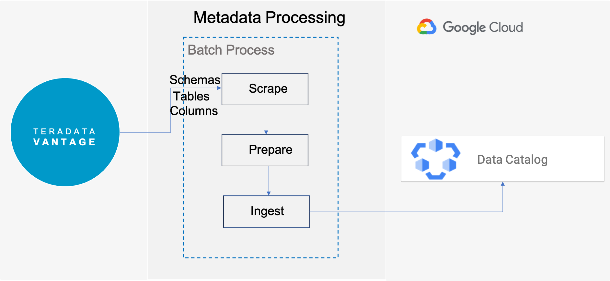
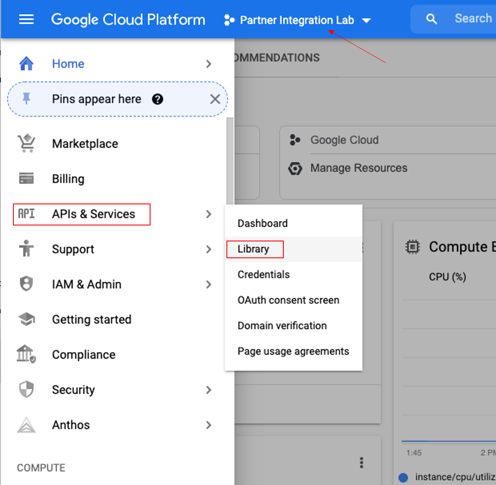
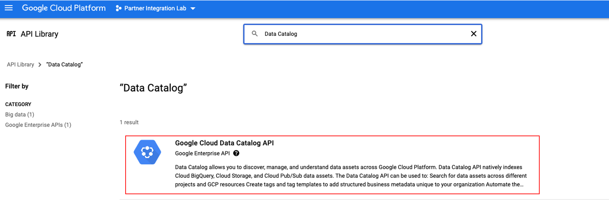
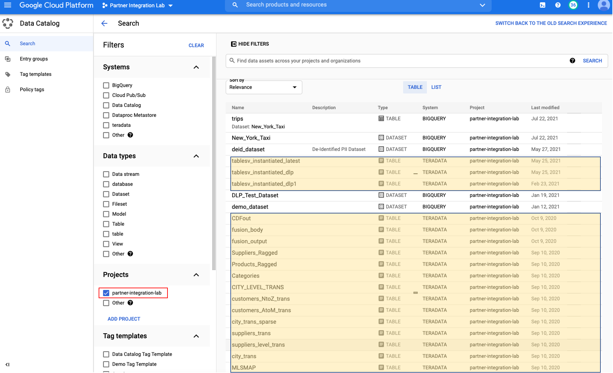
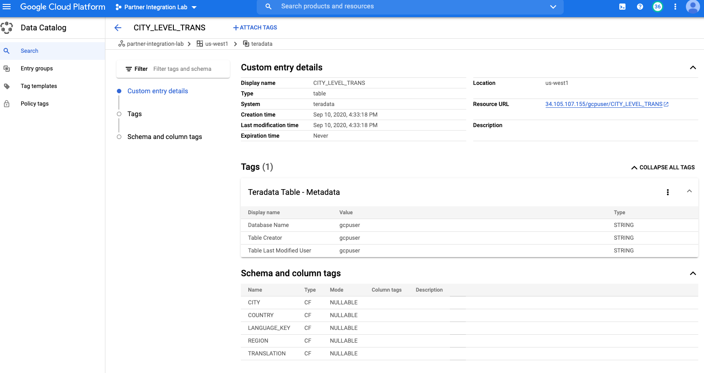

# Teradata VantageとGoogle Cloud Data Catalogを統合する

### 概要

この記事では、 [Data Catalog Teradata Connector on GitHub](https://github.com/GoogleCloudPlatform/datacatalog-connectors-rdbms/tree/master/google-datacatalog-teradata-connector)を使用して Teradata VantageとGoogle Cloud Data Catalogを接続し、Data Catalog経由でVantageテーブルのメタデータを探索する手順について説明します。



* Scrape: Teradata Vantageに接続し、利用可能なすべてのメタデータを取得する
* Prepare: Data Catalogエンティティでメタデータを変換し、タグを作成する
* Ingest: Data CatalogエンティティをGoogle Cloudプロジェクトに送信する

### Google Cloud Data Catalogについて

Google Cloud Data Catalog は、完全に管理されたデータ検出およびメタデータ管理サービスです。Data Catalog では、データアセットのネイティブ メタデータをカタログ化できます。Data Catalog はサーバーレスで、技術メタデータとビジネス メタデータの両方を構造化された形式でキャプチャするための中央カタログを提供します。

### Teradata Vantage について

Vantageは、データウェアハウス、データレイク、アナリティクスを単一の接続されたエコシステムに統合する最新のクラウドプラットフォームです。

Vantageは、記述的分析、予測的分析、処方的分析、自律的意思決定、ML機能、可視化ツールを統合したプラットフォームで、データの所在を問わず、リアルタイムのビジネスインテリジェンスを大規模に発掘することが可能です。

Vantageは、小規模から始めて、コンピュートやストレージを弾力的に拡張し、使用した分だけ支払い、低コストのオブジェクトストアを活用し、分析ワークロードを統合することを可能にします。

Vantage は、R、Python、Teradata Studio、およびその他の SQL ベースのツールをサポートしています。Vantage は、パブリック クラウド、オンプレミス、最適化されたインフラストラクチャまたはコモディティ インフラストラクチャ、またはサービスとして導入できます。

Teradata Vantage の詳細については、 [ドキュメント](https://docs.teradata.com/home)を参照してください。

### 前提条件

* Teradata Vantageインスタンスへのアクセス。

* Data Catalog 管理者ロールを持つ [**Google サービス アカウント**](https://support.google.com/accounts/answer/27441?hl=en)
* アカウント用に [**作成されたCloud Consoleプロジェクト**](https://cloud.google.com/resource-manager/docs/creating-managing-projects) (例、partner-integration-lab)
* 課金が有効になっている
* Google Cloud SDK [インストール済み](https://cloud.google.com/sdk/docs/install) および [初期化済み](https://cloud.google.com/sdk/docs/initializing)
* インストールされた[Python](https://www.python.org/downloads/)
* インストールされた[Pip](https://pip.pypa.io/en/stable/installation/)

### 手順

1. Data Catalog APIを有効にする
2. Teradata Data Catalog コネクタをインストールする
3. Run
4. Teradata VantageのメタデータをData Catalogで探索する

### Data Catalog APIを有効にする

*  [Google](http://console.cloud.google.com/) コンソールにログオンし、ナビゲーション メニューから **APIs & Services** を選択して、 _Library_をクリックします。上部のメニュー バーでプロジェクトが選択されていることを確認します。

  
* 検索ボックスに _Data Catalog_ を入力し、 **Google Cloud Data Catalog API** をクリックし、 **ENABLE** をクリックします

  

### Teradata Data Catalog コネクタをインストールする

Teradata Data Catalog コネクタは [GitHub](https://github.com/GoogleCloudPlatform/datacatalog-connectors-rdbms/tree/master/google-datacatalog-teradata-connector)で利用できます。このコネクタは Python で記述されています。

* 以下のコマンドを実行し、gcloudを認証して、Googleのユーザー認証でCloud Platformにアクセスできるようにします。

  ```bash 
  gcloud auth login
  ```
* Googleのログインページが開くので、Googleアカウントを選択し、次のページで _Allow_ をクリックします。
* 次に、デフォルトプロジェクトの設定がまだの場合は設定します。

  ```bash
  gcloud config set project &lt;project id>
  ```

### virtualenv をインストールする

Teradata Data Catalog コネクタは、分離されたPython環境にインストールすることをお勧めします。そのためには、まず [virtualenv](https://virtualenv.pypa.io/en/latest/) をインストールします。

* **Windows**

  Powershell で管理者として実行します。
  ``` bash
  pip install virtualenv
  virtualenv --python python3.6 &lt;your-env>
  &lt;your-env>\Scripts\activate
  ```
* **MacOS**

  ``` bash , role="content-editable emits-gtm-events"
  pip install virtualenv
  virtualenv --python python3.6 &lt;your-env>
  source &lt;your-env>/bin/activate
  ```
* **Linux**

  ``` bash , role="content-editable emits-gtm-events"
  pip install virtualenv
  virtualenv --python python3.6 &lt;your-env>
  source &lt;your-env>/bin/activate
  ```

#### Data Catalog Teradataコネクタのインストール

* **Windows**

  ``` bash
  pip.exe install google-datacatalog-teradata-connector
  ```
* **MacOS**

  ``` bash , role="content-editable emits-gtm-events"
  pip install google-datacatalog-teradata-connector
  ```
* **Linux**

  ``` bash , role="content-editable emits-gtm-events"
  pip install google-datacatalog-teradata-connector
  ```

### 環境変数の設定

``` bash , id="gcp_env_var", role="content-editable emits-gtm-events"
export GOOGLE_APPLICATION_CREDENTIALS=&lt;google_credentials_file>
export TERADATA2DC_DATACATALOG_PROJECT_ID=&lt;google_cloud_project_id>
export TERADATA2DC_DATACATALOG_LOCATION_ID=&lt;google_cloud_location_id>
export TERADATA2DC_TERADATA_SERVER=&lt;teradata_server>
export TERADATA2DC_TERADATA_USERNAME=&lt;teradata_username>
export TERADATA2DC_TERADATA_PASSWORD=&lt;teradata_password>
```

 `<google_credential_file>` には、サービスアカウントのキー（jsonファイル）を指定します。

### Run

 `google-datacatalog-teradata-connector` コマンドを実行して、Vantage データベースへのエ ントリポイントを確立します。

``` bash , id="gcp_data_catalog_first_run" role="content-editable emits-gtm-events"
google-datacatalog-teradata-connector \
  --datacatalog-project-id=$TERADATA2DC_DATACATALOG_PROJECT_ID \
  --datacatalog-location-id=$TERADATA2DC_DATACATALOG_LOCATION_ID \
  --teradata-host=$TERADATA2DC_TERADATA_SERVER \
  --teradata-user=$TERADATA2DC_TERADATA_USERNAME \
  --teradata-pass=$TERADATA2DC_TERADATA_PASSWORD
```

google-datacatalog-teradata-connectorコマンドの出力例です。

```
INFO:root:
==============Starting CLI===============
INFO:root:This SQL connector does not implement the user defined datacatalog-entry-resource-url-prefix
INFO:root:This SQL connector uses the default entry resoure URL

============Start teradata-to-datacatalog===========

==============Scrape metadata===============
INFO:root:Scrapping metadata from connection_args

1 table containers ready to be ingested...

==============Prepare metadata===============

--> database: Gcpuser
37 tables ready to be ingested...

==============Ingest metadata===============

DEBUG:google.auth._default:Checking /Users/Teradata/Apps/Cloud/GCP/teradata2dc-credentials.json for explicit credentials as part of auth process...
INFO:root:Starting to clean up the catalog...
DEBUG:google.auth.transport.requests:Making request: POST https://oauth2.googleapis.com/token
DEBUG:urllib3.connectionpool:Starting new HTTPS connection (1): oauth2.googleapis.com:443
DEBUG:urllib3.connectionpool:https://oauth2.googleapis.com:443 "POST /token HTTP/1.1" 200 None
INFO:root:0 entries that match the search query exist in Data Catalog!
INFO:root:Looking for entries to be deleted...
INFO:root:0 entries will be deleted.

Starting to ingest custom metadata...

DEBUG:google.auth._default:Checking /Users/Teradata/Apps/Cloud/GCP/teradata2dc-credentials.json for explicit credentials as part of auth process...
INFO:root:Starting the ingestion flow...
DEBUG:google.auth.transport.requests:Making request: POST https://oauth2.googleapis.com/token
DEBUG:urllib3.connectionpool:Starting new HTTPS connection (1): oauth2.googleapis.com:443
DEBUG:urllib3.connectionpool:https://oauth2.googleapis.com:443 "POST /token HTTP/1.1" 200 None
INFO:root:Tag Template created: projects/partner-integration-lab/locations/us-west1/tagTemplates/teradata_database_metadata
INFO:root:Tag Template created: projects/partner-integration-lab/locations/us-west1/tagTemplates/teradata_table_metadata
INFO:root:Tag Template created: projects/partner-integration-lab/locations/us-west1/tagTemplates/teradata_column_metadata
INFO:root:Entry Group created: projects/partner-integration-lab/locations/us-west1/entryGroups/teradata
INFO:root:1/38
INFO:root:Entry does not exist: projects/partner-integration-lab/locations/us-west1/entryGroups/teradata/entries/gcpuser
INFO:root:Entry created: projects/partner-integration-lab/locations/us-west1/entryGroups/teradata/entries/gcpuser
INFO:root: ^ [database] 34.105.107.155/gcpuser
INFO:root:Starting the upsert tags step
INFO:root:Processing Tag from Template: projects/partner-integration-lab/locations/us-west1/tagTemplates/teradata_database_metadata ...
INFO:root:Tag created: projects/partner-integration-lab/locations/us-west1/entryGroups/teradata/entries/gcpuser/tags/CWHNiGQeQmPT
INFO:root:2/38
INFO:root:Entry does not exist: projects/partner-integration-lab/locations/us-west1/entryGroups/teradata/entries/gcpuser_Categories
INFO:root:Entry created: projects/partner-integration-lab/locations/us-west1/entryGroups/teradata/entries/gcpuser_Categories
INFO:root: ^ [table] 34.105.107.155/gcpuser/Categories
INFO:root:Starting the upsert tags step
INFO:root:Processing Tag from Template: projects/partner-integration-lab/locations/us-west1/tagTemplates/teradata_table_metadata ...
INFO:root:Tag created: projects/partner-integration-lab/locations/us-west1/entryGroups/teradata/entries/gcpuser_Categories/tags/Ceij5G9t915o
INFO:root:38/38
INFO:root:Entry does not exist: projects/partner-integration-lab/locations/us-west1/entryGroups/teradata/entries/gcpuser_tablesv_instantiated_latest
INFO:root:Entry created: projects/partner-integration-lab/locations/us-west1/entryGroups/teradata/entries/gcpuser_tablesv_instantiated_latest
INFO:root: ^ [table] 34.105.107.155/gcpuser/tablesv_instantiated_latest
INFO:root:Starting the upsert tags step
INFO:root:Processing Tag from Template: projects/partner-integration-lab/locations/us-west1/tagTemplates/teradata_table_metadata ...
INFO:root:Tag created: projects/partner-integration-lab/locations/us-west1/entryGroups/teradata/entries/gcpuser_tablesv_instantiated_latest/tags/Ceij5G9t915o
INFO:root:
============End teradata-to-datacatalog============
```

### Teradata VantageのメタデータをData Catalogで探索する

*  [Data Catalog](https://console.cloud.google.com/datacatalog) コンソールに移動し、 **Projects**の下のプロジェクト (つまり、partner-integration-lab) をクリックします。Teradata テーブルが右側のパネルに表示されます。

  
* 興味のあるテーブル (CITY_LEVEL_TRANS など) をクリックすると、このテーブルに関するメタデータが表示されます。

  

### クリーンアップ (オプション)

* データカタログからメタデータをクリーンアップします。そのためには、https://github.com/GoogleCloudPlatform/datacatalog-connectors-rdbms/blob/master/google-datacatalog-teradata-connector/tools/cleanup_datacatalog.py をローカル ディレクトリにコピーします。
* このファイルがあるディレクトリに移動し、以下のコマンドを実行する。

  ``` bash , role="content-editable emits-gtm-events"
  python cleanup_datacatalog.py --datacatalog-project-ids=$TERADATA2DC_DATACATALOG_PROJECT_ID
  ```
