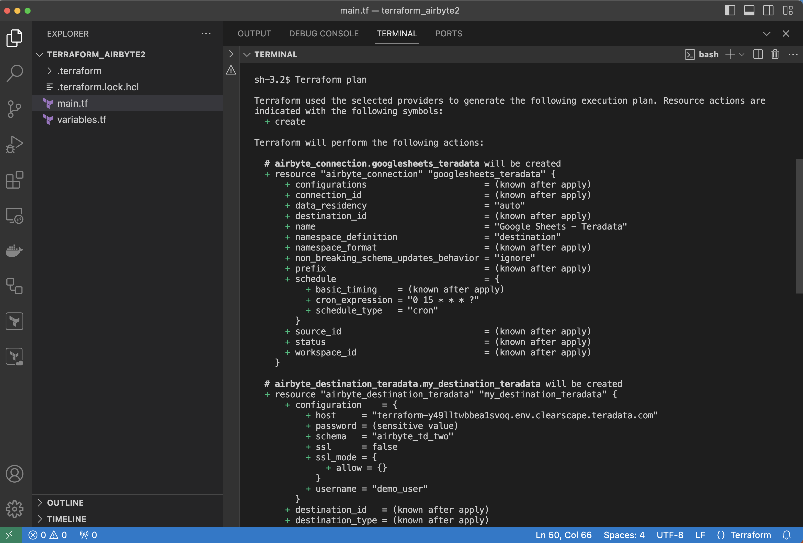
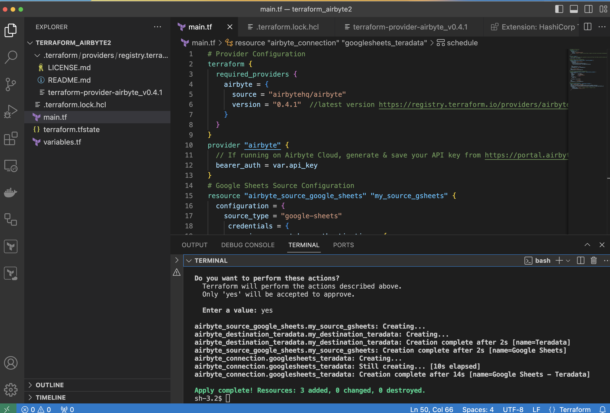

import YouTubeVideo from '../_partials/terraform-video.mdx';
import Tabs from '@theme/Tabs';
import TabItem from '@theme/TabItem';

# Teradata Vantage 上の Terraform と Airbyte を使用して ELT パイプラインをコードとして管理する 


### 概要 

このクイックスタートでは、Terraform を使用して Airbyte データ パイプラインをコードとして管理する方法について説明します。WebUI を介した手動構成の代わりに、コードを使用して Airbyte リソースを作成および管理します。提供されている例は、Airbyte の Terraform プロバイダを使用した、Google スプレッドシートから Teradata Vantage への基本的な ELT パイプラインを示しています。

Airbyte Terraform プロバイダは、Airbyte Cloud、OSS、Self-Managed Enterprise のユーザーが利用できます。 

この統合がどのように機能するかについての簡潔な説明をご覧ください:

<YouTubeVideo />

### はじめに
[Terraform](https://www.terraform.io) は、Infrastructure as Code (IaC) 分野における主要なオープンソース ツールです。手動セットアップの代わりに、構成ファイルを介してインフラストラクチャ、クラウド プラットフォーム、およびサービスの自動プロビジョニングと管理を可能にします。Terraform は、Terraform プロバイダと呼ばれるプラグインを使用して、インフラストラクチャ ホスト、クラウド プロバイダ、API、および SaaS プラットフォームと通信します。 

データ統合プラットフォームである Airbyte には、 [AirbyteのAPI](https://reference.airbyte.com/reference/start)と直接通信する Terraform プロバイダがあります。これにより、データ エンジニアは Airbyte 構成を管理し、バージョン管理を実施し、ELT パイプライン内で適切なデータ エンジニアリング プラクティスを適用できます。

### 前提条件
* [Airbyte クラウドアカウント](https://airbyte.com/connectors/teradata-vantage)最初の同期が成功した後に始まる 14 日間の無料トライアルから始めましょう。
-  [開発者ポータル](https://portal.airbyte.com)にログインしてAirbyte API キーを生成します。
* Teradata Vantage インスタンス。Airbyte の Terraform 構成には、データベース `Host`、 `Username`、 `Password` が必要です。 
- [ClearScape Analytics Experienceで無料のTeradataインスタンスを作成する](../get-access-to-vantage/clearscape-analytics-experience/getting-started-with-csae.md)

* ソースデータ。デモンストレーションの目的で [サンプルのGoogleスプレッドシート、](https://docs.google.com/spreadsheets/d/1XNBYUw3p7xG6ptfwjChqZ-dNXbTuVwPi7ToQfYKgJIE/edit#gid=0)を使用します。これを個人の Google ワークスペースにコピーします。 

* [個人または組織のアカウントで Google Cloud Platform API が有効になっている](https://support.google.com/googleapi/answer/6158841?hl=en]=)OAuth またはサービス アカウント キー認証システムを介して Google アカウントを認証する必要があります。この例では、[サービスアカウントキー認証](https://cloud.google.com/iam/docs/keys-create-delete)を使用します。

### Terraformをインストールする 
* それぞれのコマンドを適用して、オペレーティング システムに Terraform をインストールします。追加のオプションは [Terraformサイト](https://developer.hashicorp.com/terraform/tutorials/aws-get-started/install-cli)で確認できます。


```mdx-code-block
<Tabs>
  <TabItem value="MacOS" label="MacOS" default>
    まず、すべての [Homebrew](https://brew.sh) パッケージのリポジトリである HashiCorp tap をインストールします。
    ```bash
      brew tap hashicorp/tap
    ```
    次に、hashicorp/tap/terraform を使用して Terraform をインストールします。
    ```bash
      brew install hashicorp/tap/terraform
    ```
  </TabItem>
  <TabItem value="Windows" label="Windows">
    [Chocolatey](https://chocolatey.org) は、Windows 用の無料のオープンソース パッケージ管理システムです。コマンドラインから Terraform パッケージをインストールします。
    ```bash
      choco install terraform
    ```
  </TabItem>
  <TabItem value="Linux" label="Linux">
    ```bash
    wget -O- https://apt.releases.hashicorp.com/gpg | sudo gpg --dearmor -o /usr/share/keyrings/hashicorp-archive-keyring.gpg
    echo "deb [signed-by=/usr/share/keyrings/hashicorp-archive-keyring.gpg] https://apt.releases.hashicorp.com $(lsb_release -cs) main" | sudo tee /etc/apt/sources.list.d/hashicorp.list
    sudo apt update && sudo apt install terraform 
    ```
  </TabItem>
</Tabs>
```

### 環境の準備

Terraform 構成用のディレクトリを作成し、 `main.tf` と `variables.tf`の2 つのファイルを初期化して環境を準備します。

``` bash
mkdir terraform_airbyte
cd terraform_airbyte
touch main.tf variables.tf
```

### データパイプラインを定義する
 `main.tf` ファイル内でデータ ソース、宛先、接続を定義します。新しく作成された `main.tf` ファイルを Visual Studio Code または任意のコード エディターで開きます。

- Visual Studio Code を使用する場合は、 [HashiCorp Terraform 拡張機能](https://marketplace.visualstudio.com/items?itemName=HashiCorp.terraform) をインストールして、自動補完と構文の強調表示を追加します。構成言語のサポートのために [Anton Kuliko による Terraform](https://marketplace.visualstudio.com/items?itemName=4ops.terraform) を追加することもできます。 


提供されたテンプレートを使用して main.tf ファイルを入力します。
``` bash
# Provider Configuration
terraform {
  required_providers {
    airbyte = {
      source = "airbytehq/airbyte"
      version = "0.4.1"  // Latest Version https://registry.terraform.io/providers/airbytehq/airbyte/latest
    }
  }
}
provider "airbyte" {
  // If running on Airbyte Cloud, generate & save the API key from https://portal.airbyte.com
  bearer_auth = var.api_key
}
# Google Sheets Source Configuration
resource "airbyte_source_google_sheets" "my_source_gsheets" {
  configuration = {
    source_type = "google-sheets"
     credentials = {
      service_account_key_authentication = {
        service_account_info = var.google_private_key
      }
    }
    names_conversion = true,
    spreadsheet_id = var.spreadsheet_id
  }
  name = "Google Sheets"
  workspace_id = var.workspace_id
}
# Teradata Vantage Destination Configuration
# For optional parameters visit https://registry.terraform.io/providers/airbytehq/airbyte/latest/docs/resources/destination_teradata 
resource "airbyte_destination_teradata" "my_destination_teradata" {
  configuration = {
    host            = var.host
    password        = var.password
    schema          = "airbyte_td_two"
    ssl             = false
    ssl_mode = {
      allow = {}
    }
    username = var.username
  }
  name          = "Teradata"
  workspace_id  = var.workspace_id
}
# Connection Configuration 
resource "airbyte_connection" "googlesheets_teradata" {
  name = "Google Sheets - Teradata"
  source_id = airbyte_source_google_sheets.my_source_gsheets.source_id
  destination_id = airbyte_destination_teradata.my_destination_teradata.destination_id
    schedule = {
      schedule_type = "cron" // "manual"
      cron_expression = "0 15 * * * ?" # This sets the data sync to run every 15 minutes of the hour
    }
  }
```

この例では、cron 式を使用して、毎時 15 分ごとにデータ転送が実行されるようにスケジュールすることに注意してください。 

 `main.tf` ファイルでは、API キー、ワークスペース ID、Google スプレッドシート ID、Google 秘密鍵、Teradata Vantage 認証情報など、[ `variables.tf` ファイルに保存されている変数を参照します。次のテンプレートを `variables.tf` ファイルにコピーし、 `default` 属性に適切な構成値を入力します。

### variables.tf ファイルの設定

``` bash
#log in to https://portal.airbyte.com generate, save and populate the variable with an API key
variable "api_key" {
    type = string
    default = ""
}
#workspace_id is found in the url to the Airbyte Cloud account https://cloud.airbyte.com/workspaces/<workspace_id>/settings/dbt-cloud 
variable "workspace_id" {
    type = string
    default = ""
} 

#Google spreadsheet id and Google private key
variable "spreadsheet_id" {
    type = string
    default = ""
}
variable "google_private_key" {
  type = string
  default =  ""
}
# Teradata Vantage connection credentials
variable "host" {
  type = string
  default = ""
  }
variable "username" {
  type = string
  default = "demo_user"
  }
  variable "password" {
  type = string
  default = ""
  }
```

### 実行コマンド

 `terraform init` を実行して、terraform プロバイダ ページからプロバイダ プラグインをプルダウンし、作業用の Terraform ディレクトリを初期化します。

このコマンドは、新しい Terraform 構成を記述した後、またはバージョン管理から既存の構成を複製した後にのみ実行する必要があります。


 `terraform plan` を実行すると、Terraform がリソースを作成し、インフラストラクチャに変更を加えるために使用する実行プランが表示されます。 

この例では、3 つの新しいリソースのプランが作成されます。

接続: # airbyte_connection.googlesheets_teradata が作成されます

宛先: # airbyte_connection.googlesheets_teradata が作成されます

ソース: # airbyte_source_google_sheets.my_source_gsheets が作成されます
  


 `terraform apply` と `yes` を実行して計画を生成し、計画を実行します。



 `terraform.tfstate` ファイルは、 `terraform apply` を初めて実行した後に作成されます。このファイルは、Terraform によって管理されるすべてのソース、宛先、および接続のステータスを追跡します。 `Terraform apply`のその後の実行では、Terraform は `main.tf` ファイル内のコードと `tfstate` ファイルに保存されているコードを比較します。 `main.tf`でリソースが追加または削除されると、Terraform はデプロイメント時にデプロイメントと `.tfstate` ファイルの両方を自動的に更新します。このファイルを手動で変更しないでください。

これで、Airbyte Cloud 上に、Terraform 経由で作成および管理されるソース、宛先、接続が作成されました。 


### 追加リソース 

- [Airbyte を使用して外部ソースから Teradata Vantage にデータをロードする方法](./use-airbyte-to-load-data-from-external-sources-to-teradata-vantage.md)
- [dbt を使用して Airbyte に読み込まれたデータを変換する方法](./transforming-external-data-loaded-via-airbyte-in-teradata-vantage-using-dbt.md)
- [Airbyte API リファレンス ドキュメント](https://reference.airbyte.com/reference/createsource).
- [Terraform Airbyte プロバイダ ドキュメント](https://registry.terraform.io/providers/airbytehq/airbyte/latest/docs/resources/destination_teradata#example-usage)