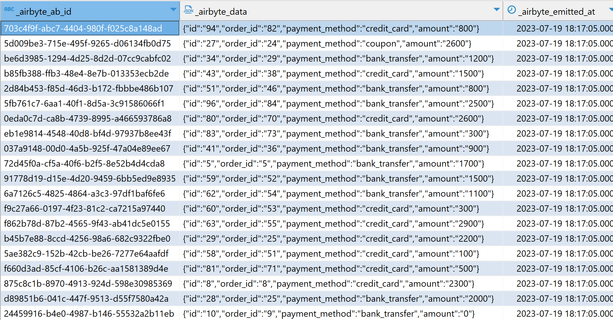
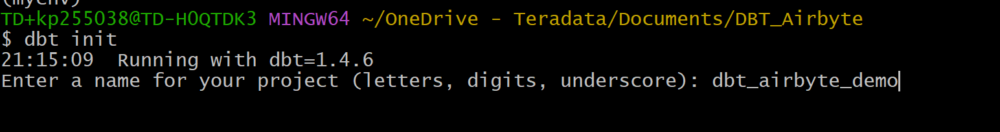
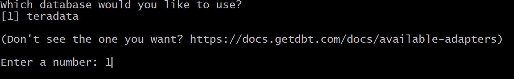
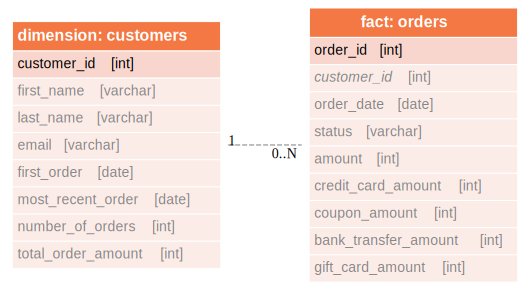

# dbt を使用して Airbyte に読み込まれたデータを変換する方法

## 概要

このチュートリアルでは、 [dbt (データ構築ツール)](https://docs.getdbt.com/docs/introduction) を使用して、Teradata Vantage の [Airbyte](https://github.com/airbytehq/airbyte) (オープンソースの抽出ロード ツール) を介して外部データ ロードを変換する方法を説明します。 

このチュートリアルは、元の [dbt Jaffleショップチュートリアル](https://github.com/dbt-labs/jaffle_shop-dev) をベースに少し変更を加えたもので、 `dbt seed` コマンドを使用する代わりに、Airbyte を使用して Jaffle Shop データセットを Google スプレッドシートから Teradata Vantage にロードします。airbyte を通じてロードされたデータは、次の図に示すように JSON 列に含まれています。



## 前提条件

import ClearscapeDocsNote from '../_partials/vantage_clearscape_analytics.mdx'

* Teradata Vantageインスタンスへのアクセス。
  <ClearscapeDocsNote />
* サンプルデータ: サンプルデータ [Jaffleショップデータセット](https://docs.google.com/spreadsheets/d/1-R4F3q8J9KDnFRWpiT3Ysp1RlOoUu3PeQR7xDeLxFts/edit#gid=42273685) はGoogle スプレッドシートにあります。
* 参照 dbt プロジェクト リポジトリ: [Airbyte との Jaffle プロジェクト。](https://github.com/Teradata/airbyte-dbt-jaffle)
* Python 3.7、3.8、3.9、3.10、または 3.11 がインストールされています。

## サンプルデータのローディング
*  [Airbyteチュートリアル](./use-airbyte-to-load-data-from-external-sources-to-teradata-vantage.md)の手順に従います。Airbyte チュートリアルで参照されているデフォルトのデータセットではなく、 [Jaffle Shop スプレッドシート](https://docs.google.com/spreadsheets/d/1-R4F3q8J9KDnFRWpiT3Ysp1RlOoUu3PeQR7xDeLxFts/edit#gid=42273685) からデータをロードするようにしてください。また、Teradata の宛先の `Default Schema` を `airbyte_jaffle_shop`に設定します。

:::note
AirbyteでTeradata宛先を設定すると、`Default Schema` をリクエストされます。`Default Schema` を `airbyte_jaffle_shop` に設定します。 
:::

## プロジェクトのクローンを作成する
チュートリアル リポジトリのクローンを作成し、ディレクトリをプロジェクト ディレクトリに変更します。

```bash
git clone https://github.com/Teradata/airbyte-dbt-jaffle
cd airbyte-dbt-jaffle
```

## dbtをインストールする
* dbt とその依存関係を管理するための新しい Python 環境を作成します。環境をアクティブ化します。

    ```bash
    python3 -m venv env
    source env/bin/activate
    ```


    :::note
    You can activate the virtual environment in Windows by executing the corresponding batch file `./myenv/Scripts/activate`.
    :::

* `dbt-teradata`モジュールをインストールします。dbtのコアモジュールも依存関係のあるモジュールとして含まれているので、別にインストールする必要はありません。

    ```bash
    pip install dbt-teradata
    ```

## dbtを構成する
* dbtプロジェクトを初期化します。

    ```bash
    dbt init
    ```


    The dbt project wizard will ask you for a project name and database management system to use in the project. In this demo, we define the project name as `dbt_airbyte_demo`. Since we are using the dbt-teradata connector, the only database management system available is Teradata.

    
    
    

*  `$HOME/.dbt` ディレクトリにある `profiles.yml` ファイルを設定します。 `profiles.yml` ファイルが存在しない場合は、新しいファイルを作成できます。 
* Teradataインスタンスの `HOST`、`Username`、`Password` に合わせて、`server`、`username`、`password` をそれぞれ調整します。 
* この構成では、`schema` はサンプルデータを含むデータベースを表し、この場合は、Airbyte `airbyte_jaffle_shop` で定義したデフォルト スキーマです。

    ``` yaml , id="dbt_first_config", role="emits-gtm-events"
    dbt_airbyte_demo:
      target: dev
      outputs:
        dev:
          type: teradata
          server: <host>
          schema: airbyte_jaffle_shop
          username: <user>
          password: <password>
          tmode: ANSI
    ```

*  `profiles.yml` ファイルの準備ができたら、セットアップを検証できます。dbt プロジェクト フォルダに移動して、次のコマンドを実行します。

    ``` bash
    dbt debug
    ```

    デバッグコマンドがエラーを返した場合、 `profiles.yml`の内容に問題がある可能性があります。設定が正しい場合は、 `All checks passed!`というメッセージが表示されます。

    

## Jaffle Shop dbtプロジェクト

`jaffle_shop` はオンラインで注文を受ける架空のレストランです。このビジネスのデータは、以下のエンティティ関係図に従う `customers`、 `orders` 、 `payments`のテーブルで構成されています。


ソース システムのデータは正規化されています。分析ツールに適した、同じデータに基づくディメンション モデルを以下に示します。



### dbt の変換

:::note
以下に詳述する変換を含む完全な dbt プロジェクトは [Airbyte との Jaffle プロジェクト](https://github.com/Teradata/airbyte-dbt-jaffle)にあります。
:::

参照 dbt プロジェクトは 2 つの型の変換を実行します。

* まず、Airbyte 経由で Google スプレッドシートから読み込まれた生データ (JSON 形式) をステージング ビューに変換します。この段階で、データは正規化されます。 
* 次に、正規化されたビューを、分析に使用できるディメンションモデルに変換します。

以下の図は、dbt を使用した Teradata Vantage の変換手順を示しています。


すべての dbt プロジェクトと同様に、フォルダ `models` には、プロジェクトまたは個々のモデル レベルでの対応する構成に従って、プロジェクトがテーブルまたはビューとしてマテリアライズドするデータ モデルが含まれています。 

モデルは、data warehouses/データ レイクの構成における目的に応じて、さまざまなフォルダに整理できます。一般的なフォルダ レイアウトには、 `staging`のフォルダ、 `core`のフォルダ、 `marts`のフォルダなどがあります。この構造は、dbt の動作に影響を与えることなく簡素化できます。

### ステージングモデル
オリジナルの [dbt Jaffleショップチュートリアル](https://github.com/dbt-labs/jaffle_shop-dev) では、プロジェクトのデータは `./data` フォルダにある csv ファイルから dbt の `seed` コマンドを通じてロードされます。 `seed` コマンドはテーブルからデータをロードするためによく使用されますが、このコマンドはデータのロードを実行するようには設計されていません。 

このデモでは、データ ローディング用に設計されたツール Airbyte を使用してデータウェアハウス/レイクにデータを読み込む、より一般的なセットアップを想定しています。
Airbyte を通じてロードされたデータは、生の JSON 文字列として表されます。これらの生データから、正規化されたステージング ビューを作成します。このタスクは、次のステージング モデルを通じて実行します。 

* `stg_customers` モデルは、`_airbyte_raw_customers` テーブルから `customers` の正規化されたステージングビューを作成します。 
* `stg_orders` モデルは、`_airbyte_raw_orders` テーブルから `orders` の正規化されたステージングビューを作成します。  
* `stg_payments` モデルは、`_airbyte_raw_payments` テーブルから `payments` の正規化されたステージングビューを作成します。 

:::note
JSON 文字列を抽出するメソッドはすべてのステージング モデルで一貫しているため、これらのモデルの 1 つだけを例として使用して、変換の詳細な説明を提供します。  
:::

以下は、`stg_orders.sql` モデルを介して生の JSON データをビューに変換する例です。 
```sql
WITH source AS (
    SELECT * FROM {{ source('airbyte_jaffle_shop', '_airbyte_raw_orders')}}
),

flattened_json_data AS (
  SELECT
    _airbyte_data.JSONExtractValue('$.id') AS order_id,
    _airbyte_data.JSONExtractValue('$.user_id') AS customer_id,
    _airbyte_data.JSONExtractValue('$.order_date') AS order_date,
    _airbyte_data.JSONExtractValue('$.status') AS status
  FROM source
)


SELECT * FROM flattened_json_data
```

* このモデルでは、ソースは生のテーブル `_airbyte_raw_orders` として定義されます。 
* この生のテーブル列には、メタデータと実際に取り込まれたデータの両方が含まれます。データ列は `_airbyte_data`と呼ばれます。 
* この列は Teradata JSON 型です。この型は、JSON オブジェクトからスカラー値を取得するメソッド JSONExtractValue をサポートします。
* このモデルでは、ビューをマテリアライズドするために、対象の各属性を取得し、意味のあるエイリアスを追加しています。

### ディメンションモデル (マート)
ディメンションモデルの構築は、以下の 2 段階のプロセスです。 

* まず、 `stg_orders`、 `stg_customers`、 `stg_payments` の正規化されたビューを取得し、非正規化された中間結合テーブル `customer_orders`、[]、 `order_payments`、 `customer_payments`を構築します。これらのテーブルの定義は `./models/marts/core/intermediate`にあります。  
* 2 番目のステップでは、 `dim_customers` および `fct_orders` モデルを作成します。これらは、BI ツールに公開するディメンション モデル テーブルを構成します。これらのテーブルの定義は `./models/marts/core`にあります。

### 変換を実行する
dbt プロジェクトで定義された変換を実行するには、以下のコマンドを実行します。

```bash
dbt run
```

以下に示すように、各モデルのステータスが取得されます。


### テストデータ
ディメンションモデル内のデータが正しいことを確認するために、dbt を使用すると、データに対するテストを定義して実行できます。 

テストは  `./models/marts/core/schema.yml` と `./models/staging/schema.yml` で定義されています。各列には、`tests` キーの下で複数のテストを構成できます。 

* 例えば、 `fct_orders.order_id` 列には固有な非 NULL 値が含まれることが予想されます。 

生成されたテーブルのデータがテスト条件を満たしていることを検証するには、以下のコマンドを実行します。

``` bash
dbt test
```

モデル内のデータがすべてのテスト ケースを満たしている場合、このコマンドの結果は以下のようになります。


### ドキュメントを生成する

私たちのモデルはほんの数個のテーブルで構成されています。より多くのデータ ソースとより複雑なディメンションモデルを使用するシナリオでは、データ系統と各中間モデルの目的をドキュメント化することが非常に重要です。 

dbt を使用してこの型のドキュメントを生成するのは非常に簡単です。

``` bash
dbt docs generate
```

これにより、`./target`ディレクトリにhtmlファイルが生成されます。

独自のサーバーを起動してドキュメントを参照できます。次のコマンドはサーバーを起動し、ドキュメントのランディング ページを含むブラウザー タブを開きます。

``` bash
dbt docs serve
```

#### Lineage Graph


## まとめ

このチュートリアルでは、Airbyte を通じてロードされた生の JSON データを dbt を使用して Teradata Vantage のディメンション モデルに変換する方法を説明しました。サンプル プロジェクトでは、Teradata Vantage にロードされた生の JSON データを取得し、正規化されたビューを作成して、最終的にディメンション データ マートを生成します。dbt を使用して JSON を正規化されたビューに変換し、複数の dbt コマンドを使用してモデル (`dbt run`) を作成し、データをテストし (`dbt test`)、モデル ドキュメント (`dbt docs generate`、 `dbt docs serve`) を生成して提供しました。


## さらに詳しく
* [dbt のドキュメント](https://docs.getdbt.com/docs)
* [dbt-teradata プラグインのドキュメント](https://github.com/Teradata/dbt-teradata)

import CommunityLinkPartial from '../_partials/community_link.mdx';

<CommunityLinkPartial />
