# Airbyte を使用して外部ソースから Teradata Vantage にデータをロードする方法


## 概要

このチュートリアルでは、Airbyte を使用してソースから Teradata Vantage にデータを移動する方法を紹介し、 [Airbyte Open Source](https://docs.airbyte.com/using-airbyte/getting-started) と [Airbyteクラウドオプション](https://airbyte.com)の両方について詳しく説明します。この特定の例では、Google スプレッドシートから Teradata Vantage へのレプリケーションについて説明します。

* ソース: Google スプレッドシート
* 宛先: Teradata Vantage

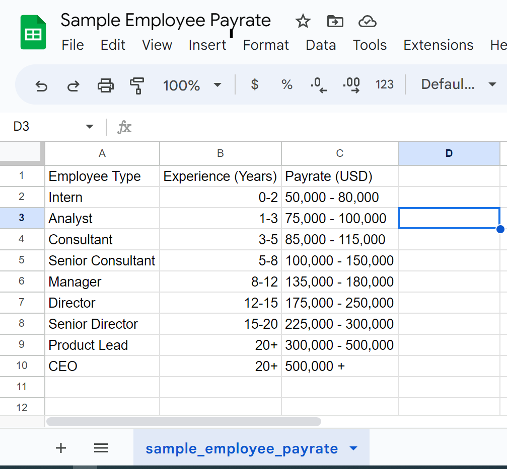

## 前提条件

import ClearscapeDocsNote from '../_partials/vantage_clearscape_analytics.mdx'

* Teradata Vantage インスタンスへのアクセス。これは、Airbyte 接続の宛先として定義されます。Airbyte の構成には、データベース `Host`、 `Username`、 `Password` が必要です。
        <ClearscapeDocsNote />

* [個人または組織のアカウントで Google Cloud Platform API が有効になっている](https://support.google.com/googleapi/answer/6158841?hl=en)OAuth またはサービス アカウント キー認証システムを使用して Google アカウントを認証する必要があります。この例では、サービス アカウント キー認証システムを使用します。

* ソース システムからのデータ。この場合は [Google スプレッドシートのサンプル スプレッドシート](https://docs.google.com/spreadsheets/d/1XNBYUw3p7xG6ptfwjChqZ-dNXbTuVwPi7ToQfYKgJIE/edit)を使用します。サンプル データは、従業員タイプ別の給与率の内訳です。

### Airbyte Cloud
*  [Airbyte Cloud](https://airbyte.com) でアカウントを作成し、 [Airbyteの構成](#airbyte-configuration) セクションの指示に進んでください。

### Airbyte Open Source
*  [Airbyte Open Source](https://github.com/airbytehq/airbyte) をローカルで実行するには、Docker Compose をインストールします。Docker Compose は Docker Desktop に付属しています。詳細については、 [docker ドキュメント](https://docs.docker.com/compose/install) を参照してください。 

* Airbyte Open Source リポジトリのクローンを作成し、airbyte ディレクトリに移動します。

        ``` bash
        git clone --depth 1 https://github.com/airbytehq/airbyte.git
        cd airbyte
        ```

シェルスクリプト`run-ab-platform`を実行する前に、Docker Desktopが実行されていることを確認します。

* シェルスクリプト `run-ab-platform` を次のように実行しますを実行します。


        ``` bash
        ./run-ab-platform.sh
        ```


        :::note
        上記のコマンドは、Windows の `git bash` で実行できます。詳細については、[Airbyte ローカル展開](https://docs.airbyte.com/deploying-airbyte/local-deployment) を参照してください。
        :::

* リポジトリに含まれる `.env` ファイルにあるデフォルトの資格情報を入力して、Web アプリ http://localhost:8000/ にログインします。


        ``` bash
        BASIC_AUTH_USERNAME=airbyte
        BASIC_AUTH_PASSWORD=password
        ```


初めてログインする場合、Airbyte は電子メール アドレスの入力と製品の改善に関する設定の指定を求めます。設定を入力して、「開始」をクリックします。

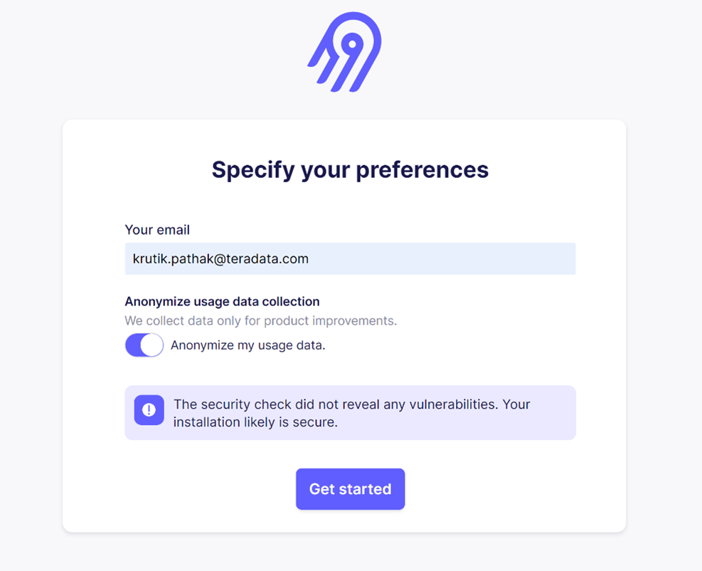

Airbyte Open Source を起動すると、接続ダッシュボードが表示されます。Airbyte Open Source を初めて起動した場合は、接続は表示されません。

## Airbyteの構成

### ソース接続の設定
* 「Create your first connection」をクリックするか、右上隅をクリックして、Airbyte の接続ダッシュボードで新しい接続ワークフローを開始できます。

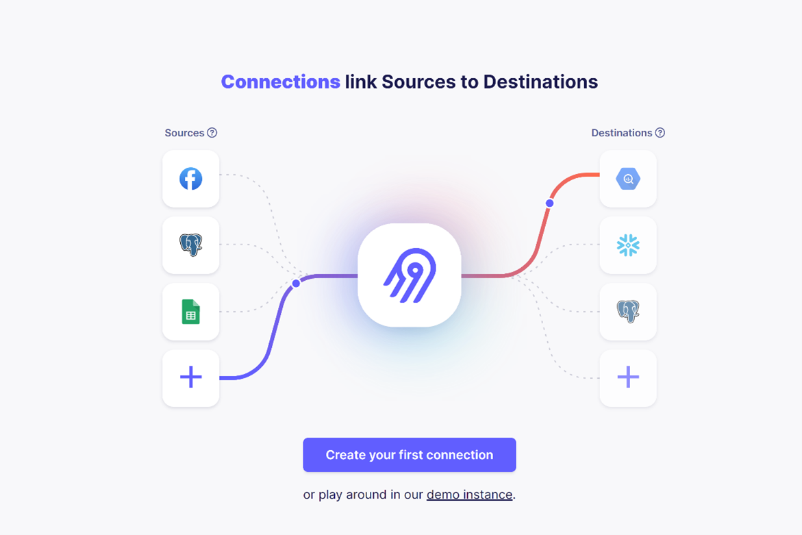

* Airbyte はソースを尋ねます。既存のソースから選択することも (すでに設定している場合)、新しいソースを設定することもできます。この場合は `Google Sheets` を選択します。

* 認証には、JSON 形式のサービス アカウント キーを使用する `Service Account Key Authentication` を使用します。デフォルトの `OAuth` から `Service Account Key Authentication`に切り替えます。サービス アカウント キー認証で Google アカウントを認証するには、JSON 形式で [Google Cloud サービス アカウント キー](https://cloud.google.com/iam/docs/keys-create-delete#creating_service_account_keys) を入力します。+
サービス アカウントにプロジェクト閲覧者権限があることを確認してください。リンクを持つすべてのユーザーがスプレッドシートを表示できる場合は、これ以上の操作は必要ありません。そうでない場合は、 [サービスアカウントにスプレッドシートへのアクセス権を付与する](https://www.youtube.com/watch?v=GyomEw5a2NQ)。

* ソーススプレッドシートへのリンクを `Spreadsheet Link` として追加します。


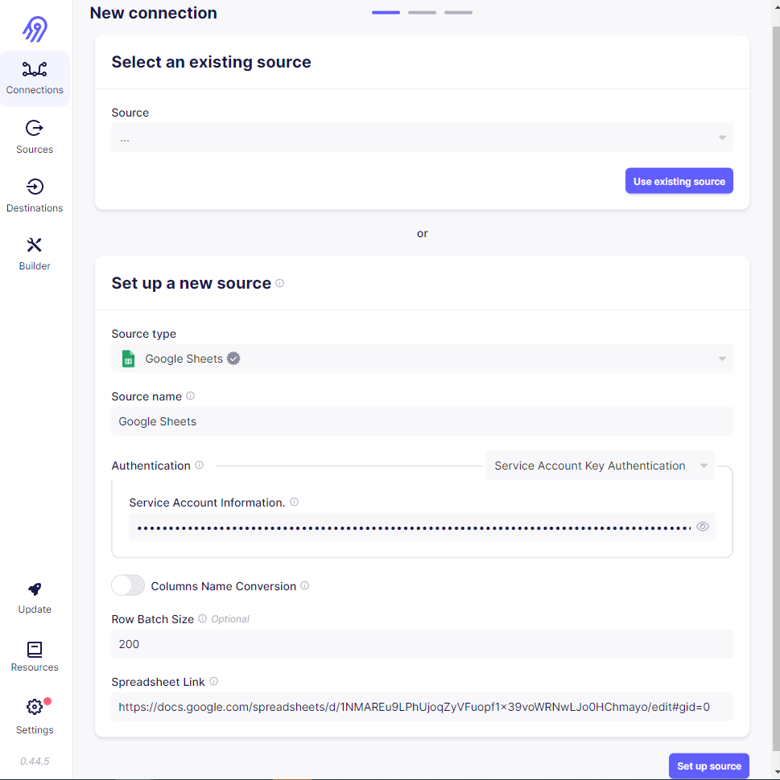

:::note
詳細については、 [Airbyte Open Source で Google スプレッドシートをソース コネクタとして設定する](https://docs.airbyte.com/integrations/sources/google-sheets/#:~:text=For%20Airbyte%20Open%20Source%3A)を参照してください。 
:::

* [Set up source]をクリックし、設定が正しければ、次のメッセージが表示されます。 `All connection tests passed!`


### 宛先接続の設定
*  `Teradata Vantage` を使用して新しい接続を作成する場合は、「Set up the destination」セクションで宛先型として  `Teradata Vantage` を選択します。
* `Host`、`User`、`Password` を追加します。これらは、Clearscape Analytics Environmentで使用される `Host`、`Username`、`Password` とそれぞれ同じです。 
* 特定のコンテキストに適したデフォルトのスキーマ名を指定します。ここでは `gsheet_airbyte_td`を指定しています。

:::note
 `Default Schema`を指定しないと、「スキーマの作成中にコネクタが失敗しました」というエラーが表示されます。 `Default Schema`に適切な名前を指定してください。
:::


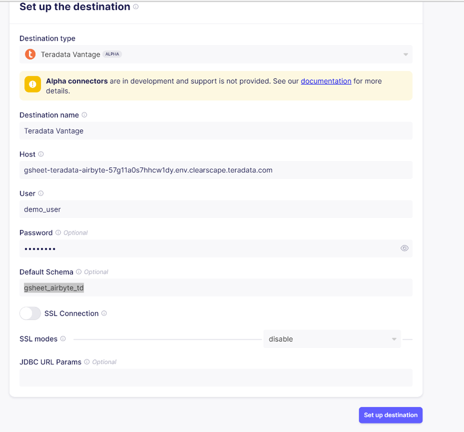


* 「Set up destination」をクリックします。構成が正しい場合は、メッセージが表示されます。 `All connection tests passed!`


:::note
構成チェック失敗エラーが発生する可能性があります。Airbyte 経由で接続する前に、Teradata Vantage インスタンスが正しく実行されていることを確認してください。 
:::

### データ同期の設定
名前空間はストリームのグループです [名前空間は、ソースまたは宛先のデータベース (テーブルなど) のことです。リレーショナル データベース システムのスキーマは、名前空間の一例です。ソースでは、名前空間はデータが宛先にレプリケートされる場所です。宛先では、名前空間はレプリケートされたデータが宛先に格納される場所です。
詳細については 、以下を参照してください。 [Airbyte 名前空間](https://docs.airbyte.com/understanding-airbyte/namespaces)

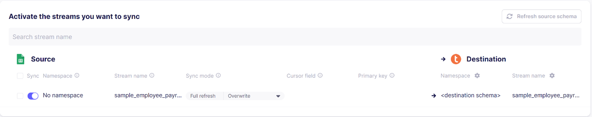


この例では、宛先はデータベースなので、名前空間は宛先を構成するときに定義したデフォルトのスキーマ `gsheet_airbyte_td` です。ストリーム名は、ソースのスプレッドシートの名前をミラーリングするテーブルで、この場合は `sample_employee_payrate` です。単一のスプレッドシート コネクタを使用しているため、サポートされるストリームは 1 つだけです (アクティブなスプレッドシート)。 

他のタイプのソースと宛先では、レイアウトが異なる場合があります。この例では、ソースとしての Google スプレッドシートは名前空間をサポートしていません。この例では、宛先の名前空間として `<destination schema>` を使用しています。これは、宛先設定で宣言した `Default Schema` に基づいて Airbyte によって割り当てられたデフォルトの名前空間です。データベース `gsheet_airbyte_td` は、Teradata Vantage インスタンスに作成されます。

:::note
ここでは、Airbyte で使用されている用語である「スキーマ」という用語を使用します。Teradata のコンテキストでは、「データベース」という用語が同等です。
:::

#### レプリケーション頻度
データが宛先に同期される頻度を示します。1 時間ごと、2 時間ごと、3 時間ごとなどを選択できます。この例では、24 時間ごとを使用しました。 

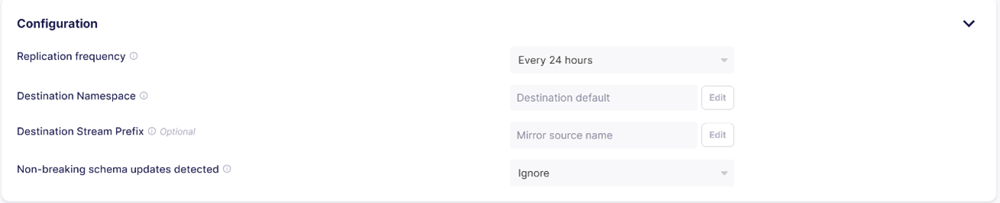

Cron 式を使用して、同期を実行する時間を指定することもできます。以下の例では、毎週水曜日の午後 12 時 43 分 (米国太平洋標準時) に同期を実行するように Cron 式を設定しています。

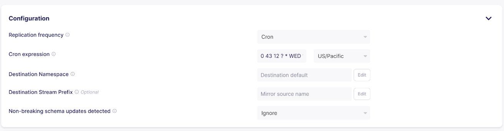

### データ同期の妥当性検査

Airbyte は、`Status` タブの [Sync History] セクションで同期の試行を追跡します。 

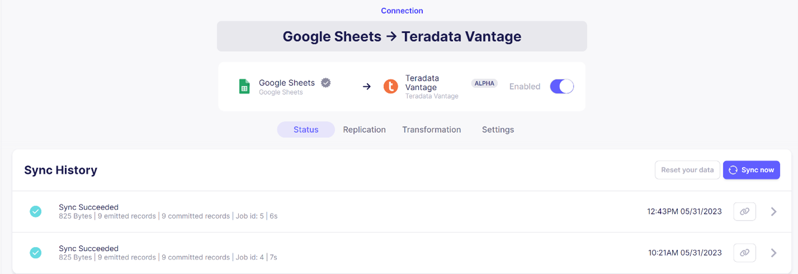

次に、 [ClearScape Analytics Experience](https://clearscape.teradata.com/dashboard) に移動しで Jupyter Notebookを実行します。ClearScape Analytics Experience のNotebookは Teradata SQL クエリーを実行するように構成されており、データベース `gsheet_airbyte_td`、ストリーム (テーブル)、および完全なデータが存在するかどうかを検証します。

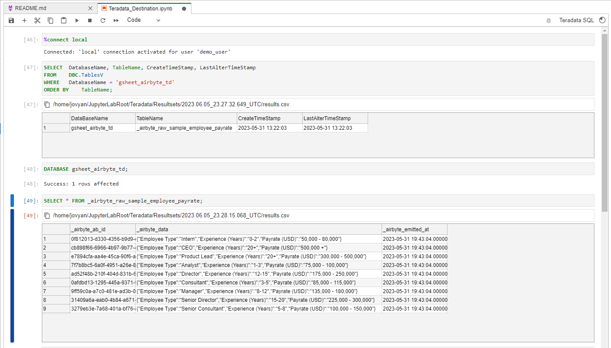

``` bash
%connect local 
```

``` bash , id="airbyte_select_query", role="emits-gtm-events"
SELECT  DatabaseName, TableName, CreateTimeStamp, LastAlterTimeStamp
FROM    DBC.TablesV
WHERE   DatabaseName = 'gsheet_airbyte_td'
ORDER BY    TableName;
```

``` bash
DATABASE gsheet_airbyte_td; 
```

``` bash
SELECT * FROM _airbyte_raw_sample_employee_payrate;  
```

この接続では正規化と変換がサポートされていないため、宛先のストリーム (テーブル) 名には `\_airbyte_raw_`[生のテーブルしかありません](https://docs.airbyte.com/understanding-airbyte/namespaces/#:~:text=If%20you%20don%27t%20enable%20basic%20normalization%2C%20you%20will%20only%20receive%20the%20raw%20tables)がプレフィックスとして付きます。各ストリーム (テーブル) には 3 つの列が含まれます。 

1. `_airbyte_ab_id`: 処理される各イベントにAirbyteによって割り当てられたuuid。Teradataの列タイプは `VARCHAR(256)`です。

2. `_airbyte_emitted_at`: イベントがデータ ソースから取得された時刻を表すタイムスタンプ。Teradata の列タイプは `TIMESTAMP(6)`です。

3. `_airbyte_data`: イベント データを表す JSON BLOB。Teradata の列タイプは `JSON`です。

`_airbyte_data`カラムには、ソースのGoogle スプレッドシートと同じ9行が表示され、データはJSON形式で、必要に応じてさらに変換できる。

### 接続を閉じて削除する

* Airbyte で接続を無効にすると、接続を閉じることができます。これにより、データ同期プロセスが停止します。

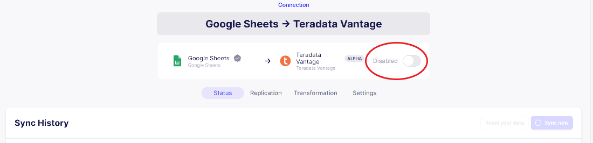

* 接続を削除することもできます。

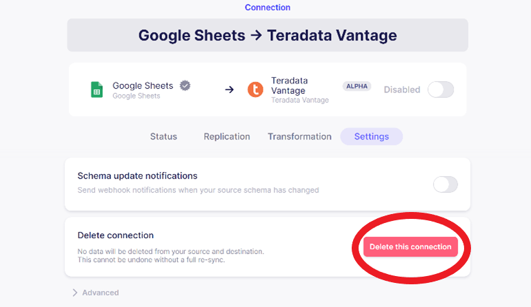


### まとめ
このチュートリアルでは、Google スプレッドシートなどのソース システムからデータを抽出し、Airbyte ELT ツールを使用してデータを Teradata Vantage インスタンスにロードする方法を説明しました。エンドツーエンドのデータ フローと、Airbyte Open Source をローカルで実行し、ソースと宛先の接続を構成するための完全な構成手順を確認しました。また、レプリケーション頻度に基づいて利用可能なデータ同期構成についても説明しました。Cloudscape Analytics Experience を使用して宛先で結果を検証し、最後に Airbyte 接続を一時停止および削除する方法を確認しました。 

### さらに詳しく
[Teradata 宛先 | Airbyte ドキュメント](https://docs.airbyte.com/integrations/destinations/teradata/?_ga=2.156631291.1502936448.1684794236-1752661382.1684794236)

[コアコンセプト | Airbyte ドキュメント](https://docs.airbyte.com/cloud/core-concepts/#connection-sync-modes)

[Airbyte コミュニティ Slack](https://airbyte.com/community)

[Airbyteコミュニティ](https://discuss.airbyte.io)

