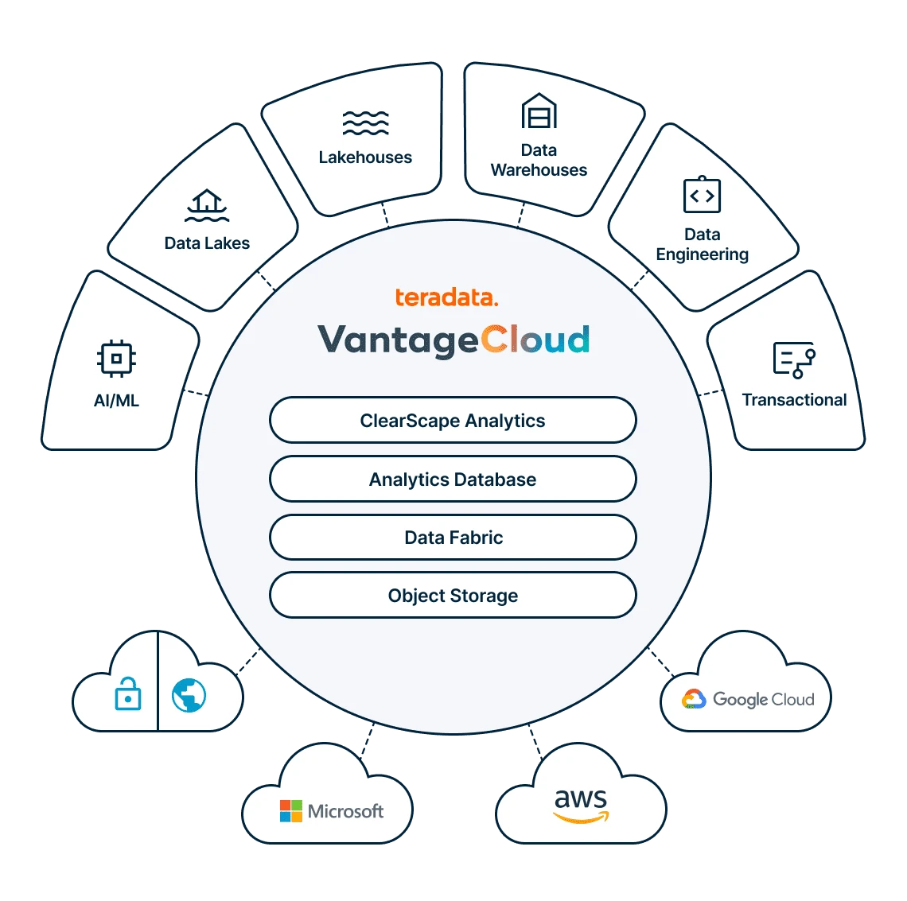
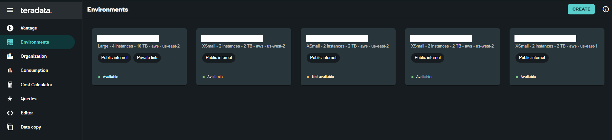
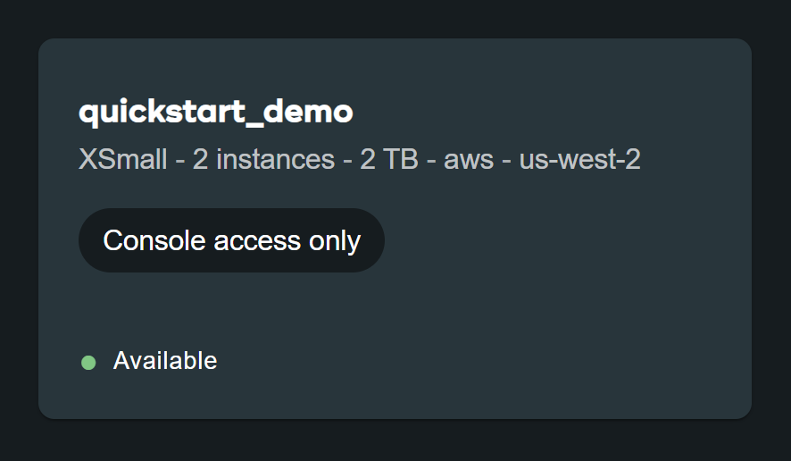

# VantageCloud Lake の使用を開始する 

## 概要

Teradata VantageCloud Lake は、Teradata の次世代クラウドネイティブ分析およびデータ プラットフォームです。オブジェクト ストレージ中心の設計を使用して、独立した柔軟なワークロードを実行する機能とともに、レイクハウスデプロイパターンを提供します。 

これにより、組織はデータを解放し、分析を有効にして、価値を加速することができます。お客様は、ワークロード要件に最適な特別に構成されたコンピューティング クラスター リソースを使用して、分析環境を最適化できます。 




VantageCloud Lake は、クラウド ソリューションに期待されるすべてのメリットに加え、業界をリードする Analytics Database、ClearScape Analytics、QueryGrid データ ファブリックなどの Teradata の差別化されたテクノロジー スタックを提供します。

## VantageCloud Lake へのサインオン

:::important
VantageCloud Lake のサインオン リンクと資格情報を取得するには、[お問い合わせフォーム](https://www.teradata.com/about-us/contact)に記入して Teradata チームに連絡してください。   
:::

Teradataが提供するURL(**_ourcompany.innovationlabs.teradata.com_**など)に移動し、サインオンします。

* 既存の顧客は、組織管理者のユーザー名 (電子メール アドレス) とパスワードを使用してサインオンできます。
* 新しい顧客は、組織管理者のユーザー名 (ウェルカム レターから: 電子メール アドレス) と作成したパスワードを使用してサインオンできます。 

:::note
 [ここ](https://login.customer.teradata.com/ext/pwdreset/Identify?AdapterId=CDSCustomer)をクリックして、組織の管理者パスワードをリセットします。
:::


サインオンすると、VantageCloud Lakeのようこそページに移動します。


ようこそページにはナビゲーション メニューがあり、環境を完全に制御できるだけでなく、さまざまな必要なツールも提供されます。


* Vantage-VantageCloud Lakeポータルのホームページ
* [環境](https://docs.teradata.com/r/Teradata-VantageCloud-Lake/Getting-Started-First-Sign-On-by-Organization-Admin/Step-1-Signing-On-and-Creating-Your-First-Environment) - 環境を作成し、作成されたすべての環境を確認する
* [組織](https://docs.teradata.com/r/Teradata-VantageCloud-Lake/Introduction-to-VantageCloud-Lake/VantageCloud-Lake-Organizations-and-Environments) - 組織の構成の表示、組織管理者の管理、アカウントの構成とステータスを表示する
* [消費](https://docs.teradata.com/r/Teradata-VantageCloud-Lake/Managing-Compute-Resources/Review-Consumption-Usage) - 組織がコンピューティングリソースとストレージリソースをどのように消費しているかを監視する
* [コスト計算ツール](https://docs.teradata.com/r/Teradata-VantageCloud-Lake/Managing-Consumption/Using-the-Consumption-Estimates) - 環境と組織全体のコストと消費量を計算する。 
* [クエリー](https://docs.teradata.com/r/Teradata-VantageCloud-Lake/Running-and-Monitoring-Queries/Monitoring-and-Managing-Queries) - 環境のクエリーを検査して、その効率を理解する。
* [エディタ](https://docs.teradata.com/r/Teradata-VantageCloud-Lake/Running-and-Monitoring-Queries) -エディタでクエリーを作成して実行する。  
* [データコピー](https://docs.teradata.com/r/Teradata-VantageCloud-Lake/Data-Copy) - VantageCloud Lake コンソールからデータ コピー (Data Mover とも呼ばれる) ジョブをプロビジョニング、構成、実行しする。


## 環境を作成する
プライマリ クラスター環境を作成するには、ナビゲーション メニューの [環境] をクリックします。新しく開いたビューで、ページの右上にある [作成] ボタンをクリックします。



### 環境の構成

環境の構成フィールドに入力します。


| **アイテム**           | **説明**                                                                 |
|--------------------|---------------------------------------------------------------------------------|
| *環境名* | 新しい環境の文脈名                                           |
| *Region*           | 利用可能なリージョン リストは、販売プロセス中に事前に決定されます。            |
| *パッケージ*          | 選択可能な DOS サービス パッケージは次のとおりです。                         |
|                    | - Lake: プレミア 24x7 クラウドサポート                                                |
|                    | - Lake: プレミア 24x7 優先クラウドサポート + 業界データモデル               |


:::important
**推定消費量** (右側)は、環境作成のためのガイダンスを提供します。詳細については、[消費量推定値の使用](https://docs.teradata.com/r/Teradata-VantageCloud-Lake/Managing-Consumption/Using-the-Consumption-Estimates)を参照してください。   
:::

### プライマリ クラスタの構成

プライマリ クラスタの構成フィールドに入力します。


```mdx-code-block

<table>
  <thead>
    <tr>
      <th>Item</th>
      <th>Description</th>
    </tr>
  </thead>
  <tbody>
    <tr>
      <td><em>Instance size</em></td>
      <td>
        Select an instance size suitable for your use-case:<br />
        <strong>Lake</strong>
        <table>
          <thead>
            <tr>
              <th>Size</th>
              <th>Value (in units)</th>
            </tr>
          </thead>
          <tbody>
            <tr>
              <td>XSmall</td>
              <td>2</td>
            </tr>
            <tr>
              <td>Small</td>
              <td>4</td>
            </tr>
            <tr>
              <td>Medium</td>
              <td>7</td>
            </tr>
            <tr>
              <td>Large</td>
              <td>10</td>
            </tr>
            <tr>
              <td>XLarge</td>
              <td>13</td>
            </tr>
            <tr>
              <td>2XLarge</td>
              <td>20</td>
            </tr>
            <tr>
              <td>3XLarge</td>
              <td>27</td>
            </tr>
          </tbody>
        </table>
        <strong>Lake+</strong>
        <table>
          <thead>
            <tr>
              <th>Size</th>
              <th>Value (in units)</th>
            </tr>
          </thead>
          <tbody>
            <tr>
              <td>XSmall</td>
              <td>2.4</td>
            </tr>
            <tr>
              <td>Small</td>
              <td>4.8</td>
            </tr>
            <tr>
              <td>Medium</td>
              <td>8.4</td>
            </tr>
            <tr>
              <td>Large</td>
              <td>12</td>
            </tr>
            <tr>
              <td>XLarge</td>
              <td>15.6</td>
            </tr>
            <tr>
              <td>2XLarge</td>
              <td>24</td>
            </tr>
            <tr>
              <td>3XLarge</td>
              <td>32.4</td>
            </tr>
          </tbody>
        </table>
      </td>
    </tr>
    <tr>
      <td><em>Instance count</em></td>
      <td>2 to 64<br />Number of nodes in the primary clusters</td>
    </tr>
    <tr>
      <td><em>Instance storage</em></td>
      <td>1 to 72TB per instance</td>
    </tr>
  </tbody>
</table>


```


### データベースの認証情報

データベースの認証情報フィールドに入力します。

| **アイテム**           | **説明**                                                                 |
|--------------------|---------------------------------------------------------------------------------|
| DBCパスワード | Teradata Vantage 環境の主な管理アカウントは「dbc」と呼ばれます。Linux のルート ユーザーと同様に、dbc アカウントには包括的な管理権限があります。環境の作成後は、日常的なタスク用に追加の管理ユーザーを設定し、dbc 資格情報の共有や利用は控えることをお勧めします。 |

dbc のパスワードを設定します。 
* 8文字から64文字まで 
* 英数字と特殊文字の両方を使用できます 
* ディクショナに載っている単語がない 


### 詳細オプション

すぐに開始するには、**デフォルトを使用する** を選択するか、追加のオプション設定を定義することができる。


```mdx-code-block
| *Item*           |Description*                                                                                   |
|-------------|---------------------------------------------------------------------------------------------------|
| AMPs per instance       | Workload management + Select the number of AMPs per instance for the instance size you selected. |
| AWS: Storage encryption | Configure encryption for customer data. See [Finding the key ID and key ARN](https://docs.aws.amazon.com/kms/latest/developerguide/find-cmk-id-arn.html) <br/> <ul><li>Managed by Teradata</li><li>Customer managed</li><li>Key Alias ARN</li></ul>  |

```


すべての情報を確認し、**CREATE ENVIRONMENT** ボタンをクリックします。


デプロイには数分かかります。完了すると、作成された環境が**環境**セクションにカード ビューとして表示されます (環境の名前は quickstart_demo です)。 



## パブリック インターネットからのアクセス環境

作成された環境にはコンソールからのみアクセスできます。これを変更するには、作成された環境をクリックして *SETTINGS* タブに移動します。


**設定** で **インターネット接続** チェックボックスをオンにし、環境へのアクセスに使用する IP アドレスを CIDR 形式で指定します (たとえば、192.168.2.0/24 は 192.168.2.0 から 192.168.2.255 の範囲内のすべての IP アドレスを指定します) 

:::note
インターネット接続の設定の詳細については、[こちら](https://docs.teradata.com/r/Teradata-VantageCloud-Lake/Getting-Started-First-Sign-On-by-Organization-Admin/Step-2-Setting-the-Environment-Connection-Type/Setting-Up-an-Internet-Connection) をご覧ください。
:::


ページの右上にある **保存** ボタンをクリックして、変更を確認します。 

 **環境** セクションに戻り、環境カードを確認してください。これで **Public internet** アクセス権が付与されます。


## まとめ

このクイック スタートでは、VantageCloud Lake に環境を作成し、パブリック インターネットからアクセスできるようにする方法を学びました。

## さらに詳しく

* [Teradata VantageCloud Lakeのドキュメント](https://docs.teradata.com/r/Teradata-VantageCloud-Lake/Getting-Started-First-Sign-On-by-Organization-Admin)