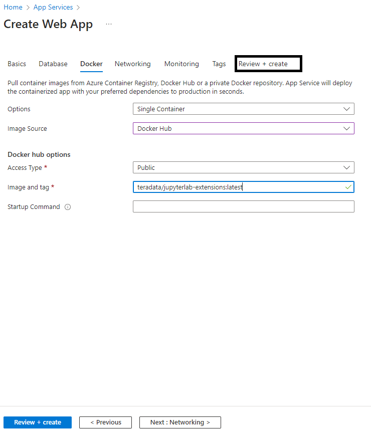
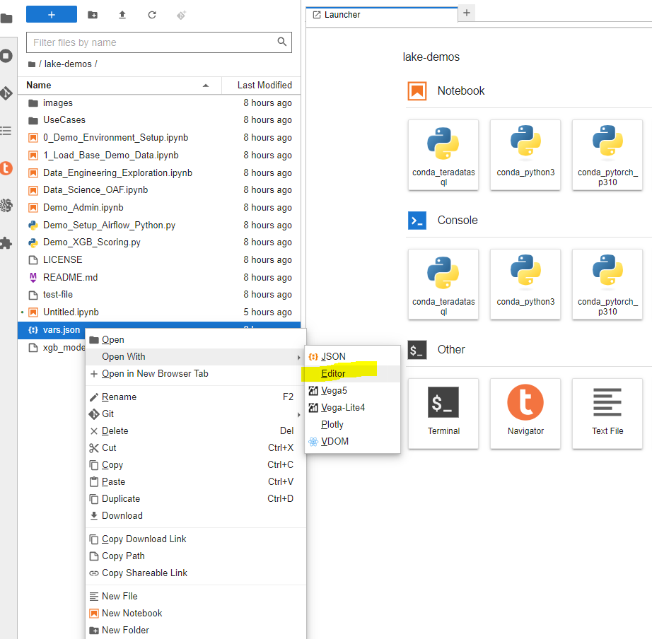

import VantageCloudLakeRequest from './_partials/vantagecloud-lake-request.md';

# Microsoft AzureでVantageCloud LakeのTeradata Jupyter Notebookデモを実行する方法


## 概要
このクイックスタートでは、Microsoft Azure で [VantageCloud Lake の Jupyter Notebook デモ](https://github.com/Teradata/lake-demos)を実行するプロセスについて詳しく説明します。

## 前提条件
* Microsoft Azure アカウントへのアクセス
* VantageCloud Lake環境へのアクセス
        <VantageCloudLakeRequest />

## Microsoft Azure のセットアップ
このセクションでは、以下の各手順について詳しく説明します。

* Teradata Jupyter Lab の拡張機能の Docker イメージに基づいて Microsoft Azure Web アプリを作成する
* Jupyter Lab の拡張機能の Azure Web アプリを構成する
* VantageCloud LakeのデモをJupyter Labの拡張機能であるAzure Web Appにロードする
* Jupyter Lab の拡張機能 Azure Web アプリの IP を確認する

### Teradata Jupyter Labの拡張Dockerイメージに基づいてMicrosoft Azure Web Appを作成する
* Microsoft Azureにログインし、「APPサービス」をクリックします。
        

* 「App Services」で「Webアプリ」をクリックする
        

* 「Basics」タブで、次の操作を行います。
    * ドロップダウンから適切なリソース グループを選択するか、新しいリソース グループを作成する
    * ウェブアプリの名前を入力する
    * 「Publish」ラジオボタンオプションで「Docker Container」を選択する
    * オペレーティングシステムとして「Linux」を選択します
    * ドロップダウンから適切なリージョンを選択する
    * 適切なApp Serviceプランを選択してください。まだプランがない場合は、デフォルトの構成で新しいプランが作成されます。

    :::tip
    VantageCloud Lake デモの目的では、冗長性は必要ありません
    :::
    
    * このタブを完了したら、「Docker」タブをクリックして続行する
    

* 「Docker」タブで、次の操作を行う
    * ドロップダウンから「Single Container」を選択する
    * 「Image Source」ドロップダウンで「Docker Hub」を選択する
    * 「Access Type」ドロップダウンで「Public」を選択する
    * 「Image and tag」タイプにタイプする: `teradata/jupyterlab-extensions:latest`
    :::tip
    この App Service には起動コマンドは必要ありません
    :::
    * 「Review + Create」タブを選択して続行する
    
    * 「Review + Create」タブで、「Create」ボタンをクリックする
    
    * デプロイが完了したら、「Go to Resource」ボタンをクリックしする
    

### Jupyter Lab の拡張 Azure Web Appを設定する
* 右側のパネルで「Configuration」を選択する
        

* 次のアプリケーション設定を追加します
        | **アプリケーション設定** | **値** |
        |--------------|-----------|
        | **"accept_license"**     | Y |
        | **"WEBSITES_PORT"**  | 8888 |
        | **"JUPYTER_TOKEN"**      | 使用するJupyter Labアクセストークンを定義します。 |

        :::info
        「JUPYTER_TOKEN」構成を含めない場合、コンテナは新しいトークンを生成し、それをコンソールに記録します。アプリケーション ログからそれを取得する必要があります。「JUPYTER_TOKEN」構成キーを含めて値を空白のままにすると、システムはトークンを空の文字列として設定し、トークン セキュリティのない保護されていない Jupyter Lab 環境になります。
        :::

* 保存をクリックすると、アプリが再起動される
        

* 右側のパネルの「Overview」タブに戻る

### VantageCloud LakeのデモをJupyter Lab の拡張 Azure Web Appにロードする
* デフォルトドメインをクリック
        

* Jupyter Labの開始ダイアログで、定義されたJupyterトークンを入力し、Log inをクリックする
        

* Jupyter Labコンソールでgitアイコンをクリックします
        

* 対応するフィールドに次のURIをコピーします
    * `https://github.com/Teradata/lake-demos.git`
* [Clone]をクリックする
    

* Jupyter Lab コンソールで、`lake-demos` フォルダをクリックする
    

    

### Jupyter Lab の拡張機能 Azure Web アプリの IP を確認する
* JupyterLab で、Teradata Python カーネルを含むノートブックを開き、次のコマンドを実行してノートブック インスタンスの IP アドレスを見つけます。
    ``` python , id="lakedemos_azure_first_config", role="emits-gtm-events, content-editable"
    import requests
    def get_public_ip():
        try:
            response = requests.get('https://api.ipify.org')
            return response.text
        except requests.RequestException as e:
            return "Error: " + str(e)
    my_public_ip = get_public_ip()
    print("My Public IP is:", my_public_ip)
    ```

* 次のステップでは、VantageCloud Lake 環境でこの IP をホワイトリストに登録して、接続を許可する
* これはこのガイドとノートブックのデモの目的のためであり、実稼働環境ではより堅牢なネットワーク設定が必要になる場合があります。
* Azure App Service は、サービスが公開する可能性のあるすべての IP アドレスのリストも提供します。これは概要タブの下にあります。
    

## VantageCloud Lakeの構成
* VantageCloud Lake 環境の設定で、ノートブック インスタンスの IP を追加する
    :::tip
    Lake環境は複数のアドレスのホワイトリストをサポートします
    :::

    

## VantageCloud Lake の Jupyter Notebook デモ

### 構成
* [vars.json](https://github.com/Teradata/lake-demos/blob/main/vars.json) は、VantageCloud Lake 環境の構成に一致するように編集する必要がある 
    

* 特に次の値を追加する必要があります 
    | **変数** | **値** |
    |--------------|-----------|
    | **"host"**     | VantageCloud Lake 環境からの Public IP値 |
    | **"UES_URI"**  | VantageCloud Lake 環境からの Open Analytics |
    | **"dbc"**      | VantageCloud Lake 環境のマスター パスワード |

* サンプル vars.json では、すべてのユーザーのパスワードがデフォルトで「password」に設定されていることがわかります。これは説明を目的としたものであり、これらのパスワード フィールドをすべて強力なパスワードに変更し、必要に応じて保護し、次の手順を実行する必要があります。 その他のパスワード管理のベスト プラクティス。
    :::info
    vars.json ファイル内のすべてのパスワードを忘れずに変更してください。
    :::

## デモを実行する
環境を設定するには、*0_Demo_Environment_Setup.ipynb*内のすべてのセルを開いて実行します。続いて*1_Demo_Setup_Base_Data.ipynb*を実行して、デモに必要な基本データを読み込みます。

デモノートブックの詳細については、GitHub の [Teradata Lake デモ](https://github.com/Teradata/lake-demos) ページをご覧ください。

## まとめ

このクイック スタートでは、Microsoft Azure で VantageCloud Lake の Jupyter ノートブック デモを実行する方法を学びました。

## さらに詳しく

* [Teradata VantageCloud Lakeのドキュメント](https://docs.teradata.com/r/Teradata-VantageCloud-Lake/Getting-Started-First-Sign-On-by-Organization-Admin)
* [Jupyter NotebookからVantageを利用する方法](../analyze-data/jupyter.md)