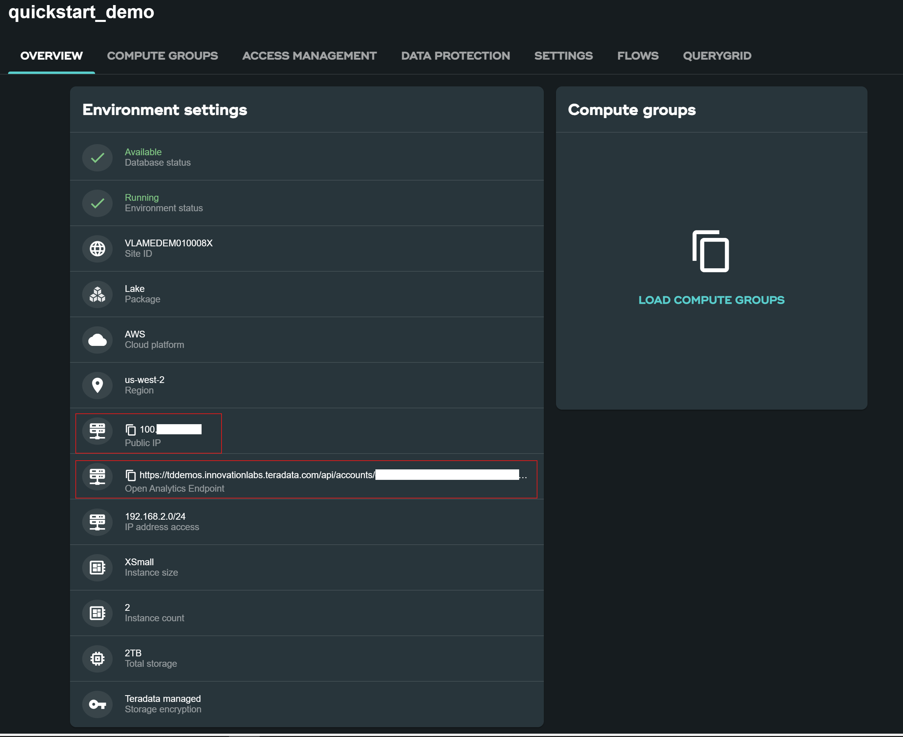
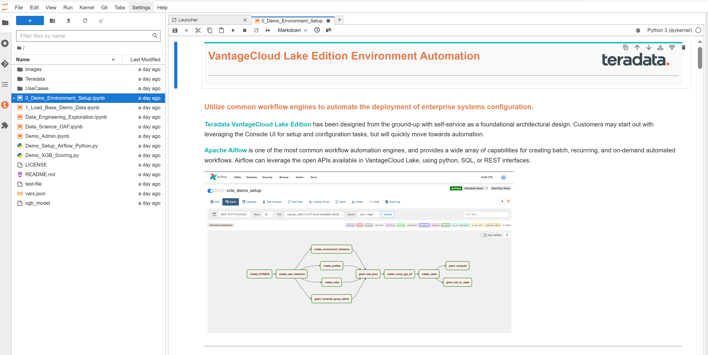

import Tabs from '../_partials/tabsJupyterNotebook.mdx';

# Docker で VantageCloud Lake の Teradata Jupyter Notebook デモを実行する

## 概要
このハウツーでは、Teradata VantageCloud Lake に接続し、Docker の Jupyter ノートブックからデモを実行する手順を説明します。 

## 前提条件
* インストールされた[Dockerデスクトップ](https://www.docker.com/products/docker-desktop)
* インストールされた[Git](https://git-scm.com/book/en/v2/Getting-Started-Installing-Git)
    * https://github.com/Teradata/lake-demos.git から git リポジトリをダウンロードする必要があります
* Teradata VantageCloud Lakeアカウント ログイン
    * Teradata のウェルカム レターにある組織の URL とログインの詳細
* お好みのIDE

## VantageCloud Lake 環境を作成する
 [VantageCloud Lake の始め方](./getting-started-with-vantagecloud-lake.md) の指示に従って独自の環境を作成してください。 

作成したら、 **SETTINGS** タブに移動し、 [環境にアクセスする](./getting-started-with-vantagecloud-lake.md#access-environment-from-public-internet)にパブリック IP アドレスを入力します。

:::note
IP アドレスは [WhatIsMyIp.com](https://www.whatismyip.com) のWeb サイトから確認できます。IPv4 アドレスをメモしてください。
:::


環境カードには「**Public internet** 」アクセスと表示されるはずです。


**OVERVIEW** タブから、コピーする。

* Public IP および 
* Open Analytics Endpoint

これらの値は、DockerからVantageCloud Lakeにアクセスするために必要です。



## VantageCloud Lakeデモリポジトリのクローンを作成する
ローカル マシンで VantageCloud Lake デモ リポジトリのクローンを作成します。

``` bash
git clone https://github.com/Teradata/lake-demos.git
cd lake-demos
```

リポジトリにはさまざまなファイルとフォルダーが含まれています。重要なものは次のとおりです。

* Jupyter Notebook
    * [0_Demo_Environment_Setup.ipynb](https://github.com/Teradata/lake-demos/blob/main/0_Demo_Environment_Setup.ipynb)
    * [1_Load_Base_Demo_Data.ipynb](https://github.com/Teradata/lake-demos/blob/main/1_Load_Base_Demo_Data.ipynb)
    * [Data_Engineering_Exploration.ipynb](https://github.com/Teradata/lake-demos/blob/main/Data_Engineering_Exploration.ipynb)
    * [Data_Engineering_Exploration.ipynb](https://github.com/Teradata/lake-demos/blob/main/Data_Science_OAF.ipynb)
    * [Demo_Admin.ipynb](https://github.com/Teradata/lake-demos/blob/main/Demo_Admin.ipynb)
* [vars.json ファイル](https://github.com/Teradata/lake-demos/blob/main/vars.json)

## vars.json ファイルを編集する
Jupyter NotebookをVantageCloud Lakeに接続するには、 [vars.json ファイル](https://github.com/Teradata/lake-demos/blob/main/vars.json) を編集して、次の情報を提供する必要があります。


| **変数** | **値** |
|--------------|-----------|
| *"host"*     | *OVERVIEW*セクションの Public IP 値(上記を参照) |
| *"UES_URI"*  | *OVERVIEW* セクションからのOpen Analytics Endpoint 値(上記を参照) |
| *dbc"*      | VantageCloud Lake 環境のマスター パスワード |


:::info
サンプルの vars.json では、すべてのユーザーのパスワードがデフォルトで「password」に設定されていますが、これは説明目的のみです。これらのパスワード フィールドをすべて強力なパスワードに変更し、必要に応じてセキュリティを確保し、その他のパスワード管理のベスト プラクティスに従う必要があります。
:::

## Docker 内でファイルをマウントする
VantageCloud Lake デモを実行するには、[Teradata Jupyter Extensions for Docker](https://hub.docker.com/r/teradata/jupyterlab-extensions) が必要です。この拡張機能は、SQL ipython カーネル、Teradata への接続を管理するユーティリティ、および Teradata データベースとの対話時の生産性を高めるデータベース オブジェクト エクスプローラを提供します。  

:::info
デモ リポジトリのクローンを作成したのと同じフォルダー内ですべてのコマンドを実行していることを確認してください。   
:::

コンテナを起動し、既存の lake-demos ディレクトリにバインドします。オペレーティング システムに応じて適切なコマンドを選択します。

:::note
Windows の場合は、PowerShell で docker コマンドを実行します。
:::

<Tabs/>


Click on the URL in docker logs to open Jupyter notebook in your browser.


## デモを実行する
 **0_Demo_Environment_Setup.ipynb** 内のすべてのセルを開いて実行して環境をセットアップし、続いて **1_Demo_Setup_Base_Data.ipynb** を実行してデモに必要な基本データをロードします。 +



デモノートブックの詳細については、GitHub の [Teradata Lake デモ](https://github.com/Teradata/lake-demos) ページをご覧ください。

## まとめ

このクイック スタートでは、Docker の Jupyter Notebook から Teradata VantageCloud Lake デモを実行する方法を学びました。

## さらに詳しく

* [Teradata VantageCloud Lakeのドキュメント](https://docs.teradata.com/r/Teradata-VantageCloud-Lake/Getting-Started-First-Sign-On-by-Organization-Admin)
* [Jupyter NotebookからVantageを利用する方法](../analyze-data/jupyter.md)
