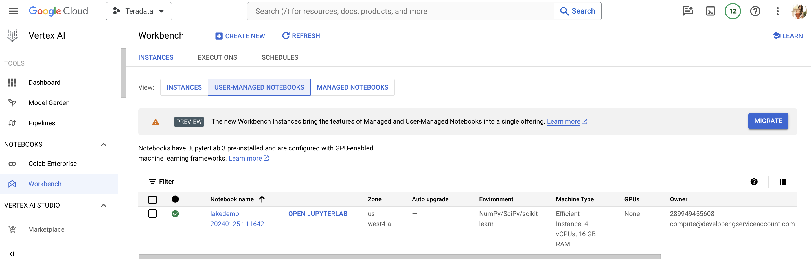
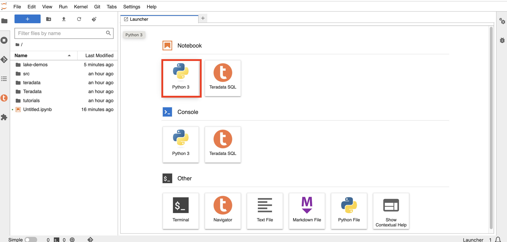

# Google Cloud Vertex AI で VantageCloud Lake の Teradata Jupyter Notebook デモを実行する方法  

## 概要
このクイックスタートでは、Google Cloud の AI/ML プラットフォームである Vertex AI で [VantageCloud Lake の Jupyter Notebook デモ](https://github.com/Teradata/lake-demos) を実行する方法について説明します。 

## 前提条件
* Teradata modules for Jupyter **Linuxデスクトップ版**(ダウンロードは [こちら](https://downloads.teradata.com/download/tools/vantage-modules-for-jupyter) 、登録が必要です)
* [Vertex AI とノートブック API](https://console.cloud.google.com/flows/enableapi?apiid=notebooks.googleapis.com,aiplatform.googleapis.com&redirect=https://console.cloud.google.com&_ga=2.180323111.284679914.1706204112-1996764819.1705688373)を有効にしたGoogle Cloudアカウント
* 起動スクリプトと Teradata Jupyter 拡張パッケージを保存するための Google クラウド ストレージ
* [VantageCloud Lake環境へのアクセス](./getting-started-with-vantagecloud-lake.md)

## Vertex AI Google Cloud環境を構築する

新しいノートブック インスタンスを作成するときに、起動スクリプトを指定できます。インスタンスの作成後に 1 回だけ実行されるこのスクリプトは、Teradata Jupyter 拡張パッケージをインストールし、GitHub リポジトリを新しいユーザー管理ノートブック インスタンスに複製します。

* Teradata Jupyter拡張パッケージをダウンロードする
    * [Vantage Modules for Jupyterページ ](https://downloads.teradata.com/download/tools/vantage-modules-for-jupyter) にアクセスする
    * サインインして、Teradata Linux バージョンのパッケージをダウンロードします。

* Google Cloud Storage Bucketを作成する 
     - プロジェクトに関連した名前でバケットを作成する(例: teradata_jupyter)でバケットを作成する。 
     - バケット名がグローバルに一意であることを確認します。たとえば、teradata_jupyter という名前がすでに使用されている場合、後続のユーザーはその名前を使用できません。 
        

* 解凍された Jupyter 拡張機能パッケージを Google Cloud Storage バケットにファイルとしてアップロードする。

* 次の起動スクリプトを作成し、`startup.sh` としてローカルマシンに保存する。 

以下は、Google Cloud Storage バケットから Teradata Jupyter 拡張機能パッケージを取得し、Teradata SQL カーネル、拡張機能をインストールし、lake-demos リポジトリのクローンを作成するスクリプトの例です。 

:::info
gsutil cp コマンドの teradata_jupyter を忘れずに置き換えてください。
:::

``` bash , id="vertex_ex_script", role="content-editable, emits-gtm-events"
#! /bin/bash

cd /home/jupyter
mkdir teradata
cd teradata
gsutil cp gs://teradata_jupyter/* .
unzip teradatasql*.zip

# Install Teradata kernel
cp teradatakernel /usr/local/bin

jupyter kernelspec install ./teradatasql --prefix=/opt/conda

# Install Teradata extensions
pip install --find-links . teradata_preferences_prebuilt
pip install --find-links . teradata_connection_manager_prebuilt
pip install --find-links . teradata_sqlhighlighter_prebuilt
pip install --find-links . teradata_resultset_renderer_prebuilt
pip install --find-links . teradata_database_explorer_prebuilt

# PIP install the Teradata Python library
pip install teradataml==17.20.00.04

# Install Teradata R library (optional, uncomment this line only if you use an environment that supports R)
#Rscript -e "install.packages('tdplyr',repos=c('https://r-repo.teradata.com','https://cloud.r-project.org'))"

# Clone the Teradata lake-demos repository
su - jupyter -c "git clone https://github.com/Teradata/lake-demos.git"
```
* このスクリプトをファイルとしてGoogle Cloudストレージバケットにアップロードします
        

### ユーザー管理ノートブック インスタンスを開始する

* Vertex AI ワークベンチにアクセスする
    - Google Cloud コンソールの Vertex AI Workbench に戻る。
    - 詳細オプションを使用するか、https://notebook.new/で直接、新しいユーザー管理ノートブックを作成する。

* Details(詳細)で、ノートブックに名前を付け、リージョンを選択して続行する。
        

* Environment(環境)で **Browse(参照)** を選択して、Google Cloud Bucketからstartup.shスクリプトを選択する。
        

* ノートブックを開始するには、[作成] を選択します。ノートブックの作成プロセスが完了するまでに数分かかる場合があります。完了したら、[JUPYTERLAB を開く] をクリックします。 
        

:::info
接続を許可するには、VantageCloud Lake 環境でこの IP をホワイトリストに登録する必要があります。このソリューションは試用環境に適しています。実稼働環境では、VPC、サブネット、セキュリティ グループの構成を構成してホワイトリストに登録する必要がある場合があります。
:::

* JupyterLab で、Python カーネルを含むノートブックを開き、次のコマンドを実行してノートブック インスタンスの IP アドレスを見つけます。
        

``` python , role="content-editable"
import requests
def get_public_ip():
    try:
        response = requests.get('https://api.ipify.org')
        return response.text
    except requests.RequestException as e:
        return "Error: " + str(e)
my_public_ip = get_public_ip()
print("My Public IP is:", my_public_ip)
```

## VantageCloud Lakeを構成する
* VantageCloud Lake環境で、[設定]の下にノートブックインスタンスのIPアドレスを追加します。
        

## vars.jsonを編集する
ノートブックの `lake-demos` ディレクトリに移動します。 
        

vars.jsonを右クリックして、エディタでファイルを開きます。 
        

*[vars.json ファイル](https://github.com/Teradata/lake-demos/blob/main/vars.json)* ファイルを編集して、デモを実行するために必要な認証情報を含める 

|**変数** | **値**|
|---------|----------|
|**"host"** | VantageCloud Lake 環境からの Public IP値 |
|**"UES_URI"**| VantageCloud Lake 環境からの Open Analytics |
|**"dbc"**| VantageCloud Lake 環境のマスター パスワード |

Public IPアドレスとOpen Analyticsエンドポイントを取得するには、次の[手順](vantagecloud-lake-demo-jupyter-docker.md#create-vantagecloud-lake-environment)に従います。


:::info
vars.json ファイルのパスワードを変更します。サンプル vars.json では、すべてのユーザーのパスワードがデフォルトで「password」に設定されていることがわかります。これはサンプル ファイルの問題にすぎず、これらのパスワードをすべて変更する必要があります。 フィールドを強力なパスワードに設定し、必要に応じて保護し、他のパスワード管理のベスト プラクティスに従ってください。
:::

## デモを実行する
環境を設定するには、*0_Demo_Environment_Setup.ipynb*内のすべてのセルを実行します。続いて**1_Demo_Setup_Base_Data.ipynb**を実行して、デモに必要な基本データを読み込みます。

デモノートブックの詳細については、GitHub の [Teradata Lake デモ](https://github.com/Teradata/lake-demos) ページをご覧ください。

## まとめ 
このクイックスタート ガイドでは、 [VantageCloud Lake の Jupyter Notebook デモ](https://github.com/Teradata/lake-demos)を実行するように Google Cloud Vertex AI Workbench Notebooks を構成しました。