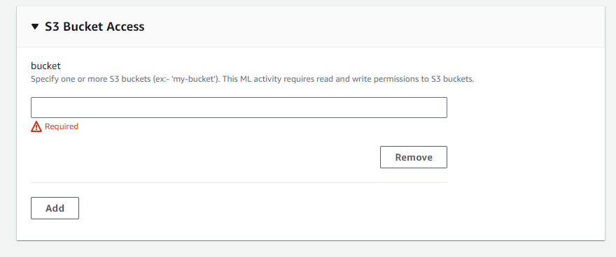
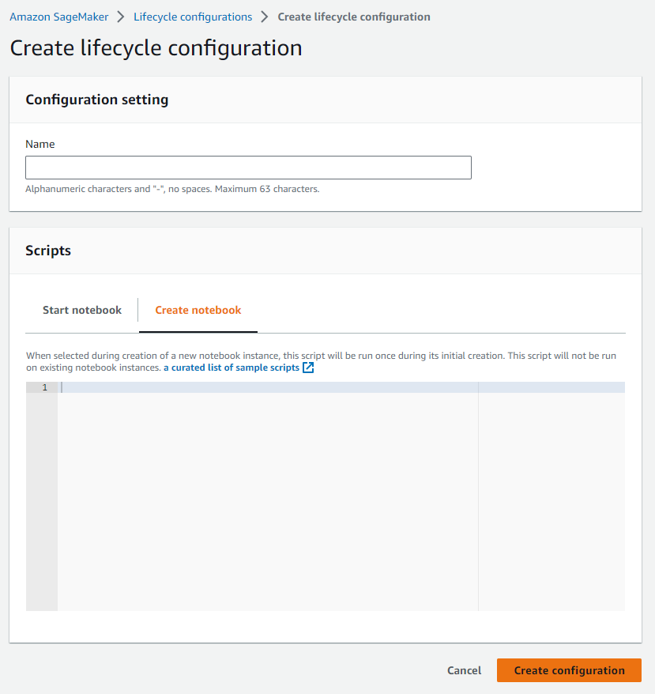
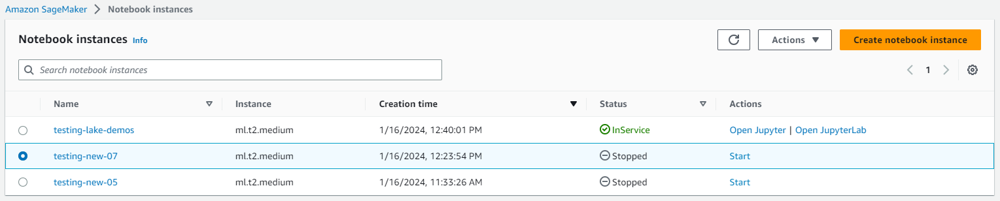
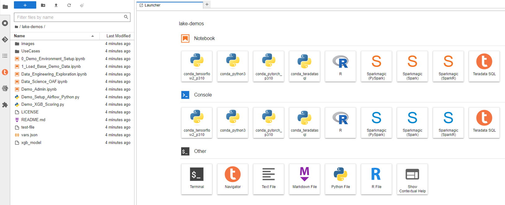

# Amazon SageMaker で VantageCloud Lake の Teradata Jupyter Notebook デモを実行する方法

## 概要
このクイックスタートでは、AWS の AI/ML プラットフォームである Amazon SageMaker で [VantageCloud Lake の Jupyter Notebook デモ](https://github.com/Teradata/lake-demos)を実行するプロセスについて詳しく説明します。

## 前提条件
* Teradata modules for Jupyter (ダウンロードは[こちら](https://downloads.teradata.com/download/tools/vantage-modules-for-jupyter)  、登録が必要です)
* S3 および SageMaker にアクセスできる AWS アカウント
* [VantageCloud Lake環境へのアクセス](./getting-started-with-vantagecloud-lake.md)

## AWS環境のセットアップ
このセクションでは、以下の各手順について詳しく説明します。

* Teradata modules for JupyterをS3バケットにアップロードする
* Jupyter ノートブック インスタンスの IAM ロールを作成する
* Jupyter ノートブック インスタンスのライフサイクル構成を作成する
* Jupyter ノートブック インスタンスを作成する
* Jupyter ノートブック インスタンスの IP CIDR を検索する

### Teradata modules for Jupyter を S3 バケットにアップロードする
* AWS S3 でバケットを作成し、割り当てられた名前を記録する
* このバケットにはデフォルトのオプションが適切です
* 作成したバケットに Jupyter 用の Teradata モジュールをアップロードする 
        

### Jupyter ノートブック インスタンスの IAM ロールを作成する
* SageMaker でロールマネージャに移動する 
        
* 新しいロールの作成する(まだ定義されていない場合)
* このガイドの目的上、作成されたロールにはデータ サイエンティストのペルソナに割り当てる 
        
* 設定に関しては、デフォルトのままにするのが適切です
* 対応する画面で、Teradata Jupyter モジュールをアップロードしたバケットを定義する
        
* 次の設定では、S3 バケットへのアクセスに対応するポリシーを追加する  
        

### Jupyter Notebooks インスタンスのライフサイクル構成を作成する
* SageMaker でライフサイクル構成に移動し、作成をクリックする 
        
* 次のスクリプトを使用してライフサイクル構成を定義する
        \* Windows 環境で作業する場合は、スクリプトをライフサイクル構成エディターに 1 行ずつコピーすることをお勧めします。コピーの問題を回避するには、エディターで各行の後に「Enter」キーを直接押します。この方法は、Windows と Linux のエンコードの違いによって発生する可能性のあるキャリッジ リターン エラーを防ぐのに役立ちます。このようなエラーは、多くの場合、「/bin/bash^M: bad interpretation」として表示され、スクリプトの実行を妨げる可能性があります。
        

    * スクリプト作成時: 

        ``` bash , id="sagemaker_first_config", role="content-editable emits-gtm-events"
        #!/bin/bash
        
        セット-e
        
        # このスクリプトは、ノートブックインスタンスのEBSボリュームにcondaのカスタム永続インストールをインストールし、
        # これらのカスタム環境は、Jupyter のカーネルとして利用できます。
        
        
        sudo -u ec2-user -i <<'EOF'
        unset SUDO_UID
        # Install a separate conda installation via Miniconda
        WORKING_DIR=/home/ec2-user/SageMaker/custom-miniconda
        mkdir -p "$WORKING_DIR"
        wget https://repo.anaconda.com/miniconda/Miniconda3-4.6.14-Linux-x86_64.sh -O "$WORKING_DIR/miniconda.sh"
        bash "$WORKING_DIR/miniconda.sh" -b -u -p "$WORKING_DIR/miniconda"
        rm -rf "$WORKING_DIR/miniconda.sh"
        # Create a custom conda environment
        source "$WORKING_DIR/miniconda/bin/activate"
        KERNEL_NAME="teradatasql"
        
        PYTHON="3.8"
        conda create --yes --name "$KERNEL_NAME" python="$PYTHON"
        conda activate "$KERNEL_NAME"
        pip install --quiet ipykernel
        
        EOF
        ```

  * スクリプトの開始時 (このスクリプトではバケットの名前を置き換え、Jupyter モジュールのバージョンを確認します)

        ``` bash , role="content-editable emits-gtm-events"
        #!/bin/bash
        
        set -e
        
        # This script installs Teradata Jupyter kernel and extensions.
        
        
        sudo -u ec2-user -i <<'EOF'
        unset SUDO_UID
        
        WORKING_DIR=/home/ec2-user/SageMaker/custom-miniconda
        
        source "$WORKING_DIR/miniconda/bin/activate" teradatasql

        # Install teradatasql, teradataml, and pandas in the teradatasql environment
        pip install teradataml
        pip install pandas

        # fetch Teradata Jupyter extensions package from S3 and unzip it
        mkdir -p "$WORKING_DIR/teradata"
        aws s3 cp s3://resources-jp-extensions/teradatasqllinux_3.4.1-d05242023.zip "$WORKING_DIR/teradata"
        cd "$WORKING_DIR/teradata"
        unzip -o teradatasqllinux_3.4.1-d05242023
        cp teradatakernel /home/ec2-user/anaconda3/condabin
        jupyter kernelspec install --user ./teradatasql
        source /home/ec2-user/anaconda3/bin/activate JupyterSystemEnv

        # Install other Teradata-related packages
        pip install teradata_connection_manager_prebuilt-3.4.1.tar.gz
        pip install teradata_database_explorer_prebuilt-3.4.1.tar.gz
        pip install teradata_preferences_prebuilt-3.4.1.tar.gz
        pip install teradata_resultset_renderer_prebuilt-3.4.1.tar.gz
        pip install teradata_sqlhighlighter_prebuilt-3.4.1.tar.gz

        conda deactivate
        EOF
        ```

### Jupyter ノートブック インスタンスを作成する
* SageMaker で、ノートブック、ノートブック インスタンスに移動し、ノートブック インスタンスを作成する
* ノートブックインスタンスの名前を選択し、サイズを定義する(デモの場合は、利用可能な小さいインスタンスで十分です)
* 追加の構成をクリックし、最近作成したライフサイクル構成を割り当てます 
        
* 追加の構成をクリックし、最近作成したライフサイクル構成を割り当てます
* 先ほど作成したIAMロールをノートブックインスタンスに割り当てる 
        

* ノートブックインスタンスのデフォルトのgithubリポジトリとして、次のリンク https://github.com/Teradata/lake-demos を貼り付けます。
        

## Jupyter ノートブック インスタンスの IP CIDR を検索する
* インスタンスが実行されたら、「JupyterLab を開く」をクリックします。 
        

        

* JupyterLab で、Teradata Python カーネルを含むノートブックを開き、次のコマンドを実行してノートブック インスタンスの IP アドレスを見つけます。
** 接続を許可するために、VantageCloud Lake 環境でこの IP をホワイトリストに登録します。
** これは、このガイドとノートブックのデモの目的のためです。実稼働環境では、VPC、サブネット、セキュリティ グループの構成を構成し、ホワイトリストに登録する必要がある場合があります。

``` python , role="content-editable"
import requests
def get_public_ip():
    try:
        response # requests.get('https://api.ipify.org')
        return response.text
    except requests.RequestException as e:
        return "Error: " + str(e)
my_public_ip = get_public_ip()
print("My Public IP is:", my_public_ip)
```

## VantageCloud Lakeを構成する
* VantageCloud Lake環境で、[設定]の下にノートブックインスタンスのIPアドレスを追加します。
        

## VantageCloud Lake の Jupyter Notebook デモ

### 構成
*  [vars.json ファイル](https://github.com/Teradata/lake-demos/blob/main/vars.json)は、VantageCloud Lake 環境の構成に一致するように編集する必要がある 
        

* 特に次の値を追加する必要があります 


        | **Variable** | **Value**|
        |--------------|----------|
        |**"host"**|Public IP value from your VantageCloud Lake environment|
        |**"UES_URI"** |Open Analytics from your VantageCloud Lake environment|
        |**"dbc"**|The master password of your VantageCloud Lake environment|


    :::info
    Remember to change all passwords in the vars.json file.
    :::

* サンプル vars.json では、すべてのユーザーのパスワードがデフォルトで「password」に設定されていることがわかります。これは説明を目的としたものであり、これらのパスワード フィールドをすべて強力なパスワードに変更し、必要に応じて保護し、次の手順を実行する必要があります。 その他のパスワード管理のベスト プラクティス。

## デモを実行する
環境を設定するには、**0_Demo_Environment_Setup.ipynb**内のすべてのセルを開いて実行します。続いて**1_Demo_Setup_Base_Data.ipynb**を実行して、デモに必要な基本データを読み込みます。

デモノートブックの詳細については、GitHub の [Teradata Lake デモ](https://github.com/Teradata/lake-demos) ページをご覧ください。

## まとめ

このクイックスタートでは、Amazon SageMaker で VantageCloud Lake の Jupyter ノートブック デモを実行する方法を学びました。

## さらに詳しく

* [Teradata VantageCloud Lakeのドキュメント](https://docs.teradata.com/r/Teradata-VantageCloud-Lake/Getting-Started-First-Sign-On-by-Organization-Admin)
* [Jupyter NotebookからVantageを利用する方法](../analyze-data/jupyter.md)