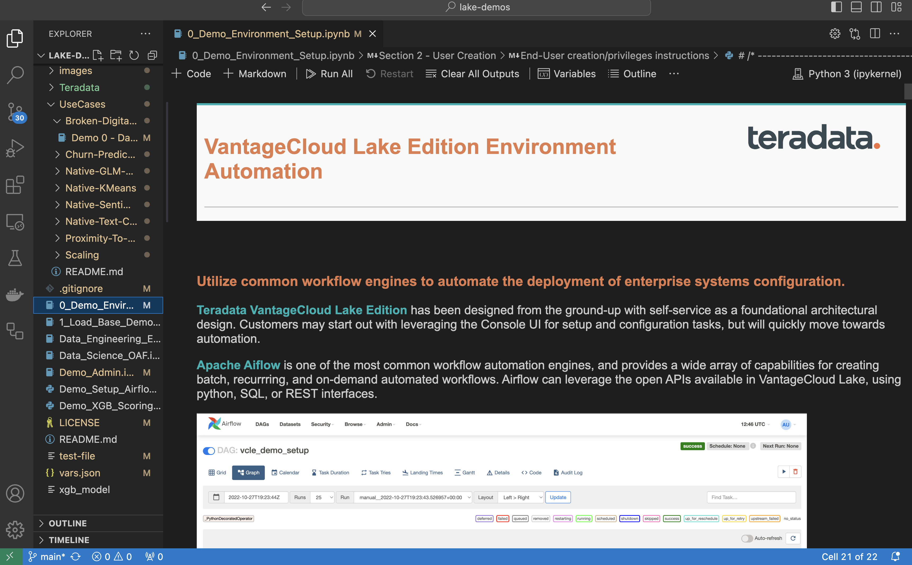
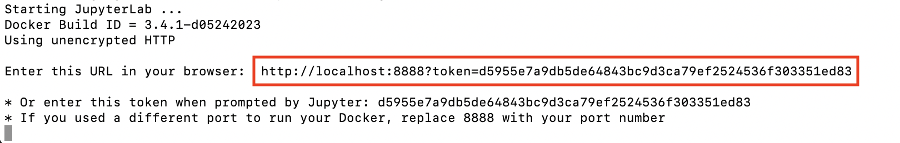
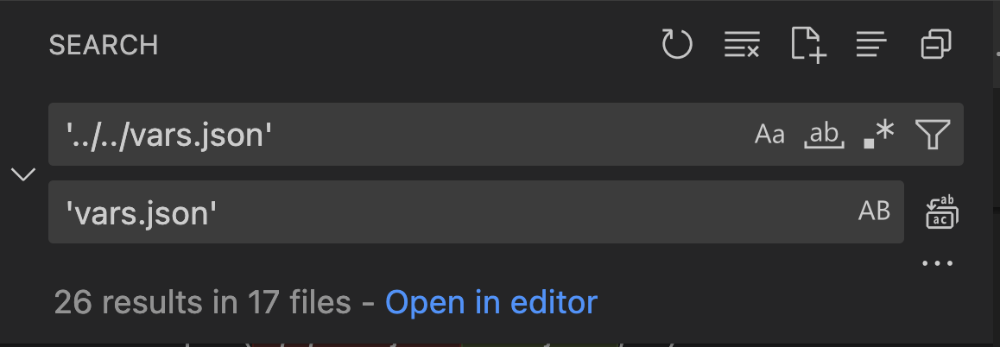
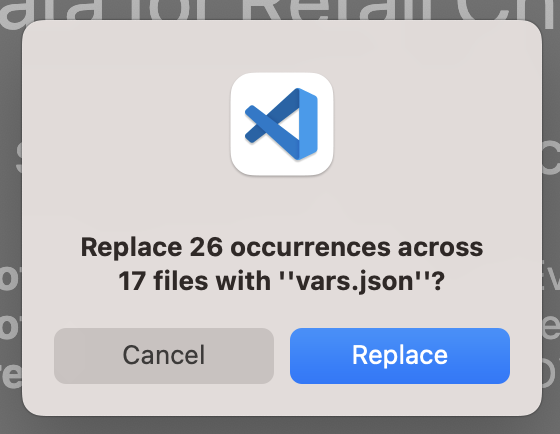

import Tabs from '@theme/Tabs';
import TabItem from '@theme/TabItem';
import TabsMDX from '../_partials/tabs.mdx';

# Visual Studio Code で VantageCloud Lake の Teradata Jupyter Notebook デモを実行する方法

## 概要
Visual Studio Code は、Windows、MacOs、Linux と互換性のある人気の高いオープンソース コード エディターです。開発者は、この統合開発環境 (IDE) を使用して、アプリケーションのコーディング、デバッグ、構築、デプロイを行います。このクイックスタート ガイドでは、Visual Studio Code 内で VantageCloud Lake Jupyter ノートブックのデモを起動します。 



## 前提条件
始める前に、次の前提条件が整っていることを確認します。

* インストールされた[Dockerデスクトップ](https://www.docker.com/products/docker-desktop)
* インストールされた[Git](https://git-scm.com/book/en/v2/Getting-Started-Installing-Git)
  * https://github.com/Teradata/lake-demos.git から git リポジトリをダウンロードする必要があります
* インストールされた[Visual Studio Code](https://code.visualstudio.com/download)
* Teradata ウェルカム レターの組織 URL とログイン詳細を含む Teradata VantageCloud Lake アカウント
  * ログインしたら、次の [手順](getting-started-with-vantagecloud-lake.md#create-an-environment) に従って VantageCloud Lake 環境を作成する

## VantageCloud Lakeデモリポジトリのクローンを作成する 
まず、GitHub リポジトリのクローンを作成し、プロジェクト ディレクトリに移動する。

``` bash
git clone https://github.com/Teradata/lake-demos.git
cd lake-demos
```

## Teradata Jupyter Extensions で Jupyterlab Docker コンテナを起動する
VantageCloud Lake デモを起動するには、[Teradata Jupyter Extensions for Docker](https://hub.docker.com/r/teradata/jupyterlab-extensions)が必要です。これらの拡張機能は、SQL ipython カーネル、Teradata への接続を管理するユーティリティ、および Teradata データベースとの対話時の生産性を高めるデータベース オブジェクト エクスプローラを提供します。   

次に、コンテナを起動し、既存の lake-demos ディレクトリにバインドします。オペレーティング システムに応じて適切なコマンドを選択します。 

:::note
Windows の場合は、PowerShell で docker コマンドを実行します。
:::


<TabsMDX />


結果の URL とトークンをメモします。 これらは、Visual Studio Code から接続を確立するために必要になります。



## Visual Studio Code の構成
Visual Studio Code で `lake-demos` プロジェクト ディレクトリを開きます。リポジトリには次のプロジェクト ツリーが含まれています。 

LAKE_DEMOS

* [ユースケース](https://github.com/Teradata/lake-demos/tree/main/UseCases)
  * [0_Demo_Environment_Setup.ipynb](https://github.com/Teradata/lake-demos/blob/main/0_Demo_Environment_Setup.ipynb)
  * [1_Load_Base_Demo_Data.ipynb](https://github.com/Teradata/lake-demos/blob/main/1_Load_Base_Demo_Data.ipynb)
  * [Data_Engineering_Exploration.ipynb](https://github.com/Teradata/lake-demos/blob/main/Data_Engineering_Exploration.ipynb)
  * [Data_Engineering_Exploration.ipynb](https://github.com/Teradata/lake-demos/blob/main/Data_Science_OAF.ipynb)
  * [Demo_Admin.ipynb](https://github.com/Teradata/lake-demos/blob/main/Demo_Admin.ipynb)
* [vars.json ファイル](https://github.com/Teradata/lake-demos/blob/main/vars.json)


### vars.json ファイルを編集する 
[**vars.json**](https://github.com/Teradata/lake-demos/blob/main/vars.json) ファイルを編集して、デモを実行するために必要な認証情報を含める 


| **変数** | **値** |
|--------------|-----------|
| **"host"**     | VantageCloud Lake 環境からの Public IP値 |
| **"UES_URI"**  | VantageCloud Lake 環境からの Open Analytics |
| **"dbc"**      | VantageCloud Lake 環境のマスター パスワード |


Public IPアドレスとOpen Analyticsエンドポイントを取得するには、次の[手順](getting-started-with-vantagecloud-lake.md#create-an-environment)に従います。

:::info
vars.json ファイルのパスワードを変更します。サンプル vars.json では、すべてのユーザーのパスワードがデフォルトで「password」に設定されていることがわかります。これはサンプル ファイルの問題にすぎず、これらのパスワードをすべて変更する必要があります。 フィールドを強力なパスワードに設定し、必要に応じて保護し、他のパスワード管理のベスト プラクティスに従ってください。
:::

### UseCases ディレクトリ内の vars.json へのパスを変更する

UseCases ディレクトリでは、Jupyterlab から作業する場合、すべての .ipynb ファイルはパス ../../vars.json を使用して JSON ファイルから変数を読み込みます。Visual Studio Code から直接作業するには、各 .ipynb のコードが vars.json を指すように更新します。

これらの変更を行う最も簡単な方法は、左側の垂直メニューの検索機能を使用することです。検索する 

```bash
'../../vars.json'
```

次のように置換します。

```bash
'vars.json'
```





### Jupyterカーネルを構成する
**0_Demo_Environment_Setup.ipynb** を開き、Visual Studio Codeの右上にあるSelect Kernelをクリックします。 

Jupyter および Python 拡張機能をインストールしていない場合は、Visual Studio Code によってインストールするように求められます。これらの拡張機能は、Visual Studio Code がカーネルを検出するために必要です。インストールするには、[Python および Jupyter の推奨拡張機能をインストール/有効化] を選択します。


必要な拡張機能をインストールすると、ドロップダウン メニューにオプションが表示されます。**既存の Jupyter カーネル**を選択します。


実行中の Jupyter Server の URL を入力し、Enter キーを押します。
```bash
http://localhost:8888
```


ファイルを Docker コンテナにマウントするときにターミナルで見つかったトークンを入力し、Enter キーを押します。


サーバー表示名を変更する (URL を使用するには空白のままにします)


これで、すべての Teradata Vantage 拡張カーネルにアクセスできるようになりました。実行中の Jupyter サーバーから Python 3 (ipykernel) を選択します。


### デモを実行する
環境を設定するには、*0_Demo_Environment_Setup.ipynb*内のすべてのセルを実行します。続いて*1_Demo_Setup_Base_Data.ipynb*を実行して、デモに必要な基本データを読み込みます。
デモノートブックの詳細については、GitHub の [Teradata Lake デモ](https://github.com/Teradata/lake-demos) ページをご覧ください。


## まとめ 
このクイックスタート ガイドでは、Jupyter ノートブックを使用して VantageCloud Lake デモにアクセスするように Visual Studio Code を構成しました。 
