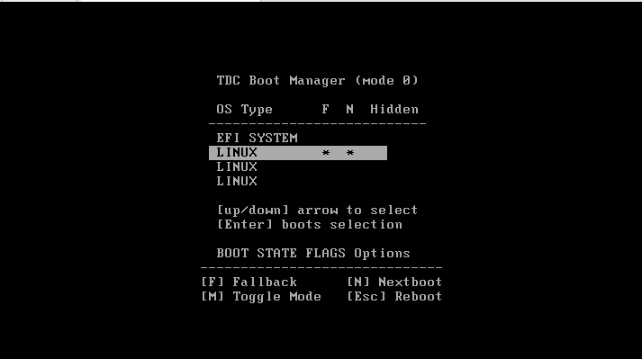
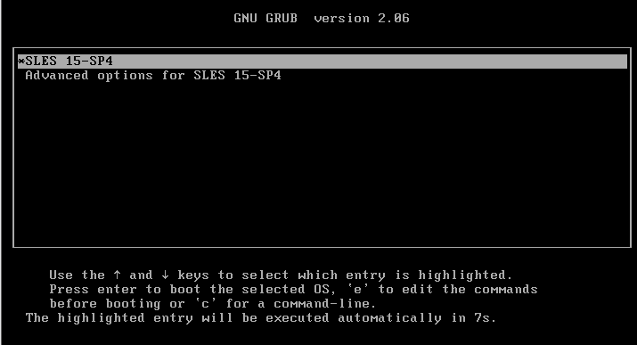
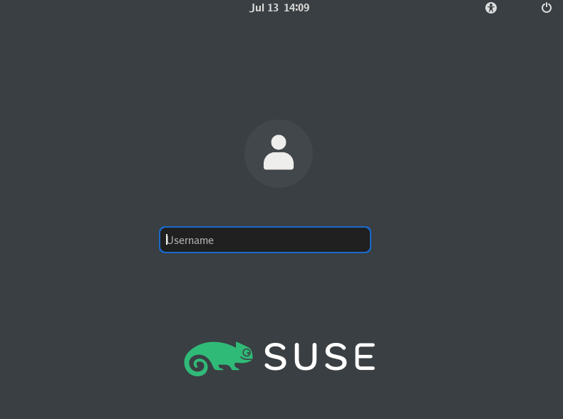
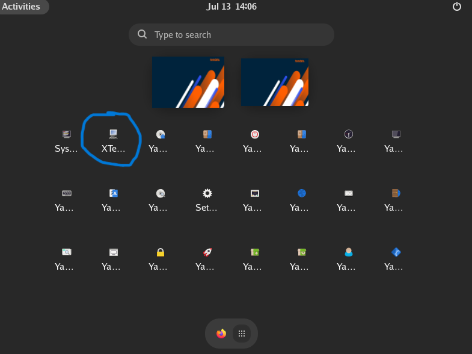
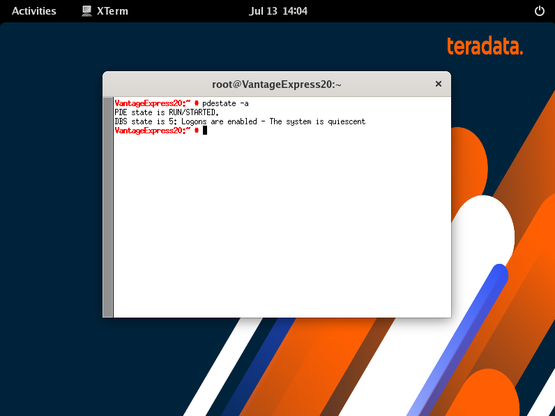
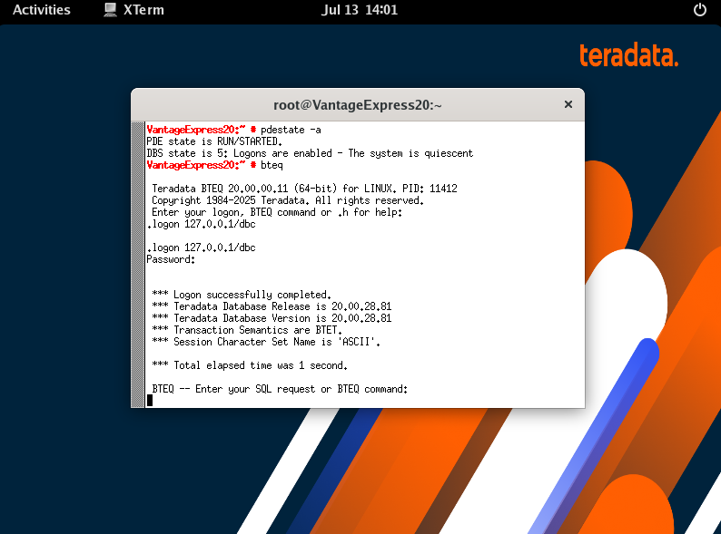

- Press <kbd>[ENTER]</kbd> to select the highlighted `LINUX` boot partition.



- On the next screen, press <kbd>ENTER</kbd> again to select the default SUSE Linux kernel.



- Once the VM is up, you will see its desktop environment. When prompted for a username and password, enter `root` for both.



- The database is configured to autostart with the VM. To confirm that the database has started, go to the virtual desktop and start a terminal.



- In the terminal, execute the `pdestate` command to check if Vantage has already started:

```bash
pdestate -a
```

Wait until you see the following message:

```bash
PDE state is RUN/STARTED.
DBS state is 5: Logons are enabled - The system is quiescent
```


<details>

<summary>See examples of messages that <code>pdestate</code> returns when the database is still initializing:</summary>

<pre>
PDE state is DOWN/HARDSTOP.

PDE state is START/NETCONFIG.

PDE state is START/GDOSYNC.

PDE state is START/TVSASTART.

PDE state is START/READY.
PDE state is RUN/STARTED.

DBS state is 1/1: DBS Startup - Initializing DBS Vprocs
PDE state is RUN/STARTED.

DBS state is 1/5: DBS Startup - Voting for Transaction Recovery
PDE state is RUN/STARTED.

DBS state is 1/4: DBS Startup - Starting PE Partitions
PDE state is RUN/STARTED.
</pre>

</details>

- Now that the database is up, you can log in to it:
- At the shell prompt, type `bteq`.
- At the logon prompt, type `.logon 127.0.0.1/dbc`.
- At the password prompt, type `dbc`.
    - If successful, the Basic Teradata Query (BTEQ) session confirms that you are logged into BTEQ.



- Run the SQL test script by typing the following:
```bash
select * from dbc.dbcinfo;
```
- A successful test returns: `*** Query completed.`

