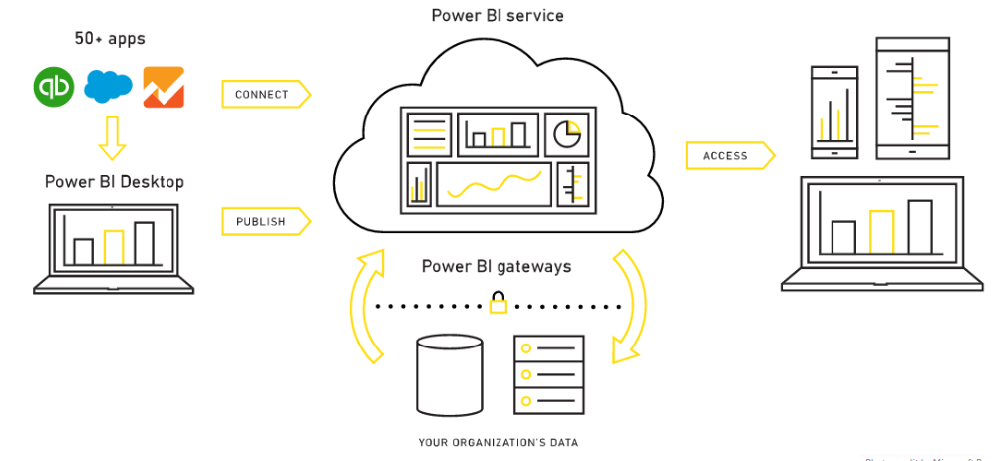
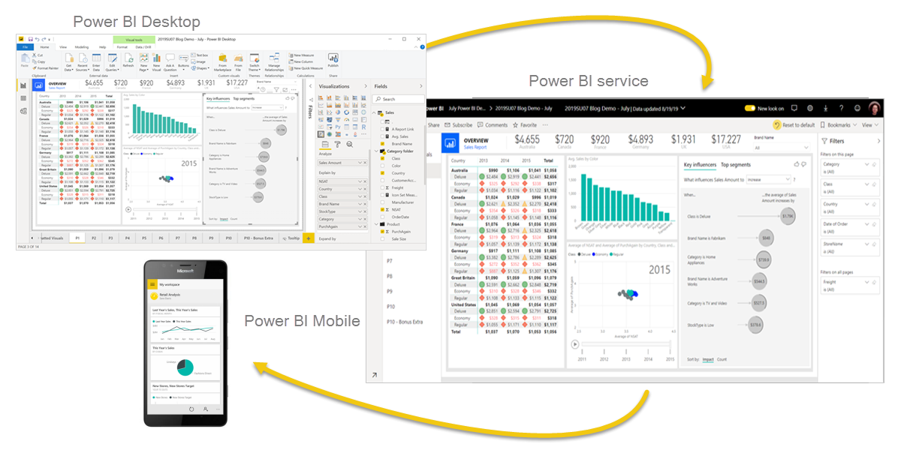
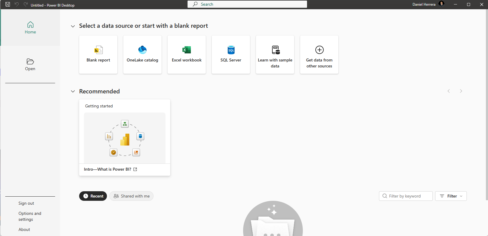
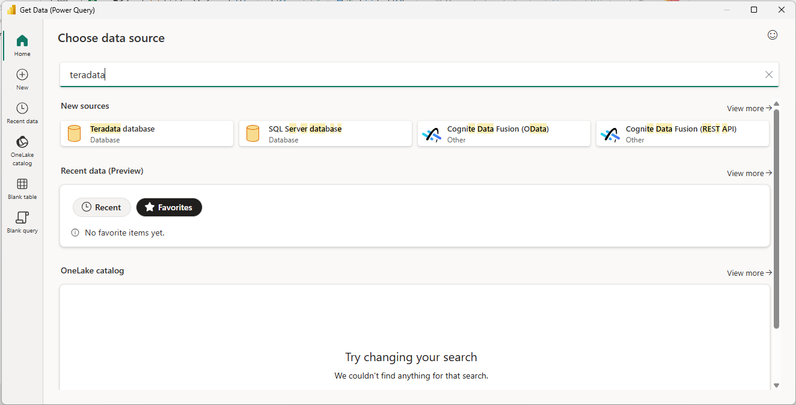
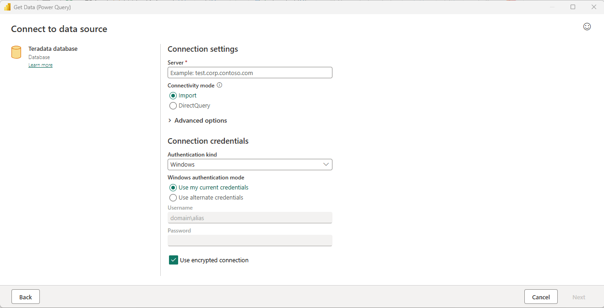
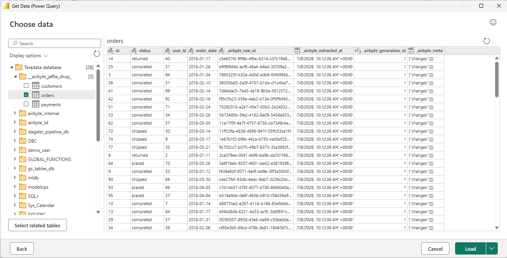
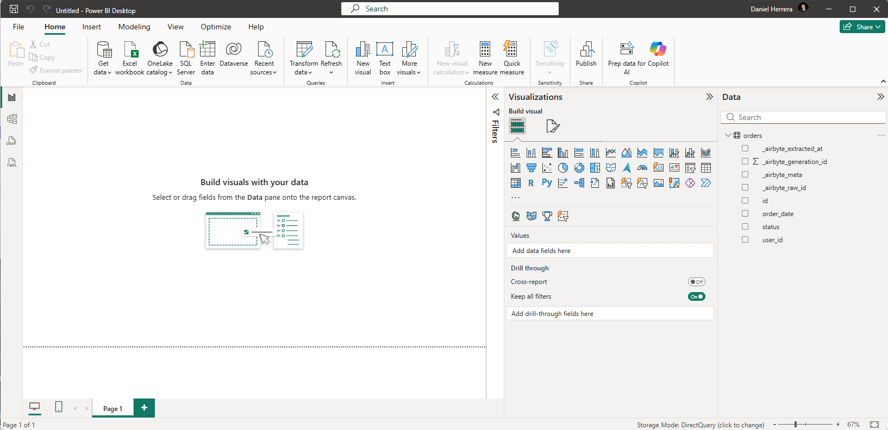
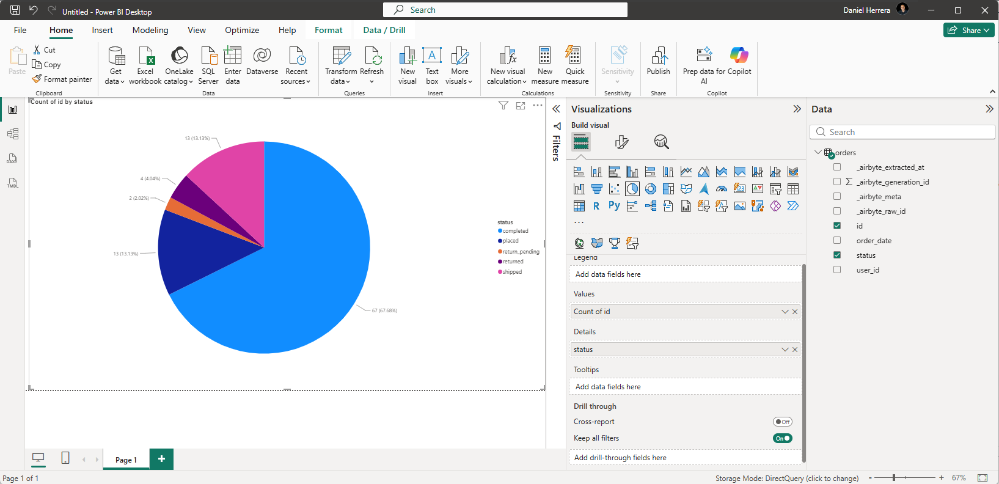

import TrialDocsNote from '../_partials/teradata_trial.mdx'

# Create Visualizations in Power BI using Teradata

## Overview

!!! note
    This guide includes content from both Microsoft and Teradata product documentation.

This article describes the process to connect your Power BI Desktop to Teradata for creating reports and visualizations of your data. Power BI supports Teradata as a data source and can use the underlying data just like any other data source in Power BI Desktop.

[Power BI](https://docs.microsoft.com/en-us/power-bi/power-bi-overview) is a collection of software services, applications, and connectors that work together to turn your unrelated sources of data into coherent, visually immersive, and interactive insights.

**Power BI consists of:**
* A Windows desktop application, called [Power BI Desktop](https://docs.microsoft.com/en-us/power-bi/fundamentals/desktop-what-is-desktop)
* An online SaaS (Software as a Service) service, called the [Power BI service](https://docs.microsoft.com/en-us/power-bi/fundamentals/power-bi-service-overview)
* [Power BI mobile](https://docs.microsoft.com/en-us/power-bi/consumer/mobile/mobile-apps-for-mobile-devices) apps for Windows, iOS, and Android devices

These three elements—Power BI Desktop, the Power BI service, and the mobile apps—are designed to let people create, share, and consume business insights in the way that serves them, or their role, most effectively.

A fourth element, [Power BI Report Server](https://docs.microsoft.com/en-us/power-bi/report-server/get-started), allows you to publish Power BI reports to an on-premises report server, after creating them in Power BI Desktop.

Power BI Desktop now supports Teradata as a native data source via the built-in Teradata database connector. However, published reports on the Power BI Service still require the [on-premises data gateway](https://docs.microsoft.com/en-us/power-bi/connect-data/service-gateway-onprem) to access Teradata, regardless of whether the database is on a local network or in the cloud.

This getting started guide will show you how to connect to Teradata. The Power BI Desktop Teradata connector uses the [.NET Data Provider for Teradata](https://downloads.teradata.com/download/connectivity/net-data-provider-for-teradata). You need to install the driver on computers that use the Power BI Desktop. The .NET Data Provider for Teradata single installation supports both 32-bit and 64-bit Power BI Desktop applications.

## Prerequisites
You are expected to be familiar with Teradata and Power BI Desktop.

You will need the following accounts and systems.

* The Power BI Desktop is a free application for Windows. (Power BI Desktop is not available for Macs. You could run it in a virtual machine, such as [Parallels](https://www.parallels.com) or [VMware Fusion](https://www.vmware.com/products/fusion.html), or in Apple’s [Boot Camp](https://support.apple.com/en-vn/boot-camp), but that is beyond the scope of this article.)

* A Teradata instance with a user and password. The user must have permission to data that can be used by Power BI Desktop. Teradata must be accessible from Power BI Desktop.

        <TrialDocsNote />

* The [.NET Data Provider for Teradata](https://downloads.teradata.com/download/connectivity/net-data-provider-for-teradata).

## Getting Started
### Install Power BI Desktop
You can install Power BI Desktop from the [Microsoft Store](https://aka.ms/pbidesktopstore) or [download the installer](https://aka.ms/pbiSingleInstaller) and run it directly.

### Install the .NET Data Provider for Teradata
Download and install the latest version of the [.NET Data Provider for Teradata](https://downloads.teradata.com/download/connectivity/net-data-provider-for-teradata).

Note that there are multiple files available for download. You want the file that starts with “tdnetdp”.

### Connect to Teradata
* Run Power BI Desktop, which has a yellow icon. 

* In the main form of Power BI, click on _Get data from other sources_.

    

* Search for _Teradata database_. Click on _Teradata database_.

* In the window that appears, enter the name or IP address of your Teradata system into the text box. You can choose to _Import_ data into the Power BI data model, or connect directly to the data source using [DirectQuery](https://docs.microsoft.com/en-us/power-bi/desktop-use-directquery) and click _OK_.

(Click _Advanced_ options to submit hand-crafted SQL statements.)

* Select the _Basic_ authentication method and enter your username and password. Click _Connect_.

You also have the option of authenticating with an LDAP server. This option is hidden by default.

If you set the environment variable, _PBI_EnableTeradataLdap_, to _true_, then the LDAP authentication method will become available.

Note that LDAP is not supported with the on-premises data gateway, which is used for reports that are published to the Power BI service. If you need LDAP authentication and are using the on-premises data gateway, you will need to submit an incident to Microsoft and request support.

Alternatively, you can [configure Kerberos-based SSO from Power BI service to on-premise data sources](https://docs.microsoft.com/en-us/power-bi/connect-data/service-gateway-sso-kerberos) like Teradata.

Once you have connected to the Teradata system, Power BI Desktop remembers the credentials for future connections to the system. You can modify these credentials by going to _File > Options and settings > Data source settings_.

The Navigator window appears after a successful connection. It displays the data available on the Teradata system. You can select one or more elements to use in Power BI Desktop.

You can preview a table by clicking on its name. If you want to load it into Power BI Desktop, ensure that you click the checkbox next to the table name.

You can _Load_ the selected table, which brings it into Power BI Desktop. 

Once the data is loaded, you can perform filtering and transformations.

And of course, you can create visualizations.

You can publish your reports and visualizations by following the steps on [Publish semantic models and reports from Power BI Desktop](https://learn.microsoft.com/en-us/power-bi/create-reports/desktop-upload-desktop-files).

## Next steps
You can combine data from many sources with Power BI Desktop. Look at the following links for more information.

* [What is Power BI Desktop?](https://docs.microsoft.com/en-us/power-bi/desktop-what-is-desktop)
* [Data Sources in Power BI Desktop](https://docs.microsoft.com/en-us/power-bi/desktop-data-sources)
* [Shape and Combine Data with Power BI Desktop](https://docs.microsoft.com/en-us/power-bi/desktop-shape-and-combine-data)
* [Connect to Excel workbooks in Power BI Desktop](https://docs.microsoft.com/en-us/power-bi/desktop-connect-excel)
* [Enter data directly into Power BI Desktop](https://docs.microsoft.com/en-us/power-bi/desktop-enter-data-directly-into-desktop)