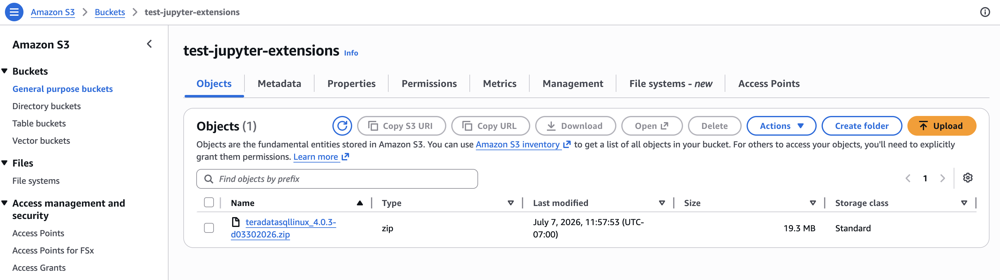
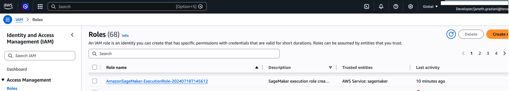
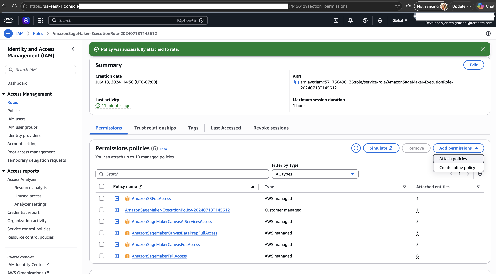
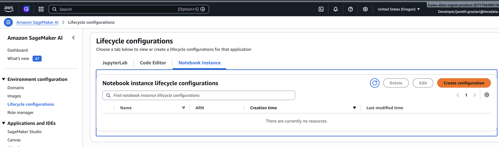
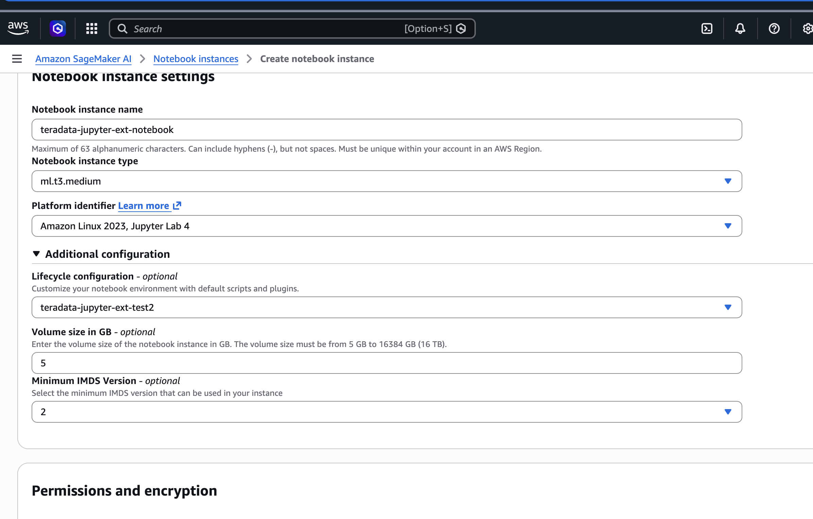
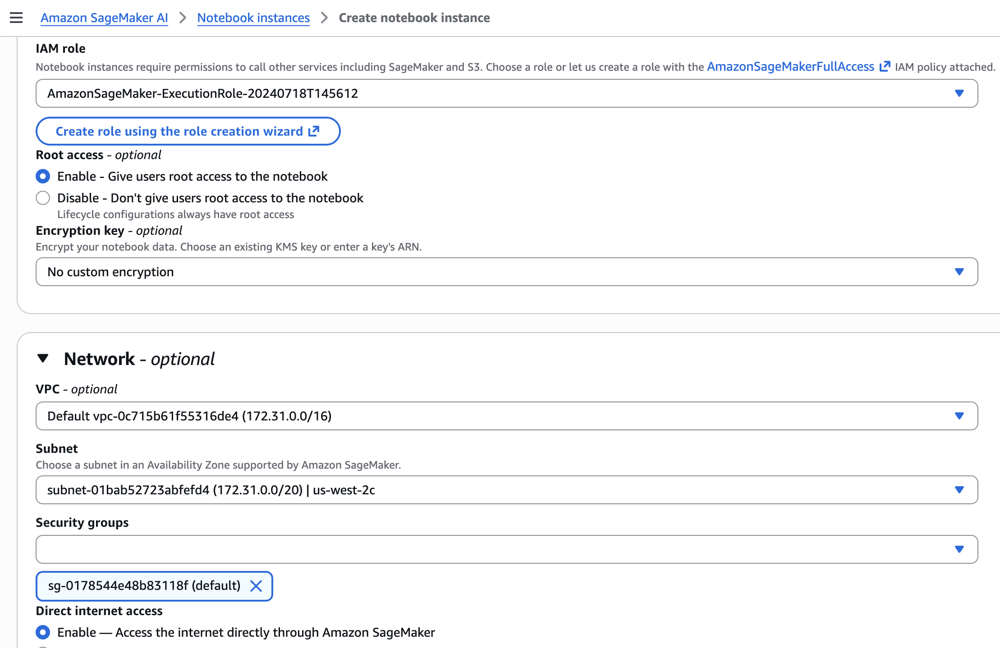
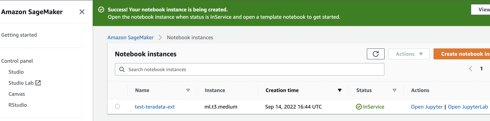
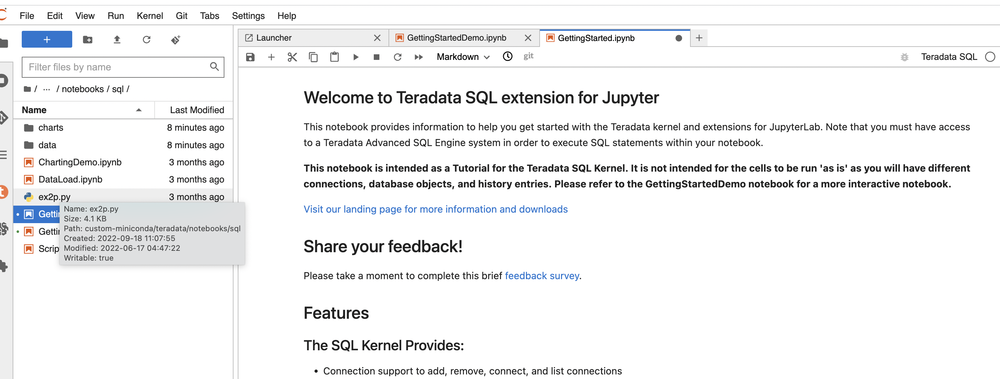

import TrialDocsNote from '../_partials/teradata_trial.mdx'
import JupyterTrialsNote from '../_partials/jupyter_notebook_trials_note.mdx';

# Integrate Teradata Jupyter extensions with SageMaker AI notebook instance


<JupyterTrialsNote />

### Overview
Teradata Jupyter extensions provide Teradata SQL kernel and several UI extensions to allow users to easily access and navigate Teradata database from Jupyter environment. This article describes how to integrate our Jupyter extensions with SageMaker AI notebook instance.

### Prerequisites


* Access to a Teradata instance
  <TrialDocsNote />
* AWS account with permissions to create SageMaker notebook instances and IAM roles
* AWS S3 bucket to store the Teradata Jupyter extension package

### Integration

SageMaker AI supports customization of notebook instances using lifecycle configuration scripts. Below we will demo how to use lifecycle configuration scripts to install our Jupyter kernel and extensions in a notebook instance.

### Steps to integrate with notebook instance

1. Download Teradata Jupyter extensions package

   Download the Linux version from https://downloads.teradata.com/download/tools/vantage-modules-for-jupyter and upload the zip file to your S3 bucket. The package contains the Teradata Jupyter kernel and extensions as `.whl` files.



2. **Grant SageMaker access to your S3 bucket**

   The SageMaker execution role needs permission to read from your S3 bucket. In the AWS IAM console, find the execution role associated with your notebook instance (typically named `AmazonSageMaker-ExecutionRole-...`) and attach the `AmazonS3FullAccess` policy.






3. Create a lifecycle configuration for notebook instance



In the SageMaker console, navigate to **Lifecycle configurations** and create a new configuration. You will see two script tabs: **Create notebook** and **Start notebook**. Paste the scripts below into the corresponding tabs.


`on-create.sh` runs once when the notebook instance is first created. It installs a persistent conda environment on the EBS volume so the installation survives notebook restarts.


on-create.sh

```bash
#!/bin/bash

set -e

# This script installs a custom, persistent installation of conda on the Notebook Instance's EBS volume, and ensures
# that these custom environments are available as kernels in Jupyter.

sudo -u ec2-user -i <<'EOF'
unset SUDO_UID
# Install a separate conda installation via Miniconda
WORKING_DIR=/home/ec2-user/SageMaker/custom-miniconda
mkdir -p "$WORKING_DIR"
wget https://repo.anaconda.com/miniconda/Miniconda3-4.6.14-Linux-x86_64.sh -O "$WORKING_DIR/miniconda.sh"
bash "$WORKING_DIR/miniconda.sh" -b -u -p "$WORKING_DIR/miniconda"
rm -rf "$WORKING_DIR/miniconda.sh"
# Create a custom conda environment
source "$WORKING_DIR/miniconda/bin/activate"
KERNEL_NAME="teradatasql"

PYTHON="3.8"
conda create --yes --name "$KERNEL_NAME" python="$PYTHON"
conda activate "$KERNEL_NAME"
pip install --quiet ipykernel
EOF
```

`on-start.sh` runs each time the notebook instance starts. It fetches the Teradata package from S3 and installs the Jupyter kernel and extensions. Replace `<your-s3-bucket>` with your bucket name and update the zip filename and `.whl` version numbers to match the version you downloaded.


on-start.sh

```bash
#!/bin/bash

set -e

# This script installs Teradata Jupyter kernel and extensions.

sudo -u ec2-user -i <<'EOF'
unset SUDO_UID

WORKING_DIR=/home/ec2-user/SageMaker/custom-miniconda

source "$WORKING_DIR/miniconda/bin/activate" teradatasql

# fetch Teradata Jupyter extensions package from S3 and unzip it
mkdir -p "$WORKING_DIR/teradata"
aws s3 cp s3://<your-s3-bucket>/teradatasqllinux_4.0.3-d03302026.zip "$WORKING_DIR/teradata"
cd "$WORKING_DIR/teradata"
unzip -o teradatasqllinux_4.0.3-d03302026.zip

# install Teradata kernel
cp teradatakernel /home/ec2-user/anaconda3/condabin
source /home/ec2-user/anaconda3/bin/activate JupyterSystemEnv
jupyter kernelspec install --user ./teradatasql

# install Teradata Jupyter extensions
pip install teradata_connection_manager-4.0.3-py3-none-any.whl
pip install teradata_database_explorer-4.0.3-py3-none-any.whl
pip install teradata_preferences-4.0.3-py3-none-any.whl
pip install teradata_resultset_renderer-4.0.3-py3-none-any.whl
pip install teradata_sqlhighlighter-4.0.3-py3-none-any.whl

conda deactivate
EOF
```


4. **Create a notebook instance**

   In the SageMaker console, create a new notebook instance. Select `Amazon Linux 2, Jupyter Lab 4` for the Platform identifier and select the lifecycle configuration created in step 3.

   Under **Permissions and encryption**, select the IAM execution role that has S3 access.

   Under **Network**, select your VPC, subnet, and the default security group. Enable **Direct internet access** so the lifecycle scripts can reach S3 and install packages.

   

   


5. **Open the notebook**

   Wait until the notebook instance status turns **InService**, then click **Open JupyterLab**.

   

   Access the demo notebooks to get started. Navigate to `custom-miniconda/teradata/notebooks/sql/GettingStarted.ipynb`
   
    


### Further reading
* [Teradata Jupyter Extensions Website](https://teradata.github.io/jupyterextensions)
* [Teradata Modules for Jupyter Installation Guide](https://docs.teradata.com/r/KQLs1kPXZ02rGWaS9Ktoww/root)
* [Teradata® Package for Python User Guide](https://docs.teradata.com/r/1YKutX2ODdO9ppo_fnguTA/root)
* [Customize a Notebook Instance Using a Lifecycle Configuration Script](https://docs.aws.amazon.com/sagemaker/latest/dg/notebook-lifecycle-config.html)
* [amazon ai notebook instance lifecycle config samples](https://github.com/aws-samples/amazon-sagemaker-notebook-instance-lifecycle-config-samples/blob/master/scripts/persistent-conda-ebs/on-create.sh)