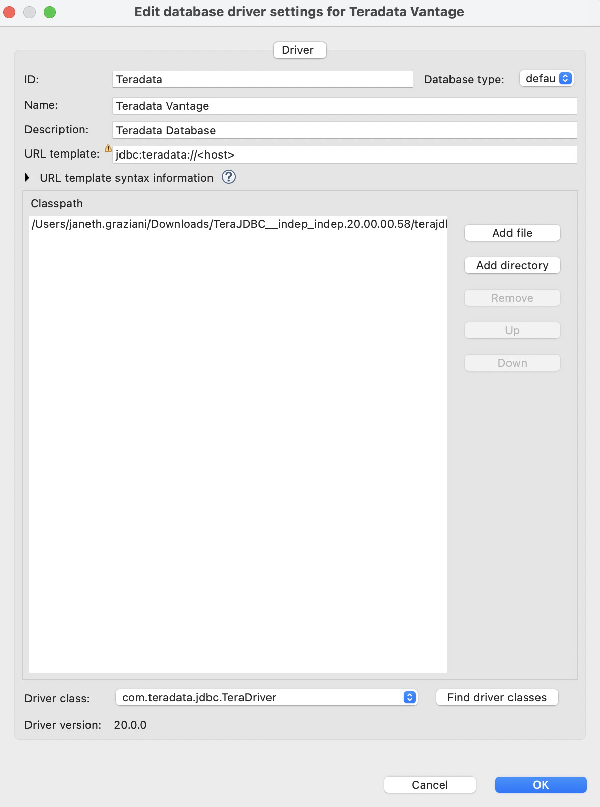
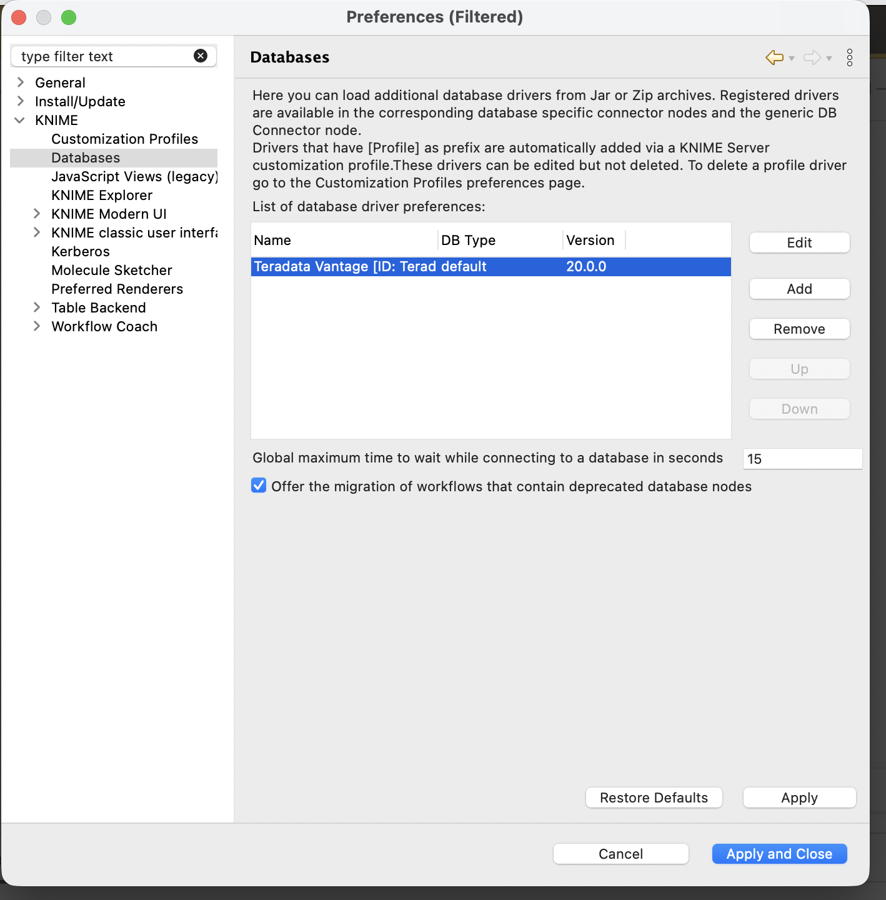
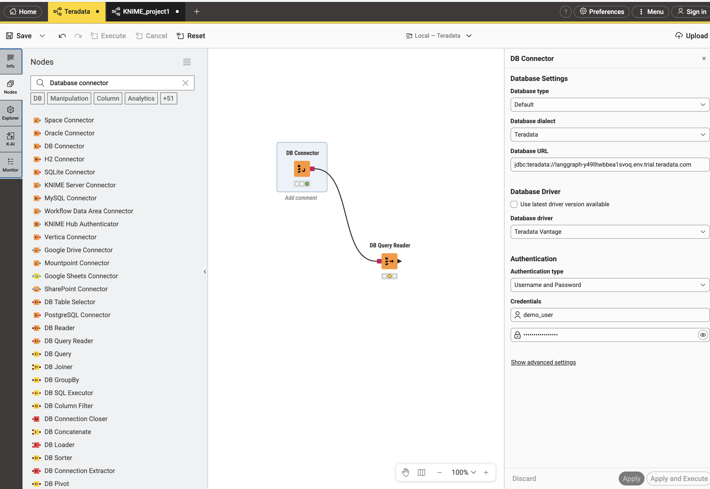
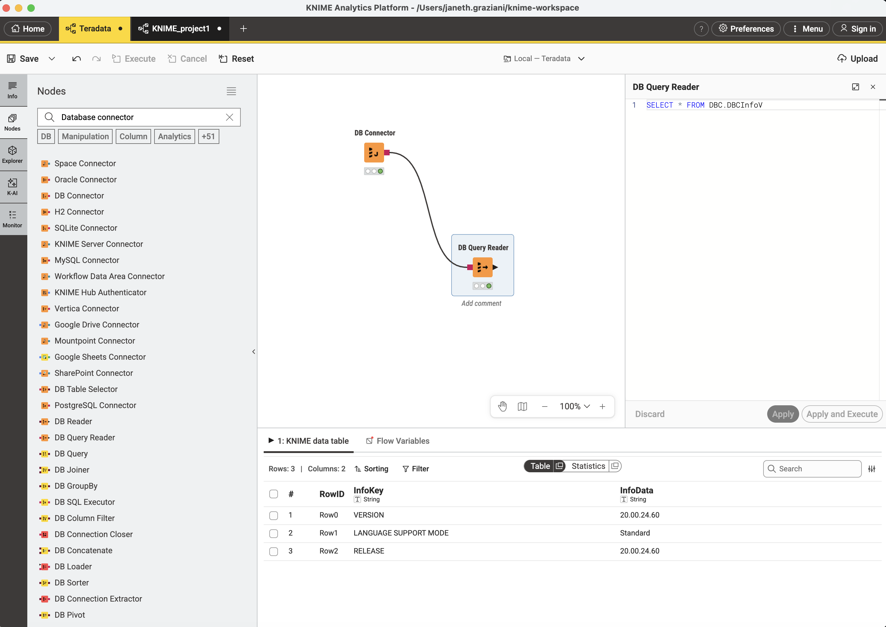

# Integrate Teradata with KNIME Analytics Platform

## Overview

This how-to describes how to connect to Terdata from KNIME Analytics Platform.

### About KNIME Analytics Platform

KNIME Analytics Platform is a data science workbench. It supports analytics on various data sources, including Teradata.

## Prerequisites

import TrialDocsNote from '../_partials/teradata_trial.mdx'

* Access to a Teradata instance, version 17.10 or higher.
  <TrialDocsNote />
* KNIME installed locally. See [KNIME installation instructions](https://www.knime.com/installation) for details.

## Integration Procedure

1. Go to https://downloads.teradata.com/download/connectivity/jdbc-driver (first time users will need to register) and download the latest version of the JDBC driver.
2. Unzip the downloaded file. You will find `terajdbc4.jar` file.
3. In KNIME, click on `File → Preference`. Under `Databases`, click `Add`:

4. Register a new database driver. Provide values for `ID`, `Name`, and `Description`. Set the **URL template** to `jdbc:teradata://<host>`. Click `Add file` and point to the `.jar` file you downloaded earlier. Click `Find driver classes` — the `Driver class` field should populate with `com.teradata.jdbc.TeraDriver`. Click `OK`:

5. Click `Apply and Close`:

6. Create a new KNIME workflow. Search for `DB Connector` in the Nodes panel and drag it to the workspace:

The DB Connector settings panel will appear on the right. Configure the following:
   - **Database dialect**: `Teradata`
   - **Database URL**: `jdbc:teradata://<your-vantage-host>`
   - **Database Driver**: uncheck `Use latest driver version available` and select `Teradata Vantage` from the dropdown
   - **Authentication type**: `Username and Password`
   - Enter your **Username** and **Password**
   - Click `Apply and Execute` It will show a green light when the connection is successful.

8. Add a `DB Query Reader` node to the workspace and connect the output port of `DB Connector` to the input port of `DB Reader`.

10. Right-click the `DB Query Reader` node and select `Configure`. Enter your SQL statement, for example and select Apply and Execute:
    `SELECT * FROM DBC.DBCInfoV`

 

## Summary

This how-to demonstrats how to connect from KNIME Analytics Platform to Teradata.

## Further reading
* [Train ML models in Teradata using only SQL](./ml.md)