# Use Amazon SageMaker AI with Teradata

### Overview

This how-to will help you to integrate Amazon SageMaker AI with Teradata. The approach this guide explains is one of many potential approaches to integrate with the service.

Amazon SageMaker AI provides a fully managed Machine Learning Platform. There are two use cases for Amazon SageMaker AI and Teradata:

1.	Data resides on Teradata and Amazon SageMaker AI will be used for both the Model definition and subsequent scoring. Under this use case Teradata will provide data into an Amazon S3 bucket so that Amazon SageMaker AI can consume training and test data sets for the purpose of model development. Teradata would further make data available via Amazon S3 for subsequent scoring by Amazon SageMaker AI. Under this model Teradata is a data repository only.

2.	Data resides on Teradata and Amazon SageMaker AI will be used for the Model definition, and Teradata for the subsequent scoring. Under this use case Teradata will provide data into an Amazon S3 bucket so that Amazon SageMaker AI can consume training and test data sets for the purpose of model development. Teradata will need to import the Amazon SageMaker AI model into a Teradata table for subsequent scoring. Under this model Teradata is a data repository and a scoring engine.

The first use case is discussed in this document.

Amazon SageMaker AI consumes training and test data from an Amazon S3 bucket. This article describes how you can load Teradata analytics data sets into an Amazon S3 bucket. The data can then be available to Amazon SageMaker AI to build and train machine learning models and deploy them into a production environment.


### Prerequisites

import TrialDocsNote from '../_partials/teradata_trial.mdx'

* Access to a Teradata instance.
  <TrialDocsNote />
* IAM permissions to access the Amazon S3 bucket and use Amazon SageMaker AI.
* An Amazon S3 bucket to store training data.

### Load data

Amazon SageMaker AI trains machine learning models using data stored in an Amazon S3 bucket. Follow these steps to load training data from Teradata into an Amazon S3 bucket:

1. In the Amazon SageMaker AI console, select `Applications and IDEs` -> `Notebooks` -> `Notebook instances`, and then select `Create notebook instance`. See the [Amazon SageMaker AI Developer Guide](https://docs.aws.amazon.com/sagemaker/latest/dg/gs-setup-working-env.html) for instructions on how to create a notebook instance:

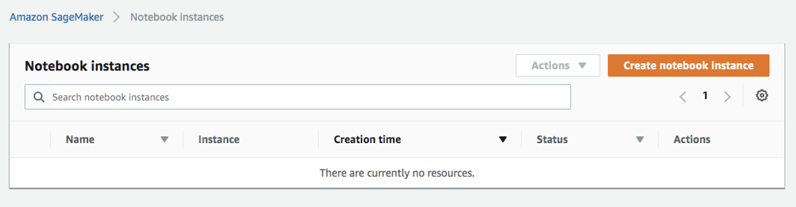

2.	Open your notebook instance:
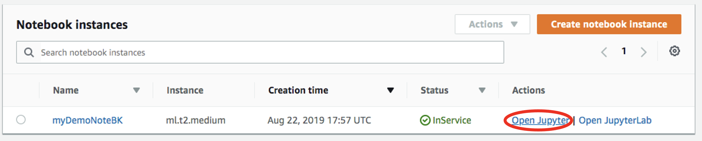

3. Start a new file by clicking on `New -> conda_python3`:
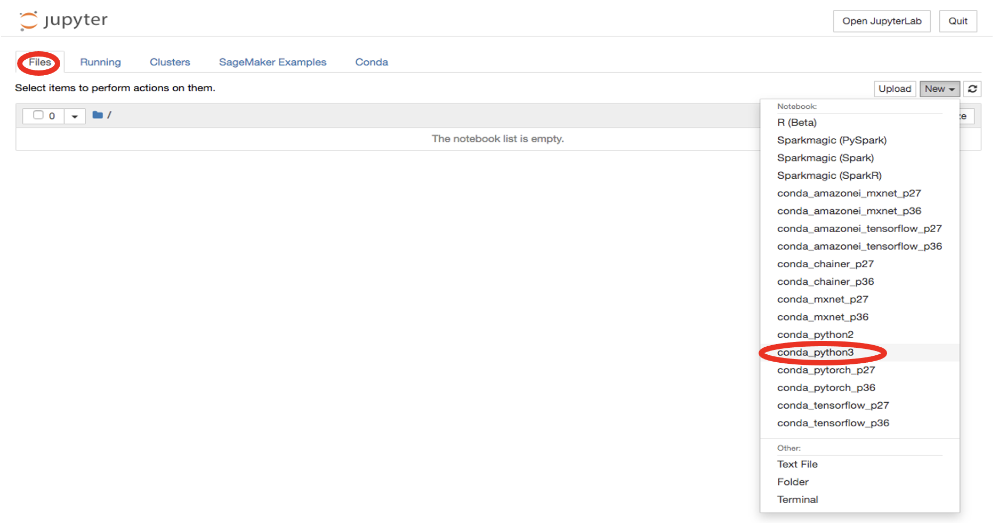

4. Install Teradata Python library:
    ``` python
    !pip install teradataml
    ```

5. In a new cell and import additional libraries:
    ``` python
    import teradataml as tdml
    from teradataml import create_context, get_context, remove_context
    from teradataml.dataframe.dataframe import DataFrame
    import pandas as pd
    import boto3, os
    ```

6. In a new cell, connect to Teradata. Replace `<hostname>`, `<database user name>`, `<database password>` to match your Teradata environment:
    ``` python
    create_context(host = '<hostname>', username = '<database user name>', password = '<database password>')
    ```

7. Retrieve data from the table where the training dataset resides using TeradataML DataFrame API:
    ``` python
    train_data = tdml.DataFrame('table_with_training_data')
    trainDF = train_data.to_pandas()
    ```

    !!! note
        For the XGBoost training job used in this how-to, place the target column first and encode categorical values as numeric values before exporting the data. The CSV file must not contain a header row.

8. Write data to a local file:
    ``` python
    trainFileName = 'train.csv'
    trainDF.to_csv(trainFileName, header=None, index=False)
    ```

9. Upload the file to Amazon S3. Replace `<s3_bucket_name>` with the name of your Amazon S3 bucket:

    ```python
    bucket = '<s3_bucket_name>'
    prefix = 'sagemaker/train'

    with open(trainFileName, 'rb') as trainFile:
        boto3.Session().resource('s3') \
            .Bucket(bucket) \
            .Object(os.path.join(prefix, trainFileName)) \
            .upload_fileobj(trainFile)
    ```

### Train the model

1. In the Amazon SageMaker AI console, select `Model training & customization` -> `Training & tuning jobs` -> `Training jobs` from the left menu, and then select `Create training job`:
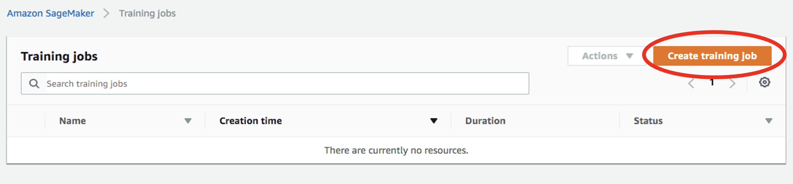

2. In the `Create training job` window, enter a job name, such as `xgboost-bank`. For the IAM role, select an existing SageMaker execution role with access to the Amazon S3 bucket, or select `Create a new role`. When creating a new role, choose `Any S3 bucket`, and then select `Create role`:
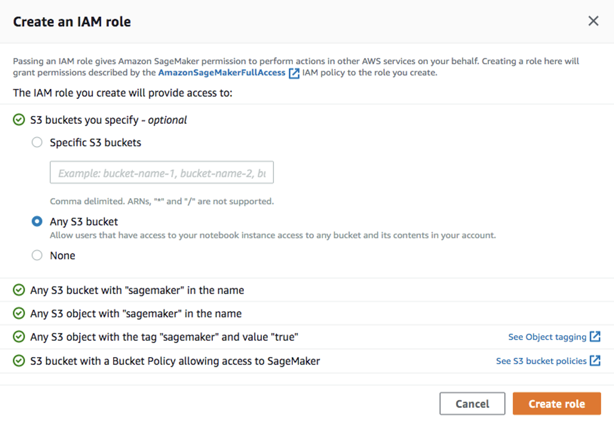

3. For the algorithm, select `Tabular – XGBoost : v1.3`:
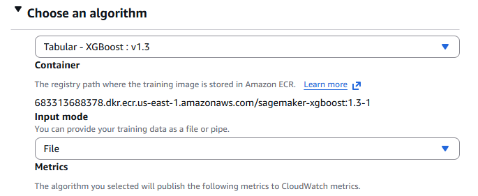

4. Under `Resource configuration`, use the following values:

    * Instance type: `ml.m4.xlarge`
    * Instance count: `1`
    * Storage volume: `30 GB`
    * Maximum runtime: `1 hour`
    * Keep alive period: `0 seconds`

    This is a short training job and should typically complete within 10 minutes.
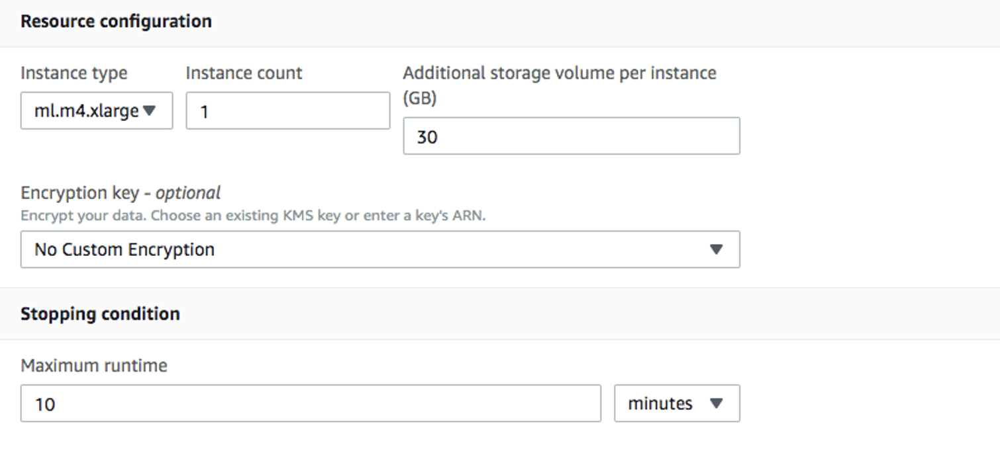

5. Enter the following hyperparameters and leave the remaining settings at their default values:

    ```bash
    num_round=100
    verbosity=1
    eta=0.2
    gamma=4
    max_depth=5
    min_child_weight=6
    subsample=0.8
    objective=binary:logistic
    ```

6. Under `Input data configuration`, use the following values:

    * Channel name: `train`
    * Input mode: `File`
    * S3 data type: `S3Prefix`
    * Distribution: `FullyReplicated`
    * Data format: `csv`
    * S3 location: The Amazon S3 prefix containing `train.csv`
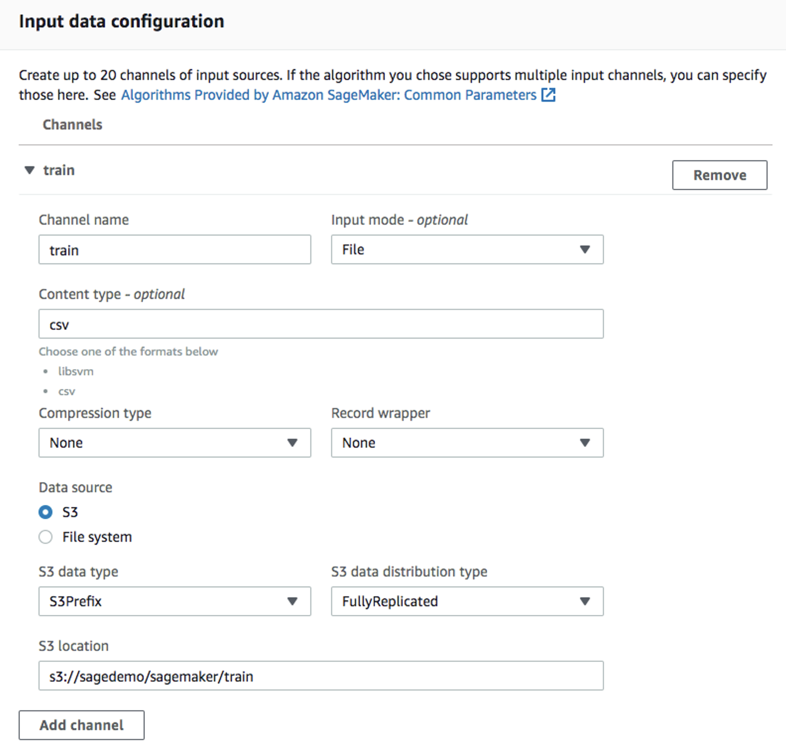

7. Under `Output data configuration`, enter the Amazon S3 location where Amazon SageMaker AI will store the model artifacts:

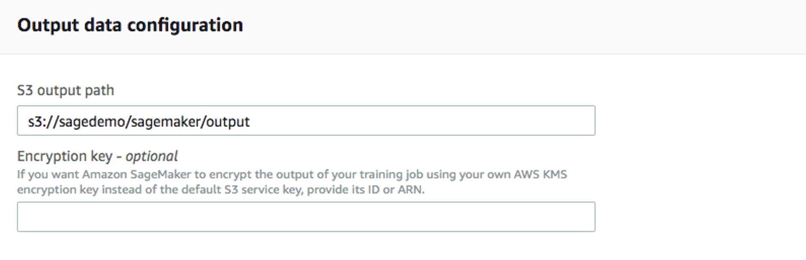

8. Leave the remaining settings at their default values and select `Create training job`. For detailed instructions on configuring a training job, see the [Amazon SageMaker AI Developer Guide](https://docs.aws.amazon.com/sagemaker/latest/dg/sagemaker-mkt-algo-train.html#sagemaker-mkt-algo-train-console).

After the training job is created, Amazon SageMaker AI launches the ML instance and trains the model. When the training job is complete, Amazon SageMaker AI stores the resulting model artifact in the configured Amazon S3 output location:

`<output-path>/<training-job-name>/output/model.tar.gz`

### Deploy the model

After you train the model, deploy it to a real-time endpoint.

### Create a model

1. In the Amazon SageMaker AI console, select `Deployments & inference` -> `Deployable models` from the left menu, and then select `Create model`.

2. Enter a model name, such as `xgboost-bank`, and select the IAM role created or used for the training job.

3. Under `Container definition 1`, configure the following:

    * For `Container input options`, select `Provide model artifacts and inference image location`.
    * Select `Use a single model`.
    * For `Location of inference code image`, enter the XGBoost `1.3-1` inference image URI for your AWS Region. For information about retrieving an XGBoost image URI, see [How to use SageMaker AI XGBoost](https://docs.aws.amazon.com/sagemaker/latest/dg/xgboost-how-to-use.html).
    * For `Location of model artifacts`, enter the complete Amazon S3 path to the model artifact generated by the training job:

      ```text
      <output-path>/<training-job-name>/output/model.tar.gz
      ```

    * For `Model compression type`, select `CompressedModel`.

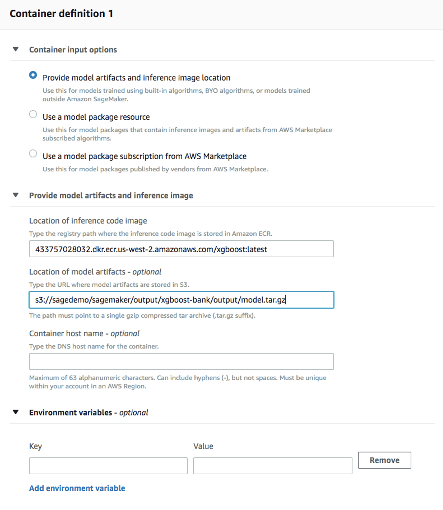

4. Leave the remaining settings at their default values and select `Create model`.

### Create an endpoint configuration

1. Select the model you just created, and then select `Create endpoint configuration`:

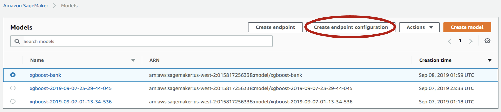

2. Enter a name, such as `xgboost-bank`, and leave the remaining settings at their default values. The model is automatically populated under `Variants`. Select `Create endpoint configuration`.

### Create endpoint

1. In the Amazon SageMaker AI console, select `Deployments & inference` -> `Deployable models` from the left menu. Select the model again, and then select `Create endpoint`:

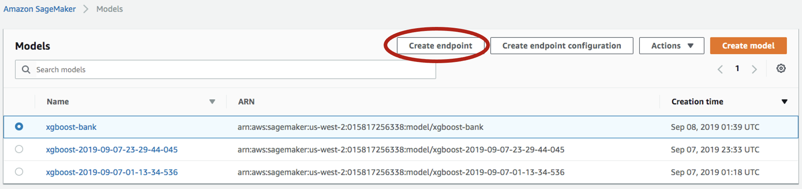

2. Enter a name, such as `xgboost-bank`, and select `Use an existing endpoint configuration`:

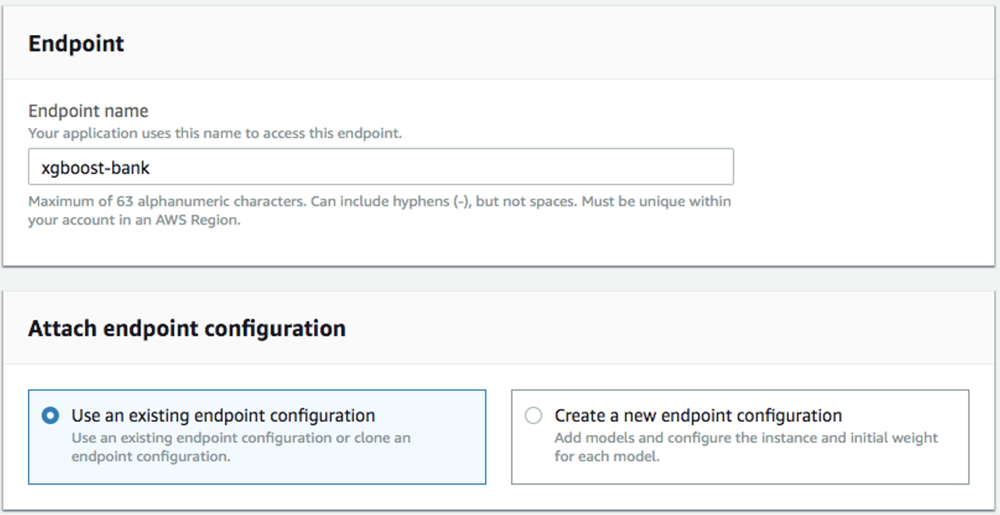

3. Select the endpoint configuration created in the previous step, and then select `Select endpoint configuration`:

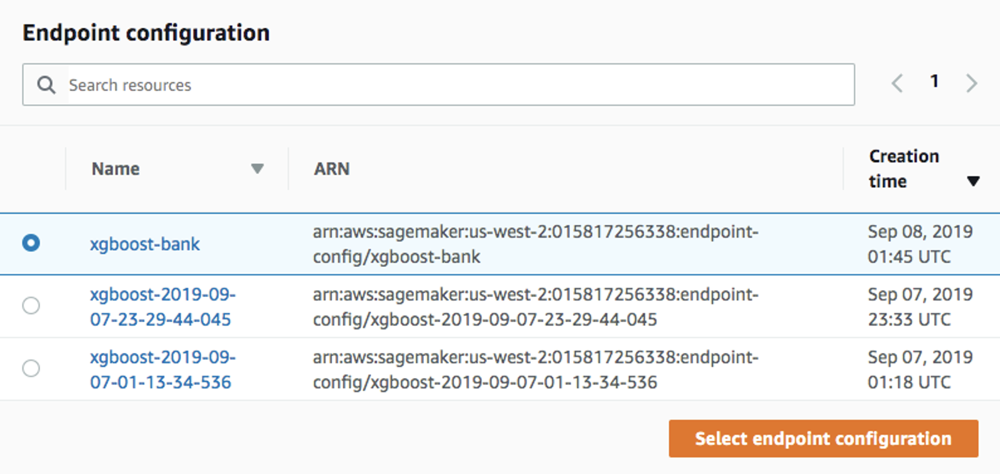

4. Leave the remaining settings at their default values and select `Create endpoint`.

Wait until the endpoint status changes to `InService`. The model is then deployed to the endpoint and can be used by client applications.

!!! warning
    A real-time endpoint incurs charges while it is running. Delete the endpoint when you no longer need it.

### Summary

This how-to demonstrated how to extract training data from Teradata and use it to train a model in Amazon SageMaker AI. The solution used a Jupyter notebook to extract data from Teradata and upload it to an Amazon S3 bucket. An Amazon SageMaker AI training job read the data from the Amazon S3 bucket and produced a model. The model was then deployed to an Amazon SageMaker AI real-time endpoint.

### Further reading

* [API integration guide for AWS SageMaker](https://docs.teradata.com/r/Enterprise_IntelliFlex_VMware/Teradata-VantageTM-API-Integration-Guide-for-Cloud-Machine-Learning/Amazon-Web-Services)
* [Integrate Teradata Jupyter extensions with SageMaker notebook instance](../analyze-data/integrate-teradata-jupyter-extensions-with-sagemaker.md)