# Connect to Teradata VantageCloud Using DBeaver and SSO (Browser Logon)

## Overview

This guide demonstrates how to connect to Teradata VantageCloud using DBeaver with secure **browser-based SSO authentication**.

This method uses the Teradata JDBC driver and the `LOGMECH=BROWSER` setting to enable a federated login experience, commonly used in enterprise environments. 

It also provides recommended DBeaver settings to optimize the experience for Teradata users familiar with SQL Assistant.

## Prerequisites

* Access to a Teradata VantageCloud instance configured for browser-based [SSO](https://docs.teradata.com/r/Teradata-VantageCloud-Enterprise/Security/Single-Sign-on)

* A valid enterprise login (e.g., @company.com credentials)
* DBeaver installed (Community or PRO version)

  Download from [DBeaver Community](https://dbeaver.io/download) or [DBeaver PRO](https://dbeaver.com/download)

## Create a Teradata Connection with SSO

1. Open DBeaver and click the plug icon () in the upper left, or navigate to `Database -> New Database Connection`.

2. In the **Select your database** screen, type `teradata`, select the **Teradata** connector, and click **Next**.

   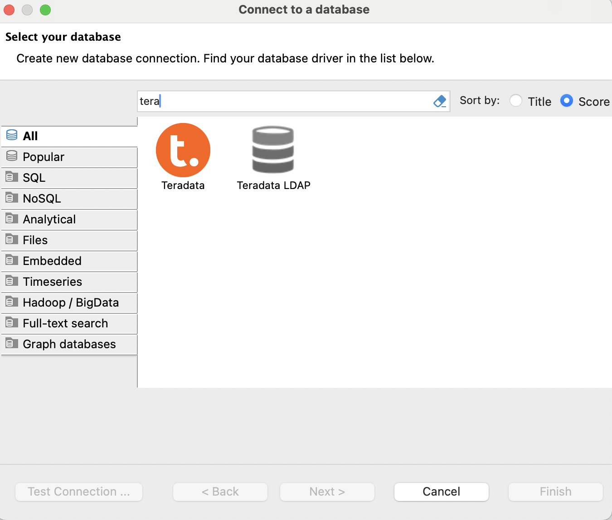

3. Change **Connect by** value from `Host` to `URL`.

4. In the **JDBC URL** field, paste the following URL (replace the YOUR-TERADATA-HOST to your VantageCloud host):

   ```text
   jdbc:teradata://<YOUR-TERADATA-HOST>/LOGMECH=BROWSER,BROWSER_TAB_TIMEOUT=0 
   
   ```

> Replace `<YOUR-TERADATA-HOST>` with the hostname of your Teradata gateway or VantagCloud environment.

> **Important:** Do NOT enter a username or password. Authentication will occur through your browser.

 
  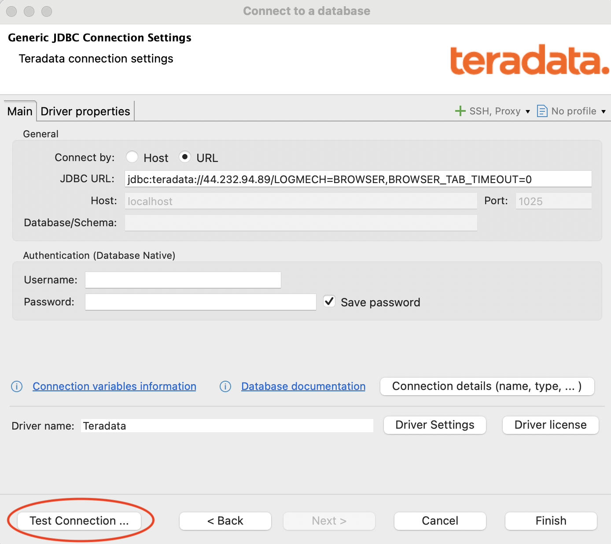

5. Click **Test Connection**.

6. If prompted, download and install the Teradata JDBC driver. 
(You may not be prompted if the driver is already installed from previous use.)

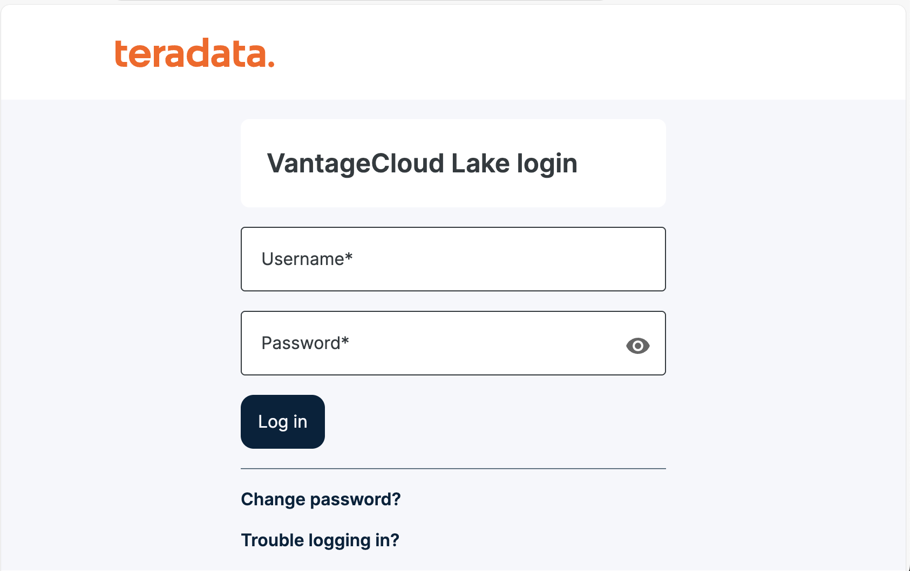

7. A browser window will open and redirect you to your organization's SSO login page. Log in with your enterprise credentials.

8. Once authenticated, a browser window will open
and close very quickly with the following message:


10. DBeaver should confirm a successful connection. Click **OK** and then **Finish**.

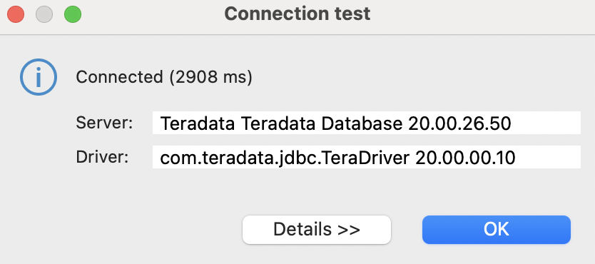

DBeaver is now able to connect to Teradata!

## Running Teradata Queries in Dbeaver

To begin querying:

- Right-click your Teradata connection and select **Connect**
- Open a new SQL script window and write your query.


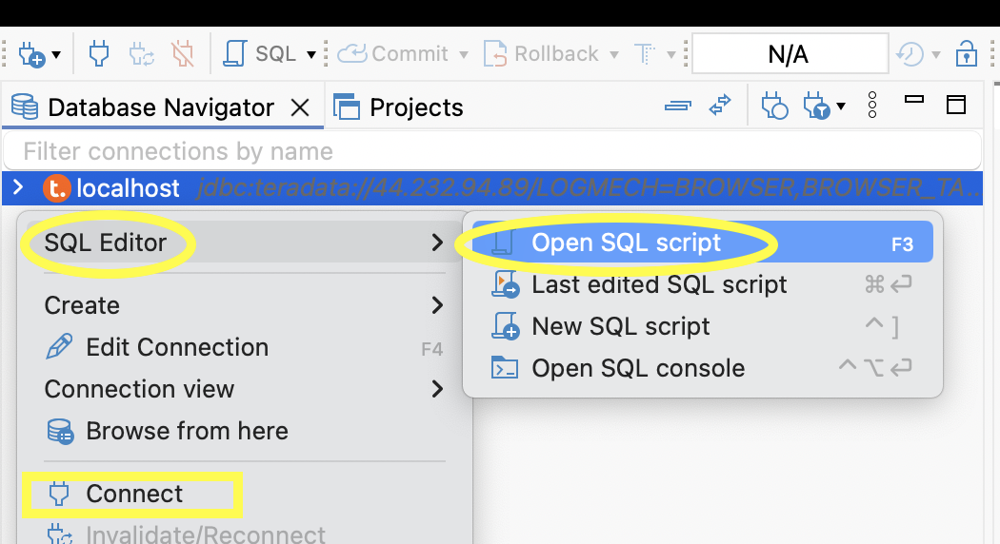

Click the upper orange arrow to execute the SQL query, or press `Command + Return` (macOS) or `Ctrl + Enter` (Windows).

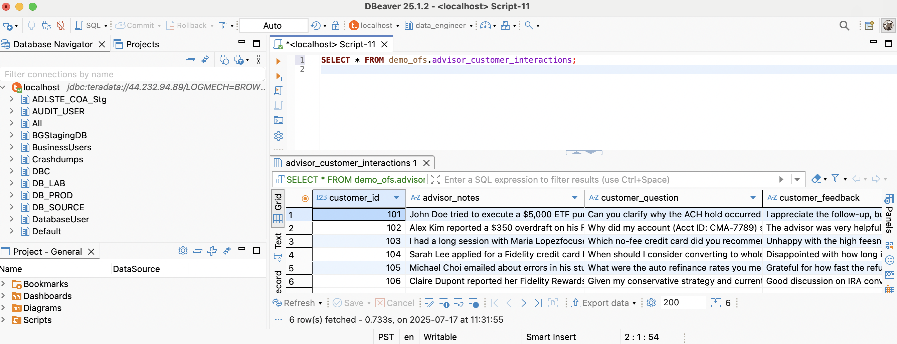


## Recommended DBeaver Settings for Teradata Users

### Disable "Blank line is statement delimiter"

Prevents DBeaver from ending queries at empty lines.

Navigate to: 

Window -> Preferences -> Editors -> SQL Editor -> SQL Processing -> Delimiters -> 

Set **Blank line is a statement delimiter** to `Never`.

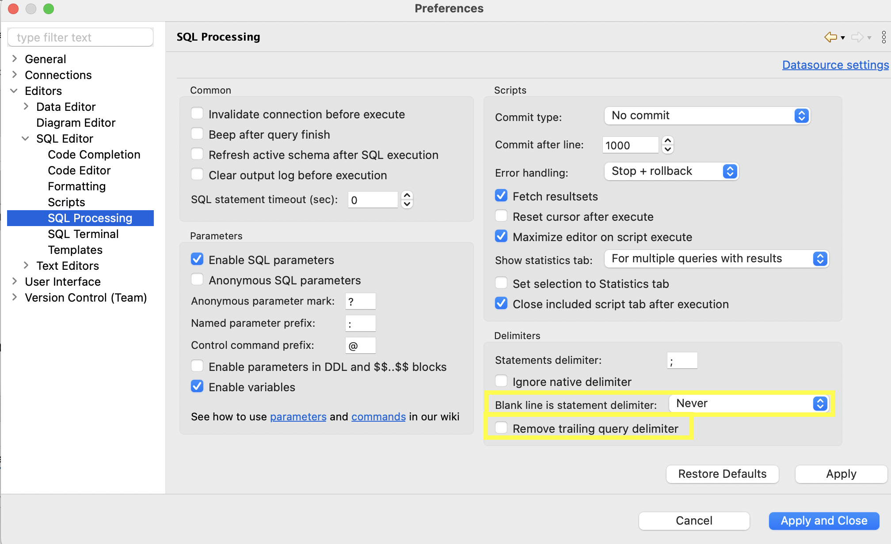

### Disable Removal of Trailing Query Delimiters

Ensures semicolons are preserved when queries are executed.

Navigate to:
Window -> Preferences -> Editors -> SQL Editor -> SQL Processing -> Delimiters

Uncheck **Remove trailing query delimiter**.


### Enable Line Numbers

Navigate to:
Window -> Preferences -> Editors -> Text Editors

Check **Show line numbers**.


### Disable Insert Table Aliases

Navigate to:

Window -> Preferences -> Editors -> SQL Editor -> Code Completion

Set **Insert table aliases** to `N/A`.

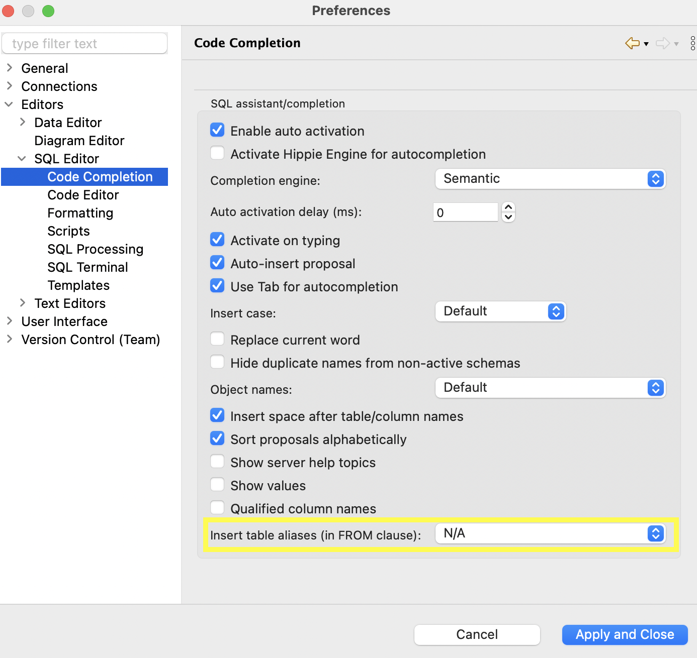

### Use Column Names Instead of Labels

Navigate to:

Window -> Preferences -> Editors -> Data Editor

Check **Use column names instead of column labels**.

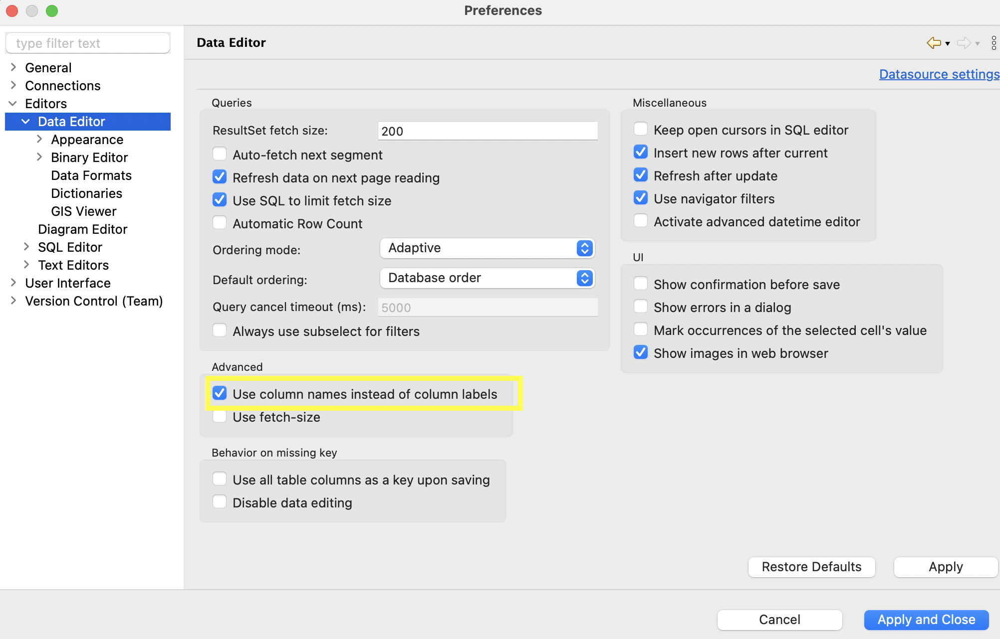


## How-to

### Display the Sum, Min, Max, etc. of a Column

After running a query, click the **Calc** button under the **Panels** menu on the right side of the Answer Set.  


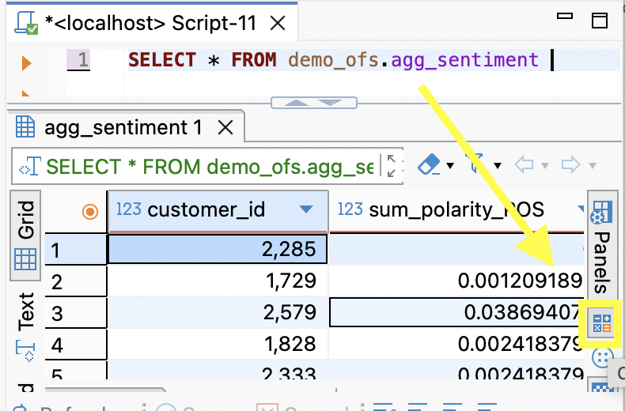

You may see existing calculations such as *Count*. Click the **plus (+)** sign to add more.


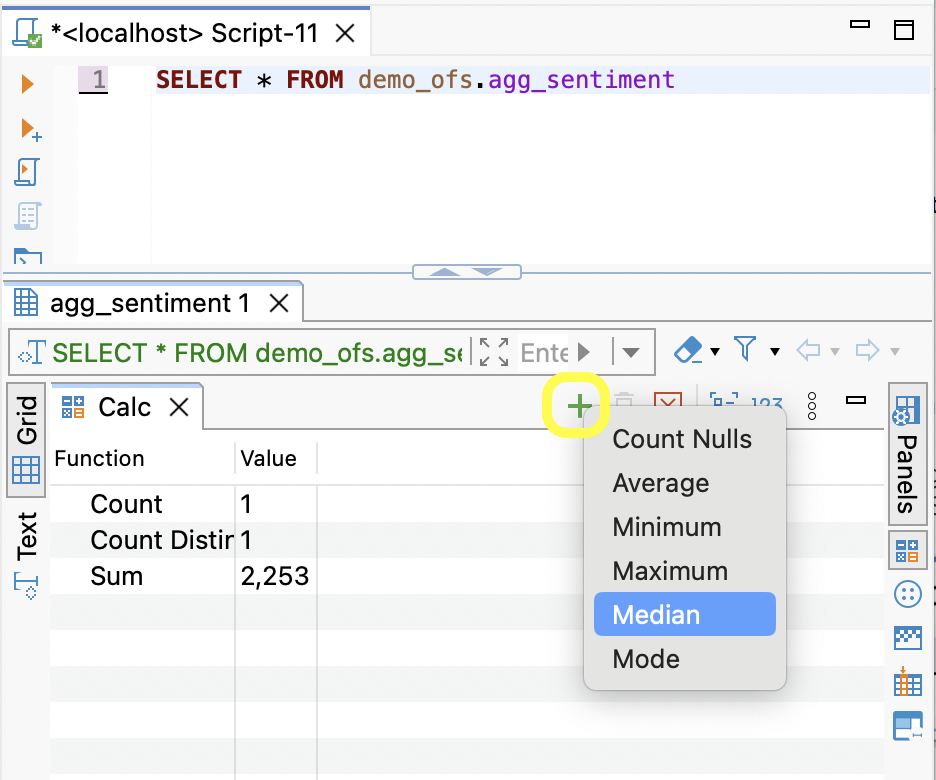

### Change Shortcut Keys

To reassign keyboard shortcuts (e.g., run a query with `F5` instead of `Ctrl+Enter`):

1. Go to `Window` → `Preferences`
2. Search for **Keys** in the search bar and select `Execute SQL query`
3. In the **Binding** section:
   - Remove `Ctrl+Enter`
   - Press the desired key (e.g., `F5`)
   - Click **Apply and Close**


  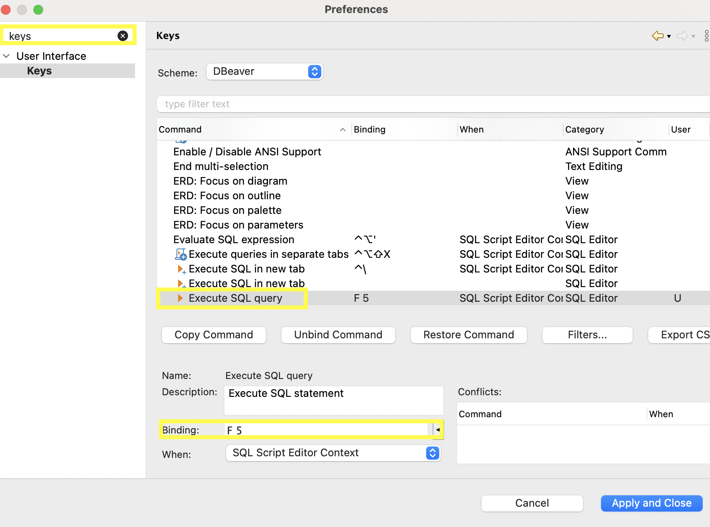


## FAQ

| **Question** | **Answer** |
|--------------|------------|
| How do I copy both headers and data from results? | Select the data, press `Ctrl+Shift+C`, then click **OK** |
| How can I get all rows of data from a query? | DBeaver limits results to 2k rows by default. Right-click the results and select **Read All Rows** or change the limit in settings  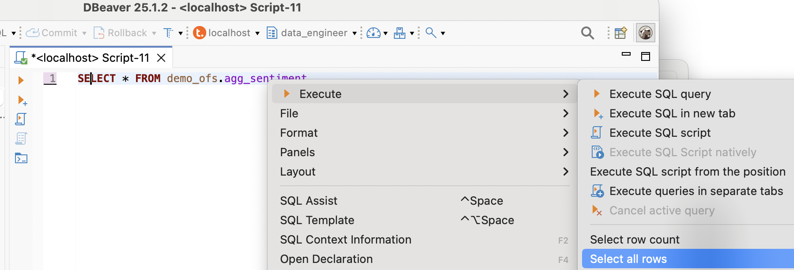|
| How do I duplicate a connection? | Right-click the existing connection and choose **Copy/Paste** |
| How do I run multiple DDL/DML statements? | Use **Execute SQL Script** instead of **Execute SQL Query** |
| How do I change the date format in results? | Teradata defaults to `YYYY-MM-DD`. To change formats, follow DBeaver’s [Managing Data Formats](https://dbeaver.com/docs/dbeaver/Managing-Data-Formats/) guide |
| How can I run parameterized SQL queries (prompted SQL)? | Go to `Editors` → `SQL Editor` → `SQL Processing`, then enable:<br />• **Anonymous SQL parameters**<br />• **Enable parameters in DDL and $$..$$ blocks**<br /><br />Example: `SELECT * FROM my_table WHERE column = :PARAM;` |
| How do I rename a connection? | Right-click the connection and choose **Rename** |


## Summary

This guide demonstrated how to connect to Teradata Vantage using browser-based SSO in DBeaver. This method enables secure enterprise login without manually entering credentials. It also provided recommended DBeaver settings to optimize the experience for Teradata users familiar with SQL Assistant.