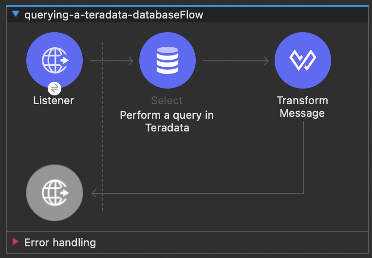
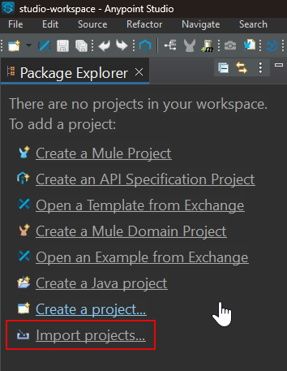
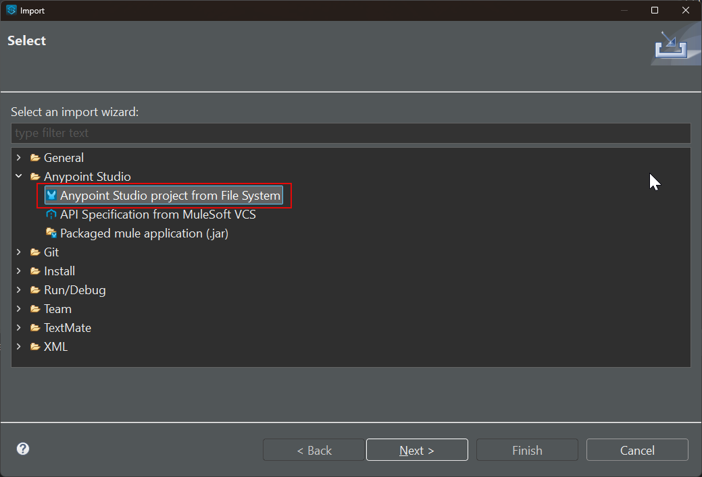
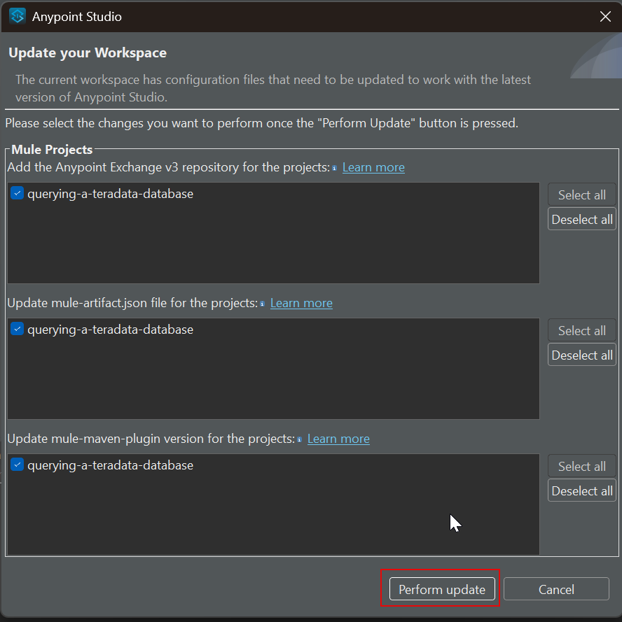

import TrialDocsNote from '../_partials/teradata_trial.mdx'

# Query Teradata from a Mule service

## Overview

This example is a clone of the Mulesoft MySQL sample project.
It demonstrates how to query Teradata and expose results over REST API.

## Prerequisites

* Mulesoft Anypoint Studio. You can download a 30-day trial from https://www.mulesoft.com/platform/studio.
* Access to a Teradata instance.

<TrialDocsNote />

## Example service

This example Mule service takes an HTTP request, queries Teradata and returns results in JSON format.



The Mule HTTP connector listens for HTTP GET requests with the form: `http://<host>:8081/?lastname=<parameter>`.
The HTTP connector passes the value of `<parameter>` as one of the message properties to a database connector.
The database connector is configured to extract this value and use it in this SQL query:

```sql
SELECT * FROM hr.employees WHERE LastName = :lastName
```

As you can see, we are using parameterized query with reference to the value of the parameter passed to the HTTP connector.
So if the HTTP connector receives http://localhost:8081/?lastname=Smith, the SQL query will be:

```sql
SELECT * FROM employees WHERE LastName = 'Smith'
```

The database connector instructs the database server to run the SQL query, retrieves the result of the query, and passes it to the Transform message processor which converts the result to JSON.
Since the HTTP connector is configured as request-response, the result is returned to the originating HTTP client.

## Setup

* Clone `Teradata/mule-jdbc-example` repository:
```bash
  git clone https://github.com/Teradata/mule-jdbc-example
```

* Edit `src/main/mule/querying-a-teradata-database.xml`, find the Teradata connection string `jdbc:teradata://<HOST>/user=<username>,password=<password>` and replace Teradata connection parameters to match your environment.

:::note
Should your Teradata instance be accessible via Teradata Trial, you must replace `<HOST>` with the host URL of your Teradata Trial environment. Additionally, the 'user' and 'password' should be updated to reflect your Teradata Trial environment's username and password.
:::

* Create a sample database in your Teradata instance.
Populate it with sample data.

```sql
 -- create database
 CREATE DATABASE HR
   AS PERMANENT = 60e6, SPOOL = 120e6;

 -- create table
 CREATE SET TABLE HR.Employees (
   GlobalID INTEGER,
   FirstName VARCHAR(30),
   LastName VARCHAR(30),
   DateOfBirth DATE FORMAT 'YYYY-MM-DD',
   JoinedDate DATE FORMAT 'YYYY-MM-DD',
   DepartmentCode BYTEINT
 )
 UNIQUE PRIMARY INDEX ( GlobalID );

 -- insert a record
 INSERT INTO HR.Employees (
   GlobalID,
   FirstName,
   LastName,
   DateOfBirth,
   JoinedDate,
   DepartmentCode
 ) VALUES (
   101,
   'Test',
   'Testowsky',
   '1980-01-05',
   '2004-08-01',
   01
 );
```

* Open the project in Anypoint Studio.
    * Once in Anypoint Studio, click on `Import projects..`:

    

    * Select `Anypoint Studio project from File System`:

    

    * Use the directory where you cloned the git repository as the `Project Root`. Leave all other settings at their default values.

    * If prompted to update the workspace, keep all the default options selected and click **Perform update**.

    

    This updates the project configuration so it is compatible with the current version of Anypoint Studio.

## Run

* Run the example application in Anypoint Studio using the `Run` menu.
The project will now build and run. It will take a minute.
* Go to your web browser and send the following request: http://localhost:8081/?lastname=Testowsky.

You should get the following JSON response:


```json
[
  {
    "GlobalID": 101,
    "FirstName": "Test",
    "LastName": "Testowsky",
    "DateOfBirth": "1980-01-05T00:00:00",
    "JoinedDate": "2004-08-01T00:00:00",
    "DepartmentCode": 1
  }
]
```

## Further reading

* View this [document](http://www.mulesoft.org/documentation/display/current/Database+Connector) for more information on how to configure a database connector on your machine.
* Access plain [Reference material](http://www.mulesoft.org/documentation/display/current/Database+Connector+Reference) for the Database Connector.
* Learn more about [DataSense](http://www.mulesoft.org/documentation/display/current/DataSense).