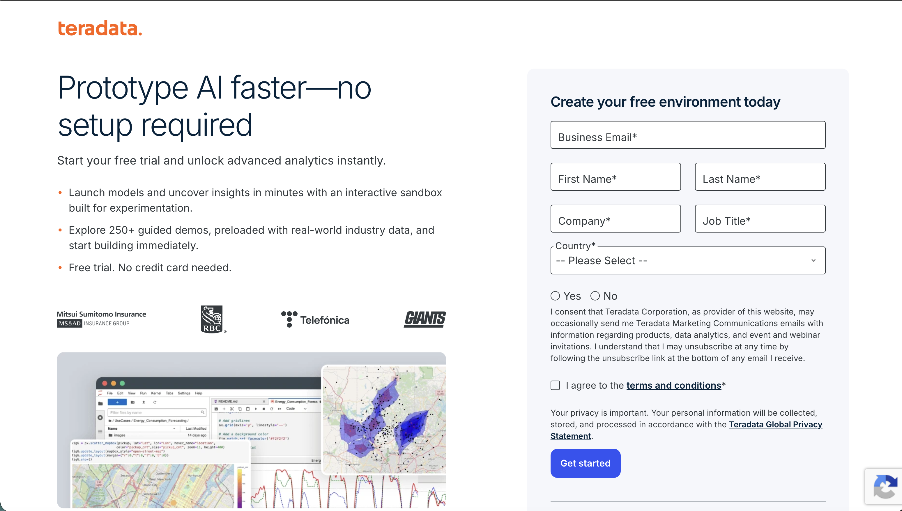
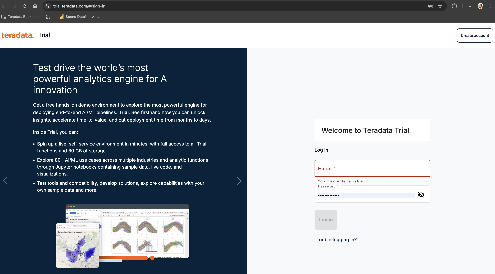
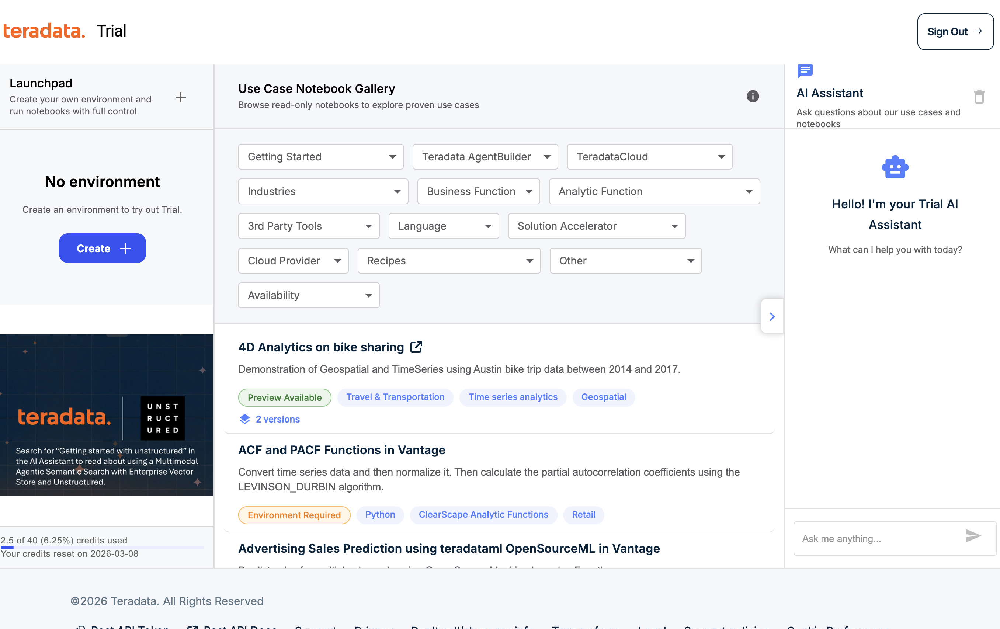
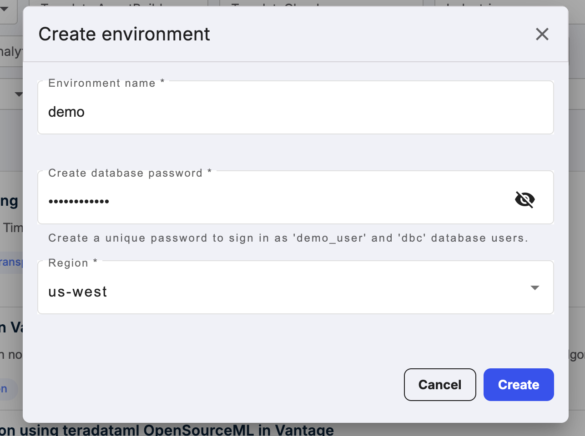
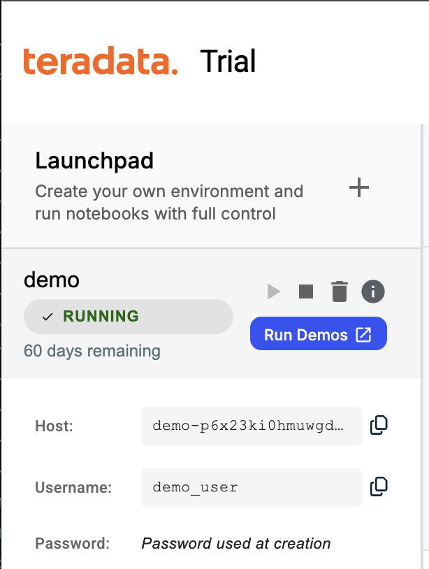
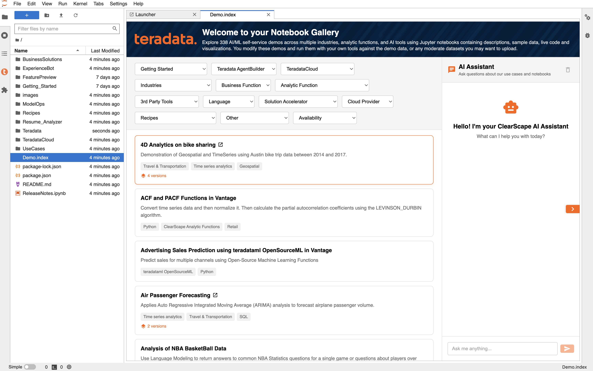

# Getting started with Teradata Trial

## Overview

[Teradata Trial](https://www.teradata.com/try) is a free, non-production environment that gives you hands-on access to the [Teradata Autonomous Knowledge Platform](https://www.teradata.com/platform), including the advanced analytics capabilities built into Teradata Database. Use it to explore demos, run queries, and experience how Teradata activates enterprise intelligence across a wide range of industries and use cases.

In this guide, we walk through the steps for creating an environment in Teradata Trial and accessing the included demos.

  
## Create a Teradata Trial account

Head over to [Teradata Trial](https://www.teradata.com/try) and create a free account.

Sign in to your [Teradata Trial](https://trial.teradata.com/#/sign-in) to create an environment and access demos.

## Create an Environment

Once signed in, click on **CREATE +**

You will need to provide:

| Variable             | Value                                                                 |
|----------------------|-----------------------------------------------------------------------|
| **environment name** | A name for your environment, e.g. "demo"                              |
| **database password**| A password of your choice, this password will be assigned to `dbc` and `demo_user` users |
| **Region**           | Select a region from the dropdown                                     |

:::info
Note down the database password. You will need it to connect to the database.
:::

Click on *CREATE* button to complete the creation of your environment and now, you can see details of your environment.

## Access demos

The Teradata Trial environment includes a variety of demos showing how analytics capabilities in Teradata Database can solve real business problems across many industries.

To access the demos, click **RUN DEMOS USING JUPYTER**. A Jupyter environment opens in a new browser tab.

:::note
You can find all the detail of demos on the demo index page.
:::

## Summary

In this quick start, we learned how to create an environment in Teradata Trial and access demos.

## Further reading

* [Teradata Trial API documentation](https://api.clearscape.teradata.com/api-docs/)
* [Teradata Documentation](https://docs.teradata.com/)

