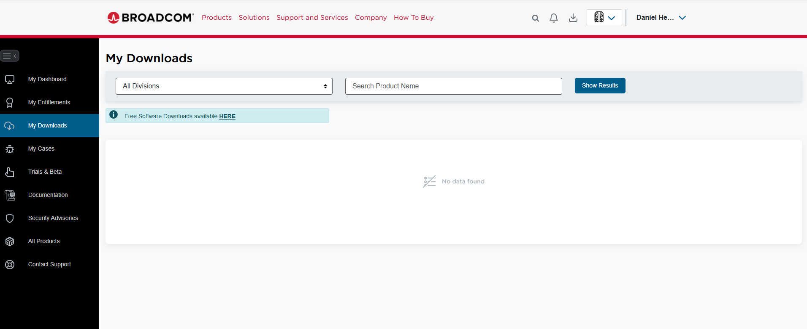

import GettingStartedIntro from '../../_partials/getting-started-intro.mdx';
import RunVantage from '../../_partials/run-vantage.mdx';

# Run Vantage Express on VMware

<GettingStartedIntro />
 
## Prerequisites

1. A computer running one of the following operating systems: Windows, Linux, or Intel-based macOS.
    !!! note
        VMware is supported only on Intel-based Macs. Apple silicon is not currently supported.
2. At least 30GB of available disk space, sufficient CPU resources, and enough RAM to allocate at least one core and 6GB of memory to the virtual machine.
3. Administrator rights to install and run software on your system.

## Installation

### Download required software

* The latest version of [Vantage Express](https://downloads.teradata.com/download/database/teradata-express-for-vmware-player). If you have not previously used the Teradata downloads website, you will need to create an account.
* [VMware Workstation Pro](https://www.vmware.com/products/desktop-hypervisor/workstation-and-fusion).
    * Log in to support.broadcom.com and click the _Free Software Downloads available HERE_ link.
    

    * VMware Workstation Pro is now available as a free download for both personal and commercial use.

### Run installers

1. Run the VMware Workstation Pro installer and accept the default values to complete the installation.

### Run Vantage Express

- Navigate to the directory where you downloaded Vantage Express and double-click the `.ova` file to launch the VM image in VMware Workstation Pro.

<RunVantage />

## Summary

This guide demonstrates how to quickly set up a working Teradata environment using Teradata Vantage Express running in a virtual machine on VMware Workstation Pro.

## Next steps

* [Query data stored in object storage](../../manage-data/nos.md)

## Further reading

* [Teradata® Studio™ and Studio™ Express Installation Guide](https://docs.teradata.com/r/Teradata-VantageTM-Express-Installation-and-Configuration-Guide/Installing-Vantage-Express/Add-Vantage-Express-to-the-VMware-Workstation-Player-Inventory)
