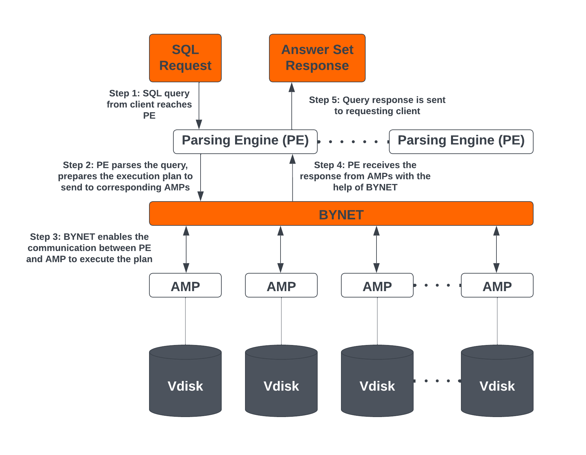
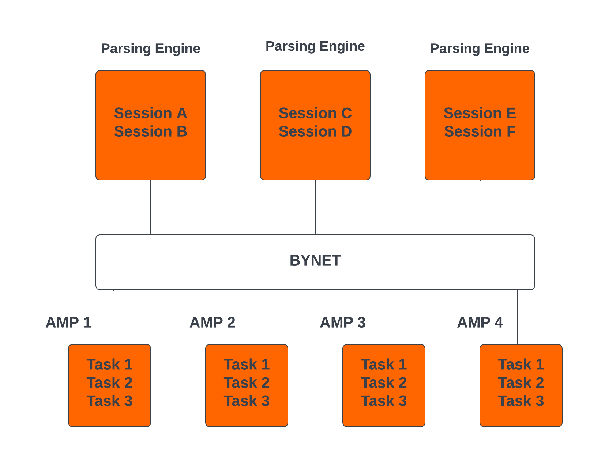
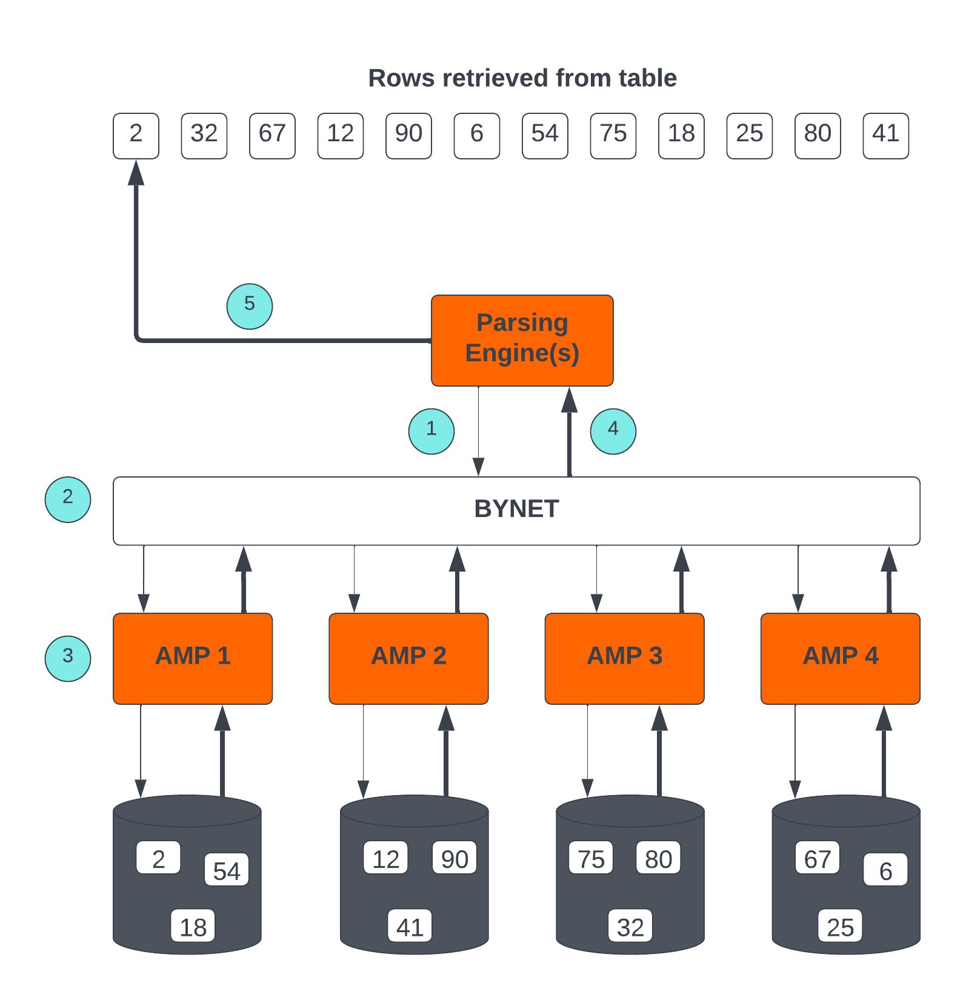
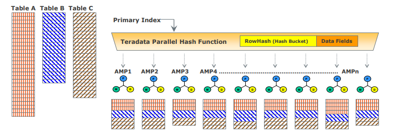

# Teradata Engine Architecture and Concepts

### Overview

This article explains the underlying concepts of Teradata engine architecture. All editions of Teradata use the same engine.  

Teradata's architecture is based on a Massively Parallel Processing (MPP), shared-nothing architecture that enables high-performance data processing and analytics. MPP distributes workloads across multiple vprocs, or virtual processors. The virtual processor responsible for query processing is commonly referred to as Access Module Processor (AMP). Each AMP is isolated from other AMPs, and processes queries in parallel, allowing Teradata to process large volumes of data rapidly. 

The major architectural components of the Teradata engine include the Parsing Engines (PEs), BYNET, Access Module Processors (AMPs), and Virtual Disks (Vdisks). Vdisks are assigned to AMPs in enterprise platforms. 

## Teradata Engine Architecture Components
The Teradata engine consists of the following components:

### Parsing Engines (PEs)
When a SQL query runs in Teradata, it first reaches a Parsing Engine. The functions of the Parsing Engine include:

* Managing individual user sessions (up to 120). 
* Checking whether the objects used in the SQL query exist.  
* Checking whether the user has the required privileges against the objects used in the SQL query.  
* Parsing and optimizing the SQL queries.  
* Preparing the execution plan to execute the SQL query and passing it to the corresponding AMPs. 
* Receiving response from the AMPs and sending it back to the requesting client. 

### BYNET 
BYNET is a system that enables component communication. The BYNET system provides high-speed bi-directional broadcast, multicast, and point-to-point communication and merge functions. It performs key functions such as coordinating multi-AMP queries, reading data from multiple AMPs, regulating message flow to prevent congestion, and processing platform throughput. These functions of BYNET make Teradata highly scalable and enable its Massively Parallel Processing (MPP) capabilities.  

### Parallel Database Extensions (PDE)
Parallel Database Extensions (PDE) is an intermediary software layer positioned between the operating system and Teradata database. PDE enables MPP systems to use features such as BYNET and shared disks. It facilitates the parallelism that is responsible for the speed and linear scalability of Teradata database.  

### Access Module Processors (AMPs)
AMPs are responsible for data storage and retrieval. Each AMP is associated with its own set of Virtual Disks (Vdisks) where data is stored, and no other AMP can access that content in line with the shared-nothing architecture. The functions of an AMP include:

* Accessing storage using Teradata's Block File System Software.  
* Lock management. 
* Sorting rows. 
* Aggregating columns. 
* Join processing. 
* Output conversion. 
* Disk space management. 
* Accounting. 
* Recovery processing. 

### Virtual Disks (Vdisks)
Virtual Disks are units of storage space owned by an AMP. Vdisks hold user data, such as rows within tables, and map to physical space on a disk.

### Node
A node, in the context of Teradata systems, represents an individual server that functions as a hardware platform for the database software. It serves as a processing unit where database operations are executed under the control of a single operating system. 
When Teradata is deployed in a cloud, it follows the same MPP, shared-nothing architecture, but the physical nodes are replaced with virtual machines (VMs). 

## Teradata Architecture Concepts
The concepts below are applicable to Teradata.

### Linear Growth and Expandability 
Teradata is a linearly expandable RDBMS. As workload and data volume increase, adding hardware resources such as servers or nodes results in a proportional increase in performance and capacity. Linear Scalability allows for increased workload without reducing throughput.  

### Teradata Parallelism  
Teradata parallelism refers to the ability of Teradata Database to process data and queries across multiple nodes and components simultaneously.

* Each Parsing Engine (PE) can manage up to 120 sessions concurrently.
* BYNET enables parallel handling of all message activity, including data redistribution for subsequent tasks. 
* Access Module Processors (AMPs) can work together in parallel to serve incoming requests. 
* Each AMP can work on multiple requests concurrently, enabling efficient parallel processing.  

### Teradata Retrieval Architecture
The key steps involved in Teradata Retrieval Architecture are:

1. The Parsing Engine sends a request to retrieve one or more rows. 
2. BYNET activates the relevant AMP or AMPs for processing. 
3. The AMP or AMPs locate and retrieve the requested rows through parallel access. 
4. BYNET returns the retrieved rows to the Parsing Engine. 
5. The Parsing Engine delivers the rows back to the requesting client application. 

### Teradata Data Distribution
Teradata's MPP architecture requires an efficient way to distribute and retrieve data, and does so using hash partitioning. Most tables in Teradata use hashing to distribute rows across AMPs based on the Primary Index (PI) value for each row. The data is stored in the Block File System (BFS), and Teradata may scan the entire table or use indexes to access the data, depending on the query. This approach ensures scalable performance and efficient data access.

* If the Primary Index is unique, the rows in the tables are automatically distributed evenly by hash partitioning. 
* The designated Primary Index column or columns are hashed to generate consistent hash codes for the same values. 
* No reorganization, repartitioning, or space management is required. 
* Each AMP typically contains rows from all tables, ensuring efficient data access and processing. 

## Conclusion 
In this article, we covered the major architectural components of Teradata, such as Parsing Engines (PEs), BYNET, Access Module Processors (AMPs), Virtual Disks (Vdisks), Parallel Database Extension (PDE), and nodes. We also covered essential Teradata architectural concepts such as linear growth and expandability, parallelism, data retrieval, and data distribution.   

## Further Reading 
* [Parsing Engine](https://docs.teradata.com/r/Enterprise_IntelliFlex_VMware/Database-Introduction/Vantage-Hardware-and-Software-Architecture/Virtual-Processors/Parsing-Engine)
* [BYNET](https://www.teradata.com/Blogs/What-Is-the-BYNET-and-Why-Is-It-Important-to-Vantage)
* [Access Module Processor](https://docs.teradata.com/r/Enterprise_IntelliFlex_VMware/Database-Introduction/Vantage-Hardware-and-Software-Architecture/Virtual-Processors/Access-Module-Processor)
* [Parallel Database Extensions](https://docs.teradata.com/r/Enterprise_IntelliFlex_VMware/Database-Introduction/Vantage-Hardware-and-Software-Architecture/Parallel-Database-Extensions)
* [Teradata Data Distribution and Data Access Methods](https://docs.teradata.com/r/Enterprise_IntelliFlex_VMware/Database-Introduction/Data-Distribution-and-Data-Access-Methods)
