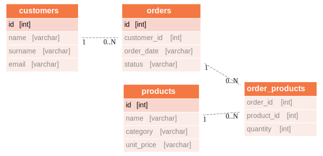
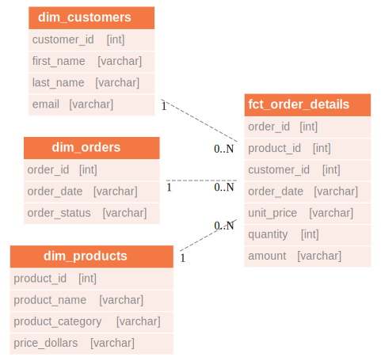

import TrialDocsNote from '../_partials/teradata_trial.mdx'

# Advanced dbt use cases with Teradata

## Overview

This project showcases the integration of dbt with Teradata from an advanced user perspective.
If you are new to data engineering with dbt we recommend that you start with our [introductory project.](dbt.md)

The advanced use cases showcased in the demo are the following:

* Incremental materializations
* Utility macros
* Optimizing table/view creations with Teradata-specific modifiers

The application of these concepts is illustrated through the ELT process of `teddy_retailers`, a fictional store.

## Prerequisites

* Access to a Teradata instance.

    <TrialDocsNote />

* Python **3.9**, **3.10**, **3.11**, **3.12** or **3.13** installed.

* [uv](https://docs.astral.sh/uv/) installed for Python environment and package management.

* A database client for running database commands, we recommend [Teradata SQL Extension for Visual Studio Code](https://downloads.teradata.com/download/tools/teradata-sql-extension-visual-studio-code).


## Demo project setup

1. Clone the tutorial repository and cd into the project directory:
    ```bash
    git clone https://github.com/Teradata/teddy_retailers_dbt-dev teddy_retailers
    cd teddy_retailers
    ```

2. Create a new Python virtual environment and install dbt and its dependencies:
    ```bash
    uv venv .venv
    uv pip install dbt-teradata dbt-core
    ```

3. Install the project's dependencies `dbt-utils` and `teradata-utils`. This can be done through the following command:

    ```bash
    uv run dbt deps
    ```

## Data setup

The demo project assumes that the source data is already loaded into your Teradata instance, this mimics the way that dbt is used in a production environment.
To achieve this objective we provide public datasets available in Google Cloud Platform (GCP), and scripts to load those datasets in Teradata.

1. Create or select a working database. The dbt profile in the project points to a database called `teddy_retailers`. You can change the `schema` value to point to an existing database in your Teradata system or you can create the `teddy_retailers` database running the following script in your database client:
    ```sql
    CREATE DATABASE teddy_retailers
    AS PERMANENT = 110e6,
        SPOOL = 220e6;
    ```
2. Load initial data set.
Run the scripts in the `references/inserts/` folder of the project in your database client, in this order:

    1. `create_db.sql` — creates the `teddy_retailers` database and the `nos_auth` authorization object needed for GCS access.
    2. `create_data.sql` — loads the four source tables from Google Cloud Storage using Teradata NOS.

    Each table should load in under 10 seconds. Expected row counts: `source_products` (50), `source_customers` (1,000), `source_orders` (858), `source_order_products` (9,131).

## Configure dbt

We will now configure dbt to connect to Teradata.
Create the file `$HOME/.dbt/profiles.yml` with the following content. Adjust `<host>`, `<user>`, `<password>` to match your Teradata credentials.
If you have already used dbt before in your environment you only need to add a profile for the project in your home's directory `.dbt/profiles.yml` file.
If the directory .dbt doesn't exist in your system yet you will need to create it and add the profiles.yml to manage your dbt profiles.

 
```bash
teddy_retailers:
  outputs:
    dev:
      type: teradata
      host: <host>
      user: <user>
      password: <password>
      logmech: TD2
      schema: teddy_retailers
      tmode: ANSI
      threads: 1
      timeout_seconds: 300
      priority: interactive
      retries: 1
  target: dev
```

Now, that we have the profile file in place, we can validate the setup:

```bash
uv run dbt debug
```

If the debug command returned errors, you likely have an issue with the content of `profiles.yml`.

## About the Teddy Retailers warehouse

As mentioned, `teddy_retailers` is a fictional store.
Through dbt driven transformations we transform source data ingested from the`teddy_retailers` transactional database into a star schema ready for analytics.

### The data models

The source data consists of the following tables customers, orders, products, and order_products, according to the following Entity Relations Diagram:



Using dbt, we leverage the source data tables to construct the following dimensional model, which is optimized for analytics tools.



### The sources

* For Teddy Retailers, the `orders` and `order_products` sources are periodically updated by the organization's ELT (Extract, Load, Transform) process.
* The updated data only includes the latest changes rather than the entire dataset due to its large volume.
* To address this challenge, it is necessary to capture these incremental updates while preserving the previously available data.

## The dbt models

The `schema.yml` file in the project's models directory specifies the sources for our models. These sources align with the data we loaded from GCP using our SQL scripts.

### Staging area

The staging area models are merely ingesting the data from each of the sources and renaming each field, if appropiate.
In the schema.yml of this directory we define basic integrity checks for the primary keys.

### Core area

The following advanced dbt concepts are applied in the models at this stage:

#### Incremental materializations

The `schema.yml` file in this directory specifies that the materializations of the two models we are building are incremental.
We employ different strategies for these models:

* For the `all_orders model`, we utilize the delete+insert strategy. This strategy is implemented because there may be changes in the status of an order that are included in the data updates.
* For the `all_order_products` model, we employ the default append strategy. This approach is chosen because the same combination of `order_id` and `product_id` may appear multiple times in the sources.
This indicates that a new quantity of the same product has been added or removed from a specific order.

#### Macro assisted assertions

Within the `all_order_products` model, we have included an assertion with the help of a macro to test and guarantee that the resulting model encompasses a unique combination of `order_id` and `product_id`. This combination denotes the latest quantity of products of a specific type per order.

#### Teradata modifiers

For both the `all_order` and `all_order_products` models, we have incorporated Teradata modifiers to enhance tracking of these two core models.
To facilitate collecting statistics, we have added a `post_hook` that instructs the database connector accordingly. Additionally, we have created an index on the `order_id` column within the `all_orders` table.


## Running transformations

### Create dimensional model with baseline data

By executing dbt, we generate the dimensional model using the baseline data.


``` bash
uv run dbt run
```

This will create both our core and dimensional models using the baseline data.

### Test the data

We can run our defined test by executing:

 
```bash
uv run dbt test
```

### Running sample queries

The `references/query` path contains the following sample business intelligence queries:

* `consult_customers.sql` — customer dimension analysis
* `consult_orders.sql` — order facts analysis
* `consult_products.sql` — product dimension analysis
* `get_stats.sql` — statistical summaries

Run these queries in your database client after `uv run dbt run` has completed successfully and the target tables exist.

### Mocking the ELT process

The scripts for loading updates into the source data set can be found in the `references/inserts/update_data.sql` path of the project. Execute it in your database client after completing the steps above.

After updating the data sources, you can proceed with the aforementioned steps: running dbt, testing the data, and executing sample queries. This will allow you to visualize the variations and incremental updates in the data.

## Summary

In this tutorial, we explored the utilization of advanced dbt concepts with Teradata+.
The sample project showcased the transformation of source data into a dimensional data mart.
Throughout the project, we implemented several advanced dbt concepts, including incremental materializations, utility macros, and Teradata modifiers.
