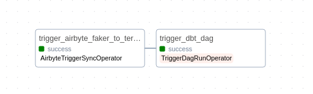

import ClearscapeDocsNote from '../_partials/vantage_clearscape_analytics.mdx'
import CommunityLink from '../_partials/community_link.mdx'
import ProfileTabs from '../_partials/tabsDBTProfiles.mdx'

# Automate Data Movement and Transformation with Airflow, Airbyte, and dbt in Teradata Vantage

## Overview

This tutorial demonstrates how to leverage Apache Airflow as orchestration tool to automate the movement of data from a source to Teradata using Airbyte. Once the data is in Teradata, trigger dbt to perform transformations, ensuring the data is clean, reliable and ready for analysis.

## Prerequisites

* Access to a Teradata Vantage instance.

    <ClearscapeDocsNote />

* Python **3.10** or later installed.

* [Docker and Docker Compose (Docker Desktop)](https://docs.docker.com/get-started/get-docker/)

* [Airbyte command line tool](https://docs.airbyte.com/using-airbyte/getting-started/oss-quickstart)

## Demo project setup

1. Clone the tutorial repository and cd into the project directory:
```bash
git clone https://github.com/teradata/quickstarts.git
cd quickstarts
```

2. Navigate to the directory:
```bash
cd airbyte_dbt_airflow_teradata
```
Open the code in your preferred IDE.


## Setting up Teradata instance
Follow the instructions from [Getting started with ClearScape Analytics Experience](https://developers.teradata.com/quickstarts/get-access-to-vantage/clearscape-analytics-experience/getting-started-with-csae/) and acquire following:

*  Host
* username
* password

Jot it down, it will be needed in next step.

## Edit `profiles.yml` file
Navigate to `dbt_project` folder, open `profiles.yml` file, it contains configuration for dbt to connect with your data platform. Update this file with your Teradata connection details:
* Host (from previous step)
* username (from previous step)
* password (from previous step)
* schema: `airbyte_td`

And move the file in location shown below:

<ProfileTabs/>

## Airbyte setup

1. After you install Airbyte OSS locally using `abctl`:

```bash
abctl local install
```

2. Generate and copy the credentials:

```bash
abctl local credentials
```

You can learn more about it from [here](https://docs.airbyte.com/using-airbyte/getting-started/oss-quickstart)

3. Create a source
    * Go to the Sources tab and click on `+ New source`.
    * Search for “faker” using the search bar and select `Sample Data (Faker)`.
    * Adjust the Count and optional fields as needed for your use case. You can also leave as is.
    * Click on `Set up source`.

4. Create a destination

    * Go to the Destinations tab and click on `+ New destination`.
    * Search for “teradata” using the search bar and select `Teradata Vantage`.
    * Enter the connection details as needed.
    * Click on `Set up destination`.

5. Create a connection

    * Go to the Connections tab and click on `+ New connection`.
    * Select the source and destination you just created.
    * Enter the connection details as needed.
    * Click on `Set up connection`.


6.Airbyte `connection id`

On the connection page,  from the URL, copy the value between `connections` and `status` 


This will be needed later in the Airflow setup.

## dbt setup

The dbt project is already present in the `dbt_project` folder. 

1. Navigate to the folder.

```bash
cd dbt_project
```

2. Create a Python virtual environment

```bash
python -m venv env
```

3. Activate the environment

```bash
source env/bin/activate
```

for Mac, Linux, or

```bash
env\Scripts\activate
```

for Windows

4. Install `dbt-teradata` and `dbt-core` modules

```bash
pip install dbt-teradata
```

```bash
pip install dbt-core>=1.8.0
```

5. Test the connection

```bash
dbt debug
```

If the output of above command is `All checks passed!` then we are good to move forward, else, check the values entered in `profiles.yml` and also make sure all the modules are installed correctly.

## Airflow setup

Airflow is at the center of the whole tutorial. It is responsible for making Airbyte move data to Teradata and triggering dbt to transform the data.

1. Navigate to `orchestration` directory

```bash
cd ..
cd orchestration
```

The directory contains environment file, if it is named as `.env.example`, then change it to `.env`.

Make sure that your docker is running, it is imperative for next steps.

2. Build custom Airflow image

```bash
docker compose build
```

3. Launch Airflow container

```bash
docker compose up
```

This might take a few minutes initially as it sets up necessary databases and metadata.

4. Airflow UI

    * Open Airflow UI by pasting `http://localhost:8080` to browser of your choice.
    * Default username and password is `airflow` (unless you changed it in `.env` file)


5. Airflow connection with Airbyte

Setting up connection in Airflow is necessary for using Airbyte and dbt both.

    * Go to the "Admin" > "Connections" tab
    * Click on the + button to create a new connection     
    * Edit the page with following values
        * `Connection id`:airbyte_connection
        * `Connection Type`:Airbyte
        * `Host`:host.docker.internal
        * `Port`:8000
        * `Login`:Your Airbyte username
        * `Password`:Your airbyte password (you can get it by running `abctl local credentials` command in terminal)
    * Click on the `Test` button, and make sure you get a `Connection successfully tested` message at the top. Then, you can `Save` the connection.


6. Link Airbyte connection to the Airflow DAG

To execute the DAG in Airflow to trigger Airbyte, `connection_id` needs to be edited in `elt_dag.py` file

    * On the connection page,  from the URL, copy the value between `connections` and `status`. This will be `connection_id`'s value 


    * Open `elt_dag.py` file inside the `airflow/dags` directory and add your Airbyte connection id on `line 28`


## Orchestration with Airflow

After making sure all the steps till now is working fine, it is time to run your data pipeline.

1. In Airflow UI, go to `DAGs` section, locate `elt_dag` and click on "Trigger DAG" under the "Action" column.


This will initiate the complete data pipeline, starting with the Airbyte sync from Faker to Teradata, followed by dbt transforming the raw data into `staging` and `marts` models.



2. Confirm the sync status in the Airbyte UI.

3. After dbt jobs completion, check the Teradata to see the newly created views in the `transformed_data` dataset. This can be done by using Teradata Studio or other database client UI tools.

## Conclusion

After completing all the above steps, you should have a working stack of Airbyte, dbt and Airflow with Teradata. It can be used as starting point for your projects and can be adapted as per your scenario.