import ClearscapeDocsNote from '../_partials/vantage_clearscape_analytics.mdx'
import CommunityLink from '../_partials/community_link.mdx'
import ProfileTabs from '../_partials/tabsDBTProfiles.mdx'

# Automate Data Movement and Transformation with Airflow, Airbyte, and dbt in Teradata Vantage

## Overview

This quickstart demonstrates how to leverage Apache Airflow as orchestration tool to automate the movement of data to Teradata using Airbyte. Once the data is in Teradata, trigger dbt to perform transformations, ensuring the data is clean, reliable and ready for analysis.

## Prerequisites

* Access to a Teradata Vantage instance.

    <ClearscapeDocsNote />

* [Python](https://www.python.org/downloads/) **3.10** or later installed.

* [Docker and Docker Compose (Docker Desktop)](https://docs.docker.com/get-started/get-docker/)

* [Airbyte command line tool](https://docs.airbyte.com/using-airbyte/getting-started/oss-quickstart)

## Demo project setup

1. Clone the tutorial repository:
```bash
git clone https://github.com/Teradata/airflow-demos.git
```

2. Navigate to the directory:
```bash
cd airflow-demos/airbyte_dbt_airflow_teradata
```
Open the code in your preferred IDE.


## Setting up Teradata instance
Follow the instructions from [Getting started with ClearScape Analytics Experience](https://developers.teradata.com/quickstarts/get-access-to-vantage/clearscape-analytics-experience/getting-started-with-csae/) and acquire following:

*  Host
* Username
* Password

Jot it down, it will be needed in next step.

## Airbyte setup

1. After you install Airbyte OSS locally using `abctl`, generate and copy the credentials:

```bash
abctl local credentials
```

:::note 
At the moment of writing this quickstart, Airbyte installed with `abctl` performs unauthenticated pulls even if you pass in Docker credentials: https://github.com/airbytehq/airbyte/issues/46309. Since Docker limits unauthenticated pulls you may encounter `429 Too Many Requests` error. If you run into this error, launch Airbyte using `run-ab-platform.sh` scruot as described in [the Airbyte quickstart](https://developers.teradata.com/quickstarts/manage-data/use-airbyte-to-load-data-from-external-sources-to-teradata-vantage/#airbyte-open-source).
:::

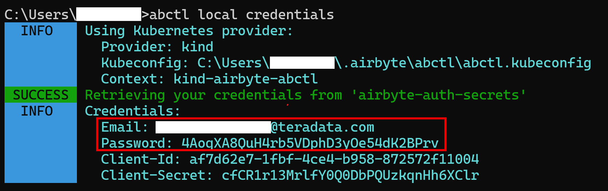

You can learn more about it from [here](https://docs.airbyte.com/using-airbyte/getting-started/oss-quickstart)

2. Launch Airbyte UI by opening [http://localhost:8000/](http://localhost:8000/ ) in your preferred browser and login with credentials from previous step.

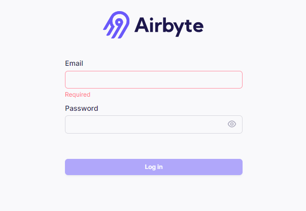


3. Create a source
    * Go to the Sources tab and click on `+ New source`.
    * Search for “faker” using the search bar and select `Sample Data (Faker)`.
    * Adjust the Count and optional fields as needed for your use case. You can also leave as is.
    * Click on `Set up source`.

4. Create a destination

    * Go to the Destinations tab and click on `+ New destination`.
    * Search for “teradata” using the search bar and select `Teradata Vantage`.
    * Enter the connection details as needed.
        * Host (your Teradata instance hostname)
        * Password (your Teradata instance password)
        * Default Schema ('ecommerce')
    * Click on `Set up destination`.

    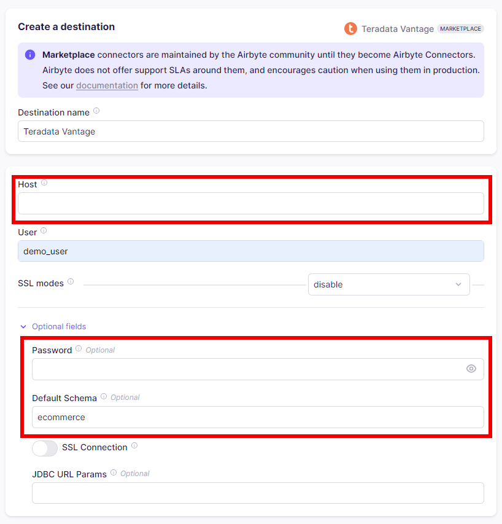

5. Create a connection

    * Go to the Connections tab and click on `+ New connection`.
    * Select the source and destination you just created.
    * Enter the connection details as needed.
    * Click on `Set up connection`.

    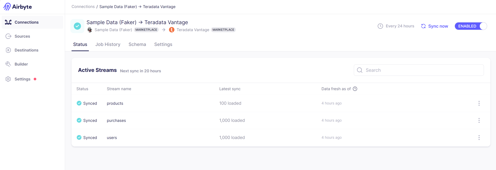

## Airflow setup

Airflow is at the center of the whole tutorial. It is responsible for making Airbyte move data to Teradata and trigger dbt to transform the data.

1. Navigate to `orchestration` directory

```bash
cd orchestration
```

2. Change the environment file name from `.env.example` to `.env`.

3. Link Airbyte connection to the Airflow DAG

    * To execute the DAG in Airflow to trigger Airbyte, `connection_id` needs to be edited in `elt_dag.py` file
    * On the connection page,  from the URL, copy the part between `connections` and `status`. It is the value of `connection_id` variable. 

    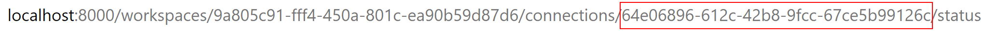

    * Open `elt_dag.py` file inside the `airflow/dags` directory and add your Airbyte connection id on `line 28`

    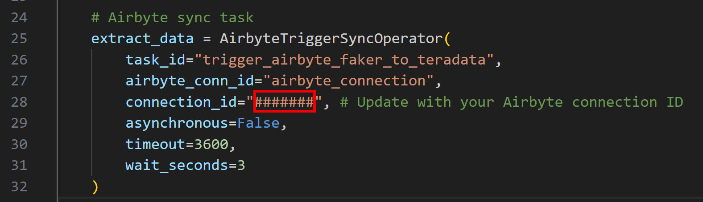

4. Build custom Airflow image

```bash
docker compose build
```

5. Launch Airflow container

```bash
docker compose up
```

This might take a few minutes initially as it sets up necessary databases and metadata.

6. Open Airflow UI

    * Open Airflow UI by pasting `http://localhost:8080` to browser of your choice.
    * Default username and password is `airflow` (unless you changed it in `.env` file)


7. Create Airflow connection with Airbyte

    * Go to the `Admin` > `Connections` tab
    * Click on the + button to create a new connection     
    * Edit the page with following values
        * `Connection id`:airbyte_connection
        * `Connection Type`:Airbyte
        * `Host`:host.docker.internal
        * `Port`:8000
        * `Login`:Your Airbyte username
        * `Password`:Your airbyte password (you can get it by running `abctl local credentials` command in terminal)
    * Click on the `Test` button, and make sure you get a `Connection successfully tested` message at the top. Then, you can `Save` the connection.

    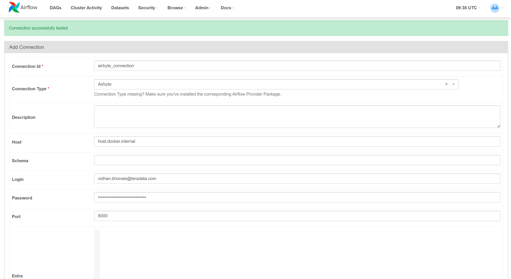

8. Create Airflow connection with Teradata

 * Go to the `Admin` > `Connections` tab
    * Click on the + button to create a new connection     
    * Edit the page with following values
        * `Connection id`:teradata_connection
        * `Connection Type`:Teradata
        * `Database Server URL`:Your Teradata instance hostname
        * `Username`:demo_user 
        * `Password`:Your Teradata instance password
    * Click on the `Test` button, and make sure you get a `Connection successfully tested` message at the top. Then, you can `Save` the connection.

    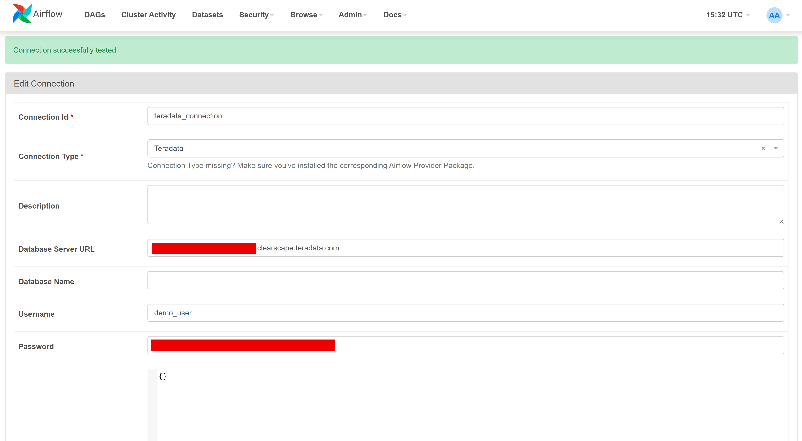


## Orchestration with Airflow

After making sure all the steps till now is working fine, it is time to run your data pipeline.

1. Make sure all the workflows are enabled.

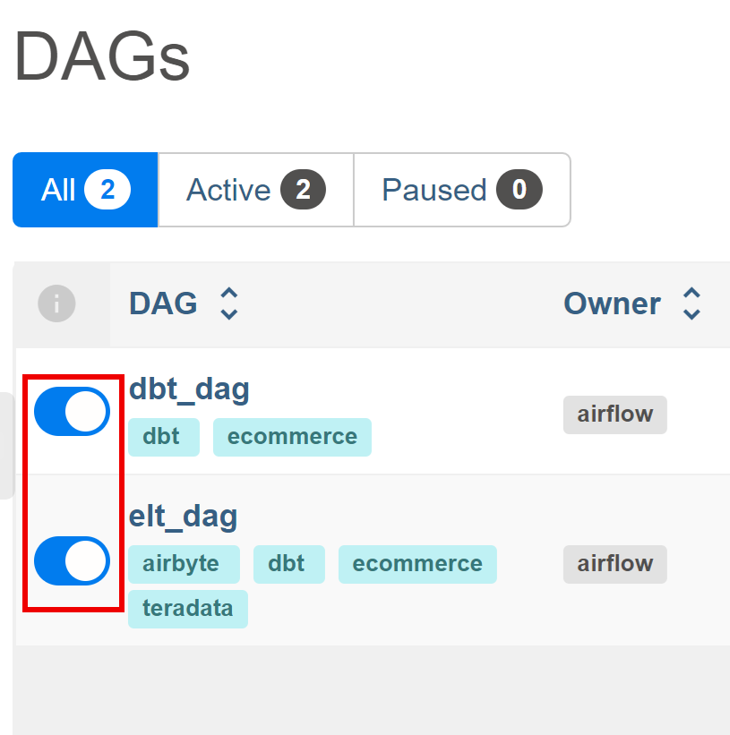

2. In Airflow UI, go to `DAGs` section, locate `elt_dag` and click on "Trigger DAG" under the "Action" column.
    * This will initiate the complete data pipeline, starting with the Airbyte sync from Faker to Teradata, followed by dbt transforming the raw data into `staging` and `marts` models.
    * The status of `elt_dag` can be check by clicking on `elt_dag` and then on `Graph`.

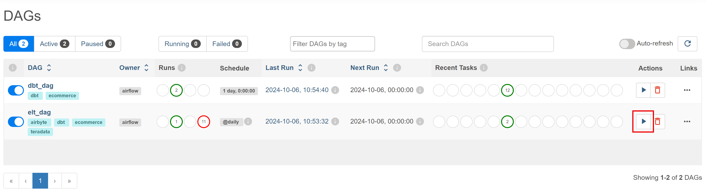

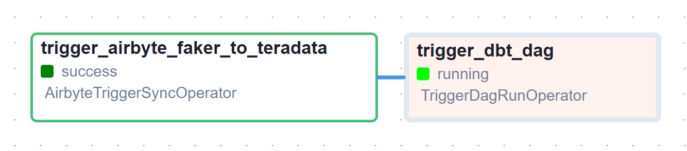

3. Confirm the sync status in the Airbyte UI.

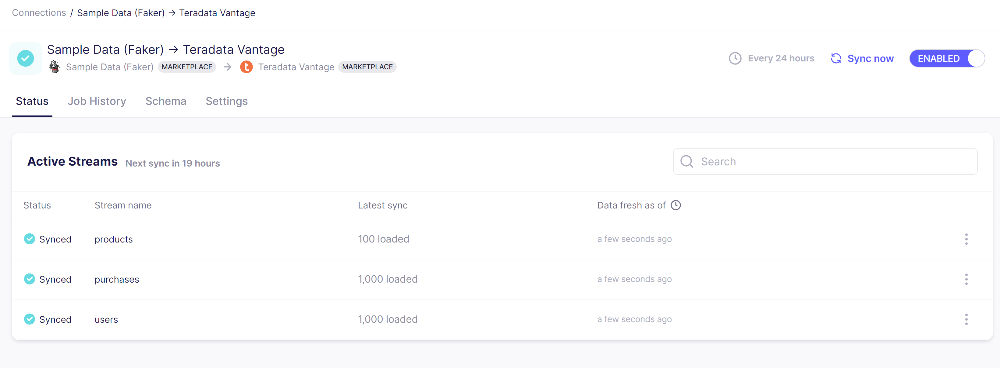

4. After the  completion of both the DAGs, check the `dbt_dag` graph.

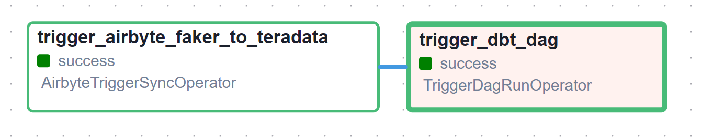

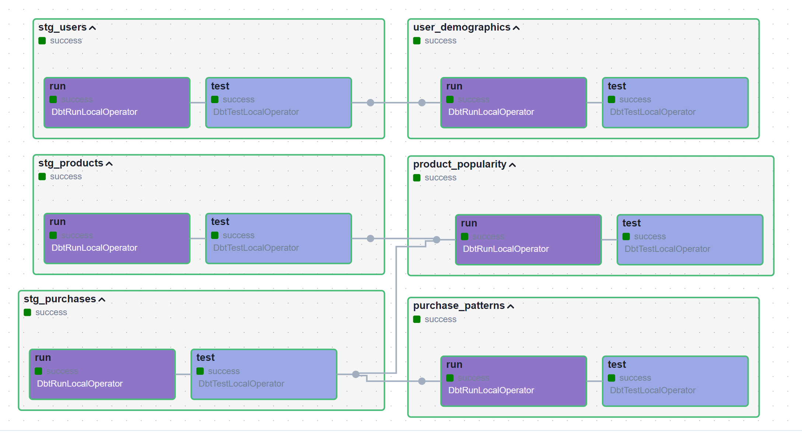


:::note
The dbt project is present in the `dbt_project` folder and is handled by Airflow with the help of [Astronomer Cosmos](https://pypi.org/project/astronomer-cosmos/)
:::

5. You can check the newly created views in the `transformed_data` dataset on Teradata Vantage. This can be done by using Teradata Studio or other database client UI tools like [DBeaver](https://dbeaver.io/download/).

## Conclusion

After completing all the above steps, you should have a working stack of Airbyte, dbt and Airflow with Teradata. It can be used as starting point for your projects and can be adapted as per your scenario.