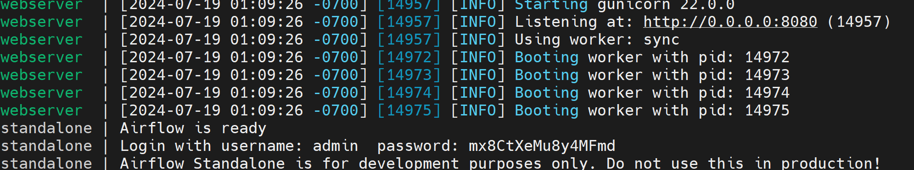
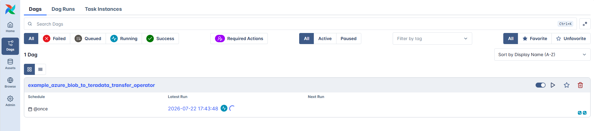

import TrialDocsNote from '../_partials/teradata_trial.mdx'

# Data Transfer from Azure Blob to Teradata Using Apache Airflow

## Overview

This document provides instructions and guidance for transferring data in CSV, JSON and Parquet formats from Microsoft Azure Blob Storage to Teradata using the Airflow Teradata Provider and the [Azure Cloud Transfer Operator](https://airflow.apache.org/docs/apache-airflow-providers-teradata/stable/operators/azure_blob_to_teradata.html). It outlines the setup, configuration and execution steps required to establish a seamless data transfer pipeline between these platforms.

!!! note
    On Windows, use [Windows Subsystem for Linux (WSL)](https://learn.microsoft.com/en-us/windows/wsl/install) to complete this quickstart.

## Prerequisites
* Access to a Teradata instance, version 17.10 or higher.
    <TrialDocsNote />
* Python 3.10, 3.11, or 3.12 installed.
* `uv` installed. To install `uv` on Linux, WSL, or macOS, run: 
   
   ```bash
   curl -LsSf https://astral.sh/uv/install.sh | sh
   ```

   Restart the terminal and verify the installation:

   ```bash
   uv --version
   ```
   
## Install Apache Airflow

1. Create and activate a Python virtual environment.

    ```bash
    uv venv airflow_env
    source airflow_env/bin/activate
    ```

2. Install Apache Airflow 3.2.2.

    ```bash
    AIRFLOW_VERSION=3.2.2
    uv pip install "apache-airflow==${AIRFLOW_VERSION}"
    ```

3. Install the Airflow Teradata provider with Microsoft Azure support.

    ```bash
    uv pip install "apache-airflow-providers-teradata[microsoft.azure]"
    ```

4. Set the `AIRFLOW_HOME` environment variable.

    ```bash
    export AIRFLOW_HOME=~/airflow-azure-quickstart
    ```

## Configure Apache Airflow

Configure the environment variables to enable the test connection functionality and prevent sample DAGs from loading in the Airflow UI.

```bash
export AIRFLOW__CORE__TEST_CONNECTION=Enabled
export AIRFLOW__CORE__LOAD_EXAMPLES=false
```

## Start Apache Airflow

1. Start Airflow Standalone.

    ```bash
    airflow standalone
    ```

2. Open [http://localhost:8080](http://localhost:8080) in a browser. Log in with the `admin` username and the password displayed in the terminal.

    

## Define the Apache Airflow connection to Teradata

1. In the Airflow UI, select **Admin > Connections**.
2. Click **Add Connection**.
3. Configure the connection using the following details:
    * Connection Id: `teradata_default`
    * Connection Type: `Teradata`
    * Database Server URL: Teradata instance hostname.
    * Database: Database name.
    * Login: Database user.
    * Password: Database user password.
4. Save the connection.
5. Open the saved connection and test it.

Refer to the [Teradata Connection](https://airflow.apache.org/docs/apache-airflow-providers-teradata/stable/connections/teradata.html) documentation for more information.

## Define a DAG in Apache Airflow

Airflow DAGs are defined in Python files. The following DAG transfers CSV data from a Teradata-provided public Azure Blob Storage container to Teradata.

1. Create the DAG directory and open a new Python file:

    ```bash
    mkdir -p "$AIRFLOW_HOME/dags"
    nano "$AIRFLOW_HOME/dags/airflow-azure-to-teradata-transfer-operator-demo.py"
    ```

2. Copy the following code into the file:

    ```python
    from __future__ import annotations

    import datetime

    from airflow import DAG
    from airflow.operators.bash import BashOperator
    from airflow.providers.teradata.operators.teradata import TeradataOperator
    from airflow.providers.teradata.transfers.azure_blob_to_teradata import AzureBlobStorageToTeradataOperator

    DAG_ID = "example_azure_blob_to_teradata_transfer_operator"
    CONN_ID = "teradata_default"

    with DAG(
        dag_id=DAG_ID,
        start_date=datetime.datetime(2020, 2, 2),
        schedule="@once",
        catchup=False,
        default_args={"teradata_conn_id": CONN_ID},
    ) as dag:
        # Drop the destination table
        drop_table_if_exists = TeradataOperator(
            task_id="drop_table_if_exists",
            sql="DROP TABLE example_blob_teradata_csv;",
        )

        # Transfer data from Azure Blob Storage to Teradata
        transfer_data_csv = AzureBlobStorageToTeradataOperator(
            task_id="transfer_data_blob_to_teradata_csv",
            blob_source_key="/az/akiaxox5jikeotfww4ul.blob.core.windows.net/td-usgs/CSVDATA/09380000/2018/06/",
            public_bucket=True,
            teradata_table="example_blob_teradata_csv",
            teradata_conn_id="teradata_default",
            trigger_rule="always",
        )

        # Get the number of records transferred to the Teradata table
        read_data_table_csv = TeradataOperator(
            task_id="read_data_table_csv",
            sql="SELECT COUNT(*) FROM example_blob_teradata_csv;",
        )

        # Write the number of records to the task log
        print_number_of_records = BashOperator(
            task_id="print_number_of_records",
            bash_command="echo {{ ti.xcom_pull(task_ids='read_data_table_csv') }}",
        )

        (
            drop_table_if_exists
            >> transfer_data_csv
            >> read_data_table_csv
            >> print_number_of_records
        )
    ```

3. Save the file and exit the editor:

    ```text
    Ctrl+O
    Enter
    Ctrl+X
    ```

This DAG performs the following operations:

* Attempts to drop the destination table.
* Transfers data from the public Azure Blob Storage container to Teradata.
* Retrieves the number of transferred records.
* Writes the number of transferred records to the task log.

Refer to the [Azure Blob Storage to Teradata Operator](https://airflow.apache.org/docs/apache-airflow-providers-teradata/stable/_api/airflow/providers/teradata/transfers/azure_blob_to_teradata/index.html) documentation for more information.

## Load the DAG

After saving the DAG file in the `$AIRFLOW_HOME/dags` directory, Airflow automatically processes it and displays it on the **DAGs** page. The DAG may take a few minutes to appear.

To check for DAG import errors, open another terminal, activate the virtual environment, set `AIRFLOW_HOME`, and run:

```bash
source airflow_env/bin/activate
export AIRFLOW_HOME=~/airflow-azure-quickstart
airflow dags list-import-errors
```

Refresh the Airflow UI after the DAG has been processed.

## Run the DAG

1. On the **DAGs** page, locate `example_azure_blob_to_teradata_transfer_operator`.
2. Click the **Trigger DAG** icon on the right side of the DAG row.
3. In the dialog box, select **Single Run**, keep the default data interval, and click **Trigger**.
4. Open the DAG to monitor the task execution in the **Grid** view.



## Transfer data from a private Azure Blob Storage container to Teradata

To transfer data from a private Azure Blob Storage container to Teradata, complete the following prerequisites:

* Create an [Azure account](https://azure.microsoft.com/free/).
* Create an [Azure storage account](https://docs.microsoft.com/en-us/azure/storage/common/storage-quickstart-create-account?tabs=azure-portal).
* Create a [blob container](https://learn.microsoft.com/en-us/azure/storage/blobs/blob-containers-portal) in the Azure storage account.
* [Upload](https://learn.microsoft.com/en-us/azure/storage/blobs/storage-quickstart-blobs-portal) CSV, JSON, or Parquet files to the blob container.
* Create a Teradata authorization object using the Azure storage account name and access key.

    ```sql
    CREATE AUTHORIZATION azure_authorization
    USER 'azuretestquickstart'
    PASSWORD 'AZURE_BLOB_ACCOUNT_ACCESS_KEY';
    ```

    !!! note
        Replace `azuretestquickstart` with the Azure storage account name and `AZURE_BLOB_ACCOUNT_ACCESS_KEY` with its [access key](https://learn.microsoft.com/en-us/azure/storage/common/storage-account-keys-manage?toc=%2Fazure%2Fstorage%2Fblobs%2Ftoc.json&bc=%2Fazure%2Fstorage%2Fblobs%2Fbreadcrumb%2Ftoc.json&tabs=azure-portal).

* In the `transfer_data_csv` task, replace `YOUR-PRIVATE-OBJECT-STORE-URI` with the URI of the private container and add the `teradata_authorization_name` parameter with the Teradata authorization object name.

    ```python
    transfer_data_csv = AzureBlobStorageToTeradataOperator(
        task_id="transfer_data_blob_to_teradata_csv",
        blob_source_key="YOUR-PRIVATE-OBJECT-STORE-URI",
        teradata_table="example_blob_teradata_csv",
        teradata_conn_id="teradata_default",
        teradata_authorization_name="azure_authorization",
        trigger_rule="always",
    )
    ```

## Summary

This guide demonstrated how to use the Airflow Teradata Provider’s Azure Blob Storage to Teradata Transfer Operator to transfer CSV, JSON, and Parquet data from Microsoft Azure Blob Storage to Teradata.

## Further reading

* [Apache Airflow DAGs](https://airflow.apache.org/docs/apache-airflow/stable/core-concepts/dags.html)
* [Teradata Authorization](https://docs.teradata.com/r/Enterprise_IntelliFlex_VMware/SQL-Data-Definition-Language-Syntax-and-Examples/Authorization-Statements-for-External-Routines/CREATE-AUTHORIZATION-and-REPLACE-AUTHORIZATION)
* [Install WSL on Windows](https://learn.microsoft.com/en-us/windows/wsl/install)