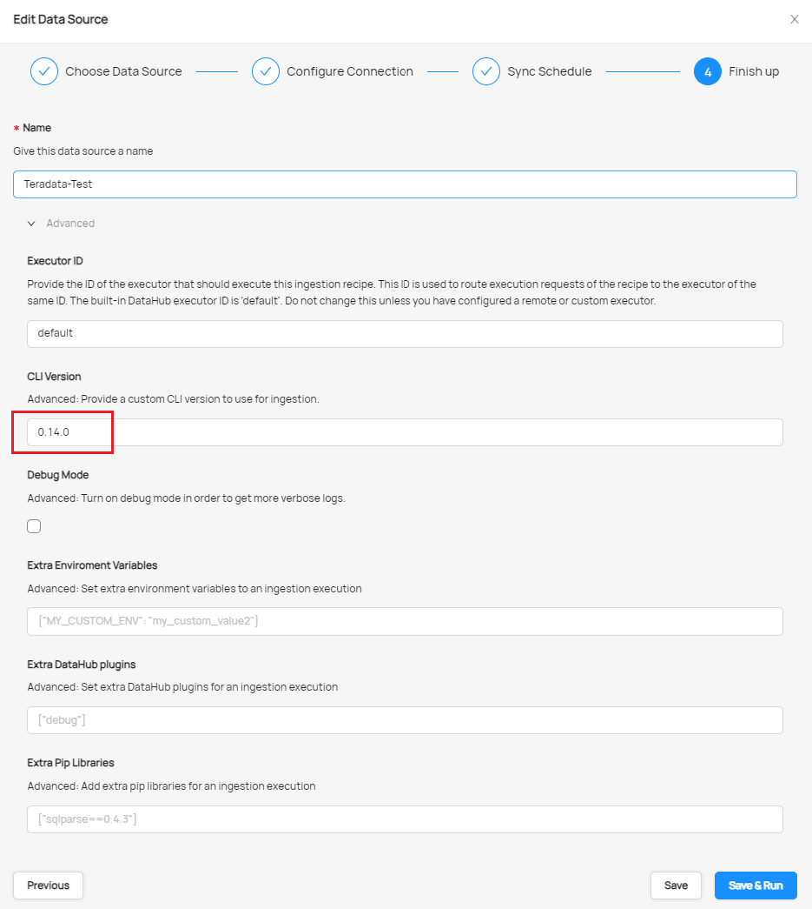
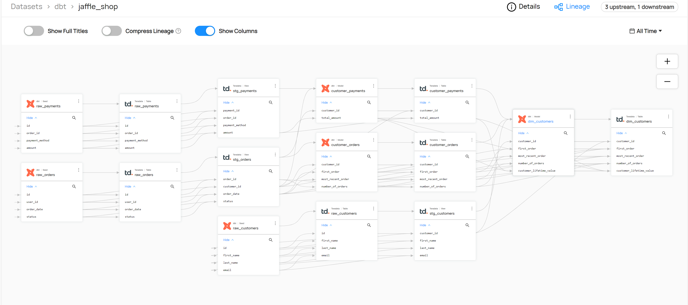

# Configure a Teradata Vantage connection in DataHub

## Overview

This how-to demonstrates how to create a connection to Teradata Vantage with DataHub, and ingest metadata about tables and views, along with usage and lineage information.

## Prerequisites

import ClearscapeDocsNote from '../_partials/vantage_clearscape_analytics.mdx'

* Access to a Teradata Vantage instance.
  <ClearscapeDocsNote />
* DataHub installed. See [DataHub Quickstart Guide](https://datahubproject.io/docs/quickstart)

## Setup DataHub

* Install the Teradata plugin for DataHub in the environment where you have DataHub installed

``` bash
pip install 'acryl-datahub[teradata]'
```

* Setup a Teradata user and set privileges to allow that user to read the dictionary tables

``` sql
CREATE USER datahub FROM <database> AS PASSWORD = <password> PERM = 20000000;

GRANT SELECT ON DBC.DatabasesV TO datahub;
GRANT SELECT ON DBC.TablesV TO datahub;
GRANT SELECT ON DBC.ColumnsV TO datahub;
GRANT SELECT ON DBC.IndicesV TO datahub;
GRANT SELECT ON dbc.TableTextV TO datahub;
GRANT SELECT ON DBC.All_RI_ChildrenV TO datahub;
   
-- if lineage or usage extraction is enabled
GRANT SELECT ON dbc.dbqlogtbl TO datahub; 
GRANT SELECT ON dbc.QryLogV TO datahub;
GRANT SELECT ON dbc.QryLogSqlV TO datahub;
```

* If you want to run profiling, you need to grant select permission on all the tables you want to profile.

* If you want to extract lineage or usage metadata, query logging must be enabled and it is set to size which will fit for your queries (the default query text size Teradata captures is max 200 chars) An example how you can set it for all users:

``` sql
-- set up query logging on all
REPLACE QUERY LOGGING WITH SQL LIMIT SQLTEXT=2000 ON ALL;
```
Learn more about query logging in this document:
[https://docs.teradata.com/r/Teradata-VantageCloud-Lake/Database-Reference/Database-Administration/Tracking-Query-Behavior-with-Database-Query-Logging-Operational-DBAs](https://docs.teradata.com/r/Teradata-VantageCloud-Lake/Database-Reference/Database-Administration/Tracking-Query-Behavior-with-Database-Query-Logging-Operational-DBAs)


## Add a Teradata connection to DataHub
With DataHub running, open the DataHub GUI and login.  In this example this is running at localhost:9002 

* Start the new connection wizard by clicking on the ingestion plug icon 


  and then selecting "Create new source" 
  


* Scroll the list of available sources and select Other 


* A recipe is needed to configure the connection to Teradata and define the options required such as whether to capture table and column lineage, profile the data or retrieve usage statistics.  Below is a simple recipe to get you started. The host, username and password should be changed to match your environment.

``` yaml
pipeline_name: my-teradata-ingestion-pipeline
source:
  type: teradata
  config:
    host_port: "myteradatainstance.teradata.com:1025"
    username: myuser
    password: mypassword
    #database_pattern:
    #  allow:
    #    - "my_database"
    #  ignoreCase: true
    include_table_lineage: true
    include_usage_statistics: true
    stateful_ingestion:
      enabled: true
```

Pasting the recipe into the window should look like this: 


* Click Next and then setup the required schedule. 


* Click Next to Finish Up and give the connection a name. Click Advanced so that the correct CLI version can be set. DataHub support for Teradata became available in CLI 0.12.x.  Suggest selecting the most current version to ensure the best compatibility.


* Once the new source has been saved, it can be executed manually by clicking Run. 


Clicking on "Succeeded" after a sucessful execution will bring up a dialogue similar to this one where you can see the Databases, Tables and Views that have been ingested into DataHub.  


* The metadata can now be explored in the GUI by browsing:
  * DataSets provides a list of the datasets (tables and views) loaded

  * Entities captured from the database

  * Schema of an entity showing column/field names, data types and usage if it has been captured

  * Lineage providing a visual representation of how data is linked between tables and views


## Summary

This how-to demonstrated how to create a connection to Teradata Vantage with DataHub in order to capture metadata of tables, views along with lineage and usage statistics.

## Further reading
* [Integrate DataHub with Teradata Vantage](https://datahubproject.io/docs/generated/ingestion/sources/teradata)
* [DataHub Integration Options for Recipes](https://datahubproject.io/docs/metadata-ingestion/#recipes)

import CommunityLinkPartial from '../_partials/community_link.mdx';

<CommunityLinkPartial />
