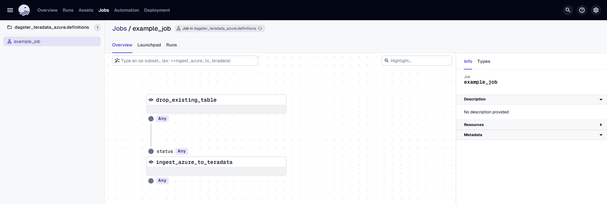
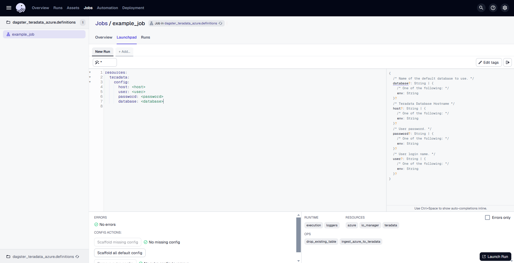
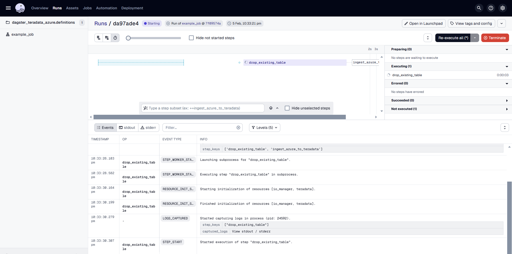

import Tabs from '@theme/Tabs';
import TabItem from '@theme/TabItem';
import ClearscapeDocsNote from '../_partials/vantage_clearscape_analytics.mdx'
import InstallTabs from '../_partials/tabsDBT.mdx'

# Data Transfer from Azure Blob to Teradata Vantage Using dagster-teradata

## Overview

This document provides instructions and guidance for transferring data in CSV, JSON and Parquet formats from Microsoft Azure Blob Storage to Teradata Vantage using **dagster-teradata**. It outlines the setup, configuration and execution steps required to establish a seamless data transfer pipeline between these platforms.

:::note
Use [The Windows Subsystem for Linux (WSL)](https://learn.microsoft.com/en-us/windows/wsl/install) on `Windows` to try this quickstart example.
:::

## Prerequisites

* Access to a Teradata Vantage instance.

    <ClearscapeDocsNote />

* Python **3.9** or higher, Python **3.12** is recommended.
* pip

## Setting Up a Virtual Enviroment

A virtual environment is recommended to isolate project dependencies and avoid conflicts with system-wide Python packages. Here’s how to set it up:
     
      <InstallTabs/>

## Install dagster and dagster-teradata

With your virtual environment active, the next step is to install dagster and the Teradata provider package (dagster-teradata) to interact with Teradata Vantage.

1. Install the Required Packages:
    
    ```bash
    pip install dagster dagster-webserver dagster-teradata[azure]
    ```

2. Verify the Installation: 
   <br />
   <br />
   To confirm that Dagster is correctly installed, run:
     ```bash
    dagster –version
    ```
   If installed correctly, it should show the version of Dagster.


## Initialize a Dagster Project

Now that you have the necessary packages installed, the next step is to create a new Dagster project.

### Scaffold a New Dagster Project

Run the following command:

```bash
dagster project scaffold --name dagster-teradata-azure
 ```
This command will create a new project named dagster-teradata-azure. It will automatically generate the following directory structure:

```bash
dagster-teradata-azure
│   pyproject.toml
│   README.md
│   setup.cfg
│   setup.py
│
├───dagster_teradata_azure
│       assets.py
│       definitions.py
│       __init__.py
│
└───dagster_teradata_azure_tests
        test_assets.py
        __init__.py
 ```

Refer [here](https://docs.dagster.io/guides/build/projects/dagster-project-file-reference) to know more above this directory structure

You need to modify the `definitions.py` file inside the `jaffle_dagster/jaffle_dagster` directory. 

### Step 1: Open `definitions.py` in `dagster-teradata-azure/dagster-teradata-azure` Directory  
Locate and open the file where Dagster job definitions are configured.  
This file manages resources, jobs, and assets needed for the Dagster project.  

### Step 2: Implement Azure to Teradata Transfer in Dagster

``` python
import os

from dagster import job, op, Definitions, EnvVar, DagsterError
from dagster_azure.adls2 import ADLS2Resource, ADLS2SASToken
from dagster_teradata import TeradataResource, teradata_resource

azure_resource = ADLS2Resource(
    storage_account="",
    credential=ADLS2SASToken(token=""),
)

td_resource = TeradataResource(
    host=os.getenv("TERADATA_HOST"),
    user=os.getenv("TERADATA_USER"),
    password=os.getenv("TERADATA_PASSWORD"),
    database=os.getenv("TERADATA_DATABASE"),
)

@op(required_resource_keys={"teradata"})
def drop_existing_table(context):
     context.resources.teradata.drop_table("people")
     return "Tables Dropped"

@op(required_resource_keys={"teradata", "azure"})
def ingest_azure_to_teradata(context, status):
    if status == "Tables Dropped":
        context.resources.teradata.azure_blob_to_teradata(azure_resource, "/az/akiaxox5jikeotfww4ul.blob.core.windows.net/td-usgs/CSVDATA/09380000/2018/06/", "people", True)
    else:
        raise DagsterError("Tables not dropped")

@job(resource_defs={"teradata": td_resource, "azure": azure_resource})
def example_job():
     ingest_azure_to_teradata(drop_existing_table())

defs = Definitions(
    jobs=[example_job]
)
```

##### Explanation of Code

1. **Resource Setup**:
   - The code sets up two resources: one for **Azure Data Lake Storage** (ADLS2) and one for **Teradata**.
     - **Azure Blob Storage**:
       - For a **public bucket**, the `storage_account` and `credential` (SAS token) are left empty.
       - For a **private bucket**, the `storage_account` (Azure Storage account name) and a valid SAS `credential` are required for access.
     - **Teradata resource**: The `teradata_resource` is configured using credentials pulled from environment variables (`TERADATA_HOST`, `TERADATA_USER`, `TERADATA_PASSWORD`, `TERADATA_DATABASE`).

2. **Operations**:
   - **`drop_existing_table`**: This operation drops the "people" table in Teradata using the `teradata_resource`.
   - **`ingest_azure_to_teradata`**: This operation checks if the "people" table was successfully dropped. If the table is dropped successfully, it loads data from Azure Blob Storage into Teradata. The data is ingested using the `azure_blob_to_teradata` method, which fetches data from the specified Azure Blob Storage path.

3. **Job Execution**:
   - The **`example_job`** runs the operations in sequence. First, it drops the table, and if successful, it transfers data from the Azure Blob Storage (either public or private) to Teradata.

This setup allows for dynamic handling of both **public** and **private Azure Blob Storage** configurations while transferring data into Teradata.

## Running the Pipeline

After setting up the project, you can now run your Dagster pipeline:

1.	**Start the Dagster Dev Server:** In your terminal, navigate to the root directory of your project and run:
dagster dev
After executing the command dagster dev, the Dagster logs will be displayed directly in the terminal. Any errors encountered during startup will also be logged here. Once you see a message similar to:
        ```bash
        2025-02-04 09:15:46 +0530 - dagster-webserver - INFO - Serving dagster-webserver on http://127.0.0.1:3000 in process 32564,
        ```
        It indicates that the Dagster web server is running successfully. At this point, you can proceed to the next step.
<br />
<br />
2.	**Access the Dagster UI:** Open a web browser and navigate to http://127.0.0.1:3000. This will open the Dagster UI where you can manage and monitor your pipelines.
<br />
<br />


In the Dagster UI, you will see the following:

- The job **`example_job`** is displayed, along with the associated dbt asset.
- The dbt asset is organized under the **"default"** asset group.
- In the middle, you can view the **lineage** of each `@op`, showing its dependencies and how each operation is related to others.



Go to the **"Launchpad"** and provide the configuration for the **TeradataResource** as follows:

```yaml
resources:
  teradata:
    config:
      host: <host>
      user: <user>
      password: <password>
      database: <database>
```
Replace `<host>, <user>, <password> and <database>` with the actual hostname and credentials of the Teradata VantageCloud Lake instance.

Once the configuration is done, click on **"Launch Run"** to start the process.



The Dagster UI allows you to visualize the pipeline's progress, view logs, and inspect the status of each step.

## Arguments Supported by `azure_blob_to_teradata`

- **azure (ADLS2Resource)**:  
  The `ADLS2Resource` object used to interact with the Azure Blob Storage.

- **blob_source_key (str)**:  
  The URI specifying the location of the Azure Blob object. The format is:  
  `/az/YOUR-STORAGE-ACCOUNT.blob.core.windows.net/YOUR-CONTAINER/YOUR-BLOB-LOCATION`  
  For more details, refer to the Teradata documentation:  
  [Teradata Documentation - Native Object Store](https://docs.teradata.com/search/documents?query=native+object+store&sort=last_update&virtual-field=title_only&content-lang=en-US)

- **teradata_table (str)**:  
  The name of the Teradata table where the data will be loaded.

- **public_bucket (bool, optional)**:  
  Indicates whether the Azure Blob container is public. If `True`, the objects in the container can be accessed without authentication.  
  Defaults to `False`.

- **teradata_authorization_name (str, optional)**:  
  The name of the Teradata Authorization Database Object used to control access to the Azure Blob object store. This is required for secure access to private containers.  
  Defaults to an empty string.  
  For more details, refer to the documentation:  
  [Teradata Vantage Native Object Store - Setting Up Access](https://docs.teradata.com/r/Enterprise_IntelliFlex_VMware/Teradata-VantageTM-Native-Object-Store-Getting-Started-Guide-17.20/Setting-Up-Access/Controlling-Foreign-Table-Access-with-an-AUTHORIZATION-Object)

## Transfer data from Private Blob Storage Container to Teradata instance
To successfully transfer data from a Private Blob Storage Container to a Teradata instance, the following prerequisites are necessary.

* An Azure account. You can start with a [free account](https://azure.microsoft.com/free/).
* Create an [Azure storage account](https://docs.microsoft.com/en-us/azure/storage/common/storage-quickstart-create-account?tabs=azure-portal)
* Create a [blob container](https://learn.microsoft.com/en-us/azure/storage/blobs/blob-containers-portal) under Azure storage account
* [Upload](https://learn.microsoft.com/en-us/azure/storage/blobs/storage-quickstart-blobs-portal) CSV/JSON/Parquest format files to blob container
* Create a Teradata Authorization object with the Azure Blob Storage Account and the Account Secret Key

    ``` sql
    CREATE AUTHORIZATION azure_authorization USER 'azuretestquickstart' PASSWORD 'AZURE_BLOB_ACCOUNT_SECRET_KEY'
    ```

    :::note
    Replace `AZURE_BLOB_ACCOUNT_SECRET_KEY` with Azure storage account `azuretestquickstart`  [access key](https://learn.microsoft.com/en-us/azure/storage/common/storage-account-keys-manage?toc=%2Fazure%2Fstorage%2Fblobs%2Ftoc.json&bc=%2Fazure%2Fstorage%2Fblobs%2Fbreadcrumb%2Ftoc.json&tabs=azure-portal)
    :::

## Summary
This guide details the utilization of the dagster-teradata to seamlessly transfer CSV, JSON, and Parquet data from Microsoft Azure Blob Storage to Teradata Vantage, facilitating streamlined data operations between these platforms.

## Further reading
* [Teradata Authorization](https://docs.teradata.com/r/Enterprise_IntelliFlex_VMware/SQL-Data-Definition-Language-Syntax-and-Examples/Authorization-Statements-for-External-Routines/CREATE-AUTHORIZATION-and-REPLACE-AUTHORIZATION)
