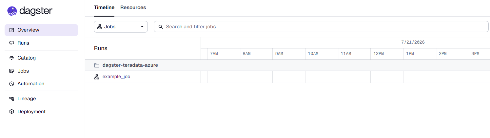
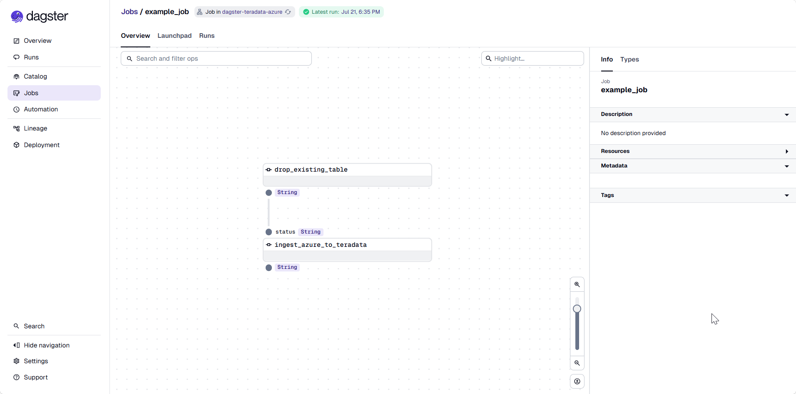
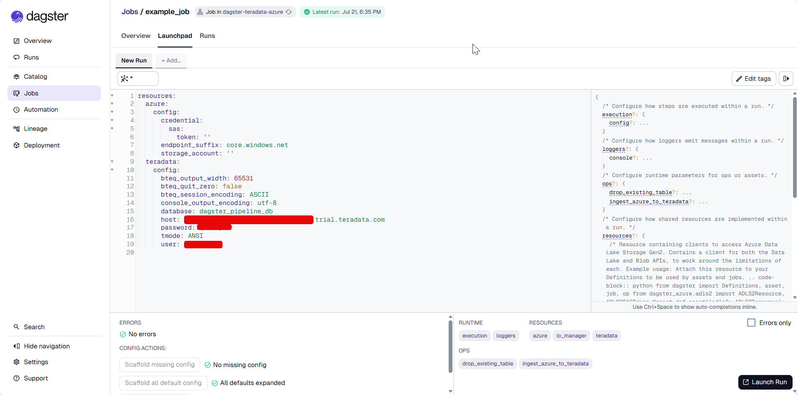
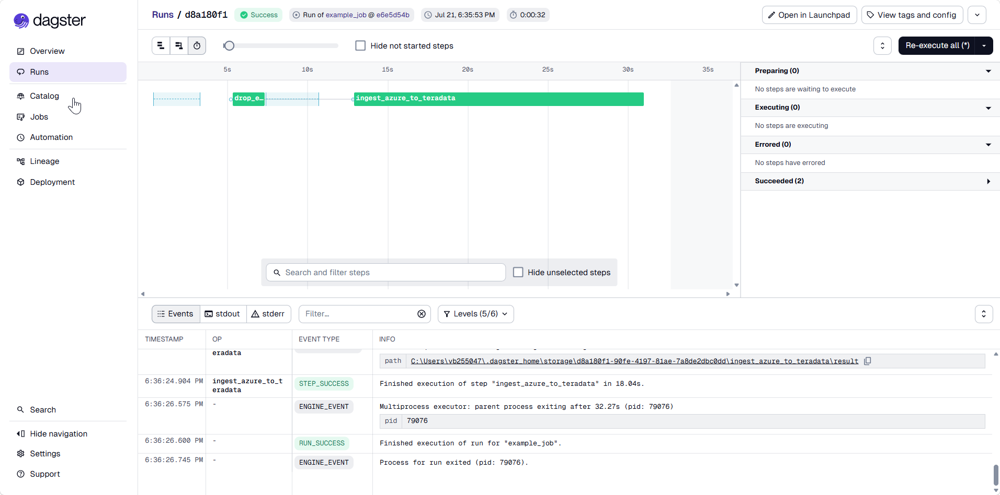

import TrialDocsNote from '../_partials/teradata_trial.mdx'

# Data Transfer from Azure Blob to Teradata Using dagster-teradata

## Overview

This quickstart shows how to transfer data in CSV, JSON, and Parquet formats from Microsoft Azure Blob Storage to Teradata using `dagster-teradata`.

The example uses a public Azure Blob Storage dataset that is accessible through Teradata Native Object Store (NOS). An Azure account is not required to run the example.

## Prerequisites

* Access to a Teradata instance.

    <TrialDocsNote />

* Python **3.9** or higher. Python **3.12** is recommended.
* The [`uv` package manager](https://docs.astral.sh/uv/getting-started/installation/) for Python environment management.

## Set Up the Project with `uv`

This quickstart uses `uv` to manage dependencies and run commands. Manual virtual environment activation is not required.

## Initialize a Dagster Project

Use `uvx` to create a new Dagster project. The command automatically creates a `pyproject.toml` file for dependency management.

### Create a New Dagster Project

Run:

```bash
uvx create-dagster@latest project dagster-teradata-azure
```

When prompted to run `uv sync`, enter `y`. This creates an isolated environment and installs the initial project dependencies.

The command creates a project with the following structure:

```text
dagster-teradata-azure/
├── .dg/
├── .venv/
├── src/
│   └── dagster_teradata_azure/
│       ├── definitions.py
│       ├── defs/
│       │   └── __init__.py
│       └── __init__.py
├── tests/
│   └── __init__.py
├── .gitignore
├── pyproject.toml
├── README.md
└── uv.lock
```

For more information, see the [Dagster project documentation](https://docs.dagster.io/guides/build/projects).

### Add the Required Dependencies

Open `pyproject.toml` in the project root and add `dagster-teradata` and `dagster-azure` to the `dependencies` section:

```toml
dependencies = [
    ...
    "dagster-teradata",
    "dagster-azure",
]
```

From the project root, sync the dependencies:

```bash
cd dagster-teradata-azure
uv sync
```

## Configure the Dagster Project

Open:

```text
src/dagster_teradata_azure/definitions.py
```

Replace its contents with the following code:

```python
import os

from dagster import DagsterError, Definitions, job, op
from dagster_azure.adls2 import ADLS2Resource, ADLS2SASToken
from dagster_teradata import TeradataResource

azure_resource = ADLS2Resource(
    storage_account="",
    credential=ADLS2SASToken(token=""),
)

td_resource = TeradataResource(
    host=os.getenv("TERADATA_HOST"),
    user=os.getenv("TERADATA_USER"),
    password=os.getenv("TERADATA_PASSWORD"),
    database=os.getenv("TERADATA_DATABASE"),
)


@op(required_resource_keys={"teradata"})
def drop_existing_table(context) -> str:
    try:
        context.resources.teradata.drop_table("people")
        context.log.info("Table 'people' dropped successfully")
        return "Tables Dropped"
    except Exception as error:
        context.log.error(f"Failed to drop table: {error}")
        raise


@op(required_resource_keys={"teradata", "azure"})
def ingest_azure_to_teradata(context, status: str) -> str:
    try:
        if status != "Tables Dropped":
            raise DagsterError("Table was not dropped")

        azure_blob_location = (
            "/az/akiaxox5jikeotfww4ul.blob.core.windows.net/"
            "td-usgs/CSVDATA/09380000/2018/06/"
        )

        context.log.info(
            f"Using Azure Blob Storage location: {azure_blob_location}"
        )

        context.resources.teradata.azure_blob_to_teradata(
            context.resources.azure,
            azure_blob_location,
            "people",
            public_bucket=True,
        )

        context.log.info(
            "Data ingested successfully from Azure Blob Storage to Teradata"
        )
        return "Data Ingested"
    except Exception as error:
        context.log.error(f"Failed to ingest data: {error}")
        raise


@job
def example_job():
    ingest_azure_to_teradata(drop_existing_table())


defs = Definitions(
    jobs=[example_job],
    resources={
        "teradata": td_resource,
        "azure": azure_resource,
    },
)
```

## Understand the Code

### Resource Configuration

The code configures:

* `ADLS2Resource` for the public Azure Blob Storage dataset.
* `TeradataResource` for the Teradata connection.

The Azure resource uses empty storage account and SAS token values because the example dataset is public. The Teradata connection values are read from environment variables.

The `public_bucket=True` argument instructs Teradata to access the public Azure Blob Storage location without a Teradata `AUTHORIZATION` object.

### Operations

* `drop_existing_table` drops the `people` table.
* `ingest_azure_to_teradata` transfers the public Azure Blob Storage dataset into the `people` table.

### Job Execution

The `example_job` runs the operations sequentially. It first drops the target table and then transfers the data from Azure Blob Storage to Teradata.

## Use the Public Azure Blob Storage Dataset

This quickstart uses the following public CSV dataset:

```text
/az/akiaxox5jikeotfww4ul.blob.core.windows.net/td-usgs/CSVDATA/09380000/2018/06/
```

Azure Blob Storage locations used by Teradata NOS must begin with `/az/` or `/AZ/` and follow this format:

```text
/az/<storage-account>.blob.core.windows.net/<container>/<blob-location>
```

The dataset used in this example is configured for public access and works with:

```python
public_bucket=True
```

An Azure account, storage account key, SAS token, and Teradata `AUTHORIZATION` object are not required for this public example.

## Set Environment Variables

Set the Teradata connection values in the same terminal from which you will run Dagster.

=== "Windows"

    Run in PowerShell:

    ```bash
    $env:TERADATA_HOST="<your-teradata-host>"
    $env:TERADATA_USER="<your-teradata-user>"
    $env:TERADATA_PASSWORD="<your-teradata-password>"
    $env:TERADATA_DATABASE="<target-database>"
    ```

=== "macOS/Linux"

    ```bash
    export TERADATA_HOST="<your-teradata-host>"
    export TERADATA_USER="<your-teradata-user>"
    export TERADATA_PASSWORD="<your-teradata-password>"
    export TERADATA_DATABASE="<target-database>"
    ```


## Prepare Teradata

The job begins by dropping the `people` table. Create the table before running the job for the first time:

```sql
CREATE MULTISET TABLE people (
    placeholder_column INTEGER
);
```

The `azure_blob_to_teradata` method drops the placeholder table and creates a new `people` table from the columns in the public CSV dataset.

!!! note
    Create the table in the database specified by `TERADATA_DATABASE`. If the table already exists, skip this step.

## Run the Pipeline

### Start the Dagster Development Server

From the project root, run:

```bash
uv run dg dev
```

The `uv run` command runs `dg dev` in the isolated project environment defined by `pyproject.toml`.

When the logs show that the Dagster UI is available at `http://127.0.0.1:3000`, proceed to the next step.

!!! note
    `dg dev` uses an ephemeral Dagster instance by default. To preserve run history, set `DAGSTER_HOME` before starting the server.

=== "Windows"

    ```bash
    $env:DAGSTER_HOME="$env:USERPROFILE\.dagster_home"
    uv run dg dev
    ```

=== "macOS/Linux"

    ```bash
    export DAGSTER_HOME=~/.dagster_home
    uv run dg dev
    ```


### Access the Dagster UI

Open `http://127.0.0.1:3000` in a browser.



The **Jobs** page displays `example_job` and the dependency between its two operations.



### Launch the Job

Open the **Launchpad** tab and select **Launch Run**.

The Teradata connection values are read from the environment variables set earlier, so no additional Launchpad configuration is required.



Use the Dagster UI to monitor the run, view logs, and inspect the status of each operation.



## Verify the Data Transfer

After the job succeeds, run:

```sql
SELECT TOP 10 *
FROM people;
```

The query should return rows transferred from the public Azure Blob Storage dataset.

## Transfer data from a private Blob Storage container to Teradata

To transfer data from a private Azure Blob Storage container to Teradata, complete the following prerequisites:

* Create an [Azure account](https://azure.microsoft.com/free/).
* Create an [Azure storage account](https://docs.microsoft.com/en-us/azure/storage/common/storage-quickstart-create-account?tabs=azure-portal).
* Create a [blob container](https://learn.microsoft.com/en-us/azure/storage/blobs/blob-containers-portal) in the Azure storage account.
* [Upload](https://learn.microsoft.com/en-us/azure/storage/blobs/storage-quickstart-blobs-portal) CSV, JSON, or Parquet files to the blob container.
* Create a Teradata authorization object using the Azure Blob Storage account name and access key.

    ```sql
    CREATE AUTHORIZATION azure_authorization
    USER 'azuretestquickstart'
    PASSWORD 'AZURE_BLOB_ACCOUNT_SECRET_KEY';
    ```

    !!! note
        Replace `AZURE_BLOB_ACCOUNT_SECRET_KEY` with the [access key](https://learn.microsoft.com/en-us/azure/storage/common/storage-account-keys-manage?toc=%2Fazure%2Fstorage%2Fblobs%2Ftoc.json&bc=%2Fazure%2Fstorage%2Fblobs%2Fbreadcrumb%2Ftoc.json&tabs=azure-portal) for the `azuretestquickstart` Azure storage account.

## Summary

In this quickstart, you created a Dagster project with `uvx`, configured the Azure and Teradata resources, and transferred data from a public Azure Blob Storage dataset to Teradata.

## Further reading

* [Dagster Azure integration](https://docs.dagster.io/integrations/libraries/azure/dagster-azure)
* [Dagster Teradata reference](https://docs.dagster.io/integrations/libraries/teradata/teradata-reference)
* [Dagster project documentation](https://docs.dagster.io/guides/build/projects)
* [Teradata Authorization](https://docs.teradata.com/r/Enterprise_IntelliFlex_VMware/SQL-Data-Definition-Language-Syntax-and-Examples/Authorization-Statements-for-External-Routines/CREATE-AUTHORIZATION-and-REPLACE-AUTHORIZATION)