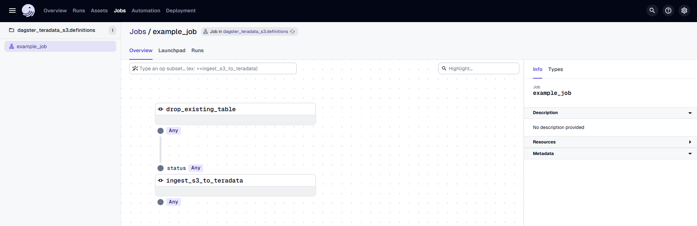
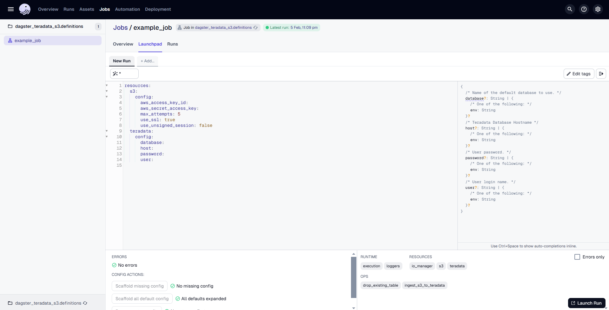
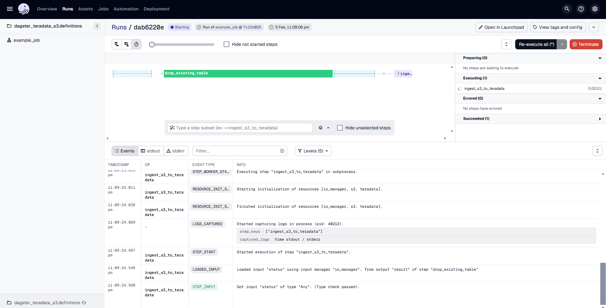

import Tabs from '@theme/Tabs';
import TabItem from '@theme/TabItem';
import ClearscapeDocsNote from '../_partials/vantage_clearscape_analytics.mdx'

# Data Transfer from AWS S3 to Teradata Vantage Using dagster-teradata

## Overview

This document provides instructions and guidance for transferring data in CSV, JSON and Parquet formats from AWS S3 to Teradata Vantage using **dagster-teradata**. It outlines the setup, configuration and execution steps required to establish a seamless data transfer pipeline between these platforms.

:::note
Use [The Windows Subsystem for Linux (WSL)](https://learn.microsoft.com/en-us/windows/wsl/install) on `Windows` to try this quickstart example.
:::

## Prerequisites

* Access to a Teradata Vantage instance.

    <ClearscapeDocsNote />

* Python **3.9** or higher, Python **3.12** is recommended.
* pip

## Setting Up a Virtual Enviroment

A virtual environment is recommended to isolate project dependencies and avoid conflicts with system-wide Python packages. Here’s how to set it up:
     
      <InstallTabs/>

## Install dagster and dagster-teradata

With your virtual environment active, the next step is to install dagster and the Teradata provider package (dagster-teradata) to interact with Teradata Vantage.

1. Install the Required Packages:
    
    ```bash
    pip install dagster dagster-webserver dagster-teradata[aws]
    ```

2. Verify the Installation: 
   <br />
   <br />
   To confirm that Dagster is correctly installed, run:
     ```bash
    dagster –version
    ```
   If installed correctly, it should show the version of Dagster.


## Initialize a Dagster Project

Now that you have the necessary packages installed, the next step is to create a new Dagster project.

### Scaffold a New Dagster Project

Run the following command:

```bash
dagster project scaffold --name dagster-teradata-s3
 ```
This command will create a new project named dagster-teradata-s3. It will automatically generate the following directory structure:

```bash
dagster-teradata-s3
│   pyproject.toml
│   README.md
│   setup.cfg
│   setup.py
│
├───dagster_teradata_s3
│       assets.py
│       definitions.py
│       __init__.py
│
└───dagster_teradata_s3_tests
        test_assets.py
        __init__.py
 ```

Refer [here](https://docs.dagster.io/guides/build/projects/dagster-project-file-reference) to know more above this directory structure

You need to modify the `definitions.py` file inside the `jaffle_dagster/jaffle_dagster` directory. 

### Step 1: Open `definitions.py` in `dagster-teradata-s3/dagster-teradata-s3` Directory  
Locate and open the file where Dagster job definitions are configured.  
This file manages resources, jobs, and assets needed for the Dagster project.  

### Step 2: Implement AWS S3 to Teradata Transfer in Dagster

``` python
import os

from dagster import job, op, Definitions, EnvVar, DagsterError
from dagster_aws.s3 import S3Resource, s3_resource
from dagster_teradata import TeradataResource, teradata_resource

s3_resource = S3Resource(
    aws_access_key_id=os.getenv("AWS_ACCESS_KEY_ID"),
    aws_secret_access_key=os.getenv("AWS_SECRET_ACCESS_KEY"),
    aws_session_token=os.getenv("AWS_SESSION_TOKEN"),
)

td_resource = TeradataResource(
    host=os.getenv("TERADATA_HOST"),
    user=os.getenv("TERADATA_USER"),
    password=os.getenv("TERADATA_PASSWORD"),
    database=os.getenv("TERADATA_DATABASE"),
)

@op(required_resource_keys={"teradata"})
def drop_existing_table(context):
     context.resources.teradata.drop_table("people")
     return "Tables Dropped"

@op(required_resource_keys={"teradata", "s3"})
def ingest_s3_to_teradata(context, status):
    if status == "Tables Dropped":
        context.resources.teradata.s3_to_teradata(s3_resource, os.getenv("AWS_S3_LOCATION"), "people")
    else:
        raise DagsterError("Tables not dropped")

@job(resource_defs={"teradata": td_resource, "s3": s3_resource})
def example_job():
     ingest_s3_to_teradata(drop_existing_table())

defs = Definitions(
    jobs=[example_job]
)
```

##### Explanation of Code

### Explanation of the Code

1. **Resource Configuration for S3 and Teradata**:  
   - The code configures resources for interacting with S3 and Teradata.  
   - The `S3Resource` is created using AWS credentials (access key, secret key, and session token) from environment variables.  
   - The `TeradataResource` is set up with connection details (host, user, password, database) for Teradata from environment variables.

2. **Defining Operations**:  
   - `drop_existing_table`: This operation uses the Teradata resource to drop the "people" table in Teradata.  
   - `ingest_s3_to_teradata`: This operation checks if the "Tables Dropped" status was returned from the previous operation. If true, it ingests data from an S3 bucket to the Teradata table `people` using the S3 resource. If the table wasn't dropped, it raises an error.

3. **Job Execution**:  
   - The `example_job` is defined to execute the two operations sequentially: first, drop the existing table, and then ingest data from S3 to Teradata.  
   - The job is registered under the `Definitions` object for execution within the Dagster environment.


## Running the Pipeline

After setting up the project, you can now run your Dagster pipeline:

1.	**Start the Dagster Dev Server:** In your terminal, navigate to the root directory of your project and run:
dagster dev
After executing the command dagster dev, the Dagster logs will be displayed directly in the terminal. Any errors encountered during startup will also be logged here. Once you see a message similar to:
        ```bash
        2025-02-04 09:15:46 +0530 - dagster-webserver - INFO - Serving dagster-webserver on http://127.0.0.1:3000 in process 32564,
        ```
        It indicates that the Dagster web server is running successfully. At this point, you can proceed to the next step.
<br />
<br />
2.	**Access the Dagster UI:** Open a web browser and navigate to http://127.0.0.1:3000. This will open the Dagster UI where you can manage and monitor your pipelines.
<br />
<br />


In the Dagster UI, you will see the following:

- The job **`example_job`** is displayed, along with the associated dbt asset.
- The dbt asset is organized under the **"default"** asset group.
- In the middle, you can view the **lineage** of each `@op`, showing its dependencies and how each operation is related to others.



Go to the **"Launchpad"** and provide the configuration for the **TeradataResource** as follows:

```yaml
resources:
  s3:
    config:
      aws_access_key_id: 
      aws_secret_access_key: 
      aws_session_token: 
      max_attempts: 5
      use_ssl: true
      use_unsigned_session: false
  teradata:
    config:
      database: 
      host: 
      password: 
      user: 
```
Replace <AWS_ACCESS_KEY_ID>, <AWS_SECRET_ACCESS_KEY>, <AWS_SESSION_TOKEN>, <TERADATA_DATABASE>, <TERADATA_HOST>, <TERADATA_PASSWORD>, and <TERADATA_USER> with the actual values for your S3 and Teradata configuration.
Once the configuration is done, click on **"Launch Run"** to start the process.



The Dagster UI allows you to visualize the pipeline's progress, view logs, and inspect the status of each step.

## Arguments Supported by `s3_blob_to_teradata`

- **s3 (S3Resource)**:  
  The `S3Resource` object used to interact with the S3 bucket.

- **s3_source_key (str)**:  
  The URI specifying the location of the S3 bucket. The URI format is:  
  `/s3/YOUR-BUCKET.s3.amazonaws.com/YOUR-BUCKET-NAME`  
  For more details, refer to:  
  [Teradata Documentation - Native Object Store](https://docs.teradata.com/search/documents?query=native+object+store&sort=last_update&virtual-field=title_only&content-lang=en-US)

- **teradata_table (str)**:  
  The name of the Teradata table to which the data will be loaded.

- **public_bucket (bool)**:  
  Indicates whether the provided S3 bucket is public. If `True`, the objects within the bucket can be accessed via a URL without authentication. If `False`, the bucket is considered private, and authentication must be provided.  
  Defaults to `False`.

- **teradata_authorization_name (str)**:  
  The name of the Teradata Authorization Database Object, which controls access to the S3 object store.  
  For more details, refer to:  
  [Teradata Vantage Native Object Store - Setting Up Access](https://docs.teradata.com/r/Enterprise_IntelliFlex_VMware/Teradata-VantageTM-Native-Object-Store-Getting-Started-Guide-17.20/Setting-Up-Access/Controlling-Foreign-Table-Access-with-an-AUTHORIZATION-Object)

## Summary
This guide details the utilization of the dagster-teradata to seamlessly transfer CSV, JSON, and Parquet data from AWS S3 Storage to Teradata Vantage, facilitating streamlined data operations between these platforms.

## Further reading
* [Teradata Authorization](https://docs.teradata.com/r/Enterprise_IntelliFlex_VMware/SQL-Data-Definition-Language-Syntax-and-Examples/Authorization-Statements-for-External-Routines/CREATE-AUTHORIZATION-and-REPLACE-AUTHORIZATION)
