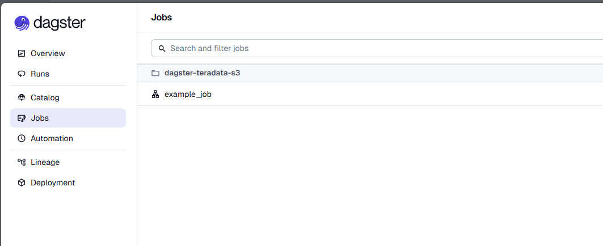
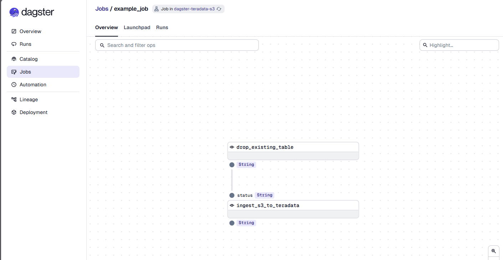
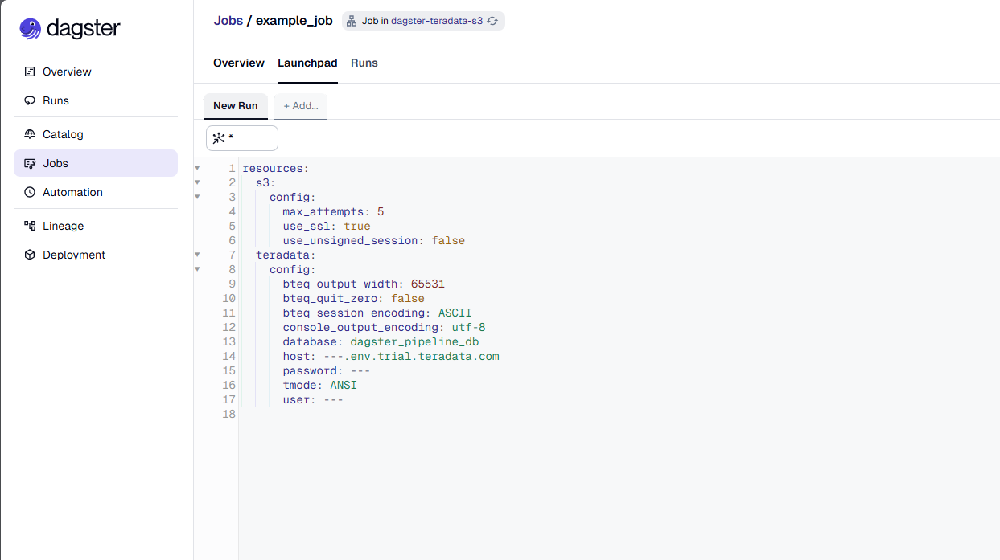

import Tabs from '@theme/Tabs';
import TabItem from '@theme/TabItem';
import TrialDocsNote from '../_partials/teradata_trial.mdx'
import InstallTabs from '../_partials/tabsDBT.mdx'

# Data Transfer from AWS S3 to Teradata Database Using dagster-teradata

## Overview

This document provides instructions and guidance for transferring data in CSV, JSON and Parquet formats from AWS S3 to Teradata Database using **dagster-teradata**. It outlines the setup, configuration and execution steps required to establish a seamless data transfer pipeline between these platforms.

## Prerequisites

* Access to a Teradata Vantage instance.

    <TrialDocsNote />

* Python **3.9** or higher, Python **3.12** is recommended.
* `uv` package manager for Python environment management.

## Setting Up a Virtual Environment

A virtual environment is recommended to isolate project dependencies and avoid conflicts with system-wide Python packages. Here's how to set it up:
      
      <InstallTabs/>

## Install dagster and dagster-teradata

With your virtual environment active, the next step is to install dagster and the Teradata provider package (dagster-teradata) to interact with Teradata Database.

1. Install the Required Packages:
    
    ```bash
    uv pip install dagster dagster-webserver dagster-teradata[aws]
    ```

2. Verify the Installation:

   To confirm that Dagster is correctly installed, run:
     ```bash
    dagster --version
    ```
   If installed correctly, it should show the version of Dagster.


## Initialize a Dagster Project

Now that we have the necessary packages installed, the next step is to create a new Dagster project.

### Scaffold a New Dagster Project

Run the following command:

```bash
dagster project scaffold --name dagster-teradata-s3
 ```
This command will create a new project named dagster-teradata-s3. It will automatically generate the following directory structure:

```bash
dagster-teradata-s3
│   pyproject.toml
│   README.md
│   setup.cfg
│   setup.py
│
├───dagster_teradata_s3
│       assets.py
│       definitions.py
│       __init__.py
│
└───dagster_teradata_s3_tests
        test_assets.py
        __init__.py
 ```

Refer [here](https://docs.dagster.io/guides/build/projects/dagster-project-file-reference) to know more about this directory structure

### Step 1: Open `definitions.py` in `dagster-teradata-s3/dagster_teradata_s3` Directory  
Locate and open the file where Dagster job definitions are configured.  
This file manages resources, jobs, and assets needed for the Dagster project.  

### Step 2: Implement AWS S3 to Teradata Transfer in Dagster

``` python
import os

from dagster import job, op, Definitions, DagsterError
from dagster_aws.s3 import S3Resource
from dagster_teradata import TeradataResource

s3_resource_instance = S3Resource(
    aws_access_key_id=os.getenv("AWS_ACCESS_KEY_ID"),
    aws_secret_access_key=os.getenv("AWS_SECRET_ACCESS_KEY"),
    aws_session_token=os.getenv("AWS_SESSION_TOKEN"),
)

td_resource = TeradataResource(
    host=os.getenv("TERADATA_HOST"),
    user=os.getenv("TERADATA_USER"),
    password=os.getenv("TERADATA_PASSWORD"),
    database=os.getenv("TERADATA_DATABASE"),
)

@op(required_resource_keys={"teradata"})
def drop_existing_table(context):
    try:
        context.resources.teradata.drop_table("people")
        context.log.info("Table 'people' dropped successfully")
        return "Tables Dropped"
    except Exception as e:
        context.log.error(f"Failed to drop table: {e}")
        raise

@op(required_resource_keys={"teradata", "s3"})
def ingest_s3_to_teradata(context, status):
    try:
        if status == "Tables Dropped":
            context.resources.teradata.s3_to_teradata(s3_resource_instance, os.getenv("AWS_S3_LOCATION"), "people")
            context.log.info("Data ingested successfully from S3 to Teradata")
        else:
            raise DagsterError("Tables not dropped")
    except Exception as e:
        context.log.error(f"Failed to ingest data: {e}")
        raise

@job(resource_defs={"teradata": td_resource, "s3": s3_resource_instance})
def example_job():
    ingest_s3_to_teradata(drop_existing_table())

defs = Definitions(
    jobs=[example_job]
)
```

### Explanation of the Code

1. **Resource Configuration for S3 and Teradata**:  
   - The code configures resources for interacting with S3 and Teradata.  
   - The `S3Resource` is created using AWS credentials (access key, secret key, and session token) from environment variables.  
   - The `TeradataResource` is set up with connection details (host, user, password, database) for Teradata from environment variables.

2. **Defining Operations**:  
   - `drop_existing_table`: This operation uses the Teradata resource to drop the "people" table in Teradata. Error handling is included to catch and log any exceptions.
   - `ingest_s3_to_teradata`: This operation checks if the "Tables Dropped" status was returned from the previous operation. If true, it ingests data from an S3 bucket to the Teradata table `people` using the S3 resource. If the table wasn't dropped, it raises an error. Error handling is included for robust operation.
   - To use a different table name, replace `"people"` with your table name throughout the code and update your Teradata schema accordingly.

3. **Job Execution**:  
   - The `example_job` is defined to execute the two operations sequentially: first, drop the existing table, and then ingest data from S3 to Teradata.  
   - The job is registered under the `Definitions` object for execution within the Dagster environment.


## Preparing Your Data

Before running the pipeline, we need to prepare our AWS S3 environment with sample data.

### Create an S3 Bucket

1. Go to [AWS Management Console](https://console.aws.amazon.com/) and navigate to S3.
2. Click **Create bucket** and provide:
   - **Bucket name**: `dagster-teradata-transfer-demo` (or your preferred name)
   - **Region**: Choose your preferred AWS region (e.g., us-west-2)
3. Click **Create bucket**.

### Upload Sample Data

1. In your S3 bucket, create a folder named `data`.
2. Prepare your data file in CSV, JSON, or Parquet format with columns matching your Teradata table schema.
3. For testing, we recommend a simple CSV file with columns: `id`, `name`, `email`, `city`.
4. Upload the file to `s3://your-bucket/data/sample_data.csv`.

### Set Environment Variables

Set the following environment variables for your pipeline:

```bash
export TERADATA_HOST=<your-teradata-host>
export TERADATA_USER=<your-teradata-user>
export TERADATA_PASSWORD=<your-teradata-password>
export TERADATA_DATABASE=<target-database>
export AWS_ACCESS_KEY_ID=<your-aws-access-key>
export AWS_SECRET_ACCESS_KEY=<your-aws-secret-key>
export AWS_SESSION_TOKEN=<your-aws-session-token>
export AWS_S3_LOCATION=/s3/your-bucket.s3.amazonaws.com/your-bucket/data/sample_data.csv
```

**S3 Location Format Explanation:**
The `AWS_S3_LOCATION` must follow the format: `/s3/YOUR-BUCKET.s3.amazonaws.com/YOUR-BUCKET/PATH-TO-FILE`

For example:
- If your file is at: `s3://dagster-demo/data/sample_data.csv`
- Then `AWS_S3_LOCATION` should be: `/s3/dagster-demo.s3.amazonaws.com/dagster-demo/data/sample_data.csv`

### Prepare Teradata Database

Execute the following SQL commands in your Teradata instance to create the target database and table:

```sql
CREATE DATABASE IF NOT EXISTS dagster_pipeline_db AS PERM = 10000000 FROM <your-user>;

CREATE TABLE IF NOT EXISTS dagster_pipeline_db.people (
    id INTEGER,
    name VARCHAR(100),
    email VARCHAR(100),
    city VARCHAR(100)
);
```


## Running the Pipeline

After setting up the project and preparing our data, we can now run our Dagster pipeline:

1.	**Start the Dagster Dev Server:** In your terminal, navigate to the root directory of your project and run:
```bash
dagster dev
```
After executing the command `dagster dev`, the Dagster logs will be displayed directly in the terminal. Any errors encountered during startup will also be logged here. Once you see a message similar to:
```bash
2025-02-04 09:15:46 +0530 - dagster-webserver - INFO - Serving dagster-webserver on http://127.0.0.1:3000 in process 32564,
```
It indicates that the Dagster web server is running successfully. At this point, we can proceed to the next step.

2.	**Access the Dagster UI:** Open a web browser and navigate to http://127.0.0.1:3000. This will open the Dagster UI where we can manage and monitor our pipelines.



In the Dagster UI, we will see the following:

- The job **`example_job`** is displayed, along with the associated assets.
- The assets are organized under the **"default"** asset group.
- In the middle, we can view the **lineage** of each `@op`, showing its dependencies and how each operation is related to others.



Go to the **"Launchpad"** and provide the configuration for the **TeradataResource** as follows:

```yaml
resources:
  s3:
    config:
      aws_access_key_id: <AWS_ACCESS_KEY_ID>
      aws_secret_access_key: <AWS_SECRET_ACCESS_KEY>
      aws_session_token: <AWS_SESSION_TOKEN>
      max_attempts: 5
      use_ssl: true
      use_unsigned_session: false
  teradata:
    config:
      host: <TERADATA_HOST>
      user: <TERADATA_USER>
      password: <TERADATA_PASSWORD>
      database: <TERADATA_DATABASE>
```
Replace `<AWS_ACCESS_KEY_ID>`, `<AWS_SECRET_ACCESS_KEY>`, `<AWS_SESSION_TOKEN>`, `<TERADATA_HOST>`, `<TERADATA_USER>`, `<TERADATA_PASSWORD>`, and `<TERADATA_DATABASE>` with the actual values for your S3 and Teradata configuration.
Once the configuration is done, click on **"Launch Run"** to start the process.



The Dagster UI allows us to visualize the pipeline's progress, view logs, and inspect the status of each step.

## Arguments Supported by `s3_blob_to_teradata`

- **s3 (S3Resource)**:  
  The `S3Resource` object used to interact with the S3 bucket.

- **s3_source_key (str)**:  
  The URI specifying the location of the S3 bucket. The URI format is:  
  `/s3/YOUR-BUCKET.s3.amazonaws.com/YOUR-BUCKET-NAME`  
  For more details, refer to:  
  [Teradata Documentation - Native Object Store](https://docs.teradata.com/search/documents?query=native+object+store&sort=last_update&virtual-field=title_only&content-lang=en-US)

- **teradata_table (str)**:  
  The name of the Teradata table to which the data will be loaded.

- **public_bucket (bool)**:  
  Indicates whether the provided S3 bucket is public. If `True`, the objects within the bucket can be accessed via a URL without authentication. If `False`, the bucket is considered private, and authentication must be provided.  
  Defaults to `False`.

- **teradata_authorization_name (str)**:  
  The name of the Teradata Authorization Database Object, which controls access to the S3 object store.  
  For more details, refer to:  
  [Teradata Database Native Object Store - Setting Up Access](https://docs.teradata.com/r/Enterprise_IntelliFlex_VMware/Teradata-VantageTM-Native-Object-Store-Getting-Started-Guide-17.20/Setting-Up-Access/Controlling-Foreign-Table-Access-with-an-AUTHORIZATION-Object)

## Summary
This guide details the utilization of the dagster-teradata to seamlessly transfer CSV, JSON, and Parquet data from AWS S3 Storage to Teradata Database, facilitating streamlined data operations between these platforms.

## Further reading
* [Teradata Authorization](https://docs.teradata.com/r/Enterprise_IntelliFlex_VMware/SQL-Data-Definition-Language-Syntax-and-Examples/Authorization-Statements-for-External-Routines/CREATE-AUTHORIZATION-and-REPLACE-AUTHORIZATION)
