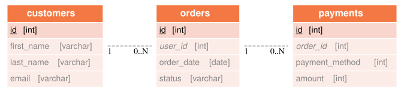
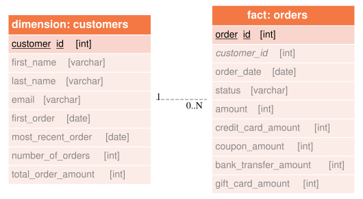

import TrialDocsNote from '../_partials/teradata_trial.mdx'
import InstallTabs from '../_partials/tabsDBT.mdx'
import ProfileTabs from '../_partials/tabsDBTProfiles.mdx'

# dbt with Teradata

## Overview

This tutorial demonstrates how to use dbt (data build tool) with Teradata. It's based on the original [dbt Jaffle Shop tutorial](https://github.com/dbt-labs/jaffle_shop-dev). A couple of models have been adjusted to the SQL dialect supported by Teradata.

## Prerequisites

* Access to a Teradata instance. 

    <TrialDocsNote />

* Python **3.10**, **3.11**, **3.12**, or **3.13** installed.

* [uv](https://docs.astral.sh/uv/) installed for Python environment and package management.

## Install dbt

1. Clone the tutorial repository and change into the project directory:
    ```bash
    git clone https://github.com/Teradata/jaffle_shop-dev.git jaffle_shop
    cd jaffle_shop
    ```

2. Create and activate a new Python virtual environment to manage dbt and its dependencies. 

      <InstallTabs/>

3. Install `dbt-teradata` and `dbt-core`:
    

    ```bash
    uv pip install dbt-teradata dbt-core
    ```


## Configure dbt
Configure dbt to connect to your Teradata database. Create a `profiles.yml` file in the location shown below.

  <ProfileTabs/>

Add the following configuration to the `profiles.yml` file. Adjust `<host>`, `<user>`, and `<password>` to match your Teradata instance.


:::note
**Database setup**

The following dbt profile points to a database called `jaffle_shop`. 
If the database doesn't exist on your Teradata Database instance, it will be created. You can also change `schema` value to point to an existing database in your instance.
:::

```yaml
jaffle_shop:
  outputs:
    dev:
      type: teradata
      host: <host>
      user: <user>
      password: <password>
      logmech: TD2
      schema: jaffle_shop
      tmode: ANSI
      threads: 1
      timeout_seconds: 300
      priority: interactive
      retries: 1
  target: dev
```

Now that the profile file is in place, validate the setup:

```bash
dbt debug
```

If the debug command returns errors, you likely have an issue with the content of `profiles.yml`.

## About the Jaffle Shop warehouse

`jaffle_shop` is a fictional e-commerce store. This dbt project transforms raw data from an app database into a dimensional model with customer and order data ready for analytics.

The raw data from the app consists of customers, orders, and payments, with the following entity-relationship diagram:



dbt takes these raw data tables and builds the following dimensional model, which is more suitable for analytics tools:



## Run dbt

### Create raw data tables

In production, raw data is typically ingested from platforms like Segment, Stitch, Fivetran, or another ETL/ELT tool. In this tutorial, we use dbt's `seed` functionality to create tables from CSV files. The CSV files are located in the `./data` directory. Each CSV file produces one table, and dbt infers the column data types from the file contents.

```bash
dbt seed
```

You should now see three tables in your `jaffle_shop` database: `raw_customers`, `raw_orders`, and `raw_payments`. The tables should be populated with data from the CSV files.

### Create the dimensional model

Now that we have the raw tables, we can instruct dbt to create the dimensional model:
```bash
dbt run
```

So what exactly happened here? dbt created additional tables using `CREATE TABLE/VIEW FROM SELECT` SQL. In the first transformation, dbt took raw tables and built denormalized join tables called `customer_orders`, `order_payments`, `customer_payments`. You will find the definitions of these tables in `./models/marts/core/intermediate`.
In the second step, dbt created `dim_customers` and `fct_orders` tables. These are the dimensional model tables that we want to expose to our BI tool.

### Test the data

dbt applied multiple transformations to our data. How can we ensure that the data in the dimensional model is correct? dbt allows us to define and execute tests against the data. The tests are defined in `./models/marts/core/schema.yml`. The file describes each column in all relationships. Each column can have multiple tests configured under `tests` key. For example, we expect that `fct_orders.order_id` column will contain unique, non-null values. To validate that the data in the produced tables satisfies the test conditions run:

```bash
dbt test
```

### Generate documentation

Our model consists of just a few tables. Imagine a scenario where we have many more sources of data and a much more complex dimensional model. We could also have an intermediate zone between the raw data and the dimensional model that follows the Data Vault 2.0 principles. Would it not be useful, if we had the inputs, transformations and outputs documented somehow? dbt allows us to generate documentation from its configuration files:

```bash
dbt docs generate
```

This will produce HTML files in `./target` directory.

You can start your own server to browse the documentation. The following command will start a server and open up a browser tab with the docs' landing page:

```bash
dbt docs serve
```

## Summary

This tutorial demonstrated how to use dbt with Teradata. The sample project takes raw data and produces a dimensional data mart. We used multiple dbt commands to populate tables from CSV files (`dbt seed`), create models (`dbt run`), test the data (`dbt test`), and generate and serve model documentation (`dbt docs generate`, `dbt docs serve`).

## Further reading
* [dbt documentation](https://docs.getdbt.com/docs/)
* [dbt-teradata plugin documentation](https://github.com/Teradata/dbt-teradata)