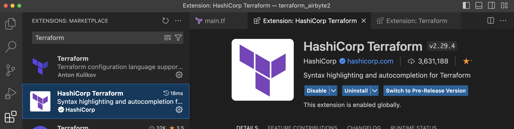
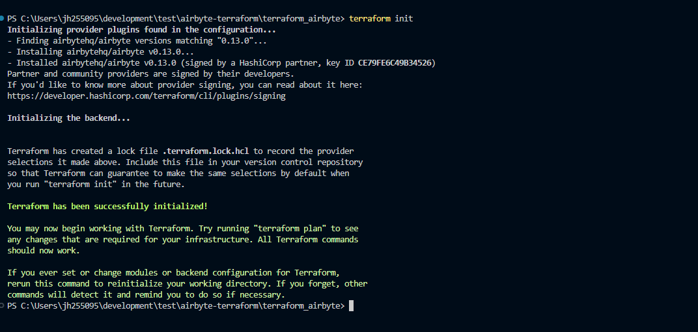
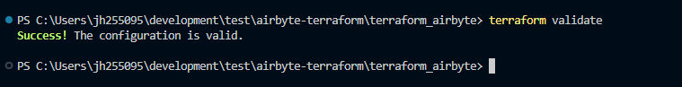
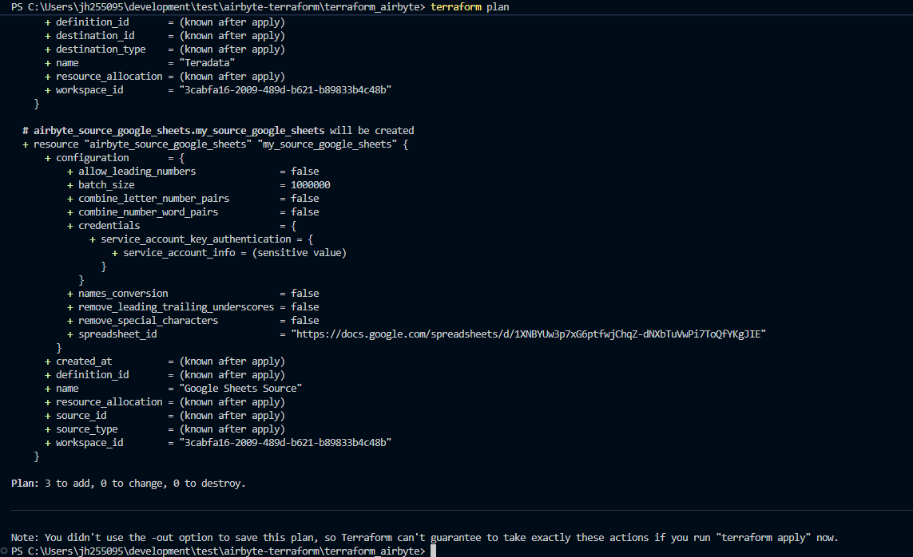
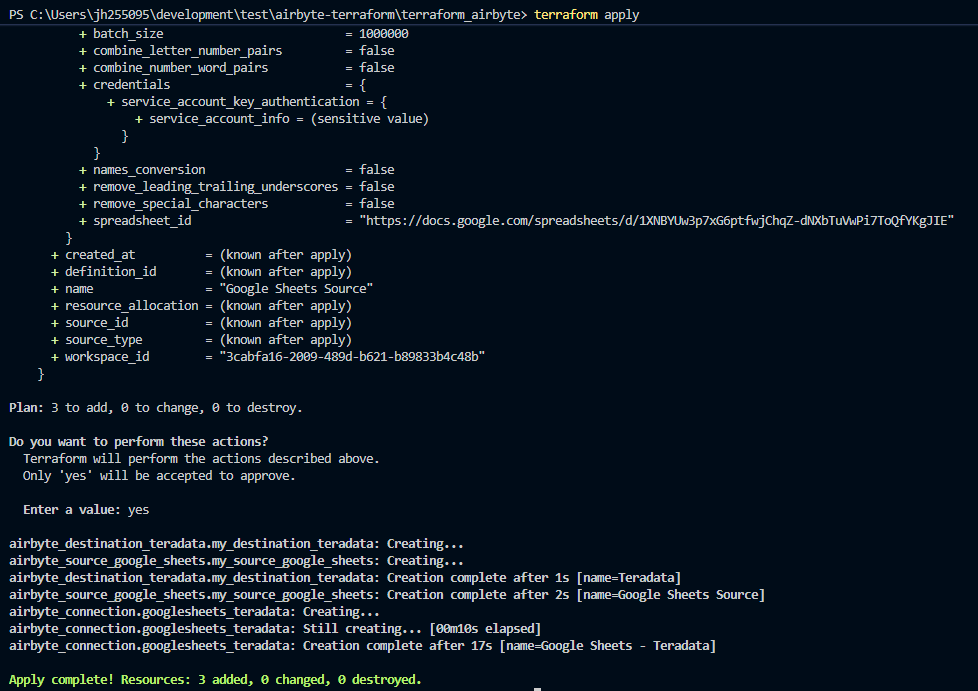
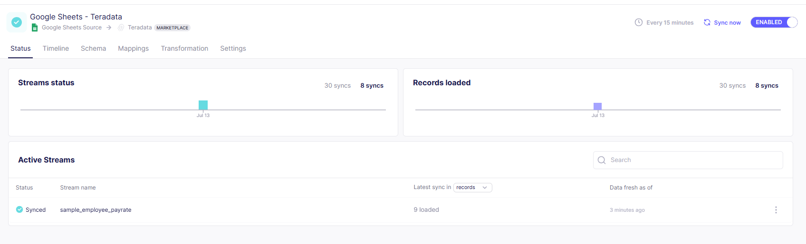

import YouTubeVideo from '../_partials/terraform-video.mdx';
import Tabs from '@theme/Tabs';
import TabItem from '@theme/TabItem';

# Manage ELT pipelines as code with Terraform and Airbyte on Teradata 


### Overview 

This quickstart explains how to use Terraform to manage Airbyte data pipelines as code. Instead of manual configurations through the WebUI, we'll use code to create and manage Airbyte resources. The provided example illustrates a basic ELT pipeline from Google Sheets to Teradata using Airbyte's Terraform provider.

The Airbyte Terraform provider is available for users on Airbyte Cloud, OSS, and Self-Managed Enterprise. **This guide covers Airbyte Cloud setup. For OSS or Self-Managed Enterprise deployments, refer to [Airbyte's documentation](https://docs.airbyte.com/terraform-integration).**

Watch this concise explanation of how this integration works (for the specific code refer to the examples below, the provider has been updated since the video was published):

<YouTubeVideo />

### Introduction
[Terraform](https://www.terraform.io) is a leading open-source tool in the Infrastructure as Code (IaC) space. It enables the automated provisioning and management of infrastructure, cloud platforms, and services via configuration files, instead of manual setup. Terraform uses plugins, known as Terraform providers, to communicate with infrastructure hosts, cloud providers, APIs, and SaaS platforms. 

Airbyte, the data integration platform, has a Terraform provider that communicates directly with [Airbyte's API](https://reference.airbyte.com/reference/start). This allows data engineers to manage Airbyte configurations, enforce version control, and apply good data engineering practices within our ELT pipelines.

### Prerequisites
* [Airbyte Cloud Account](https://airbyte.com/connectors/teradata-vantage). Start with a 30-day free trial that begins after the first successful sync.
  - Log into [Airbyte Cloud ETL](https://airbyte.com/signin).
  - [Obtain an Airbyte Client ID and Client Secret](https://docs.airbyte.com/platform/using-airbyte/configuring-api-access)

* Teradata Instance. You will need a database `host`, `username`, and `password` for Airbyte's Terraform configuration. 
  - [Create a free Teradata instance on Teradata Trial](https://www.teradata.com/try)

* Source Data. For demonstration purposes, we will use a [sample Google Sheets](https://docs.google.com/spreadsheets/d/1XNBYUw3p7xG6ptfwjChqZ-dNXbTuVwPi7ToQfYKgJIE/edit#gid=0).
  - Open the shared spreadsheet link.
  - Click **File** → **Make a copy**.
  - Save the copy to your Google Drive.
  - Note the spreadsheet URL: `https://docs.google.com/spreadsheets/d/spreadsheetid/edit`.

* You will need a service account key from Google API Service. Follow the instructions from [Airbyte Documentation](https://docs.airbyte.com/integrations/sources/google-sheets#set-up-the-service-account-key)

### Install Terraform 
* Apply the respective commands to install Terraform on your operating system. Find additional options on the [Terraform documentation](https://developer.hashicorp.com/terraform/tutorials/aws-get-started/install-cli).


<Tabs>
  <TabItem value="MacOS" label="MacOS" default>
    First, install the HashiCorp tap, a repository of all [Homebrew](https://brew.sh) packages.
    ```bash
      brew tap hashicorp/tap
    ```
    Next, install Terraform with hashicorp/tap/terraform.
    ```bash
      brew install hashicorp/tap/terraform
    ```
  </TabItem>
  <TabItem value="Windows" label="Windows">
    [Chocolatey](https://chocolatey.org) is a free and open-source package management system for Windows. Install the Terraform package from the command-line.
    ```bash
      choco install terraform
    ```
  </TabItem>
  <TabItem value="Linux" label="Linux">
    ```bash
    wget -O- https://apt.releases.hashicorp.com/gpg | sudo gpg --dearmor -o /usr/share/keyrings/hashicorp-archive-keyring.gpg
    echo "deb [signed-by=/usr/share/keyrings/hashicorp-archive-keyring.gpg] https://apt.releases.hashicorp.com $(lsb_release -cs) main" | sudo tee /etc/apt/sources.list.d/hashicorp.list
    sudo apt update && sudo apt install terraform 
    ```
  </TabItem>
</Tabs>

### Environment Preparation

Prepare the environment by creating a directory for the Terraform configuration and initializing two files: `main.tf` and `variables.tf`.

``` bash
mkdir terraform_airbyte
cd terraform_airbyte
touch main.tf variables.tf
```

### Define a Data Pipeline

Define the data source, destination, and connection within the `main.tf` file. Open the newly created `main.tf` file in Visual Studio Code or any preferred code editor.

- If using Visual Studio Code, install [HashiCorp Terraform Extensions](https://marketplace.visualstudio.com/items?itemName=HashiCorp.terraform) to add autocompletion and syntax highlighting. 



Populate the `main.tf` file with the template provided:
``` bash
# Provider Configuration
terraform {
  required_providers {
    airbyte = {
      source = "airbytehq/airbyte"
      version = "0.13.0"
    }
  }
}
provider "airbyte" {
  // Use client credentials so the provider refreshes access tokens automatically.
  client_id     = var.airbyte_client_id
  client_secret = var.airbyte_client_secret
  token_url     = var.airbyte_token_url
}

# Teradata Vantage Destination Configuration
# For optional parameters visit https://registry.terraform.io/providers/airbytehq/airbyte/latest/docs/resources/destination_teradata 
resource "airbyte_destination_teradata" "my_destination_teradata" {
  configuration = {
    host   = var.host
    schema = "airbyte_td_two"
    ssl    = false
    ssl_mode = {
      allow = {}
    }
    logmech = {
      td2 = {
        username = var.username
        password = var.password
      }
    }
  }
  name         = "Teradata"
  workspace_id = var.workspace_id
}
# Connection Configuration 
resource "airbyte_connection" "googlesheets_teradata" {
  name           = "Google Sheets - Teradata"
  source_id      = airbyte_source_google_sheets.my_source_google_sheets.source_id
  destination_id = airbyte_destination_teradata.my_destination_teradata.destination_id

  schedule = {
    schedule_type   = "cron"
    cron_expression = "0 */15 * * * ?" # every 15 minutes
  }
}
# Google Sheets Source Configuration
resource "airbyte_source_google_sheets" "my_source_google_sheets" {
  configuration = {
    spreadsheet_id = var.google_sheets_spreadsheet_id
    credentials = {
      service_account_key_authentication = {
        service_account_info = var.google_service_account_info
      }
    }
  }
  name         = "Google Sheets Source"
  workspace_id = var.workspace_id
}
```

Note that this example uses a cron expression to schedule the data transfer to run every 15 minutes. 

In our `main.tf` file, we reference variables that are held in the `variables.tf` file, including the API key, workspace ID, Google Sheets ID, Google private key, and Teradata credentials. We will populate sensitive credentials to a `terraform.tfvars` file that we will not commit to version control.

### Configuring the variables.tf File

``` bash
# Create these in Airbyte UI: User settings -> Applications.
variable "airbyte_client_id" {
  type        = string
  sensitive   = true
  description = "Airbyte application client ID"
}

variable "airbyte_client_secret" {
  type        = string
  sensitive   = true
  description = "Airbyte application client secret"
}

variable "airbyte_token_url" {
  type        = string
  description = "OAuth token endpoint used by the Airbyte provider"
  default     = "https://api.airbyte.com/v1/applications/token"
}

#workspace_id is found in the URL to the Airbyte Cloud account https://cloud.airbyte.com/workspaces/<workspace_id>/settings/dbt-cloud 
variable "workspace_id" {
    type = string
}

# Teradata Vantage connection credentials
variable "host" {
  type = string
}
variable "username" {
  type = string
}
variable "password" {
  type = string
  sensitive = true
}

variable "google_sheets_spreadsheet_id" {
  type        = string
  description = "Google Sheets URL to read from"
}

variable "google_service_account_info" {
  type        = string
  sensitive   = true
  description = "Service account JSON key as a single string"
}
```
### Sample Terraform .tfvars File

We will need a `terraform.tfvars` file with the following structure:

```bash
airbyte_client_id     = "your-airbyte-client-id-here"
airbyte_client_secret = "your-airbyte-client-secret-here"
workspace_id = "your-workspace-id-here"

# Teradata Vantage connection credentials
host     = "your-teradata-host-here"
username = "your-teradata-username-here"
password = "your-teradata-password-here"

# Google Sheets configuration
google_sheets_spreadsheet_id = "https://docs.google.com/spreadsheets/d/your-spreadsheet-id-here"
google_service_account_info = <<EOT
Your Google service account key
EOT
```

### Understanding Terraform State

Before executing your Terraform configuration, it's important to understand how Terraform manages state.

The `terraform.tfstate` file is created after running `terraform apply` for the first time. This file tracks the status of all sources, destinations, and connections managed by Terraform — it serves as a snapshot of your infrastructure's current state.

**Important:** Do not modify the `.tfstate` file manually. Terraform relies on this file to determine what changes are needed between your configuration files and the actual infrastructure.

For subsequent executions of `terraform apply`, Terraform compares the code in the `main.tf` file with the state stored in the `.tfstate` file. If you add or remove resources in `main.tf`, Terraform automatically updates both your deployment and the `.tfstate` file accordingly.

**Best practice for version control:** If you're using CI/CD or collaborating with team members, do not commit the `.tfstate` file to version control. Instead, use remote state storage (such as Terraform Cloud, S3, or Azure Blob Storage) to manage state securely across your team.

### Execution Commands

Run `terraform init` to pull down the provider plugin from the Terraform provider registry and initialize a working Terraform directory.

This command should only be run after writing a new Terraform configuration or cloning an existing configuration from version control.



Run `terraform validate` to validate your Terraform configuration.



Run `terraform plan` to display the execution plan that Terraform will use to create resources and make modifications to infrastructure. 

For this example, a plan for 3 new resources is created:

Connection: # airbyte_connection.googlesheets_teradata will be created

Destination: # airbyte_destination_teradata will be created

Source: # airbyte_source_google_sheets.my_source_gsheets will be created
  


Run `terraform apply`, then enter `yes` to create a plan and carry out the plan.



We now have a source, destination, and connection on Airbyte Cloud created and managed via Terraform. 



### Additional Resources 

- [Use Airbyte to Load Data from External Sources to Teradata](./use-airbyte-to-load-data-from-external-sources-to-teradata.md)
- [Airbyte API Reference Documentation](https://reference.airbyte.com/reference/createsource).
- [Terraform Airbyte Provider Docs](https://registry.terraform.io/providers/airbytehq/airbyte/latest/docs/resources/destination_teradata#example-usage)