import TrialDocsNote from '../_partials/teradata_trial.mdx'

# Use Airbyte to load data from external sources to Teradata


## Overview

This tutorial shows how to use Airbyte to move data from external sources to Teradata. In this example, you replicate data from Google Sheets to Teradata. You can follow the configuration steps using either [Airbyte Open Source](https://docs.airbyte.com/using-airbyte/getting-started) or [Airbyte Cloud](https://airbyte.com).

* Source: Google Sheets
* Destination: Teradata

## Prerequisites

* Access to a Teradata instance. This will be defined as the destination of the Airbyte connection. You will need a `Host`, `Username`, and `Password` for Airbyte's configuration.

<TrialDocsNote />

* [Google Cloud Platform API enabled for your personal or organizational account](https://support.google.com/googleapi/answer/6158841?hl=en). You'll need to authenticate your Google account via OAuth or via Service Account Key Authenticator. In this example, we use Service Account Key Authenticator.

* Data from the source system. In this case, we use a [sample spreadsheet from Google Sheets](https://docs.google.com/spreadsheets/d/1XNBYUw3p7xG6ptfwjChqZ-dNXbTuVwPi7ToQfYKgJIE/edit). The sample data is a breakdown of pay rate by employee type.

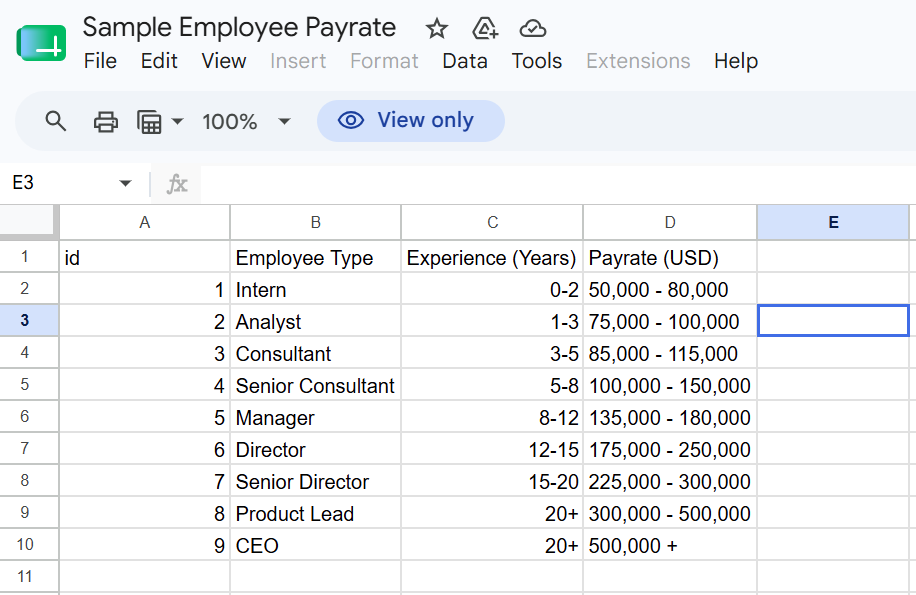

### Airbyte Cloud
* Create an account on [Airbyte Cloud](https://cloud.airbyte.com/login) and skip to the instructions under the [Airbyte Configuration](#airbyte-configuration) section.

### Airbyte Open Source
To deploy a local instance of Airbyte Core, Airbyte's open source product, you need to install: 
* Docker Desktop on your machine ([Mac](https://docs.docker.com/desktop/setup/install/mac-install/), [Windows](https://docs.docker.com/desktop/setup/install/windows-install/), [Linux](https://docs.docker.com/desktop/setup/install/linux/)).  

* [abctl](https://docs.airbyte.com/platform/using-airbyte/getting-started/oss-quickstart#part-2-install-abctl), Airbyte's command line tool for deploying and managing Airbyte. It can be installed for [Mac](https://docs.airbyte.com/platform/using-airbyte/getting-started/oss-quickstart#install-abctl-the-fast-way-mac-linux), [Windows](https://docs.airbyte.com/platform/using-airbyte/getting-started/oss-quickstart#install-abctl-manually-mac-linux-windows), and [Linux](https://docs.airbyte.com/platform/using-airbyte/getting-started/oss-quickstart#install-abctl-the-fast-way-mac-linux). 

There are several ways to [run Airbyte](https://docs.airbyte.com/platform/using-airbyte/getting-started/oss-quickstart#part-3-run-airbyte) on your machine. You can run it locally, over HTTP, and even in low resource mode. In this example, we run Airbyte Open Source locally using Docker Desktop. 

* While keeping Docker Desktop running, open a terminal and run the following command to install Airbyte.     
``` bash
abctl local install
```

!!! note
    Installation may take up to 30 minutes depending on your internet connection. When it completes, the Airbyte instance opens up in your web browser at [http://localhost:8000](http://localhost:8000).  

* In the opened [http://localhost:8000](http://localhost:8000) page, enter your Email and Organization name, then click `Get started`.

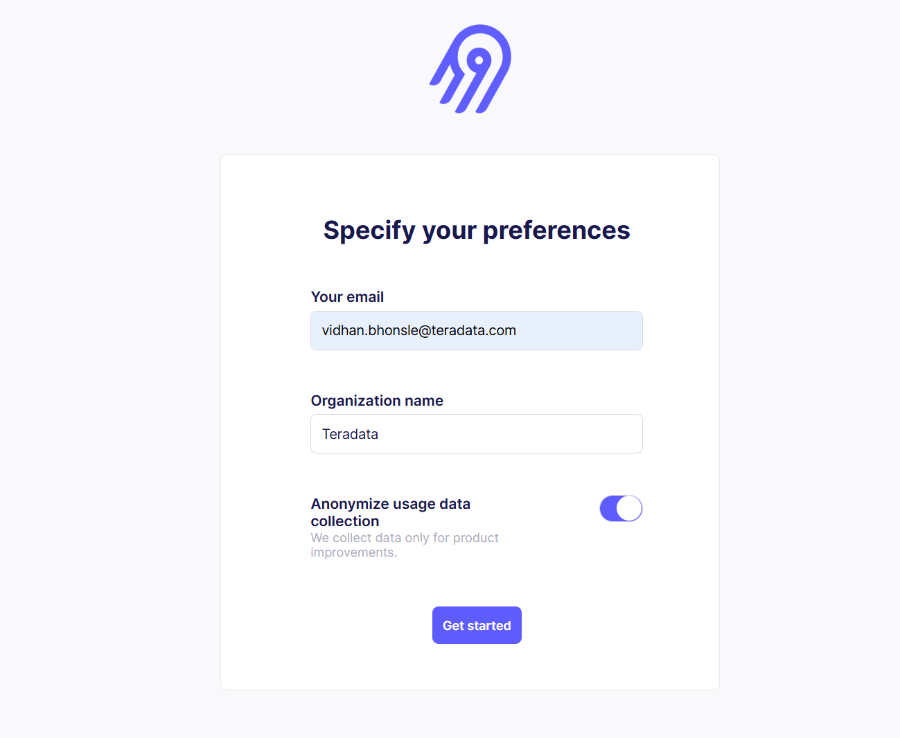      

* To access your Airbyte instance, you need a password. 

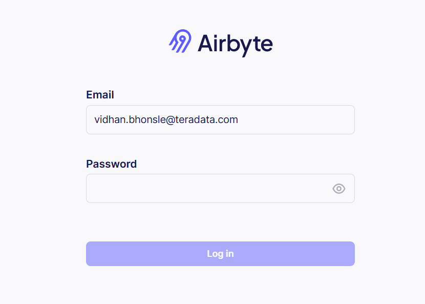  

* To get the credentials, enter the following command in the terminal.

 ``` bash
abctl local credentials
 ```

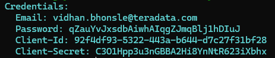  

Enter the password you got from the terminal, as shown in the previous image, in the browser to log into Airbyte.
Once Airbyte Open Source is launched for the first time, you will see a connections dashboard.

## Airbyte Configuration

### Set up the Source Connection

* Click `Create your first connection` to initiate a new connection workflow.


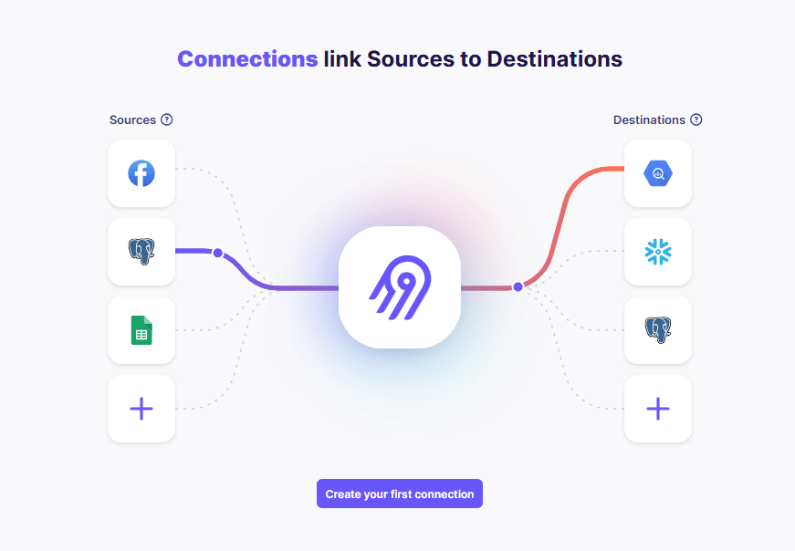

* Airbyte asks you to select a source. You can select an existing source or set up a new source. In this example, select `Google Sheets`.

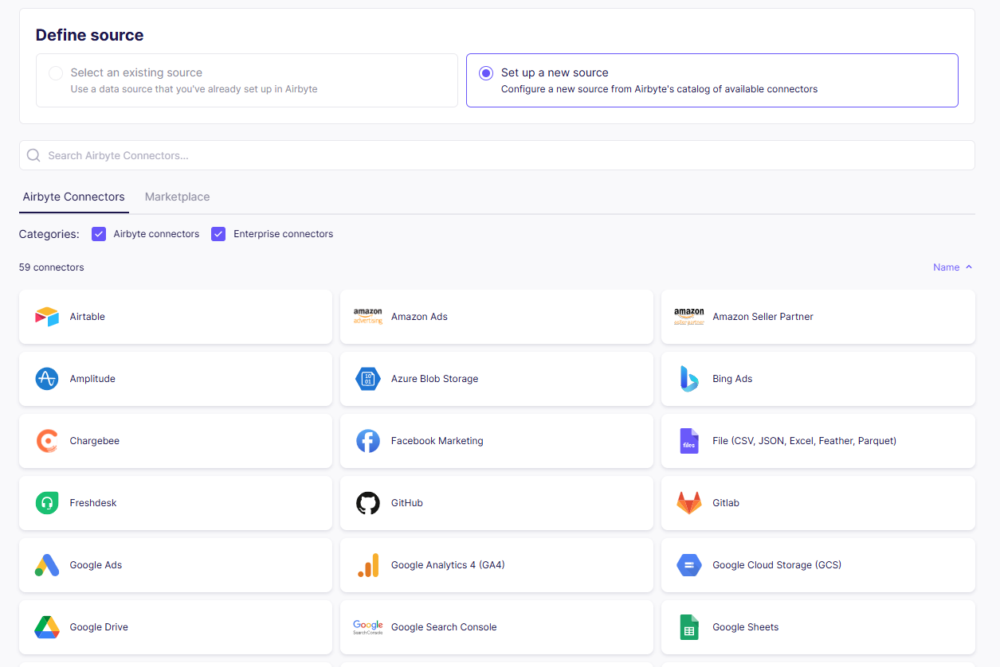

* Add the link to the source spreadsheet as `Spreadsheet Link`.

* For authentication use `Service Account Key Authentication`, which uses a service account key in JSON format. Toggle from the default `OAuth` option to `Service Account Key Authentication`, then enter your [Google Cloud service account key](https://cloud.google.com/iam/docs/keys-create-delete#creating_service_account_keys) in JSON format.

* Make sure the service account has the `Viewer` role in your Google Cloud project and that the `Google Sheets API` is enabled for the project. If your spreadsheet is viewable by anyone with its link, no further action is needed. If not, open the Google Sheet, click `Share`, and give the service account email from the JSON key, listed as `client_email`, at least `Viewer` access to the spreadsheet.

!!! note
    For more details, refer to [setting Google Sheets as Source Connector in Airbyte Open Source](https://docs.airbyte.com/integrations/sources/google-sheets) 

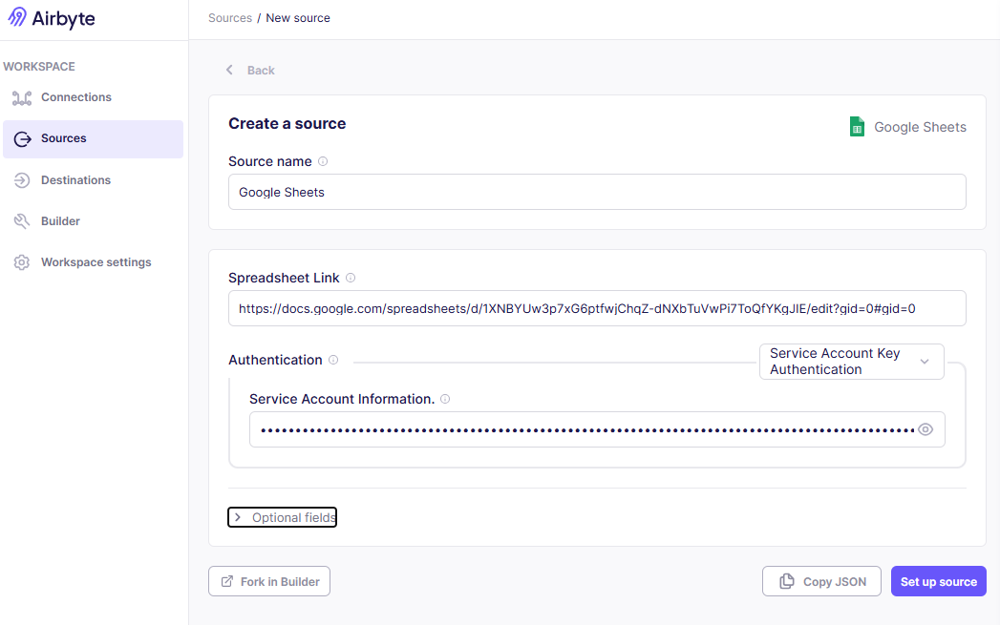


* Click `Set up source`. If the configuration is correct, you will see the `Define destination` section.

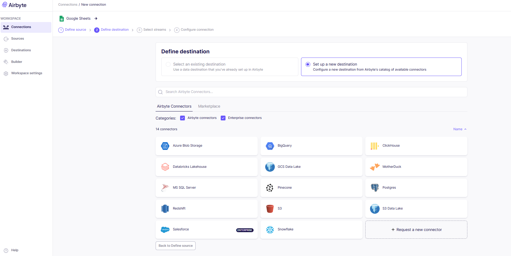

### Set up the Destination Connection
* Assuming you want to create a fresh new connection with `Teradata`, search for `Teradata` as the destination type under the "Set up a new destination" section. You can find it under `marketplace`.
* Add the `Host`, `User`, and `Password`. These are the same as the `Host`, `Username`, and `Password` for your Teradata instance (check [prerequisites](#prerequisites)).

* Provide a default schema name under the `Optional fields` section. In this example, we use `gsheet_airbyte_td`.


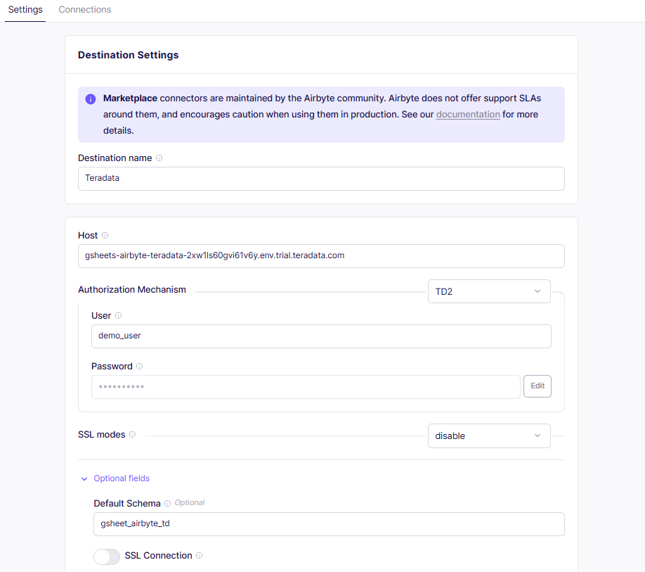


* Click `Set up destination`. If the configuration is correct, you will see the `Select streams` section.


!!! note
    If you get a configuration check failed error, make sure your Teradata instance is running and accessible from Airbyte. 

### Select sync mode and schema
* In the `Select streams` section, you can select how you want your data to be delivered to the Teradata destination.
* Under `Select Sync Mode`, you can choose between `Replicate Source` and `Append Historical Changes`. In this example, we select `Replicate Source`, as it keeps an up-to-date copy of the Google Sheets data in Teradata.
* Under `Schema`, review the columns detected from the Google Sheet.

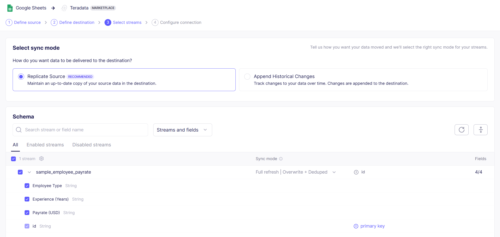

* In this example, Airbyte detects the following columns:
    * `id`
    * `Employee Type`
    * `Experience (Years)`
    * `Payrate (USD)`
* Keep all four columns selected. Select `id` as the primary key, as it uniquely identifies each row in the Google Sheet.
* After selecting the sync mode and confirming the schema, click `Next`.

### Configure connection
* In the `Configure connection` section, provide a name for your connection. You can keep the default name or update it based on your use case.
* Select the `Schedule type`. In this example, we keep it as `Scheduled`.
* Select the `Replication frequency`. In this example, we keep it as `Every 24 hours`.
* Under `Destination Namespace`, select `Destination-defined`. In this example, the destination is Teradata, so Airbyte uses the default schema `gsheet_airbyte_td` that we defined while configuring the Teradata destination.

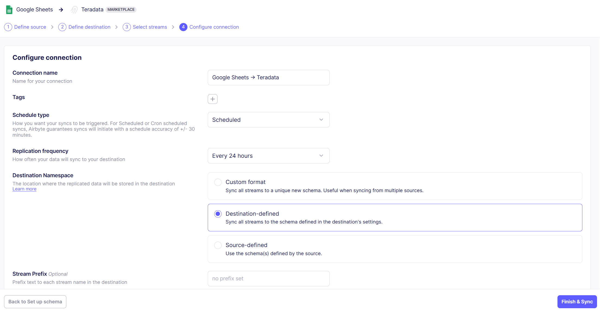

!!! note
    We use the term "schema", as it is the term used by Airbyte. In a Teradata context, the equivalent term is "database".

* The stream name is based on the name of the spreadsheet in the source. In this example, the stream name is `sample_employee_payrate`. Since we are using the single spreadsheet connector, it supports one stream for the selected spreadsheet.

* Review the configuration and click `Finish & Sync` to create the connection and start syncing data from Google Sheets to Teradata.

### Data Sync Validation in Airbyte

After you click `Finish & Sync`, Airbyte creates the connection and starts the first sync. Airbyte tracks synchronization attempts in the `Status` tab.

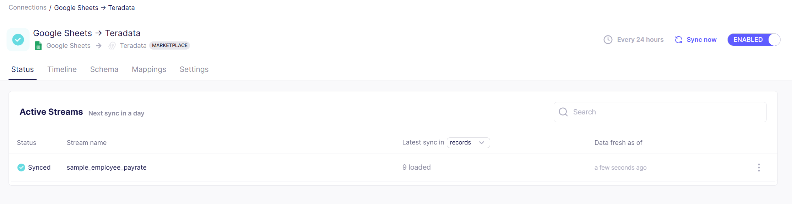

In this example, the `sample_employee_payrate` stream is synced successfully, and Airbyte shows that 9 records were loaded to the Teradata destination.

You can also click `Sync now` to run the sync manually.

### Validate the data in Teradata Trial

Next, you can go to the [Teradata Trial](https://clearscape.teradata.com/#/dashboard) and run a Jupyter notebook to verify if the database `gsheet_airbyte_td`, stream table, and data are available in Teradata.

Notebooks in Teradata Trial are configured to run Teradata SQL queries.

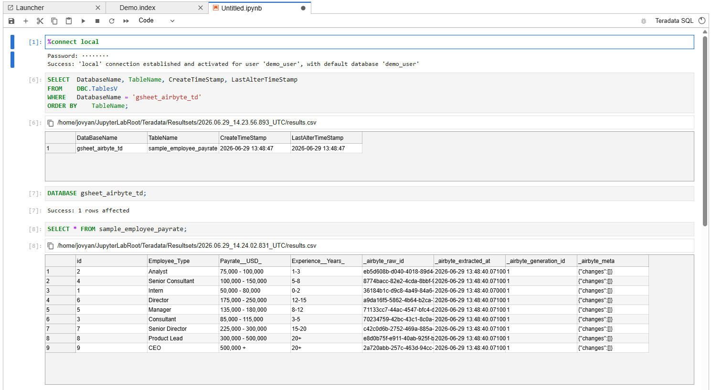

Connect to the local Teradata environment.

```bash
%connect local 
```

Run the following query to verify that the database and table were created in Teradata.

```sql
SELECT  DatabaseName, TableName, CreateTimeStamp, LastAlterTimeStamp
FROM    DBC.TablesV
WHERE   DatabaseName = 'gsheet_airbyte_td'
ORDER BY    TableName;
```

Switch to the `gsheet_airbyte_td` database.

```sql
DATABASE gsheet_airbyte_td; 
```

Query the synced table.

```sql
SELECT * FROM sample_employee_payrate;  
```

In this example, the table `sample_employee_payrate` is created in the `gsheet_airbyte_td` database. The table contains the data synced from the Google Sheet along with Airbyte metadata columns.

Airbyte may convert source column names into SQL-friendly column names in the destination. In this example, the Google Sheet columns are synced to Teradata as `id`, `Employee__Type`, `Experience__Years_`, and `Payrate__USD_`. Airbyte also adds metadata columns such as `_airbyte_raw_id`, `_airbyte_extracted_at`, `_airbyte_generation_id`, and `_airbyte_meta`.

You should see 9 rows in the Teradata table, the same as the source Google Sheet.

### Optional: Close and delete the connection

If you do not want Airbyte to continue syncing data from Google Sheets to Teradata, go to the `Connections` page and disable the connection using the `Enabled` toggle. This stops future syncs without deleting the connection configuration.

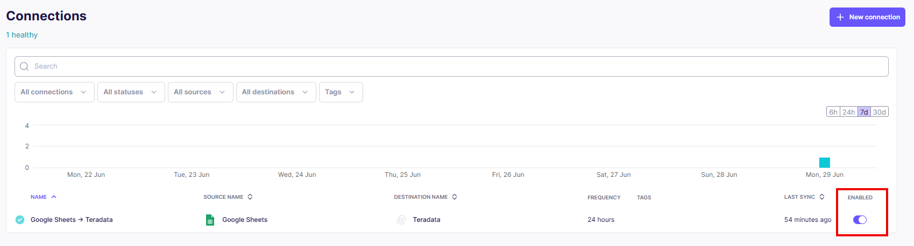

You can also delete the connection if you no longer need it. To delete the connection, open the connection, go to the `Settings` tab, scroll to `Delete Connection`, and click `Delete this connection`.

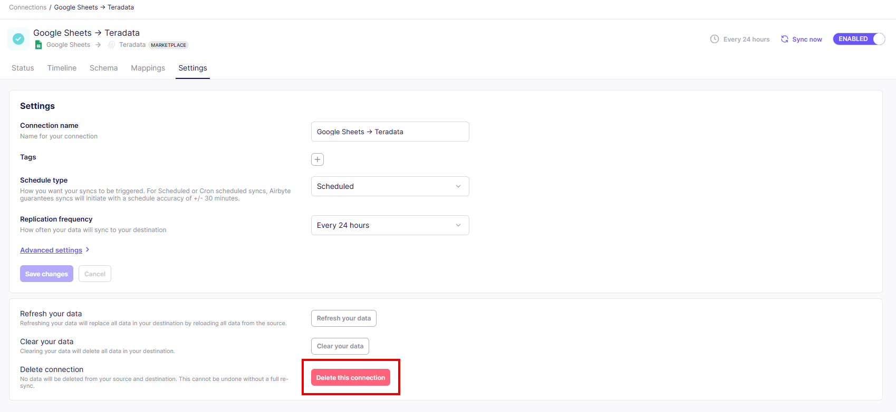


## Summary
This tutorial demonstrated how to extract data from a source system like Google Sheets and use Airbyte to load the data into a Teradata instance. We saw the end-to-end data flow, including how to run Airbyte Open Source locally, configure Google Sheets as the source, configure Teradata as the destination, select the sync mode and schema, and start the data sync. We also validated the synced data in Teradata Trial and reviewed how to disable or delete the Airbyte connection when it is no longer needed.

## Further reading
[Teradata Destination | Airbyte Documentation](https://docs.airbyte.com/integrations/destinations/teradata/?_ga=2.156631291.1502936448.1684794236-1752661382.1684794236)

[Core Concepts | Airbyte Documentation](https://docs.airbyte.com/cloud/core-concepts/#connection-sync-modes)

[Airbyte Community Slack](https://airbyte.com/community)

[Airbyte Community](https://discuss.airbyte.io)