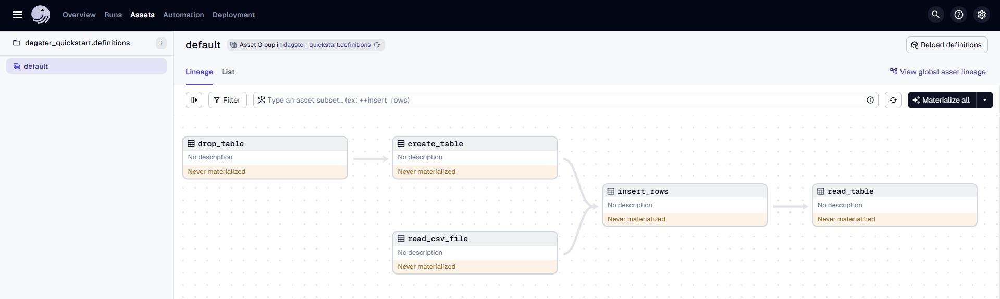
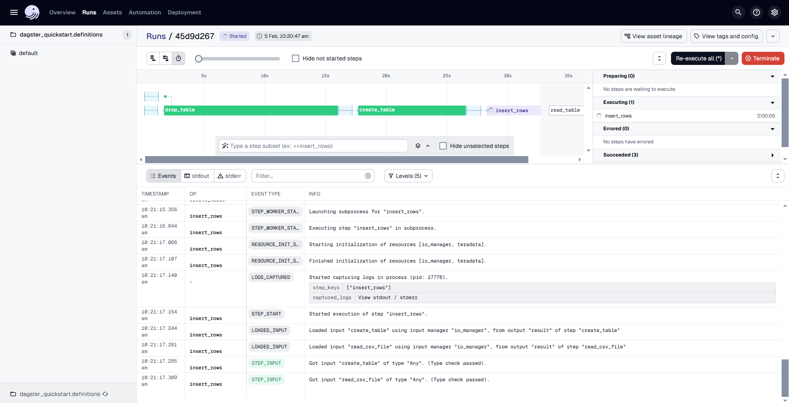

import ClearscapeDocsNote from '../_partials/vantage_clearscape_analytics.mdx'
import InstallTabs from '../_partials/tabsDBT.mdx'

# dagster-teradata with Teradata Vantage

This guide walks you through integrating Dagster with Teradata Vantage to create and manage ETL pipelines. It provides step-by-step instructions for installing and configuring the necessary packages, setting up a Dagster project, and implementing a pipeline that interacts with Teradata Vantage.

## Dagster

* Dagster is a data orchestrator built for data engineers, with integrated lineage, observability, a declarative programming model and best-in-class testability.
* Data pipelines are automated workflows that ingest raw data, process it through various transformations (such as cleaning and structuring), and produce a final, usable format—much like an assembly line for data.
* Dagster orchestrates this process by defining each stage of the pipeline, ensuring tasks execute in the correct sequence and at scheduled intervals. It provides a structured way to manage dependencies, track execution, and maintain reliable data workflows.
* Dagster orchestrates dbt alongside other technologies. Dagster's asset-oriented approach allows Dagster to understand dbt at the level of individual dbt models.


## Prerequisites

* Access to a Teradata Vantage instance.

    <ClearscapeDocsNote />

* Python **3.9** or higher, Python **3.12** is recommended.
* pip

## Setting Up a Virtual Enviroment

A virtual environment is recommended to isolate project dependencies and avoid conflicts with system-wide Python packages. Here’s how to set it up:
     
      <InstallTabs/>

## Install dagster and dagster-teradata

With your virtual environment active, the next step is to install dagster and the Teradata provider package (dagster-teradata) to interact with Teradata Vantage.

1. Install the Required Packages:
    
    ```bash
    pip install dagster dagster-webserver dagster-teradata
    ```

2. Note about Optional Dependencies:
   <br>
   <br>
   a) dagster-teradata relies on dagster-aws for ingesting data from an S3 bucket into Teradata Vantage. Since dagster-aws is an optional dependency, users can install it by running:

     ```bash
    pip install dagster-teradata[aws]
    ```
   b) dagster-teradata also relies on dagster-azure for ingesting data from an Azure Blob Storage container into Teradata Vantage. To install this dependency, run:

     ```bash
    pip install dagster-teradata[azure]
    ```

3. Verify the Installation: 
   <br>
   <br>
   To confirm that Dagster is correctly installed, run:
     ```bash
    dagster –version
    ```
   If installed correctly, it should show the version of Dagster.


## Initialize a Dagster Project

Now that you have the necessary packages installed, the next step is to create a new Dagster project.

### Scaffold a New Dagster Project

Run the following command:

```bash
dagster project scaffold --name dagster-quickstart
 ```
This command will create a new project named dagster-quickstart. It will automatically generate the following directory structure:

```bash
dagster-quickstart
│   pyproject.toml
│   README.md
│   setup.cfg
│   setup.py
│
├───dagster_quickstart
│       assets.py
│       definitions.py
│       __init__.py
│
└───dagster_quickstart_tests
        test_assets.py
        __init__.py
 ```

Refer [here](https://docs.dagster.io/guides/build/projects/dagster-project-file-reference) to know more above this directory structure

## Create Sample Data

To simulate an ETL pipeline, create a CSV file with sample data that your pipeline will process.

**Create the CSV File:** Inside the dagster_quickstart/data/ directory, create a file named sample_data.csv with the following content:

```bash
id,name,age,city
1,Alice,28,New York
2,Bob,35,San Francisco
3,Charlie,42,Chicago
4,Diana,31,Los Angeles
 ```
This file represents sample data that will be used as input for your ETL pipeline.

## Define Assets for the ETL Pipeline

Now, we’ll define a series of assets for the ETL pipeline inside the assets.py file.

**Edit the assets.py File**: Open the dagster_quickstart/assets.py file and add the following code to define the pipeline:

```python
import pandas as pd
from dagster import asset

@asset(required_resource_keys={"teradata"})
def read_csv_file(context):
    df = pd.read_csv("dagster_quickstart/data/sample_data.csv")
    context.log.info(df)
    return df

@asset(required_resource_keys={"teradata"})
def drop_table(context):
    result = context.resources.teradata.drop_table(["tmp_table"])
    context.log.info(result)

@asset(required_resource_keys={"teradata"})
def create_table(context, drop_table):
    result = context.resources.teradata.execute_query('''CREATE TABLE tmp_table (
                                                            id INTEGER,
                                                            name VARCHAR(50),
                                                            age INTEGER,
                                                            city VARCHAR(50));''')
    context.log.info(result)

@asset(required_resource_keys={"teradata"}, deps=[read_csv_file])
def insert_rows(context, create_table, read_csv_file):
    data_tuples = [tuple(row) for row in read_csv_file.to_numpy()]
    for row in data_tuples:
        result = context.resources.teradata.execute_query(
            f"INSERT INTO tmp_table (id, name, age, city) VALUES ({row[0]}, '{row[1]}', {row[2]}, '{row[3]}');"
        )
        context.log.info(result)

@asset(required_resource_keys={"teradata"})
def read_table(context, insert_rows):
    result = context.resources.teradata.execute_query("select * from tmp_table;", True)
    context.log.info(result)

```

This Dagster pipeline defines a series of assets that interact with Teradata. It starts by reading data from a CSV file, then drops and recreates a table in Teradata. After that, it inserts rows from the CSV into the table and finally retrieves the data from the table.

## Define the Pipeline Definitions

The next step is to configure the pipeline by defining the necessary resources and jobs.

**Edit the definitions.py File**: Open dagster_quickstart/definitions.py and define your Dagster pipeline as follows:

```python
from dagster import EnvVar, Definitions
from dagster_teradata import TeradataResource

from .assets import read_csv_file, read_table, create_table, drop_table, insert_rows

# Define the pipeline and resources
defs = Definitions(
    assets=[read_csv_file, read_table, create_table, drop_table, insert_rows],  
    resources={
        "teradata": TeradataResource(
            host=EnvVar("TERADATA_HOST"),
            user=EnvVar("TERADATA_USER"),
            password=EnvVar("TERADATA_PASSWORD"),
            database=EnvVar("TERADATA_DATABASE"),
        )
    }
)
```

This code sets up a Dagster project that interacts with Teradata by defining assets and resources

1.	It imports necessary modules, including pandas, Dagster, and dagster-teradata.
2.	It imports asset functions (read_csv_file, read_table, create_table, drop_table, insert_rows) from the assets.py module.
3.	It registers these assets with Dagster using Definitions, allowing Dagster to track and execute them.
4.	It defines a Teradata resource (TeradataResource) that reads database connection details from environment variables (TERADATA_HOST, TERADATA_USER, TERADATA_PASSWORD, TERADATA_DATABASE).

## Running the Pipeline

After setting up the project, you can now run your Dagster pipeline:

1.	**Start the Dagster Dev Server:** In your terminal, navigate to the root directory of your project and run:
dagster dev
After executing the command dagster dev, the Dagster logs will be displayed directly in the terminal. Any errors encountered during startup will also be logged here. Once you see a message similar to:
        ```bash
        2025-02-04 09:15:46 +0530 - dagster-webserver - INFO - Serving dagster-webserver on http://127.0.0.1:3000 in process 32564,
        ```
        It indicates that the Dagster web server is running successfully. At this point, you can proceed to the next step.
<br>
<br>
2.	**Access the Dagster UI:** Open a web browser and navigate to http://127.0.0.1:3000. This will open the Dagster UI where you can manage and monitor your pipelines.
<br>
<br>
        
<br>
<br>
3.	**Run the Pipeline:**
* In the top navigation of the Dagster UI, click on Assets > View global asset lineage.
* Click Materialize to execute the pipeline.
* In the popup window, click View to see the details of the pipeline run.
<br>
<br>
        
<br>
<br>

4.	**Monitor the Run:** The Dagster UI allows you to visualize the pipeline's progress, view logs, and inspect the status of each step. You can switch between different views to see the execution logs and metadata for each asset.

## Below are some of the definitions provided by the TeradataResource:

* **execute_query:**
    
    Args:

      sql (str): the query to be executed
      fetch_results (bool, optional): If True, fetch the query results. Defaults to False.
      single_result_row (bool, optional): If True, return only the first row of the result set.
        Effective only if `fetch_results` is True. Defaults to False.

* **execute_queries**

    Args:
    
      sql_queries (Sequence[str]): List of queries to be executed in series
      fetch_results (bool, optional): If True, fetch the query results. Defaults to False.
      single_result_row (bool, optional): If True, return only the first row of the result set.
          Effective only if `fetch_results` is True. Defaults to False.

* **drop_database** 

  Args:

      databases (Union[str, Sequence[str]]): Database name or list of database names to drop.

* **drop_table**

   Args:

      tables (Union[str, Sequence[str]]): Table name or list of table names to drop.


## Summary
This guide provides a step-by-step approach to integrating Dagster with Teradata Vantage for building ETL pipelines

## Further reading
* https://docs.dagster.io/
* https://docs.dagster.io/getting-started/quickstart
* https://docs.dagster.io/getting-started/installation
* https://docs.dagster.io/etl-pipeline-tutorial/
