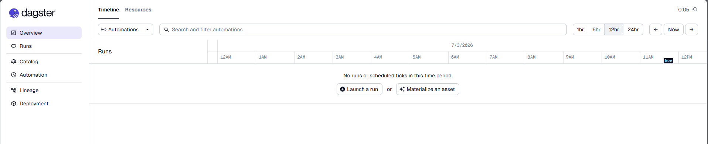
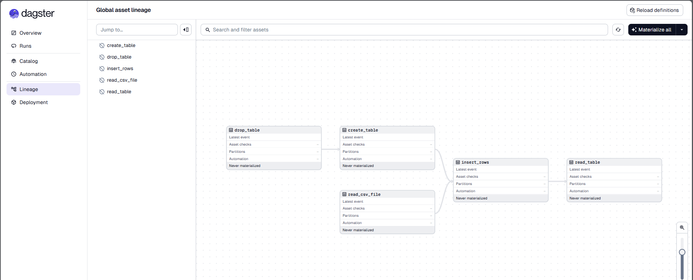
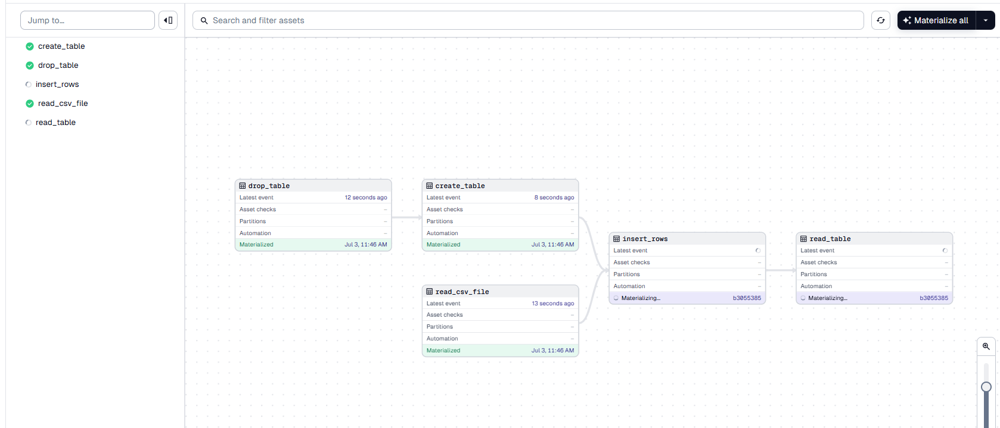

---
id: use-dagster-with-teradata
sidebar_position: 4.5
author: Mohan Talla, Daniel Herrera
email: developer.relations@teradata.com
page_last_update: 2026-06-23
description: Use dagster-teradata with Teradata.
keywords: [dagster, dagster-teradata, data warehouses, compute storage separation, teradata, vantage, cloud data platform, object storage, business intelligence, enterprise analytics, elt]
---

import TrialDocsNote from '../_partials/teradata_trial.mdx'

# dagster-teradata with Teradata

This guide walks you through integrating Dagster with Teradata to create and manage ETL pipelines. It provides step-by-step instructions for installing and configuring the necessary packages, setting up a Dagster project, and implementing a pipeline that interacts with Teradata.

## Dagster

* Dagster is a data orchestrator built for data engineers, with integrated lineage, observability, a declarative programming model and best-in-class testability.
* Data pipelines are automated workflows that ingest raw data, process it through various transformations (such as cleaning and structuring), and produce a final, usable format—much like an assembly line for data.
* Dagster orchestrates this process by defining each stage of the pipeline, ensuring tasks execute in the correct sequence and at scheduled intervals. It provides a structured way to manage dependencies, track execution, and maintain reliable data workflows.
* Dagster orchestrates dbt alongside other technologies. Dagster's asset-oriented approach allows Dagster to understand dbt at the level of individual dbt models.


## Prerequisites

* Access to a Teradata cloud or on-premises instance (Teradata Cloud, Teradata Factory, or Teradata Trial).

    <TrialDocsNote />

* Python **3.9** or higher, Python **3.12** is recommended.
* `uv` package manager for Python environment management.
* A Teradata database where you have CREATE TABLE privileges. You can create one by running:

  ```sql
  CREATE DATABASE dagster_pipeline_db AS PERMANENT = 100e6;
  ```

## Setting Up the Project with `uv`

We'll use `uv` exclusively to manage dependencies and run commands. No manual venv activation is required.

## Initialize a Dagster Project

We'll use `uvx` to scaffold a new Dagster project, which automatically creates a `pyproject.toml` with all dependencies.

### Create a New Dagster Project

Run the following command:

```bash
uvx create-dagster@latest project dagster-quickstart
```

When prompted, respond `y` to run `uv sync` which will set up the isolated environment and install all dependencies:

```
A `uv` installation was detected. Run `uv sync`? (y/n) [y]: y
```

This command will create a new project named `dagster-quickstart` with the following directory structure:

```bash
cd dagster-quickstart
```

```bash
dagster-quickstart
│   pyproject.toml
│   README.md
│   uv.lock
│   .gitignore
│
├───.venv/                          (virtual environment created by uv sync)
│
├───.dg/                            (Dagster CLI configuration)
│
├───src/
│   └───dagster_quickstart/
│       ├── definitions.py
│       ├── defs/
│       │   └── __init__.py
│       └── __init__.py
│
└───tests/
    └── __init__.py
```

### Configure the `pyproject.toml` with Required Packages

The generated `pyproject.toml` needs the `dagster-teradata` package to interact with Teradata. Open the `pyproject.toml` file and add `dagster-teradata` to the dependencies section:

```toml
dependencies = [
    ...
    "pandas",
    "dagster-teradata",
    "python-dotenv",
]
```

After modifying the `pyproject.toml`, run `uv sync` to install the new dependencies:

```bash
uv sync
```

This ensures that all required packages, including `dagster-teradata`, are installed in your isolated environment.

## Create Sample Data

To simulate an ETL pipeline, create a CSV file with sample data that your pipeline will process.

**Create the data directory:** First, create a `data` directory inside the `dagster_quickstart` project root:

```bash
mkdir data
```

**Create the CSV File:** Inside the `/data` directory, create a file named `sample_data.csv` with the following content:

```
id,name,age,city
1,Alice,28,New York
2,Bob,35,San Francisco
3,Charlie,42,Chicago
4,Diana,31,Los Angeles
```

This file represents sample data that will be used as input for your ETL pipeline.

## Create a Database for the Pipeline

Before defining assets, create a database where the pipeline can create and drop tables:

```sql
CREATE DATABASE dagster_pipeline_db AS PERMANENT = 100e6;
```

## Define Assets for the ETL Pipeline

Now, we'll define a series of assets for the ETL pipeline. Assets must be organized properly so they can be discovered by Dagster.

**Create the assets module:** Create a file named `assets.py` in the `defs/` folder and add the following code to define the pipeline:

```python
import pandas as pd
from pathlib import Path
from dagster import asset

@asset(required_resource_keys={"teradata"})
def read_csv_file(context):
    csv_path = Path(__file__).parent.parent.parent.parent / "data" / "sample_data.csv"
    df = pd.read_csv(csv_path)
    context.log.info(df)
    return df

@asset(required_resource_keys={"teradata"})
def drop_table(context):
    try:
        result = context.resources.teradata.drop_table(["dagster_pipeline_db.tmp_table"])
        context.log.info(result)
    except Exception as e:
        context.log.warning(f"Drop table warning (may not exist): {e}")

@asset(required_resource_keys={"teradata"})
def create_table(context, drop_table):
    try:
        result = context.resources.teradata.execute_query('''CREATE TABLE dagster_pipeline_db.tmp_table (
                                                                id INTEGER,
                                                                name VARCHAR(50),
                                                                age INTEGER,
                                                                city VARCHAR(50));''')
        context.log.info(result)
    except Exception as e:
        context.log.error(f"Failed to create table: {e}")
        raise

@asset(required_resource_keys={"teradata"}, deps=[read_csv_file])
def insert_rows(context, create_table, read_csv_file):
    try:
        data_tuples = [tuple(row) for row in read_csv_file.to_numpy()]
        for row in data_tuples:
            result = context.resources.teradata.execute_query(
                f"INSERT INTO dagster_pipeline_db.tmp_table (id, name, age, city) VALUES ({row[0]}, '{row[1]}', {row[2]}, '{row[3]}');"
            )
            context.log.info(result)
    except Exception as e:
        context.log.error(f"Failed to insert rows: {e}")
        raise

@asset(required_resource_keys={"teradata"})
def read_table(context, insert_rows):
    try:
        result = context.resources.teradata.execute_query("select * from dagster_pipeline_db.tmp_table;", True)
        context.log.info(result)
    except Exception as e:
        context.log.error(f"Failed to read table: {e}")
        raise

```

This Dagster pipeline defines a series of assets that interact with Teradata. It starts by reading data from a CSV file, then drops and recreates a table in Teradata. After that, it inserts rows from the CSV into the table and finally retrieves the data from the table.

### Register Assets in `defs/__init__.py`

Now you need to register these assets so Dagster can discover them. Update the existing `defs/__init__.py` file and add the following:

```python
from .assets import read_csv_file, read_table, create_table, drop_table, insert_rows

__all__ = [
    "read_csv_file",
    "read_table",
    "create_table",
    "drop_table",
    "insert_rows",
]
```

This makes the assets importable from the `defs` module, allowing them to be discovered by Dagster's asset lineage system.

## Set Up Environment Variables

Before defining the pipeline, configure the environment variables that the Teradata resource will use to connect to your Teradata instance. Create a `.env` file in the root of your `dagster-quickstart` project with the following content:

```bash
TERADATA_HOST=your_teradata_host
TERADATA_USER=your_teradata_username
TERADATA_PASSWORD=your_teradata_password
TERADATA_DATABASE=dagster_pipeline_db
```

Replace the placeholder values with your actual Teradata connection details:
- `TERADATA_HOST`: The hostname or IP address of your Teradata instance
- `TERADATA_USER`: Your Teradata username
- `TERADATA_PASSWORD`: Your Teradata password
- `TERADATA_DATABASE`: The database name (use `dagster_pipeline_db` if you created it as shown in the prerequisites)


The next step is to configure the pipeline by defining the necessary resources and jobs.

**Edit the definitions.py File:** Modify `src/dagster_quickstart/definitions.py` and define your Dagster pipeline as follows:

```python
import os
from dotenv import load_dotenv

from dagster import Definitions
from dagster_teradata import TeradataResource


from .defs import read_csv_file, read_table, create_table, drop_table, insert_rows


# Load environment variables from .env file
load_dotenv()

# Configure Teradata resource with connection details from environment variables
td_resource = TeradataResource(
    host=os.getenv("TERADATA_HOST"),
    user=os.getenv("TERADATA_USER"),
    password=os.getenv("TERADATA_PASSWORD"),
    database=os.getenv("TERADATA_DATABASE"),
)

# Define the pipeline and resources
defs = Definitions(
    assets=[read_csv_file, read_table, create_table, drop_table, insert_rows],  
    resources={
        "teradata": td_resource,
    }
)
```

This code sets up a Dagster project that interacts with Teradata by defining assets and resources:

1. It imports necessary modules, including Dagster and dagster-teradata.
2. It imports asset functions (read_csv_file, read_table, create_table, drop_table, insert_rows) from the defs module.
3. It configures the TeradataResource with connection details from environment variables.
4. It registers these assets with Dagster using `Definitions`, allowing Dagster to track and execute them.

## Running the Pipeline

After setting up the project, you can now run your Dagster pipeline:

1. **Start the Dagster Dev Server:** In your terminal, navigate to the root directory of your project and run:

   ```bash
   uv run dg dev
   ```

   The `uv run` command ensures that `dg dev` runs within the project's isolated environment defined in `pyproject.toml`. No manual venv activation is needed.

   After executing the command, the Dagster logs will be displayed in the terminal. Once you see a message similar to:

   ```bash
   2025-02-04 09:15:46 +0530 - dagster - INFO - Serving Dagster UI on http://127.0.0.1:3000
   ```

   The Dagster web server is running successfully.

   > **Note:** `dg dev` creates an ephemeral instance by default. To persist your runs and assets across sessions, set the `DAGSTER_HOME` environment variable before running `uv run dg dev`:
   >
   > **Windows (PowerShell):**
   > ```powershell
   > $env:DAGSTER_HOME="$env:USERPROFILE\.dagster_home"
   > uv run dg dev
   > ```
   >
   > **macOS/Linux:**
   > ```bash
   > export DAGSTER_HOME=~/.dagster_home
   > uv run dg dev
   > ```

2. **Access the Dagster UI:**

   Open a web browser and navigate to `http://127.0.0.1:3000`. This will open the Dagster UI where you can manage and monitor your pipelines.

   

3. **Run the Pipeline:**

   - In the left navigation of the Dagster UI, click on **Lineage**.

    
   - Click **Materialize all** to execute the pipeline.

4. **Monitor the Run:**

   The Dagster UI allows you to visualize the pipeline's progress, view logs, and inspect the status of each step. You can switch between different views to see the execution logs and metadata for each asset.

   

## TeradataResource Operations

Below are some of the operations provided by the TeradataResource:

### 1. Execute a Query (`execute_query`)

This operation executes a SQL query within Teradata.

**Args:**
- `sql` (str) – The query to be executed.
- `fetch_results` (bool, optional) – If True, fetch the query results. Defaults to False.
- `single_result_row` (bool, optional) – If True, return only the first row of the result set. Effective only if `fetch_results` is True. Defaults to False.

### 2. Execute Multiple Queries (`execute_queries`)

This operation executes a series of SQL queries within Teradata.

**Args:**
- `sql_queries` (Sequence[str]) – List of queries to be executed in series.
- `fetch_results` (bool, optional) – If True, fetch the query results. Defaults to False.
- `single_result_row` (bool, optional) – If True, return only the first row of the result set. Effective only if `fetch_results` is True. Defaults to False.

### 3. Drop a Database (`drop_database`)

This operation drops one or more databases from Teradata.

**Args:**
- `databases` (Union[str, Sequence[str]]) – Database name or list of database names to drop.

### 4. Drop a Table (`drop_table`)

This operation drops one or more tables from Teradata.

**Args:**
- `tables` (Union[str, Sequence[str]]) – Table name or list of table names to drop.


## Summary
This guide provides a step-by-step approach to integrating Dagster with Teradata for building ETL pipelines.

## Further reading
* https://docs.dagster.io/
* https://docs.dagster.io/getting-started/quickstart
* https://docs.dagster.io/getting-started/installation
* https://docs.dagster.io/etl-pipeline-tutorial/


