import ClearscapeDocsNote from '../_partials/vantage_clearscape_analytics.mdx'

# dbt Cloud with Teradata Vantage

This tutorial demonstrates how to use dbt Cloud with Teradata Vantage. It's based on the original [dbt Jaffle Shop tutorial](https://github.com/Teradata/jaffle_shop-dev). A couple of models have been adjusted to the SQL dialect supported by Vantage.

## Prerequisites

* You have a [dbt Cloud account](https://www.getdbt.com/signup/).
* Access to a Teradata Vantage instance.

    <ClearscapeDocsNote />

### About the Jaffle Shop warehouse

`jaffle_shop` is a fictional e-commerce store. This dbt project transforms raw data from an app database into a dimensional model with customer and order data ready for analytics.

The raw data from the app consists of customers, orders, and payments, with the following entity-relationship diagram:


dbt takes these raw data table and builds the following dimensional model, which is more suitable for analytics tools:


## Creating a project in dbt Cloud and connect to a Teradata environment
Create a new project in dbt Cloud. 
* Login to your dbt Cloud account 
* Click on "Account home"
* In the "All projects" list click on "+ New Project"

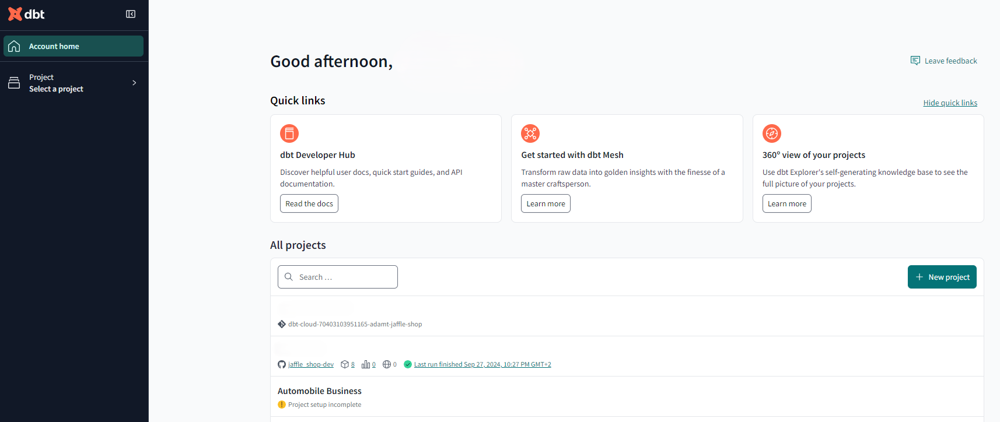

### dbt Project setup
The setup of a dbt Cloud project includes the following steps:
- "Name your project"
- "Configure your development environment"
- "Setup a repository"

1.  Enter a project name and click "Continue".

    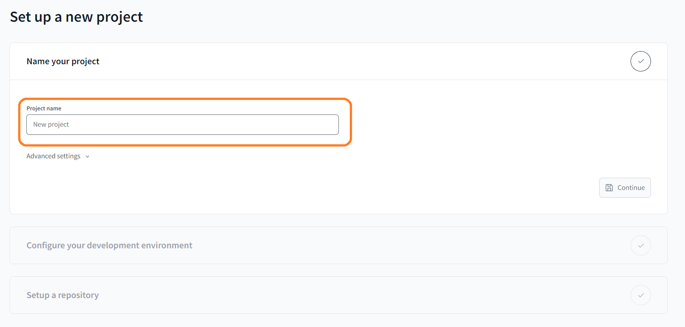

2.  In "Configure your development environment", click "Add new connection" and follow the steps below. Once you have Teradata Vantage connections established you can simply select them from the dropdown in future projects.
    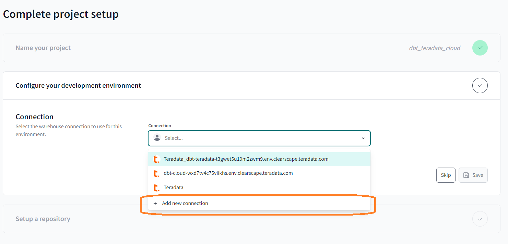

    - Select "Teradata"
    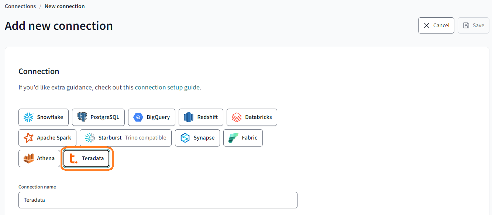
    
    - Provide a name for the connection that is meaningful.
    - Fill in all the required details in the "Settings" section.
    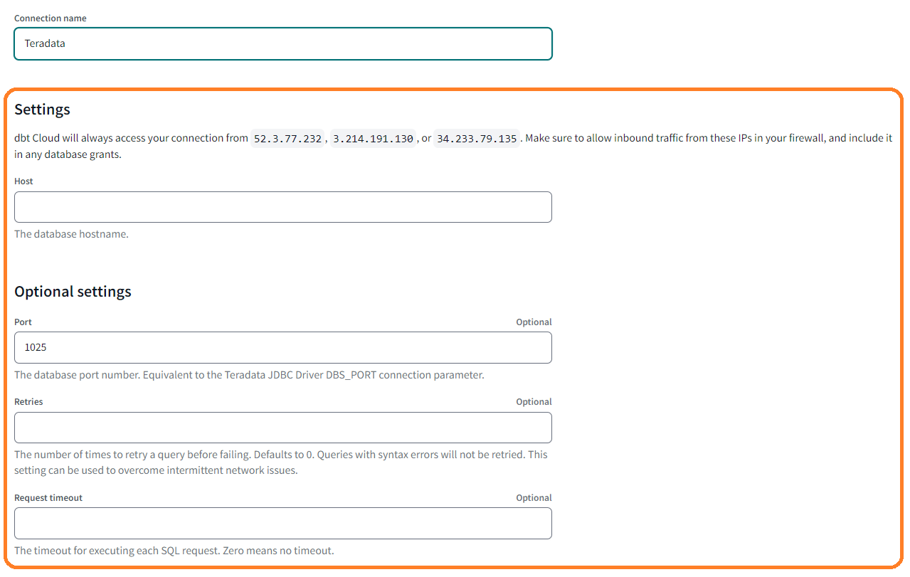

    The only required field in the settings is the connection host, if your Vantage Environment is behind a firewall you might need to whitelist the provided IP addresses that dbt Cloud uses in your specific environment.

    - Save the connection.

3.	Once the Teradata connection is created, return to the project setup page of your project, select your connection in the "Configure your developer environment" dropdown, and provide the required "Development Credentials".

    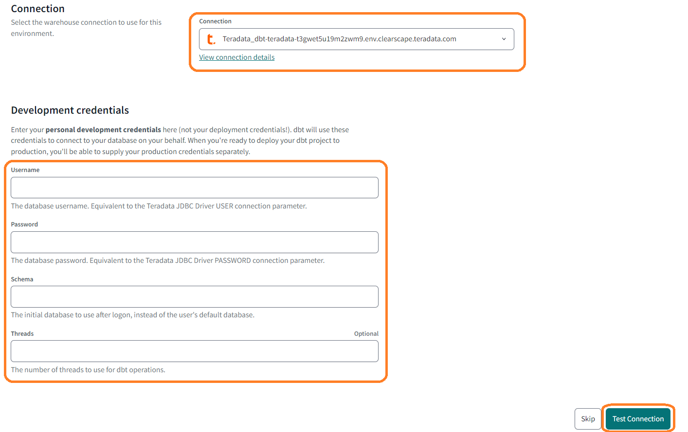

4.  Click "Test Connection". 
    - This verifies that dbt Cloud can access your Teradata database. 
    - If the connection test succeeds, click Save.
    - If the connection fails, verify your Teradata settings and credentials. 
    - If the issue persists, reach out to Teradata support at support.teradata.com. For dbt-teradata related issues, start a discussion on the dbt-teradata GitHub at https://github.com/Teradata/dbt-teradata.

## Import a sample dbt project to dbt Cloud
1. Fork the following repository to your github account
    https://github.com/Teradata/jaffle_shop-dev

1.  In "Setup a repository" select the "Git Clone" option

2.  Paste the following link in the git URL field, remember to substitute your github handle in order it picks the fork of the sample repository. 
    ```
    git@github.com:{your github handle}/jaffle_shop-dev.git
    ```
    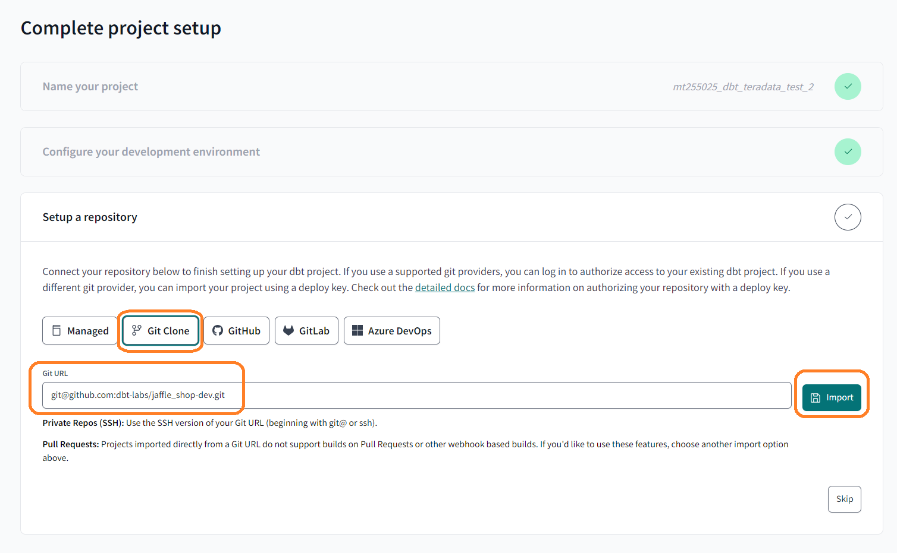

    This will generate a "Deploy key", this key needs to be deployed to your github, refer to [this guide](https://docs.getdbt.com/docs/cloud/git/import-a-project-by-git-url) for detailed instructions.
    
    Once the key is deployed, the project will be ready for further development.

    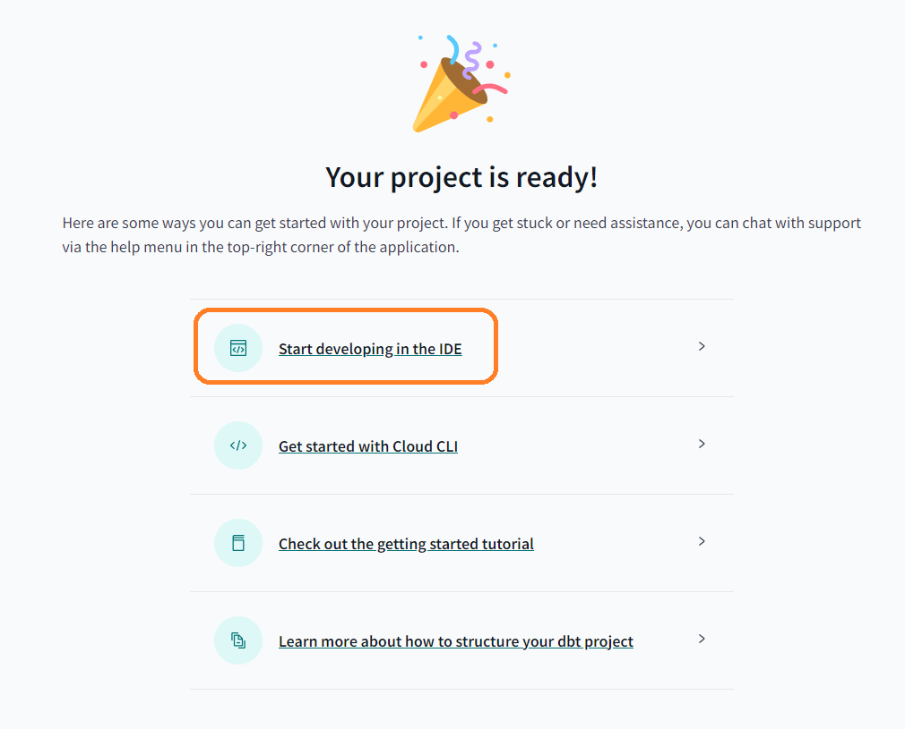

## Visualize the project on dbt Cloud IDE

Select "Start developing in the IDE". You will be redirected to the development page of the dbt Cloud IDE.

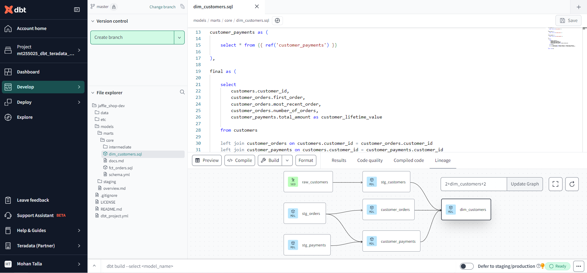
In the "File explorer" section, you can browse through the project.

## Create an environment for managing staging and production workflows for the project 

### Create a dbt Cloud environment

Before deploying the project, an environment must be created, for this navigate to the dashboard of your project and click "create environment"
* Determine the project's stage of development and select one of the deployment options: General, Staging, or Production, for this guide you might want to create it as a staging environment.
* for dbt version select versionless.
* From the drop-down menu, choose the previously configured connection.
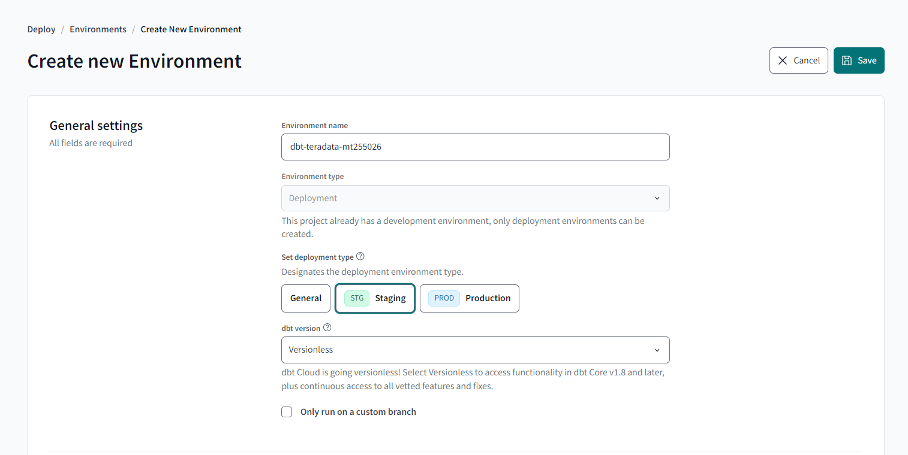

Provide the Deployment credentials for the connection and test the connection.
Once the connection is successful, save this environment.
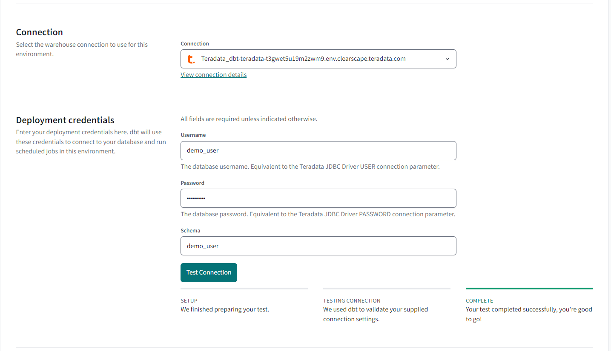

Now we have successfully created the environment for creating jobs.
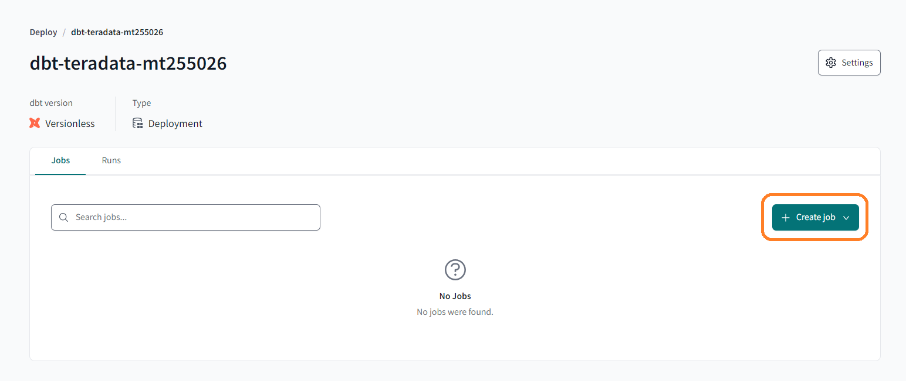

### The next step is to create the jobs

- Clicking the "Create job" button directs you to the "Deploy job" configuration page. 
- Add a job name to identify the job. 
- Select your environment from the drop-down menu, 
- Choose the job to run, such as `dbt build`, `dbt seed`, etc.

You can schedule these jobs using the provided checkbox and enable source freshness from the same section. Additionally, advanced configurations such as threads and target name can be adjusted based on the project’s requirements

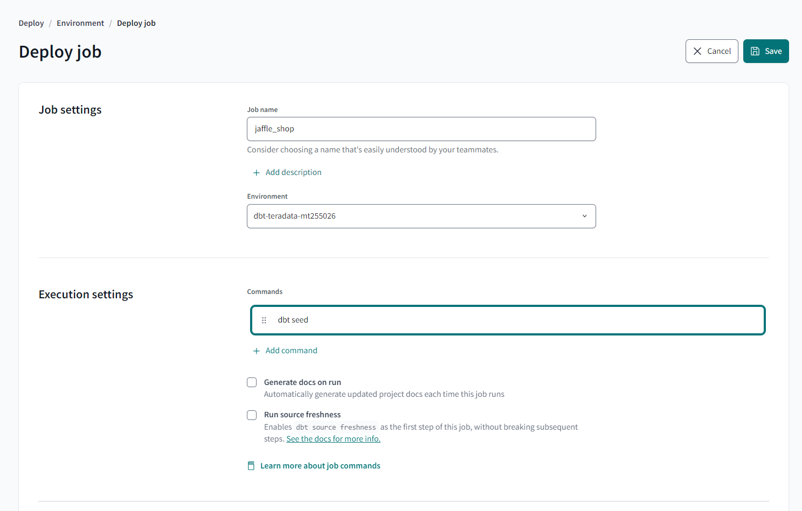

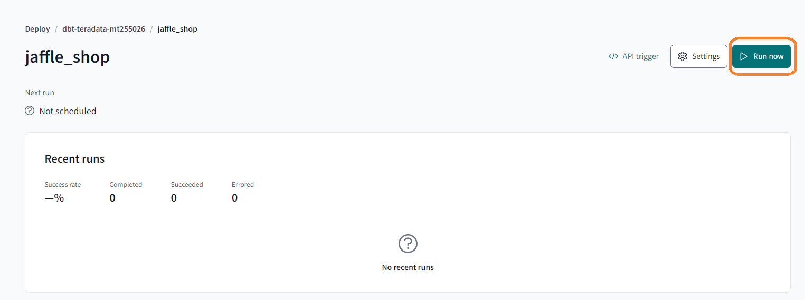

After the job completes, you will be able to view the following:
1.	Run summary – Displays the various stages of the job along with their run times. Expanding these summaries provides access to console and debug logs, which can be downloaded.
2.	Lineage – Selecting the "Lineage" option at the top displays a graph representing the data flow in your project.
3.	Model timing – Shows the execution times of models and tests.
4.	Artifacts – Artifacts from your runs, such as the manifest.json file, are saved by dbt Cloud, with download links provided.

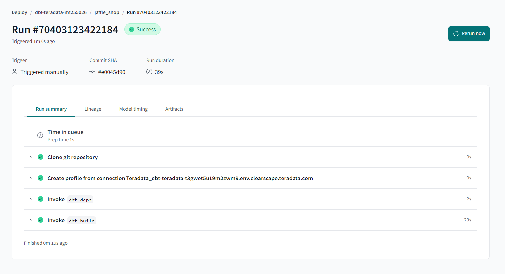

## Summary

This tutorial demonstrates how to use dbt Cloud with Teradata Vantage, adapting the dbt Jaffle Shop example. It covers steps for project creation, environment configuration, and job setup in dbt Cloud with Teradata.

## Further reading
- Learn more with [dbt Learn courses](https://learn.getdbt.com)
- [How we provision Teradata Clearscape Vantage instance](https://developers.teradata.com/quickstarts/get-access-to-vantage/clearscape-analytics-experience/getting-started-with-csae/)
  