import TrialDocsNote from '../_partials/teradata_trial.mdx'

# dbt Cloud with Teradata

This tutorial demonstrates how to use dbt Cloud with Teradata. It's based on the original [dbt Jaffle Shop tutorial](https://github.com/Teradata/jaffle_shop-dev). A couple of models have been adjusted to the SQL dialect supported by Teradata.

## Prerequisites

- A dbt Cloud account (https://www.getdbt.com/signup/)
- Access to a Teradata instance

    <TrialDocsNote />

### About the Jaffle Shop warehouse

`jaffle_shop` is a fictional e-commerce store. This dbt project transforms raw data from an app database into a dimensional model with customer and order data ready for analytics.

The raw data from the app consists of customers, orders, and payments, with the following entity-relationship diagram:


dbt takes these raw data tables and builds the following dimensional model, which is more suitable for analytics tools:


## Creating a project in dbt Cloud and connect to a Teradata environment
Create a new project in dbt Cloud. 
* Log in to your dbt Cloud account 
* Create a new project.

### dbt Project setup
The setup of a dbt Cloud project includes the following steps:
- Name your project
- Configure your development environment
- Set up a repository

1.  Enter a project name and click **Continue**.

    

2.  In **Configure your development environment**, select a connection. If you do not already have a connection, click **Add new connection**.

    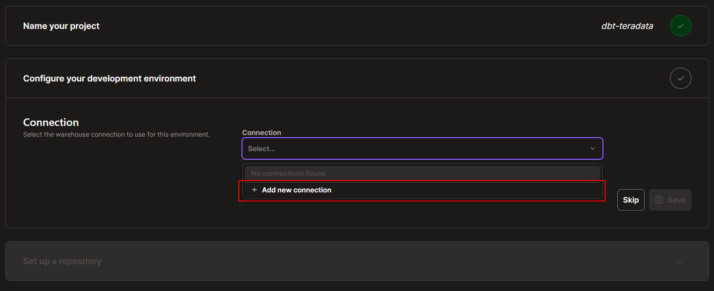

3. Select **Teradata**.

    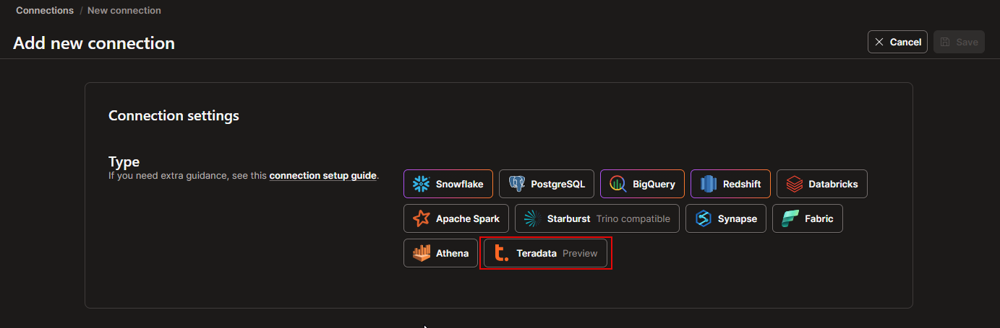

4. Provide a meaningful connection name and enter the Teradata host in the **Settings** section.

    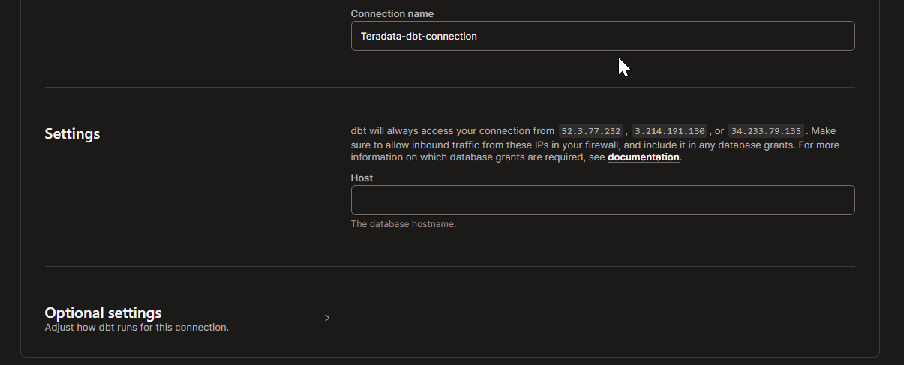

    The required field in the settings is the connection host. If your Teradata environment is behind a firewall, you might need to allowlist the IP addresses that dbt Cloud uses in your environment.

5. Save the connection. Once the Teradata connection is created, return to the project setup page and select the connection in the **Configure your development environment** section.

6. Provide the required user credentials:

    - Username
    - Password
    - Schema 

7. Click **Test connection** to verify that dbt Cloud can access your Teradata database.

    If the connection test succeeds, save the configuration and continue.

    If the connection test runs with dbt Fusion and fails with an error similar to `unknown variant teradata`, click **Skip** and continue with the repository setup. You can validate the Teradata connection later while creating the deployment environment by selecting **Latest** as the dbt version.

    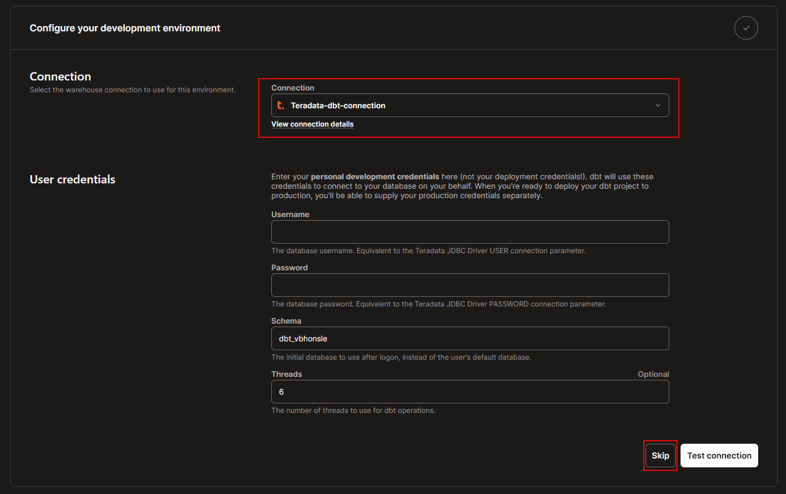

## Import a sample dbt project to dbt Cloud

1. Fork the following repository to your GitHub account:

    ```
    https://github.com/Teradata/jaffle_shop-dev
    ```

2.  In **Set up a repository**, select the **Git Clone** option.

3.  Paste the following link in the Git URL field. Replace `{your GitHub handle}` with your GitHub handle so that dbt Cloud picks your fork of the sample repository.
 
    ```
    git@github.com:{your GitHub handle}/jaffle_shop-dev.git
    ```
    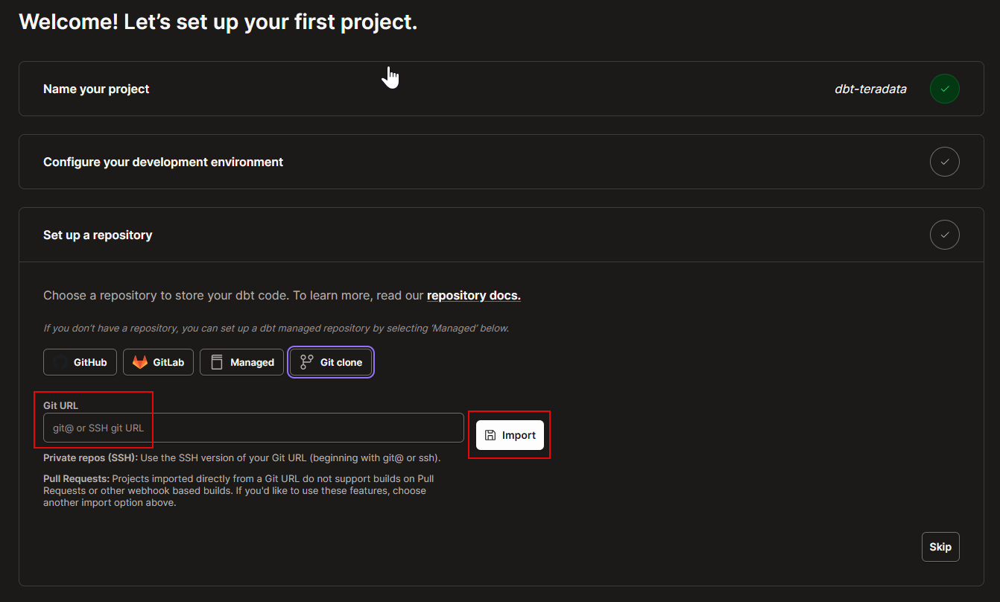

    This will generate a deploy key. This key needs to be added to your GitHub repository. Refer to [this guide](https://docs.getdbt.com/docs/cloud/git/import-a-project-by-git-url) for detailed instructions.

## Create an environment for managing staging and production workflows for the project 
Before deploying the project, create a dbt Cloud environment.

!!! note
    In some cases, the left navigation menu may not be visible in dbt Cloud. In that case, click your profile or account icon at the bottom-left of the page, then go to **Account settings** > **Credentials** > select your project > **configure your development environment and add a connection**.

1. From the left navigation, go to **Orchestration** > **Environments**.

    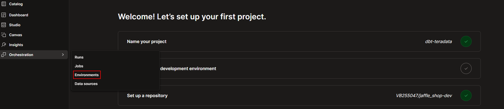

2. Click **+ Create environment**.

3. In **Environment settings**, provide the following details:

    - **Environment name**: Enter a meaningful name, such as `dbt-teradata-env`.
    - **Environment type**: Select **Deployment**.
    - **Set deployment type**: Select **Staging**.
    - **dbt version**: Select **Latest**.

    !!! note
        For this quickstart, select **Latest** as the dbt version. Do not select a Fusion option.

    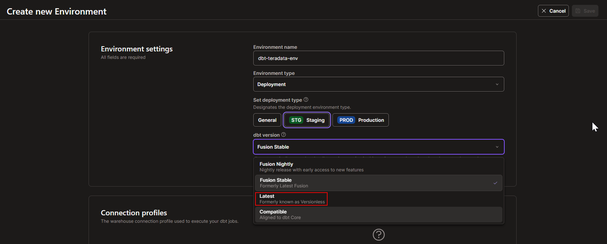

4. In **Connection profiles**, click **Assign profile**, and create a new profile.

    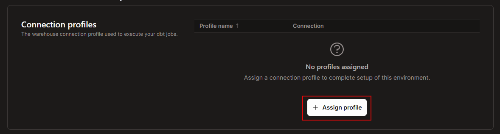

5. In **New profile**, provide a profile name and select the Teradata connection created earlier. If the connection is not available, click **Add new connection** and create a Teradata connection.

    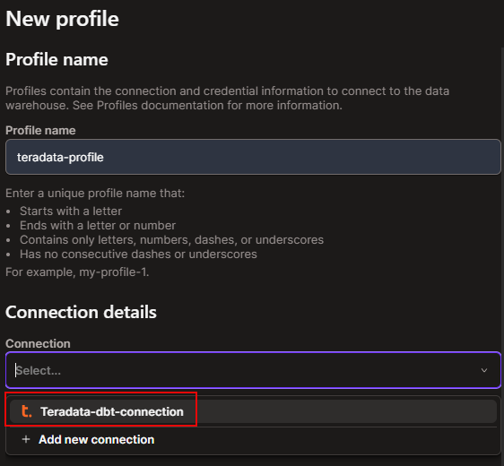

6. Provide the deployment credentials:

    - Username
    - Password
    - Schema

7. Click **Test connection**. Once the connection test completes successfully, create the profile. Then, select the newly created profile from the dropdown and save the environment.

    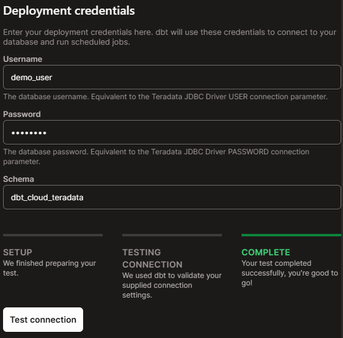

Now you have created a dbt Cloud environment for running jobs.

## Create and run a job

1. On the environment page, click **Create job**. From the available options, select **Deploy job**.

    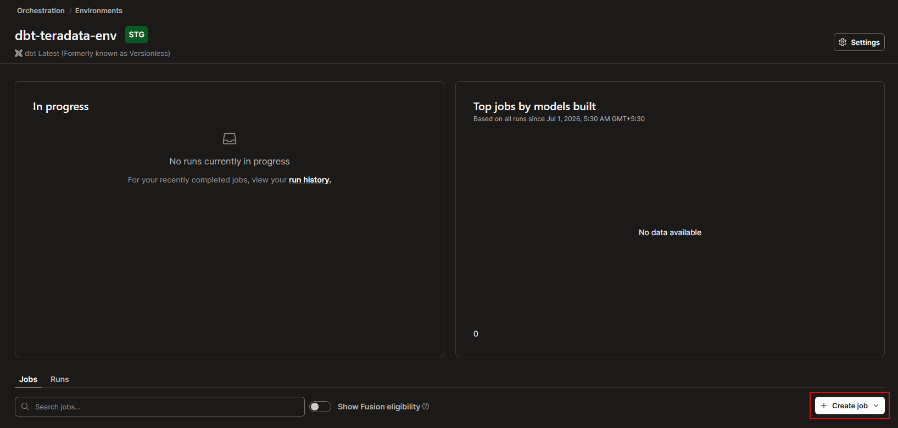

2. On the **Deploy job** page, provide the job details:

    - **Job name**: Enter a name such as `jaffle_shop`.
    - **Environment**: Select the environment created earlier.
    - **Commands**: Add the command to run, such as `dbt build`.

    You can schedule the job using the scheduling options. You can also enable source freshness and adjust advanced configurations such as threads and target name based on your project requirements.

    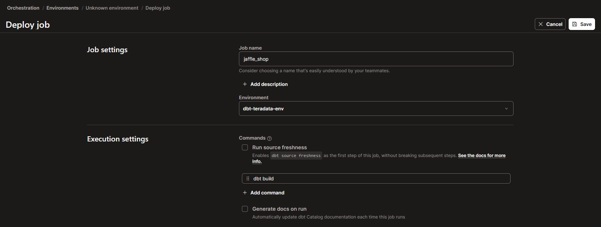

3. Save the job.

4. After saving the job, dbt Cloud opens the job details page. Click **Run now** to start the job.

    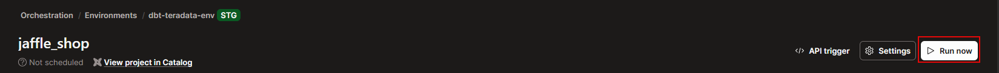

5. After the job completes, verify that the run is successful.

    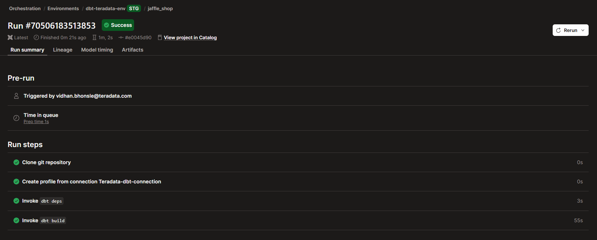

After the job completes, you will be able to view the following:

1. **Run summary** – Displays the various stages of the job along with their run times. Expanding these summaries provides access to console and debug logs, which can be downloaded.
2. **Lineage** – Displays a graph representing the data flow in your project.
3. **Model timing** – Shows the execution times of models and tests.
4. **Artifacts** – Provides access to artifacts from your runs, such as the `manifest.json` file.

## Summary

This tutorial demonstrates how to use dbt Cloud with Teradata, adapting the dbt Jaffle Shop example. It covers steps for project creation, environment configuration, and job setup in dbt Cloud with Teradata.

## Further reading

- Learn more with [dbt Learn courses](https://learn.getdbt.com)