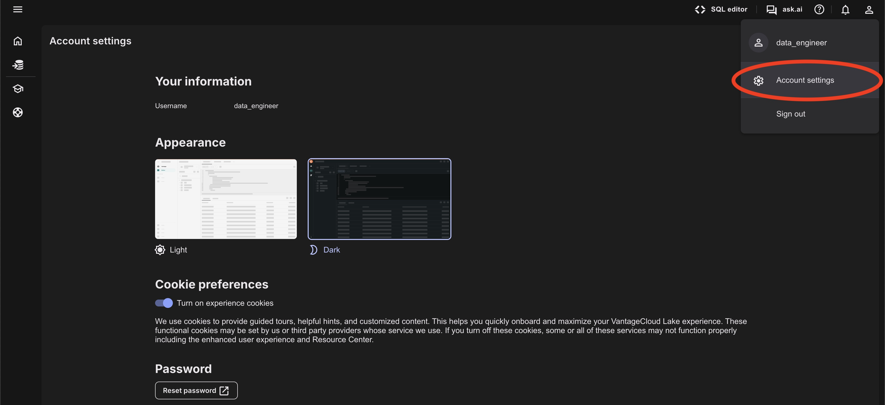
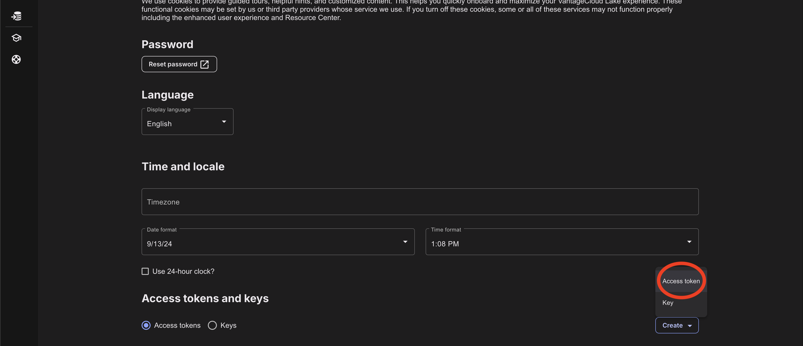
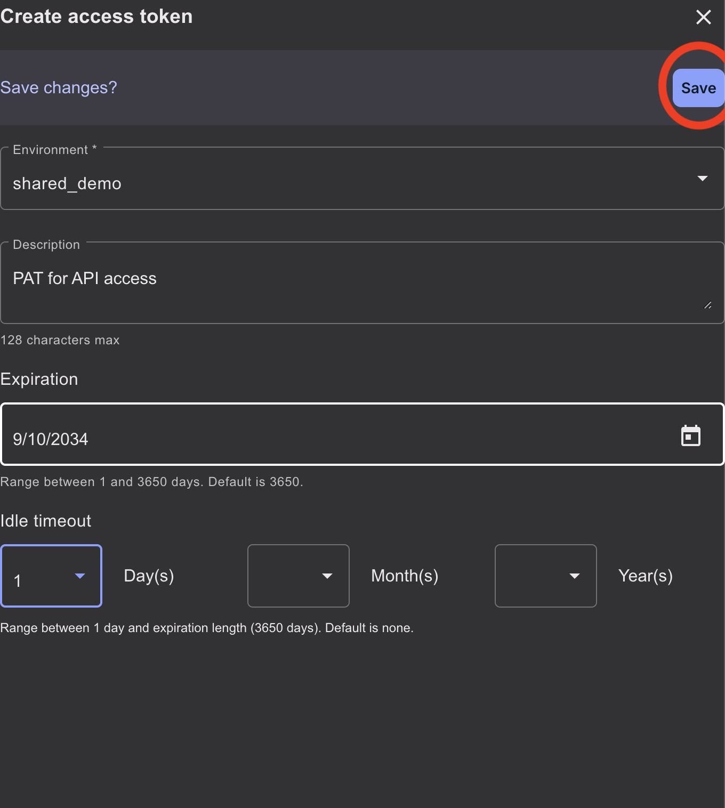
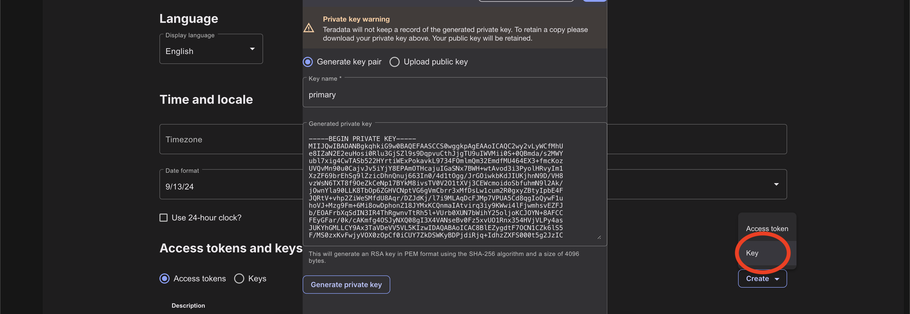
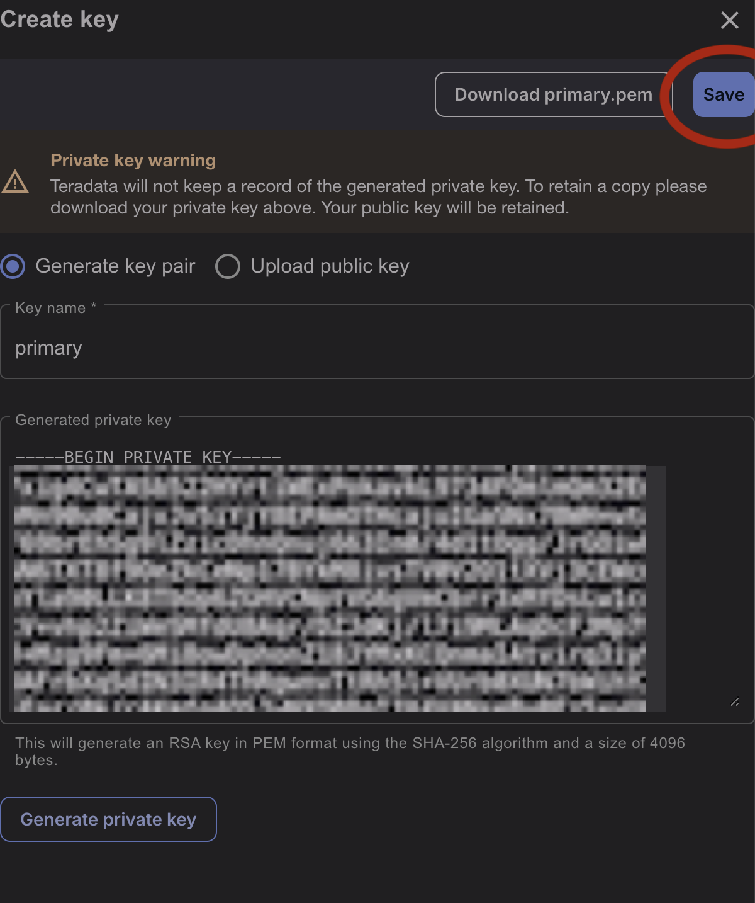

import CreateJWT from './_partials/create-jwt.mdx';

# Create JWT tokens to call VantageCloud Lake APIs

## Overview

VantageCloud Lake exposes a set or REST APIs to manage environments. To call VantageCloud Lake REST APIs such as Query Service you need a valid JWT token. This quickstart demonstrates how to create a JWT token and how to use it to call VantageCloud Lake REST APIs.

The process has the following steps:
1. Generate Personal Access Token and your private key - they are needed to create JWTs
2. Create a JWT
3. Call the API

## Generate Personal Access Token (PAT) and private key

:::important
To get a VantageCloud Lake sign-on link and credentials, submit the [contact form](https://www.teradata.com/about-us/contact) to reach out to Teradata team.   
:::

1. Go to the URL provided by Teradata, for example, mycompany.innovationlabs.teradata.com and sign on as a database user who has Console access rights.

    :::note
    Click [here](https://login.customer.teradata.com/ext/pwdreset/Identify?AdapterId=CDSCustomer) to reset the organization admin password.
    :::

    

    The signing on takes you to VantageCloud Lake welcome page.

    

1. Create a Personal Access Token (PAT)

    * In the top-right corner click on the user icon and then click on "Account settings"
        
    * Click on "Create" and then on "Access token"
        
    * Select the environment you want to use the PAT for, fill out other fields and click Save
        
    * Copy the PAT displayed on the page

1. Create a private key

    * Go back to the "Account settings" page and click "Create" and then "Key"
        
    * Click on "Generate key pair", name the key "primary", click on "Generate private key", download the `.pem` file and click on "Save"
        

1. Retrieve the organization id
    * Open a new tab and go to https://\{MY_COMPANY\}.innovationlabs.teradata.com/api/my-organization. Replace `{MY_COMPANY}` with the right name for your Lake deployment
    * Copy the value of the organization id. It should be similar to this: `fd3463dee-3efe-4120-8153-0bb253547df7`.

## Use PAT and private key to generate JWT

:::note
This section assumes that you have you have the following:
* Private key saved in file called `primary.pem`
* You now your lake user name that you have used to create the PAT and the primary key
* You have the PAT
* You have your organization id
:::

The code demonstrates how to generate a JWT and call Query Service with the JWT. Make sure you set the correct path to `primary.pem` file containing the private key and set the correct values for:
* `sub` - the user name
* `pat` - PAT
* `org_id` - organization id

<CreateJWT/>

## Summary

This quickstart describes how to create JWT tokens to call VantageCloud Lake REST APIs.

## Further reading

* [Teradata VantageCloud Lake documentation](https://docs.teradata.com/r/Teradata-VantageCloud-Lake/Getting-Started-First-Sign-On-by-Organization-Admin)