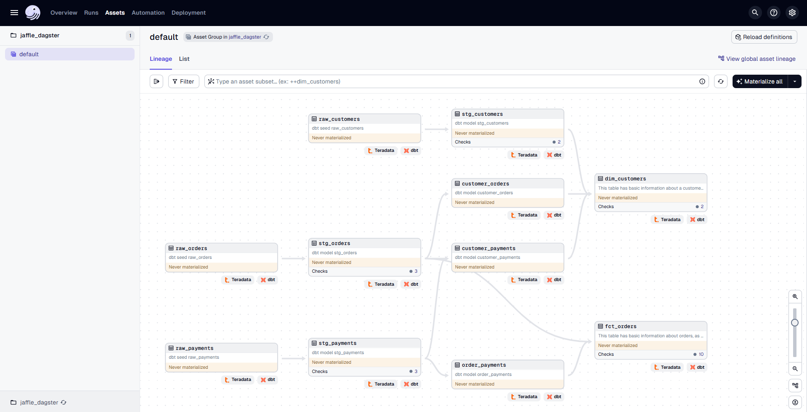
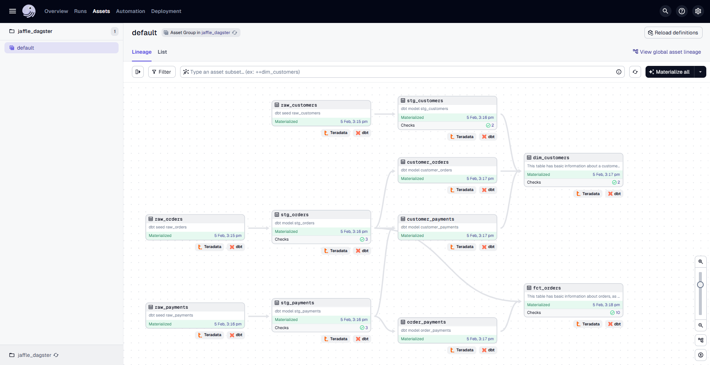
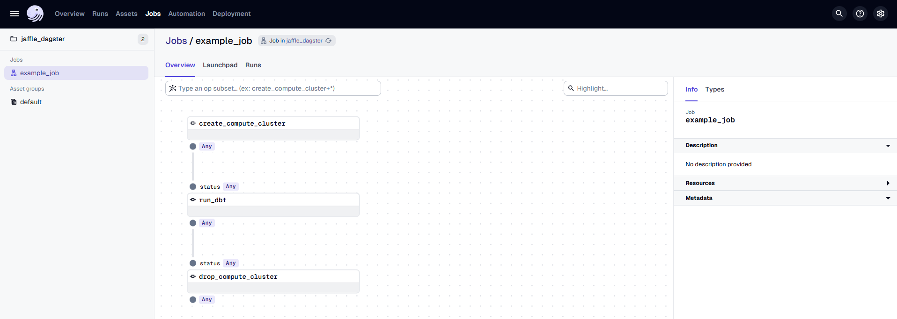
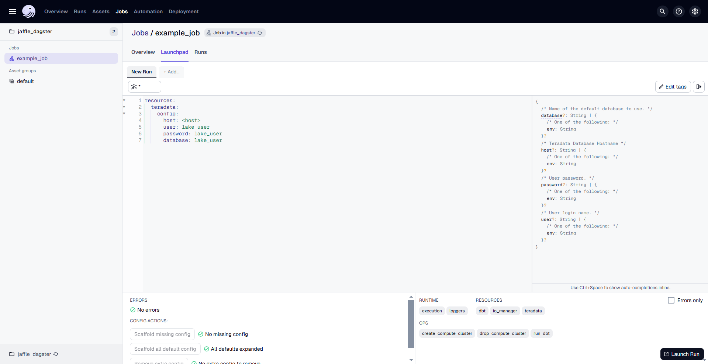
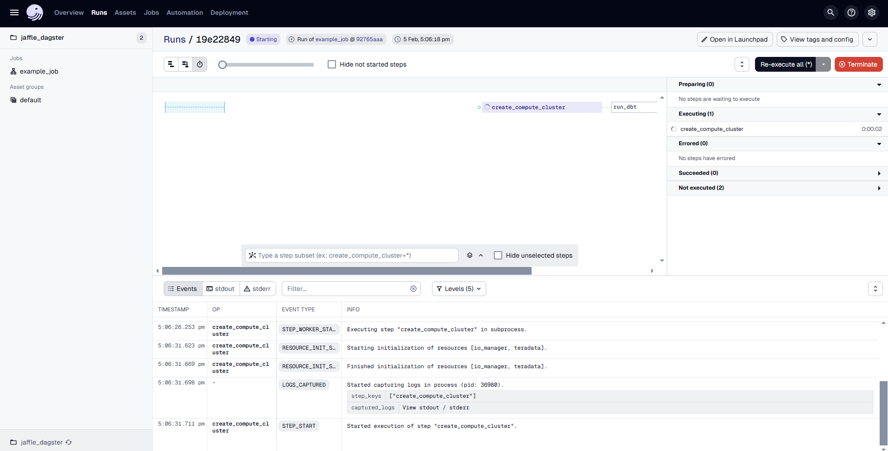

import Tabs from '@theme/Tabs';
import TabItem from '@theme/TabItem';
import InstallTabs from '../_partials/tabsDBT.mdx'

# Manage VantageCloud Lake Compute Clusters with dagster-teradata

## Overview

This tutorial showcases how to use dagster-teradata to manage VantageCloud Lake compute clusters. The goal is to run dbt transformations from the [jaffle_shop](https://github.com/Teradata/jaffle_shop-dev.git) dbt project on VantageCloud Lake compute clusters.

Additionally, we leverage dagster-dbt and dbt-teradata to import a dbt project and treat it as an asset within Dagster.

## Prerequisites

* Ensure you have the necessary credentials and access rights to use Teradata VantageCloud Lake.
    
:::tip
To request a VantageCloud Lake environment, refer to the form provided in this [link](https://www.teradata.com/about-us/contact). If you already have a VantageCloud Lake environment and seek guidance on configuration, please consult this [guide](https://quickstarts.teradata.com/getting-started-with-vantagecloud-lake.html).
:::

* Python **3.9** or higher, Python **3.12** is recommended.
* pip

## Setting Up a Virtual Enviroment

A virtual environment is recommended to isolate project dependencies and avoid conflicts with system-wide Python packages. Here’s how to set it up:
     
      <InstallTabs/>

## Install dagster and dagster-teradata

With your virtual environment active, the next step is to install dagster and the Teradata provider package (dagster-teradata) to interact with Teradata Vantage.

1. Install the Required Packages:
    
    ```bash
    pip install dagster dagster-webserver dagster-dbt dagster-teradata 
    ```

2. Verify the Installation: 

   To confirm that Dagster is correctly installed, run:
     ```bash
    dagster –version
    ```
   If installed correctly, it should show the version of Dagster.

## Install dbt

Install `dbt-teradata` and `dbt-core` modules:

```bash
pip install dbt-teradata dbt-core
 ```

## Create a database

:::note
A database client connected to VantageCloud Lake is needed to execute SQL statements. [Vantage Editor Desktop](https://downloads.teradata.com/download/tools/vantage-editor-desktop), or [dbeaver](https://quickstarts.teradata.com/other-integrations/configure-a-teradata-vantage-connection-in-dbeaver.html) can be used for this purpose.
:::

Let's create the `jaffle_shop` database in the VantageCloud Lake instance with TD_OFSSTORAGE as default.

```sql
CREATE DATABASE jaffle_shop
AS DEFAULT STORAGE = TD_OFSSTORAGE OVERRIDE ON ERROR,
PERMANENT = 120e6, -- 120MB
    SPOOL = 120e6; -- 120MB
```

## Create a database user

:::note
A database client connected to VantageCloud Lake is needed to execute SQL statements. [Vantage Editor Desktop](https://downloads.teradata.com/download/tools/vantage-editor-desktop), or [dbeaver](https://quickstarts.teradata.com/other-integrations/configure-a-teradata-vantage-connection-in-dbeaver.html) can be used to execute `CREATE USER` query.
:::

Let's create a `lake_user` user in the VantageCloud Lake instance.

```sql
CREATE USER lake_user
AS PERMANENT = 1000000,
PASSWORD = lake_user,
SPOOL = 1200000,
DEFAULT DATABASE = jaffle_shop;
```

## Grant access to user
:::note
A database client connected to VantageCloud Lake is needed to execute SQL statements. [Vantage Editor Desktop](https://downloads.teradata.com/download/tools/vantage-editor-desktop), or [dbeaver](https://quickstarts.teradata.com/other-integrations/configure-a-teradata-vantage-connection-in-dbeaver.html) can be used to execute `GRANT ACCESS` queries.
:::

Let's provide the required privileges to the user `lake_user` to manage compute clusters.

```sql
GRANT ALL ON jaffle_shop TO lake_user;
GRANT CREATE COMPUTE GROUP To lake_user;
GRANT DROP COMPUTE GROUP TO lake_user;
GRANT CREATE COMPUTE PROFILE To lake_user;
GRANT DROP COMPUTE PROFILE TO lake_user;
GRANT SELECT ON DBC TO lake_user;
GRANT ALL ON jaffle_shop TO lake_user;
```

## Setup dbt project

### Step 1: Download the sample dbt project

Let's get started by downloading a sample dbt project. We'll use the standard dbt [Jaffle Shop](https://github.com/Teradata/jaffle_shop-dev.git) example.

1. First, create a folder that will ultimately contain both your dbt project and Dagster code.

   ```shell
   mkdir dbt-dagster-teradata
   ```

2. Then, navigate into that folder:

   ```shell
   cd dbt-dagster-teradata
   ```

3. Finally, download the sample dbt project into that folder.

   ```shell
   git clone https://github.com/Teradata/jaffle_shop-dev.git
   ```

### Step 2: Configure your dbt project to run with Teradata Vantage

You'll set up dbt to work with Teradata Vantage by configuring a dbt [profile](https://docs.getdbt.com/docs/core/connect-data-platform/connection-profiles):

1. Navigate into the `jaffle_shop` folder, which was created when you downloaded the project, inside your `dbt-dagster-teradata` folder:

   ```shell
   cd jaffle_shop-dev
   ```

2. In this folder, with your text editor of choice, create a file named `profiles.yml` and add the following code to it:

   ```yaml
   jaffle_shop:
     outputs:
       dev:
         type: teradata
         host: <host>
         user: lake_user
         password: lake_user
         logmech: TD2
         schema: jaffle_shop
         tmode: ANSI
         threads: 1
         timeout_seconds: 300
         priority: interactive
         retries: 1
     target: dev
   ```

### Step 3: Build your dbt project

With the profile configured above, your dbt project should now be usable. To test it out, run:

```shell
dbt build
```

This will run all the models, seeds, and snapshots in the project and store a set of tables in your Teradata Vantage.

## Load dbt models as Dagster assets

### Step 1: Create a Dagster Project for Your dbt Project

To integrate your dbt project with Dagster, use the **dagster-dbt** CLI. Navigate to the directory containing your `dbt_project.yml` and run:

```shell
dagster-dbt project scaffold --project-name jaffle_dagster
```

This command generates a `jaffle_dagster/` directory, which contains the necessary files for a Dagster project.

Typically, it's best to place your Dagster project at the root of your Git repository. Since `dbt_project.yml` is located at the root of the `jaffle_shop` repository, we create the Dagster project there.

**Note**: If you run the command from a different directory than your dbt project, use the `--dbt-project-dir option` to specify the correct path.

### Step 2: View Your Dagster Project in the Dagster UI

Now that you have a Dagster project, you can run Dagster's UI to take a look at it.

1. Change directories to the Dagster project directory:

   ```shell
   cd jaffle_dagster/
   ```

2. To start Dagster's UI, run the following:

   ```shell
   dagster dev
   ```

   Which will result in output similar to:

   ```shell
   Serving dagster-webserver on http://127.0.0.1:3000 in process 70635
   ```

3. In your browser, navigate to [http://127.0.0.1:3000](http://127.0.0.1:3000) The page will display the assets:

   

### Step 3: Run Your dbt Models in Dagster

In Dagster, you can not only view but also run your dbt models by materializing them as assets.

To build your dbt project, click **"Materialize all"** in the top right corner. This starts a run to materialize the assets. Once complete, the **Materialized** and **Latest Run** details will be updated.

   

After the run completes, you can:

- Click on an **asset** to open a sidebar with details such as its last materialization stats and a link to the **Asset Details** page.
- Click the **Latest Run ID** within an asset to access the **Run Details** page, which provides timing information, errors, and logs.

## VantageCloud Lake Compute Cluster Management

Now, we integrate VantageCloud Lake compute cluster management with this dbt asset.

You need to modify the `definitions.py` file inside the `jaffle_dagster/jaffle_dagster` directory. 

### Step 1: Open `definitions.py` in `jaffle_dagster/jaffle_dagster` Directory  
Locate and open the file where Dagster job definitions are configured.  
This file manages resources, jobs, and assets needed for the Dagster project.  

### Step 2: Implement Compute Cluster Management in Dagster

```python
from dagster import Definitions, DagsterError, op, materialize, job
from dagster_dbt import DbtCliResource
from dagster_teradata import teradata_resource, TeradataResource

from .assets import jaffle_shop_dbt_assets
from .project import jaffle_shop_project
from .schedules import schedules

@op(required_resource_keys={"teradata"})
def create_compute_cluster(context):
    context.resources.teradata.create_teradata_compute_cluster(
        "ShippingCG01",
        "Shipping",
        "STANDARD",
        "TD_COMPUTE_MEDIUM",
        "MIN_COMPUTE_COUNT(1) MAX_COMPUTE_COUNT(1) INITIALLY_SUSPENDED('FALSE')",
    )
    return "Compute Cluster Created"

@op(required_resource_keys={"teradata", "dbt"})
def run_dbt(context, status):
    if status == "Compute Cluster Created":
        materialize(
            [jaffle_shop_dbt_assets],
            resources={
                "dbt": DbtCliResource(project_dir=jaffle_shop_project)
            }
        )
        return "DBT Run Completed"
    else:
        raise DagsterError("DBT Run Failed")

@op(required_resource_keys={"teradata"})
def drop_compute_cluster(context, status):
    if status == "DBT Run Completed":
        context.resources.teradata.drop_teradata_compute_cluster("ShippingCG01", "Shipping", True)
    else:
        raise DagsterError("DBT Run Failed")

@job(resource_defs={"teradata": teradata_resource, "dbt": DbtCliResource})
def example_job():
    drop_compute_cluster(run_dbt(create_compute_cluster()))

defs = Definitions(
    assets=[jaffle_shop_dbt_assets],
    jobs=[example_job],
    schedules=schedules,
    resources={
        "dbt": DbtCliResource(project_dir=jaffle_shop_project),
        "teradata": TeradataResource(),
    },
)
```

>  ##### 1. Create a Compute Cluster  
>  The `create_compute_cluster` operation provisions a Teradata compute cluster using `teradata_resource`.  
>  
>  ##### 2. Run dbt Transformations  
>  The `run_dbt` operation triggers dbt materialization **only if** the compute cluster was created successfully.  
>  
>  ##### 3. Drop the Compute Cluster  
>  The `drop_compute_cluster` operation removes the cluster **only if** the dbt transformation completes successfully.  
>  
>  ##### 4. Define a Dagster Job  
>The `example_job` function executes these operations in sequence:  
>- Create a compute cluster  
>- Run dbt transformations  
>- Drop the compute cluster  
>
>##### 5. Register Definitions  
>The `Definitions` object registers assets, jobs, schedules, and resources for Dagster.

After making the changes in `definitions.py`, stop the existing Dagster webserver by pressing `Ctrl+C` in the terminal where it’s running. Then, restart the server by running the command `dagster dev` again. In your browser, navigate to http://127.0.0.1:3000


In the Dagster UI, you will see the following:

- The job **`example_job`** is displayed, along with the associated dbt asset.
- The dbt asset is organized under the **"default"** asset group.
- In the middle, you can view the **lineage** of each `@op`, showing its dependencies and how each operation is related to others.



Go to the **"Launchpad"** and provide the configuration for the **TeradataResource** as follows:

```yaml
resources:
  teradata:
    config:
      host: <host>
      user: lake_user
      password: lake_user
      database: lake_user
```
Replace `<host>` with the actual host address for your Teradata VantageCloud Lake instance.

Once the configuration is done, click on **"Launch Run"** to start the process.



The Dagster UI allows you to visualize the pipeline's progress, view logs, and inspect the status of each step.



## Teradata VantageCloud Lake Compute Cluster Management with Dagster-Teradata

Teradata VantageCloud Lake provides robust compute cluster management capabilities, enabling users to dynamically allocate, suspend, resume, and delete compute resources. These operations are fully supported through **`dagster-teradata`**, allowing users to manage compute clusters directly within their Dagster pipelines. This integration ensures optimal performance, scalability, and cost efficiency. The following operations facilitate seamless compute cluster management within Dagster:

### 1. Create a Compute Cluster (`create_teradata_compute_cluster`)

This operation provisions a new compute cluster within Teradata VantageCloud Lake using `dagster-teradata`. It enables users to define the cluster's configuration, including compute profiles, resource allocation, and query execution strategies, directly within a Dagster job.

**Args:**
- `compute_profile_name` (str) – Specifies the name of the compute profile.
- `compute_group_name` (str) – Identifies the compute group to which the profile belongs.
- `query_strategy` (str, optional, default="STANDARD") – Defines the method used by the Teradata Optimizer to execute SQL queries efficiently. Acceptable values:
  - `STANDARD` – The default strategy at the database level, optimized for general query execution.
  - `ANALYTIC` – Optimized for complex analytical workloads.
- `compute_map` (Optional[str], default=None) – Maps compute resources to specific nodes within the cluster.
- `compute_attribute` (Optional[str], default=None) – Specifies additional configuration attributes for the compute profile, such as:
  - `MIN_COMPUTE_COUNT(1) MAX_COMPUTE_COUNT(5) INITIALLY_SUSPENDED('FALSE')`
- `timeout` (int, optional, default=constants.CC_OPR_TIME_OUT) – The maximum duration (in seconds) to wait for the cluster creation process to complete. Default: 20 minutes.

### 2. Suspend a Compute Cluster (`suspend_teradata_compute_cluster`)

This operation temporarily suspends a compute cluster within Teradata VantageCloud Lake using **`dagster-teradata`**, reducing resource consumption while retaining the compute profile for future use.

**Args:**
- `compute_profile_name` (str) – Specifies the name of the compute profile.
- `compute_group_name` (str) – Identifies the compute group associated with the profile.
- `timeout` (int, optional, default=constants.CC_OPR_TIME_OUT) – The maximum wait time for the suspension process to complete. Default: 20 minutes.

### 3. Resume a Compute Cluster (`resume_teradata_compute_cluster`)

This operation restores a previously suspended compute cluster using **`dagster-teradata`**, allowing workloads to resume execution within a Dagster pipeline.

**Args:**
- `compute_profile_name` (str) – Specifies the name of the compute profile.
- `compute_group_name` (str) – Identifies the compute group associated with the profile.
- `timeout` (int, optional, default=constants.CC_OPR_TIME_OUT) – The maximum wait time for the resumption process to complete. Default: 20 minutes.

### 4. Delete a Compute Cluster (`drop_teradata_compute_cluster`)

This operation removes a compute cluster from Teradata VantageCloud Lake using **`dagster-teradata`**, with an option to delete the associated compute group. You can run this operation directly from your Dagster workflow.

**Args:**
- `compute_profile_name` (str) – Specifies the name of the compute profile.
- `compute_group_name` (str) – Identifies the compute group associated with the profile.
- `delete_compute_group` (bool, optional, default=False) – Determines whether the compute group should be deleted:
  - `True` – Deletes the compute group.
  - `False` – Retains the compute group without modifications.

---

These operations are designed to be fully integrated into **`dagster-teradata`** for managing compute clusters in Teradata VantageCloud Lake. By utilizing these operations within Dagster jobs, users can optimize resource allocation, perform complex transformations, and automate compute cluster management to align with workload demands.


## Summary

In this quick start guide, we explored how to utilize Teradata VantageCloud Lake compute clusters to execute dbt transformations using `dagster-dbt` and Teradata compute cluster operators from `dagster-teradata`.


## Further reading
* [Using dbt with Dagster](https://docs.dagster.io/integrations/libraries/dbt/using-dbt-with-dagster/)
* [Teradata VantageCloud Lake Compute Clusters](https://docs.teradata.com/r/Teradata-VantageCloud-Lake/Managing-Compute-Resources/Compute-Clusters)


